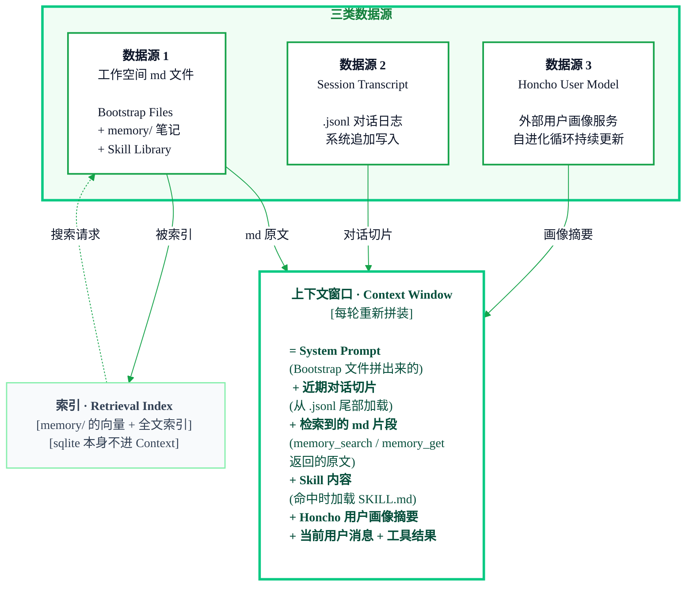
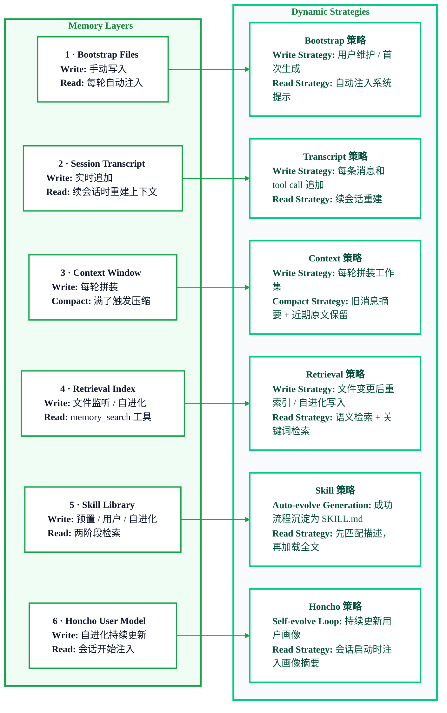

## Hermes Agent

<Badge icon="clock" color="green">Written: 2026.05</Badge>
如果说 2025 年的风向标是 Manus，2026 年初是 OpenClaw，那么 2026 年春天以来最火的 Agent 就是 **Hermes Agent**。它在 OpenRouter 上已经是 top trending coding agent，热度仅次于 OpenClaw

站在面试角度，Hermes 已经是必须掌握的第二个 Agent 爆品。它和 OpenClaw 属于**同一类产品**，使用形态和核心功能都很接近。但 Hermes 最出圈的地方，是它强调“自我进化”能力：看起来更会记事，也更聪明

所以拍脑袋想也知道，Hermes 最常被问的内容大概率就是：它和 OpenClaw 有什么区别？新的实现点在哪里？为什么看起来能自我进化？记忆模块是怎么设计的？这些问题，正好也是 Hermes 最核心的卖点和创新点

Hermes 是什么、总体架构、记忆系统（四层 → 五层）、Agent 架构，以及 Hermes 独有的**自进化循环**和**自动 Skill 沉淀**两个核心新特性。学完这一章你应该能在面试时说清楚“为什么在同样的模型下 Hermes 跑得更快、越用越懂你”，并把 Hermes 的设计思路搬到自己的 Agent 项目里加分

## 1.1 Hermes Agent 是什么
Hermes Agent 是 **Nous Research** 推出的开源、可自托管的自主 AI Agent 平台，核心卖点是**自我进化（self-improving）**：同一个模型，用得越多，它越懂你

- 核心用 **Python** 编写（入口脚本 `hermes-agent/hermes/cli.py`），通过 `pip install hermes-agent` 或官方一行安装脚本部署
- 支持 Linux / macOS / WSL2 / Termux（**Windows 原生不支持，需要 WSL2**）
- 所有数据都存在本地（`~/.hermes/`），和 OpenClaw 一样不经过云中转
- MIT 协议开源，与 OpenClaw 可通过 **ACP 协议**互相调度

**Hermes 是一个带“自进化闭环”的事件驱动 Agent 执行引擎**——OpenClaw 做的它都做（多渠道网关、cron、子 Agent），但它额外把“经验沉淀成可复用 skill”和“持续学习用户画像”做成了一等公民

## 1.2 Hermes 总体架构
Hermes 的总体架构是 **三层主干 + 一圈闭环** ——主干三层是**触发层（Trigger）→ 网关层（Gateway）→ Agent 层（Agent Loop）**，和 OpenClaw 完全同构；**闭环是 Agent 层额外挂的自进化回路（Reflect → 记忆 / Skill 沉淀 → 反哺下一次触发）**，这是 Hermes 区别于 OpenClaw 的核心。

所以当面试官问“Hermes 架构是几层”时，标准答法是：**“主干 3 层 + 1 个自进化闭环”**

看完OpenClaw 架构这部分可以秒懂，差异集中在 Agent 层额外多了一圈自进化闭环：
~~~text title="Hermes 主执行链路" icon="arrows-repeat-1"
触发层 → 网关层 → Agent 层 → 记忆/Skill 沉淀 → 反哺下一次触发 
						 └─ 每 ~15 次 tool call 触发自进化反思
~~~

### 1.2.1 触发层

Hermes 的触发维度和 OpenClaw 一一对应，同样是 **5 种信号源**，没有新东西。这部分和 OpenClaw 笔记里的触发层完全一致——从这一点也能看出来 Hermes 作者应该是在 OpenClaw 基础上进行改进的，这也是为什么面试官喜欢把两者放在一起对比：

- **Message（消息）**— CLI、Telegram、Discord、Slack、WhatsApp、Signal、Email（比 OpenClaw 多一个 Email）
- **Heartbeat（心跳）**— 周期性唤醒 Agent 进行自检 / 续跑
- **Cron（定时任务）**— 内置 cron 调度器（源码 `hermes-agent/cron/scheduler.py`、`cron/jobs.py`），支持每日 / 每周自动任务并推送到任意平台
- **Webhook（外部推入）**— 同样支持外部系统 HTTP 推入
- **Hooks（生命周期钩子）**— 会话开始 / 结束、工具调用前后等事件挂钩，可触发自定义逻辑

### 1.2.2 网关层 -- 进程多渠道

**Gateway 是什么：** 本地长驻的一个进程，是触发层和 Agent 层之间的中间件——所有外部事件（消息、webhook、cron 触发）都先进 Gateway，由它统一“接入、认证、再分发给对应的 Agent session”

**核心职责（4 件事，别跑偏）：**
1. **连接管理**：同时维持多个渠道的长连接（CLI、Telegram、Discord、Slack、WhatsApp、Email……一进程多渠道）
2. **协议转换**：把 Telegram 的 JSON、Discord 的 WebSocket 帧、Email 的 MIME、Webhook 的 HTTP POST 等不同协议，统一转换成内部标准事件格式
3. **路由分发**：根据事件里的 agentId / sessionId，把事件投递给正确的 Agent 会话；回复也按原路送回对应渠道
4. **安全控制**：入口处做认证（token / 签名校验）、限流、沙箱隔离

**关键边界（面试必答）**：Gateway **只做路由，不调 LLM，不执行工具**。它只回答两个问题——“这条消息该给哪个 Agent？”、“Agent 的回复该送回哪个渠道？”。这个边界让 Gateway 保持轻量，可以横向扩展，Agent 换掉也不影响接入层

一句话总结：**Gateway = 多渠道适配器 + 路由器 + 安全网关**，是“一个 Agent 能同时出现在 Telegram、Discord、CLI 里”的技术基础。

### 1.2.3 Agent 层
Agent 层是整个 Hermes 的“大脑”，Gateway 把事件路由过来之后，真正的推理、工具调用、记忆读写全在这里完成

**Agent 循环的 4 步：Think（推理）→ Act（工具执行）→ Remember（记忆读写）→ Reflect（周期性反思）**。前三步是所有 Agent 都有的标准循环，第 4 步 Reflect 是 Hermes 的独有创新（即**自进化闭环**），在 1.3 节详细展开

> **自进化循环是什么？** 一句话先打个底：这是 Hermes 的“自我反思 + 经验沉淀”模块。用一句话概括就是 _“like back propagation but for prompts instead of model weights”_——像反向传播，但更新的不是模型权重，而是 prompt / 记忆 / skill**。周期性触发，让 Agent 回看自己刚才做了什么，把有价值的事实写进 `memory/` md文件，把成功流程抽象成 Skill，把用户偏好更新到 **Honcho**（一个独立的第三方开源用户建模服务，`honcho.dev`，专门给 Agent 存“这个用户是谁”——偏好、沟通风格、目标，Hermes 作为可选依赖集成它）。完整机制在 1.4.4 讲。后面章节会反复提到“自进化循环”，看到它就想“这是 Hermes 的周期性反思和写记忆的机制”即可


**什么叫“循环”——ReAct 范式：**
Agent 不是“想一次就直接输出答案”的单次推理，而是 **思考 → 行动 → 观察结果 → 再思考”的多轮迭代**，这就是业界最经典的 **ReAct 范式**（Reasoning + Acting）一次典型的循环长这样：
```mermaid
%%{init: {
  "theme": "base",
  "flowchart": {
    "curve": "basis",
    "htmlLabels": true,
    "nodeSpacing": 42,
    "rankSpacing": 64,
    "padding": 18
  },
  "themeVariables": {
    "background": "#FFFFFF",
    "mainBkg": "#FFFFFF",
    "primaryColor": "#FFFFFF",
    "primaryTextColor": "#0F172A",
    "primaryBorderColor": "#16A34A",
    "lineColor": "#16A34A",
    "clusterBkg": "#F0FDF4",
    "clusterBorder": "#07C983",
    "fontFamily": "Inter, ui-sans-serif, system-ui",
    "fontSize": "15px"
  }
}}%%
flowchart TD
  Start["<b>用户消息</b><br/>[Agent 收到当前请求]<br/>[并加载可用上下文]"]

  subgraph AgentLoop["Agent 决策循环"]
    direction TB

    Think["<b>Think</b><br/>调用 LLM 基于上下文做决策<br/><br/><div style='text-align:left'><b>A. 信息足够</b><br/>[直接生成最终回复]<br/><b>B. 需要回忆旧信息</b><br/>[调用 memory search]<br/><b>C. 信息不够</b><br/>[调用工具 X，传入参数 Y]</div>"]

    Enough["<b>信息足够</b><br/>[生成最终回复]<br/>[循环结束]"]
    NeedMemory["<b>需要回忆旧信息</b><br/>[检索历史记忆]<br/>[补齐长期上下文]"]
    NeedTool["<b>信息不够</b><br/>[选择工具与参数]<br/>[进入执行阶段]"]

    Act["<b>Act</b><br/>[执行工具调用]<br/>browser / exec / search<br/>[拿到外部结果]"]

    Remember["<b>Remember</b><br/>[读取或写入记忆]<br/>[沉淀可复用事实]"]

    Context["<b>Context 回灌</b><br/>工具结果 / 记忆片段<br/>[重新拼装进上下文窗口]"]
  end

  End["<b>最终回复</b><br/>[输出给用户]<br/>[本轮循环结束]"]

  Start -->|"当前消息"| Think

  Think -->|"A. 信息足够"| Enough
  Think -->|"B. 需要旧信息"| NeedMemory
  Think -->|"C. 缺少外部信息"| NeedTool

  NeedTool --> Act
  Act --> Remember
  NeedMemory --> Remember

  Remember --> Context
  Context -->|"补齐上下文后继续判断"| Think

  Enough --> End

  classDef entry fill:#FFFFFF,stroke:#16A34A,stroke-width:2px,color:#0F172A;
  classDef core fill:#FFFFFF,stroke:#07C983,stroke-width:3px,color:#064E3B;
  classDef gateway fill:#F0FDF4,stroke:#15803D,stroke-width:2px,color:#052E16;
  classDef aux fill:#F8FAFC,stroke:#86EFAC,stroke-width:1.5px,color:#334155;
  classDef output fill:#FFFFFF,stroke:#16A34A,stroke-width:2px,color:#0F172A;

  class Start entry;
  class Think core;
  class Enough gateway;
  class NeedMemory,NeedTool aux;
  class Act,Remember,Context core;
  class End output;

  style AgentLoop fill:#F0FDF4,stroke:#07C983,stroke-width:3px,color:#15803D
  ```
<Info>
  这就是 Agent Loop：LLM 每轮先 Think，决定是继续调用工具、检索记忆，还是直接结束；工具和记忆结果会回灌上下文，再进入下一轮 Think
</Info>


**关键性质：**
**1.“任务完不完，由 LLM 自己判断”**：没有外部调度器在循环外面数圈，而是每一轮 Think 里 LLM 根据当前上下文自主决定“继续调工具”还是“输出回复、结束”。这就是 ReAct 的精髓——决策权在 LLM 手里

**2.Think 和 Act 是交替的，不是一次性的**。同一个任务可能循环 3 次、10 次甚至几十次 tool call 才结束

**3.每一轮的工具结果都会回灌到下一轮 Think 的上下文里**，让 LLM 基于新信息继续推理——这就是“推理 + 行动”比“纯推理”强的原因

>下面三个小节（1.2.3.1 / 1.2.3.2 / 1.2.3.3）分别讲这个循环里每一步的具体实现——Think 层如何调 LLM、Act 层有哪些工具、Remember 层的记忆怎么组织


#### 1.2.3.1 推理(Think)
Think 层的职责很聚焦：**把当前上下文（系统提示 + Bootstrap Files + 对话历史 + 上一轮工具结果）送给 LLM，拿到 LLM 的下一步决策**（直接回复 / 调用某个工具 / 调用子 Agent）

Hermes 在 Think 层的核心要点是 **主模型 + 辅助模型分工（Auxiliary Client）**

Hermes 允许同时配置两个模型，让不同能力的模型干不同的活：
- **主模型**：做长链推理、规划、复杂任务——用强模型（如 Claude Opus、GPT-5）
- **辅助模型**：做压缩、摘要、分类、错误归类等轻量任务——用便宜 / 本地的弱模型（如 Qwen、Gemma）

这样做的价值是在**成本、速度、质量之间取得平衡**——长链推理用贵的，但压缩一段对话历史这种活没必要也让 Opus 来干。这也是 harness engineering 的典型思路：**不是用一个模型解决所有问题，而是把任务按难度分层、匹配合适模型**

#### 1.2.3.2 工具执行(Act)

Agent 推理过程中可以自主决定调用工具。Hermes 的内置工具覆盖了 Agent 干活的几乎所有场景：

- **终端 / exec**：执行 Shell 命令（带 allowlist 安全策略）
- **浏览器**：通过 CDP 控制 Chromium，浏览网页、截图、操作页面
- **文件操作**：读写本地文件、应用 patch
- **消息发送**：向任意渠道（Telegram / Discord / Email ...）发送消息
- **Subagent Spawn**：启动子 Agent 处理复杂 / 并行任务
- **MCP 集成**：通过 Model Context Protocol 接入任意外部工具生态

Hermes 的一个特色是支持 **6 种终端后端**：**local / Docker / SSH / Daytona / Singularity / Modal**（serverless 持久化，闲时近乎零成本）——这给 Agent 提供了从本地开发到云端大规模执行的全套部署选项

Hermes 独有的一个小设计：**Error Classifier**(`agent/error_classifier.py`)——把常见失败模式（网络错误、权限错误、文件不存在、rate limit 等）预编码成分类器。这样当工具调用失败时，弱模型不需要从错误消息里自己推理“这是什么错、该怎么恢复”，而是由 Error Classifier 直接把错误归类成已知类别，走预设恢复路径。这就是 harness engineering 的典型落地——**用系统层面的预处理，降低对模型推理能力的依赖**

#### 1.2.3.3 记忆(Memory)& Skills
记忆是 Agent 层的第二个核心组件，但不是每次对话都自动塞入上下文（那样太浪费 token），而是 **Agent 主动按需检索**——Agent 自己判断“需不需要回忆过去”，然后调用记忆工具去搜索。

Hermes 的记忆体系分 5 层 + 1 个用户画像：

- **Bootstrap Files**：永久身份与规则（AGENTS.md 等），每次会话开始从磁盘注入
- **Session Transcript**：完整对话历史存档（JSONL 文件追加写入）
- **Context Window：** 当前推理能看到的内容（满了触发 Compaction）
- **Retrieval Index**：记忆文件的全文 / 向量混合检索索引
- **Skill Library**：程序性记忆，可复用的成功流程（Hermes 独家第 5 **层）**
- **Honcho User Model**：独立的用户画像模型，专门存“你是谁”（偏好、沟通风格、目标）


**和 OpenClaw 的对比**：
前 4 层（Bootstrap / Transcript / Context / Retrieval）和 OpenClaw 完全一样，Hermes 直接沿用了 OpenClaw 的设计思路；**Skill Library 和 Honcho User Model 是 Hermes 新加的两块**，这是两者记忆体系的核心差异。

> 举个例子，系统中前 4 层属于**陈述性记忆**（“我记得什么事实”），Skill Library 属于**程序性记忆**（“我会做什么流程”），Honcho 是独立的**用户建模**（“我是谁”）。相比 OpenClaw，OpenClaw 只有陈述性记忆，Hermes 把程序性记忆和用户建模也补齐了，这是它越用越懂你的理论基础

这 6 块是 Hermes “越用越懂你”的数据底座。具体每一层的存储结构、写入 / 读取时机、压缩策略、如何协同工作，在 1.4 节 Hermes 记忆功能详解里展开。


### 1.2.4 架构总览图
到这里我们已经把 Hermes 三层主干（触发层 / 网关层 / Agent 层）都讲完了。下面用一张图把各模块的位置关系串起来，让大家对 “一个事件从进来到处理完的完整路径” 有个整体印象：


```mermaid
%%{init: {
  "theme": "base",
  "flowchart": {
    "curve": "basis",
    "htmlLabels": true,
    "nodeSpacing": 42,
    "rankSpacing": 64,
    "padding": 18
  },
  "themeVariables": {
    "background": "#FFFFFF",
    "mainBkg": "#FFFFFF",
    "primaryColor": "#FFFFFF",
    "primaryTextColor": "#0F172A",
    "primaryBorderColor": "#16A34A",
    "lineColor": "#16A34A",
    "clusterBkg": "#F0FDF4",
    "clusterBorder": "#07C983",
    "fontFamily": "Inter, ui-sans-serif, system-ui",
    "fontSize": "15px"
  }
}}%%
flowchart TD
  Trigger["<b>触发层 Trigger</b><br/>Message · Heartbeat · Cron <br/> Webhook · Hooks"]
  Gateway["<b>网关层 Gateway</b><br/>连接管理 · 协议转换 <br/> 路由分发 · 安全控制<br/>[不调 LLM，不执行工具]"]

  subgraph AgentLayer["<b>Agent 层</b>"]
    direction TB
    Loop["<b>Think → Act → Remember</b><br/>[循环执行，由 LLM 自主决定继续或结束]"]
    Feedback["[工具结果回灌上下文]"]
    Models["<b>可用模型</b><br/>Claude / GPT / Gemini<br/>Qwen / Ollama / ..."]
    Memory["<b>记忆体系</b><br/>Bootstrap · Transcript <br/> Context · Retrieval Index<br/>+ Skill Library（独有）<br/>+ Honcho 用户画像（独有）"]

    Loop --> Feedback --> Loop
    Loop -.-> Models
    Loop -.-> Memory
  end

  Reply["<b>原渠道送回用户</b>"]

  Trigger -->|"事件"| Gateway
  Gateway -->|"统一事件 → session"| AgentLayer
  AgentLayer -->|"最终回复"| Reply

  classDef entry fill:#FFFFFF,stroke:#16A34A,stroke-width:2px,color:#0F172A;
  classDef gateway fill:#F0FDF4,stroke:#15803D,stroke-width:2px,color:#052E16;
  classDef core fill:#FFFFFF,stroke:#07C983,stroke-width:3px,color:#064E3B;
  classDef aux fill:#F8FAFC,stroke:#86EFAC,stroke-width:1.5px,color:#334155;
  classDef output fill:#FFFFFF,stroke:#16A34A,stroke-width:2px,color:#0F172A;

  class Trigger entry;
  class Gateway gateway;
  class Loop,Feedback core;
  class Models,Memory aux;
  class Reply output;
  style AgentLayer fill:#F0FDF4,stroke:#07C983,stroke-width:3px,color:#15803D
```

**三点提醒：**
1. 上图是 Hermes 的**静态结构**，还没有画出 Hermes 真正的创新——**自进化循环**。自进化循环本质是作用于记忆层之上的动态更新策略，会在 **1.4 节 · 动态更新策略**里讲
2. Agent 层的 Think / Act 循环由 LLM 自主驱动，Gateway **不参与推理决策**——这是职责边界
3. 记忆体系的前 4 层和 OpenClaw 相同，后 2 层是 Hermes 新增；静态结构见 1.3 节，动态更新见 1.4 节

## 1.3 Hermes 记忆系统 · 静态结构
<Tip>
**高频考点**：**Agent 记忆系统是 Agent 核心**。大家看任何 Agent 的时候，都应该有意识，去了解一下他的记忆功能是如何实现的。其中记忆功能，大家可以思考两点：由哪几部分组成（静态），如何更新，压缩（动态），笔记的 ClaudeCode 架构也是这么组织的。想清楚这两点，就想清楚了一个 Agent 的记忆模块最核心的东西
</Tip>
### 1.3.1 总览：一个上下文窗口 + 三类数据源 + 一个索引
先给大家一个整体骨架：Hermes 的记忆系统由一个**上下文窗口**（**Context Window）+ 三类数据源 + 一个索引**组成。每轮推理，系统把三类数据源的内容拼进工作集、送给模型；索引只在数据源 1 里按需搜片段，不直接进工作集。下面先看这五个角色分别是什么

**三类数据源（真正进 Context 的内容都出自这三类）：**
1. **工作空间 md 文件**——人写的（或自进化循环写的）配置和知识文件，包含 Bootstrap Files、`memory/` 笔记、Skill Library
2. **Session Transcript**——系统自动追加的完整对话日志 .jsonl
3. **Honcho User Model**——外部独立服务，存用户画像

**一个索引：**
- **Retrieval Index**——为 `memory/` 下的 md 文件建的向量 + 全文索引。**它自己不进 Context**——它的作用是让 `memory_search` 能快速从 md 文件里找到相关片段，**真正进 Context 的是搜到的那段 md 原文**



**全景一张表：**

| 名称                 | 存储在哪                         | 谁来写                   | 怎么进 Context                |
| ------------------ | ---------------------------- | --------------------- | -------------------------- |
| Context Window     | 模型 RAM（推理瞬态）                 | 系统每轮拼装                | 本身就是容器                     |
| Bootstrap Files    | ~/.hermes/workspace/*.md     | 用户 / 自进化循环            | 每轮自动注入 system prompt       |
| memory/ 笔记         | ~/.hermes/memory/*.md        | 用户 / Agent 归档 / 自进化循环 | 按需检索（memory_search 返回原文片段） |
| Skill Library      | `skills/<cat>/<name>/SKILL.md` | 预置 / 用户 / 自进化循环       | 两阶段匹配后加载 SKILL.md 原文       |
| Session Transcript | `sessions/<id>.jsonl`          | 系统自动 append           | 续会话时从尾部切片加载                |
| Honcho User Model  | 独立进程 / DB                    | 自进化循环持续更新             | 会话启动时查询摘要注入                |
| Retrieval Index    | `memory/<agent>.sqlite`        | 文件变化自动重建              | ❌ 不直接进——只是让搜索快             |

**和 OpenClaw 的对比（直接落到三类数据源上）：**
- 工作空间 md 文件 / Session Transcript / Retrieval Index：和 OpenClaw 同构
- Skill Library（工作空间 md 文件里的一类）：Hermes 独有
- Honcho User Model：Hermes 独有

其实不论 ClaudeCode / OpenClaw / Hermes，**记忆模块的底层都是“几份磁盘文件 + 一个派生索引 + 一个工作集”这个老套路**，差异只在于“多沉淀了什么”。看透这一层，新产品再出也不慌——新东西无非是在这张图上加一个源或改一条注入路径


### 1.3.2 Context Window：上下文窗口
**定位：** 固定大小的 token 容器（模型决定：Claude 200K、GPT-4 128K、Gemini 1M），**不是一层记忆，是记忆的消费端**。每轮推理前系统从四类数据源拼装内容填进来

**每轮被拼进来的内容**（按源码 `prompt_builder.py` + `context_engine.py` 的顺序）：

1. **System Prompt**（来自工作空间 md 文件）：SOUL.md + AGENTS.md + MEMORY.md + TOOLS.md + ...
2. **Skill 系统提示**（来自 Skill Library）：精简 skill 描述列表
3. **Honcho 摘要**（来自 Honcho User Model）：用户画像的一段文字摘要
4. **对话历史切片**（来自 Session Transcript）：从 .jsonl 尾部加载的最近消息 + 已有压缩摘要
5. **预检索片段**（来自 memory/ 下的 md 文件，通过 Retrieval Index 找到，Hermes 特色）：Context Engine 根据当前消息主动做一次 memory_search，把命中的 md 原文片段塞进来
6. **当前用户消息 + 工具结果**

**关键性质：**
- 最大 token 消耗者通常是**工具结果**（文件读取、网页快照、API 响应）
- Bootstrap Files 每轮都占空间，所以要尽量精简（SOUL.md 最容易写太长）
- 满了就触发 **Compaction**（见 1.4.3）——压缩的是“当前上下文里的旧消息”，不是整个 `.jsonl`
- 用 `/status` 监控使用量，建议 75-80% 时手动 `/compress`

### 1.3.3 工作空间 md 文件
这一类是**磁盘上的 Markdown 文件**，用户可以直接编辑，也会被 Agent / 自进化循环写入。虽然都叫“md 文件”，但按用途分成三块。

#### 1.3.3.1 Bootstrap Files
**定位**：会话每次开始都从磁盘读、注入 system prompt 的“身份文件”。

文件清单（位置：`~/.hermes/workspace/`，仓库根目录也有一份）：
- **AGENTS.md**：操作指令、行为规则（Hermes 主入口文件）
- **SOUL.md**：人格、语气、边界
- **USER.md**：用户身份信息（静态版，和 Honcho 互补）
- **TOOLS.md**：工具使用说明
- **IDENTITY.md**：Agent 名称与风格
- **MEMORY.md**：策展的长期记忆（仅主会话加载）
- **HEARTBEAT.md**：心跳任务清单（可选）
- **BOOTSTRAP.md**：首次运行仪式（一次性）

**关键要点**：
- 每次会话**重新从磁盘读**，不进 `.jsonl` → **免疫 Compaction**
- 字符限制：单文件 20,000 字符，总计 150,000 字符，超出截断
- 子 Agent 只收到 AGENTS.md / SOUL.md / TOOLS.md / IDENTITY.md / USER.md，拿不到 MEMORY.md / HEARTBEAT.md
- 用 `/context list` 查看注入状态
- 尽量精简——每轮都占空间

#### 1.3.3.2 memory/ 笔记
**定位**：Agent 的“事实性知识库”，不自动注入，靠工具按需检索。
**位置**：`~/.hermes/memory/*.md`、`~/.hermes/memory/**/*.md`

- 文件命名一般是 `YYYY-MM-DD-slug.md`（归档）或 `topic.md`（常青）
- 写入来源：用户手写 / 会话结束时自动归档 / 自进化反思产出
- 这些文件被 Retrieval Index 建索引，通过 `memory_search` + `memory_get` 被检索到

与 Bootstrap 的区别：Bootstrap 是“每轮都读”，memory/ 是“需要时才读”。

#### 1.3.3.3 Skill Library
**定位**：把“成功完成过的流程”固化成可执行 skill，下次遇到类似任务直接调用，不用从零推理

**Skill 文件结构**：
~~~text title="Skill 文件结构" icon="folder-tree"
skills/<category>/<skill_name>/
├── SKILL.md       # skill 描述 + 触发条件 + 步骤说明 
├── scripts/       # 可执行脚本（可选） 
└── templates/     # 模板文件（可选）
~~~

**目录分类**（仓库 `hermes-agent/skills/` 自带几百个预置 skill）：
~~~text title="Skill 目录分类" icon="folder-tree"
skills/
├── software-development/ # 代码评审、重构、测试 
├── research/             # 论文检索、总结 
├── creative/             # ASCII art、Excalidraw 
├── productivity/         # PowerPoint、邮件 
├── devops/               # CI/CD、Docker 
├── mcp/                  # MCP 集成 
└── social-media/
~~~

**Skill 的三种生成路径**（写入时机见 1.4.1）：
1. **系统预置**：仓库自带几百个 skill，随 Hermes 一起分发
2. **用户安装**：`/skills` 命令或从 agentskills.io 开放标准安装
3. **Agent 自动生成**：自进化闭环触发自动写 `SKILL.md`（如 Hacker News 每日简报的例子） 

**两阶段检索**（防上下文膨胀）：先用精简描述粗排命中，再加载对应 SKILL.md + scripts 进上下文

**面试回答模板**：
> Hermes 在 OpenClaw 的磁盘文件记忆之外加了 Skill Library，本质是程序性记忆。OpenClaw 的 memory 层只能记‘事实’，Hermes 的 skill 层能记‘怎么做’。这也是为什么 Hermes 号称‘越用越懂你’——用户画像（陈述）+ skill（程序）两条线都在进化


### 1.3.4 Session Transcript
**定位**：一条消息一条消息追加到磁盘的完整对话归档。只增不改，跨重启持久
存储路径（注意：不是“一份 session 存两遍”，**两个文件分工不同**）：
~~~text title="Session 存储结构" icon="folder-tree"
~/.hermes/agents/<agentId>/sessions/
├── sessions.json           # 索引表：所有 session 的元信息（只有一份）
├── <sessionId-1>.jsonl     # 第 1 个 session 的对话正文 
├── <sessionId-2>.jsonl     # 第 2 个 session 的对话正文 
└── ...                     # 一个 session = 一个 .jsonl
~~~
- `sessions.json`**（索引表）**：列出所有 session 的元信息——id、标题、创建 / 更新时间、消息数。类比文件系统的 `ls`或一本书的“目录页”
- `<sessionId>.jsonl` **（对话正文）**：存这个 session 的实际内容——每条消息 / 工具调用 / 压缩摘要占一行 JSON，按时间顺序 append

**为什么分开存**：启动时只读轻量的 `sessions.json` 就能列出所有历史会话让你选；选中某个再去读对应 `.jsonl` 重建上下文


**被“读”的典型场景**（不只是续会话）：

|场景|读取范围|
|---|---|
|续会话（hermes continue）|从 .jsonl 尾部加载最近一段进 Context|
|会话结束归档到 memory/|扫本次 session 抽取要点写成 md|
|自进化反思（周期性触发）|回看最近一段对话判断值不值得沉淀|
|TUI 回滚 / 分叉|按 entryId 定位某条历史消息|
|训练数据生成（batch_runner / tinker-atropos）|整段导出为 trajectory|
|调试 / 导出 / 迁移|整段读取|

**关键要点**：
- Compaction **不读整段** `.jsonl`——它压缩的是当前 Context 里的旧消息（内存里），只是把结果 append 回 `.jsonl`
- 磁盘上的原始记录始终保留，压缩只改变“下次从哪条之后开始读”（`firstKeptEntryId` 标记）

### 1.3.5 Retrieval Index
**定位**：为工作空间 memory/ 下的 md 文件建立的搜索索引。不是独立存储——数据完全来自 md 文件，索引只是加速访问的派生物。

**索引范围：**
- `MEMORY.md` + `memory/**/*.md`（默认）
- 可通过 `memorySearch.extraPaths` 加入额外目录（如 Obsidian 笔记库）
- 存储在 `~/.hermes/memory/agentId.sqlite`

**检索工具（两步走）：**
- `memory_search`：语义搜索，返回相关片段（文件路径 + 行号 + 分数）
- `memory_get`：按路径读取指定记忆文件的完整内容

**混合搜索权重（和 OpenClaw 一致）：**
$$
\text{finalScore} = 0.7 \cdot \text{vectorScore} + 0.3 \cdot \text{textScore}
$$

**向量语义匹配（擅长同义词）+ BM25 关键词匹配（擅长精确 ID / 代码符号）加权合并**


**关键要点：**
- 只索引文件——**聊天中说过但没写进文件的内容搜不到**
- 文件变动后自动重新索引（去抖 1.5 秒）
- 支持 MMR 去重 + 时间衰减（默认半衰期 30 天）
- 常青文件（`MEMORY.md`、非日期命名的 `memory/*.md`）不受时间衰减影响

### 1.3.6 Honcho User Model
**定位**：独立于对话历史的动态用户画像，专门存“你是谁”——偏好、沟通风格、目标。不是文件，是一个外部服务 / 独立模型

**和 Bootstrap 里的 USER.md 的区别：**

| 维度   | USER.md       | Honcho                 |
| ---- | ------------- | ---------------------- |
| 存储方式 | 磁盘上的 `.md` 文件 | 独立服务                   |
| 更新方式 | 静态手写，不修改就不会变化 | 动态模型，对话后台自动更新          |
| 内容来源 | 用户自己编写        | Hermes / 自进化循环从过往对话中推断 |

**实测对话示例：**
~~~
User: 你对我的 user profile 里写了什么？ 
Hermes: 你正在做基于 Gemma4 + SAM 的视频感知项目……
~~~
作者没有手写过这些，这是 Hermes 自己从过往对话里学到的——总结成一句话：**“RL on user preferences”**

底层是独立开源项目 `plastic-labs/honcho`，Hermes 原生集成

### 1.3.7 小结：从记忆心理学看 Hermes 的升级
前面 6 个小节讲的是“存哪、谁写、怎么进 Context”的工程视角。换个心理学视角回看，这些源其实对应**人类记忆的三大分类**：

- **陈述性记忆（Declarative Memory）**——“我记得什么事实”
    - 对应：Bootstrap Files + memory/ 笔记 + Session Transcript + Retrieval Index
    - 存的是事实性知识：“我喜欢 TypeScript”、“这个项目用 React”、“上周讨论过 X 方案”
    
- **程序性记忆（Procedural Memory）**——“我会做什么流程”
    - 对应：Skill Library
    - 存的是可执行流程：“怎么做代码评审”、“怎么生成每日 AI 简报”
    
- **用户建模（User Modeling**）——“我是谁”
    - 对应：Honcho User Model
    - 独立于对话历史的动态用户画像

**对比 Hermes 相对 OpenClaw 的升级：**

> OpenClaw 只有陈述性记忆，Hermes 把**程序性记忆（Skill）和用户建模（Honcho）**也补齐了——这就是它“越用越懂你”的理论基础，也是面试里最容易讲出深度的切入点。


## 1.4 Hermes 记忆系统：动态更新策略
上一节讲完了静态骨架（一个上下文窗口 + 四类数据源），这一节讲**动态血肉**——这些源怎么被读、**写、压缩、反思**。本质上：**写入 / 读取 / 压缩 / 自进化反思都是作用在哪些数据源之上的更新策略**

本节的 4 种策略：
1. **写入策略**（1.4.1） ：记忆从哪来？
2. **读取策略**（1.4.2）：记忆怎么被用？
3. **压缩策略**（1.4.3）：上下文满了怎么办？——Compaction
4. **反思策略**（1.4.4）：Hermes 的核心创新——自进化循环

### 1.4.1 写入策略：记忆从哪来
对照 1.3 的三类数据源 + 一个索引，每部分的写入来源和时机：


**数据源 1：工作空间 md 文件**

|子类|写入来源|写入时机|
|---|---|---|
|Bootstrap Files|用户手写 / 从 OpenClaw 迁移 / 首次运行生成|一次性 / 用户编辑时|
|memory/ 笔记|自进化循环自动 / 会话结束自动归档 / 用户手写|自进化循环周期性触发；/new、/reset 时自动保存|
|Skill Library|预置 / 用户 / 自进化循环自动|任务完成且自进化循环判断“可抽象”|

**数据源 2 & 3 + 索引**

|名称|写入来源|写入时机|
|---|---|---|
|Session Transcript|系统自动|每条消息、每次 tool call 实时 append 到 JSONL|
|Honcho User Model|自进化循环 / 对话后台自动|每次对话后持续更新|
|Retrieval Index（索引）|文件监听器自动|memory/ 等 md 文件变化后 1.5 秒内重索引|

**两个关键的自动写入点：**
1. **会话结束时的自动归档**：当用户输入 `/new` 或 `/reset`，hook 会自动把最近对话保存为 `memory/YYYY-MM-DD-slug.md` 文件 → 进而被 Retrieval Index 重新索引。
2. **文件监听同步**：用户手动编辑 `MEMORY.md` 或 `memory/` 目录下文件，chokidar 文件监听器检测到变化 → 自动分块、计算 embedding、写入索引库

**自进化循环驱动的写入**将在 1.4.4 详细展开——这是 Hermes 区别于 OpenClaw 的核心

### 1.4.2 读取策略：记忆怎么被用
Hermes 的读取策略分自动注入和按需检索两大类：

**A. 自动注入（会话开始时无条件注入）**
- **Bootstrap Files**：每次会话开始全量注入 Context Window
- **Session Transcript**：继续会话时从 JSONL 重建上下文到 Context Window
- **Honcho User Model**：会话启动时查询用户画像，摘要后注入系统提示


**B. 按需检索（只有相关时才注入）**
不是所有记忆都无条件塞入上下文（那样浪费 token），有两类内容是按需加载的：
1. **`memory/` 笔记**——有两条检索通道：
    - **系统自动**（Hermes 特色）：Context Engine 每轮推理前根据当前消息自动检索 `memory/`，命中才注入。对弱模型 / 开源本地模型特别友好，因为它们不一定会主动搜。OpenClaw 没有这一层
    - **Agent 主动**：LLM 自己判断需要回忆时，调用 `memory_search` → `memory_get` 检索
2. **Skill Library**：先只加载各 skill 的精简描述，匹配当前任务时才加载完整 skill 内容


### 1.4.3 压缩策略：Compaction

>我觉得压缩策略可以稍微背一下。因为这些都挺通用的常考的，比如面试官问你上下文满了怎么办、怎么压缩，压缩时侯要保留一些什么东西。这些都是很好的经验之谈

**触发方式（和 OpenClaw 一致）：**
- **自动触发**：上下文使用量达到阈值
    - 溢出恢复：模型返回 context overflow 错误 → 压缩 → 重试
    - 阈值维护：`contextTokens > contextWindow - reserveTokens` 时触发
- **手动触发**：输入 `/compress`，可带自定义指令如 `/compress` 重点保留决策和待办事项

触发公式：上下文窗口 - reserveTokensFloor（默认 20000）- softThreshold（默认 4000） 200K 模型 → 约 176K 时触发

**压缩过程：**
1. **划分保留区和压缩区**：最近的 ~20,000 tokens 消息进“保留区”，原封不动；之前的旧消息进“压缩区”
2. **分块总结**：压缩区分成若干块，用模型对每块生成摘要
3. **合并摘要**：多个块摘要再合成一个连贯总摘要
4. **写入 Transcript**：JSONL 里写入一条 `compaction` 类型的条目 + `firstKeptEntryId`
压缩后上下文结构：[压缩摘要] + [保留区原文]


**保留策略（必须保留的内容）：**
- 进行中的任务及其状态（进行中 / 阻塞 / 待办）
- 批量操作进度（“17 项中已完成 5 项”）
- 用户最后请求 + 正在做的事
- 已做出的决策及理由
- TODO、开放问题、约束条件
- 承诺的后续行动
- **所有不透明标识符**（UUID、哈希、token、API key、URL、文件名）——由 `identifierPolicy: "strict"` 控制


**Pre-Compaction Memory Flush:**
- **OpenClaw**：压缩前静默运行一轮，提醒 Agent 把重要内容写入 `memory/YYYY-MM-DD.md`，用户不可见（NO_REPLY）

- **Hermes**：**在此之上多走一步**——不仅 flush 到 memory，还会先调用**自进化反思**，判断这次有没有新 skill 要沉淀

Hermes 有自进化循环兜底主动判断要不要关键信息是否保存，但自进化循环不是百分百捕获，**明确告诉 Hermes“记住这件事”仍然是最稳妥的做法**

### 1.4.4 反思策略：自进化循环
**这是 Hermes 区别于所有现有 Agent 的标志性特性，面试当作 Hermes 核心卖点必考**。前面三条（写入、读取、压缩）OpenClaw 大体都有；自进化循环是 Hermes **独创的第四条更新策略**

#### 1.4.4.1 自进化循环是什么
核心思想：***"like back propagation, but for prompts instead of model weights"***——**像反向传播，但更新的不是模型权重，而是 Agent 的记忆、skill 和用户画像**。这里 `"prompts"` 是泛指所有影响 Agent 行为的非权重部分——对应后面 1.4.4.2 的三路沉淀：memory（事实性知识）、Skill Library（程序性流程）、Honcho（用户偏好）

核心机制：每隔大约 10 次工具调用，Agent 会主动暂停，回顾刚才发生了什么、哪些步骤失败了，然后更新自身的记忆、skill 和用户画像

技术实现上：自进化循环在工具调用达到一定次数后周期性触发。不是每次都跑——反思本身也花钱花时间，频繁反思就本末倒置

#### 1.4.4.2 自进化闭环的完整流程
~~~text title="自进化闭环的完整流程" icon="arrows-repeat-1"
1. 用户下达任务（自然语言）
   ↓
2. Agent 执行（Think -> Act 循环）
   ↓
3. 每 ~10 次 tool call，Agent 主动暂停（periodic nudge）
   ↓
4. 自问三件事：
   ① 这次学到的东西值不值得保留？
   ② 有没有失败的步骤需要记下来避免？
   ③ 成功的流程能不能抽象成可复用 skill？
   ↓
5. 值得保留 -> 分三路沉淀到对应记忆层：
   ├─ 事实性知识 -> memory/YYYY-MM-DD.md        （更新 Retrieval Index）
   ├─ 程序性流程 -> skills/xxx/SKILL.md          （更新 Skill Library）
   └─ 用户偏好   -> Honcho User Model            （更新用户画像）
   ↓
6. 下次遇到类似任务 -> 直接命中 skill，跳过重新推理
~~~

**关键观察**：自进化循环本质上是**跨 3 层记忆的联合更新器**——同时更新 Retrieval Index、Skill Library、Honcho。这就是前面说的“自进化循环是作用在记忆层之上的更新策略”的具体含义

#### 1.4.4.3 Skill 的自我改进
Skill 不是一次生成就固化了，自进化循环会持续优化。如果 Hermes 再次执行同类任务时发现了更好的做法，会直接更新已有的 skill，而不是新建一个。关键词是 **updating**，不是 **creating**——只有确实是全新类别才会新建。这是防止 Skill 膨胀的核心机制之一

#### 1.4.4.4 自进化循环 vs OpenClaw Pre-Compaction Flush

这两个机制容易混，面试可能追问：

|  | OpenClaw Pre-Compaction Flush | Hermes 自进化循环 |
|---|---|---|
| 触发时机 | 仅在压缩前触发一次 | 每 ~15 次 tool call 触发 |
| 模式 | 事后归档 | 持续反思 |
| 更新范围 | 只写 `memory/YYYY-MM-DD.md` | `memory` + `skill` + `Honcho` 三路 |
| 关注维度 | “别让重要信息被压缩丢了” | “值不值得留 + 失败要避免 + 流程能抽象” |

**一句话区分**：OpenClaw 是**事后归档**，Hermes 是**持续反思**。Hermes 在压缩前也会先跑一次自进化反思，所以可以理解为“自进化循环 ⊇ Pre-Compaction Flush”

### 1.4.5 小结：一张动态更新全景图
**把四种策略都映射到 6 层静态记忆上，得到一张 Hermes 记忆的完整图景：**



## 1.5 Hermes Agent 架构解析
对应 OpenClaw 的 Agent 架构解析，回答 “Hermes 的多 Agent 架构是什么”。因为 Hermes Agent 的架构和 OpenClaw 非常像，虽然 Agent 架构是很重要的一部分，但这里没有什么新东西，就不赘述了

### 1.5.1 概述：同样是递归 Centralized

Hermes 的 Agent 架构和 OpenClaw 一样是递归 **Centralized**：
- Parent Agent（主 Agent）对最终回复负责
- 通过 tool call 的方式 spawn subagent
- Subagent 可以继续 spawn 孙 Agent（默认深度比 OpenClaw 宽）

Hermes 的定位是 **"agent loop first with this learning element"**——loop 结构本身是常规的 Centralized，创新在于 "learning element"。


### 1.5.2 Spawn 机制对比

| 维度 | OpenClaw | Hermes |
|---|---|---|
| 工具名 | `sessions_spawn` | `spawn_subagent`（见 `batch_runner.py`） |
| Runtime 选项 | `subagent` / `acp` | `subagent` / `acp` / `modal`（serverless） |
| 默认深度 | `maxSpawnDepth=1` | 默认更宽松（为批量训练数据生成） |
| 子 Agent 上限 | `maxChildrenPerAgent=5` | 可配置，批量模式下大得多 |
| ACP 协议 | 作为 harness 调用 Codex 等 | 原生 ACP server（`acp_adapter/server.py`），双向能力 |

**关键差异**：Hermes 把 **ACP 做成双向能力**——不仅能调别人，还能被别人调。这让 “OpenClaw 作 orchestrator、Hermes 作 worker” 的组合变得开箱即用

### 1.5.3 Agent 通信机制（和 OpenClaw 一样）

**通信模式**：**Tool Call（而非 Handoff）**——父 Agent 保留控制权
**消息传递**：**仅最终结果**，子 Agent 的 chain-of-thought 留在私有 session 里，父 Agent 只收到蒸馏后的回复

这和 OpenClaw 的策略完全一致——两者在“多 Agent 通信”这块没有本质差异，都是业界主流做法

## 1.6 面试问题
>吸收了上面的内容，你可以足够应付大部分的 Hermes 面试问题。这一小节快速总结上述知识，给出标准面试参考答案，用这些面试问题检验自己吧

<AccordionGroup>
  <Accordion title="Q1: 你看过 Hermes Agent 源码吗？简单讲讲它的架构和 OpenClaw 的区别">

Hermes 是 Nous Research 开源的自主 AI Agent 平台，核心用 Python 编写。架构上和 OpenClaw 是同构的三层管道：触发层(Messages / Heartbeats / Crons / Webhooks / Hooks)-> 网关层(多渠道适配 + 路由 + 安全)-> Agent 层(Think -> Act -> Remember 循环)。这一层和 OpenClaw 几乎 1:1 对应

核心区别在 Agent 层额外多了一个**自进化闭环**。OpenClaw 是纯执行型——把当下任务做好就结束。Hermes 在执行之外加了周期性反思机制，会把经验沉淀为三样东西：事实性知识写入 memory 文件、成功流程固化为 Skill 文件、用户偏好更新到 Honcho 用户画像。所以 OpenClaw 是执行型 Agent，Hermes 是学习型 Agent

两者不是替代关系，而是搭档关系——通过 ACP 协议互相调度，OpenClaw 做 orchestrator，Hermes 做 learning worker，是社区共识的最佳实践

---

  </Accordion>

  <Accordion title="Q2: Hermes 的架构是几层？每层做什么？">

Hermes 的架构是 **主干 3 层加 1 个自进化闭环**

第一层是 **触发层**，有 5 种信号源，包括用户消息（CLI、Telegram、Discord、Slack、WhatsApp、Email）、心跳定时唤醒、Cron 定时任务、外部 Webhook 推入，以及生命周期钩子。这一层和 OpenClaw 完全一致

第二层是 **网关层**，也就是 Gateway。它是一个本地长驻的进程，负责连接管理、协议转换、路由分发和安全控制。一个很重要的边界是，Gateway 不调 LLM、不执行工具，它只负责两件事：“这条消息该给哪个 Agent”和“Agent 的回复该送回哪个渠道”

第三层是 **Agent层**，也就是核心推理循环：Think 推理、Act 执行工具、Remember 读写记忆，由 LLM 自主驱动决定是继续调工具还是输出最终回复。Hermes 还支持主模型加辅助模型的分工，强模型做长链推理，弱模型做压缩摘要这种轻量任务

除了这三层之外，Hermes 还有一个自进化闭环，这是它和 OpenClaw 最核心的区别。Agent 层在工具调用达到一定次数后会周期性触发反思，Agent 会自问三件事：学到的东西值不值得保留、失败的步骤要不要记下来避免、成功的流程能不能抽象成 skill。然后把结果分三路沉淀到 memory 文件、Skill Library 和 Honcho 用户画像，反哺下一次任务执行。

所以整体来看，本质是一个事件驱动的执行管道：事件产生、网关路由、Agent 执行、状态持久化，然后额外多了反思沉淀和反哺下一次执行这两步，最后这两步是 Hermes 独有的

---

  </Accordion>

  <Accordion title="Q3: Hermes 的记忆功能是如何实现的？">

Hermes 的记忆系统我会从**静态**和**动态**两个角度来讲。

静态上Hermes有 6 层策略：前 4 层和 OpenClaw 是完全一样的：第一层是 Bootstrap Files，就是 AGENTS.md、SOUL.md、USER.md 这些身份文件，每次会话开始从磁盘读取注入系统提示，不受压缩影响。第二层是 Session Transcript，完整的对话历史持久化到数据库，续会话时从里面重建上下文。第三层是 Context Window，就是模型每轮推理实际看到的 token 容器，满了会触发压缩。第四层是 Retrieval Index，为 memory 文件建的向量加全文混合搜索索引，权重是 7:3，Agent 通过 memory_search 工具按需检索。

后 2 层是 Hermes 独有的。第五层是 Skill Library，这是程序性记忆，把成功完成过的流程固化成 SKILL.md 加可执行脚本，下次遇到类似任务直接调用，不用从零推理。第六层是 Honcho User Model，这是一个独立的用户画像服务，存的是你的偏好、沟通风格、目标，会话启动时查询摘要注入上下文。

前 4 层属于陈述性记忆，就是“我记得什么事实”；Skill Library 属于程序性记忆，就是“我会做什么流程”；Honcho 是用户建模，就是“你是谁”。OpenClaw 只有陈述性记忆，Hermes 把程序性记忆和用户建模也补齐了，这就是它“越用越懂你”的理论基础。

动态上Hermes有 4 种策略：写入策略包括手写、会话结束自动归档、自进化循环自动写入；读取策略分自动注入和按需检索；压缩策略就是 Compaction，把旧消息压缩成摘要、保留最近的原文；反思策略就是自进化循环，周期性触发三路沉淀。

---

  </Accordion>

  <Accordion title="Q4: Hermes 的自我进化功能是什么？怎么实现的？">

Hermes 的自我进化功能叫自进化循环，英文叫 **self-improvement loop**。它就像神经网络的传播一样，但更新的不是模型权重，而是 Agent 的记忆、skill 和用户画像

具体实现是这样的：Agent 在工具调用达到一定次数后会周期性触发反思，触发之后 Agent 会自问三件事：这次学到的东西值不值得保留？有没有失败的步骤需要记下来避免？成功的流程能不能抽象成可复用的 skill？

如果值得保留，就分三路沉淀：事实性知识写入 memory 文件，更新检索索引；程序性流程写成 SKILL.md，更新 Skill Library；用户偏好更新到 Honcho User Model。而且反思任务是在主回复返回给用户之后在后台执行的，不会阻塞用户交互

和 OpenClaw 对比的话，OpenClaw 有一个 Pre-Compaction Flush 机制，但那只在压缩前触发一次，属于事后归档，而且只写 memory 文件。Hermes 的自进化循环是持续反思，同时更新 memory、skill、Honcho 三路，而且压缩前也会额外跑一次。所以可以理解为自进化循环包含了 Pre-Compaction Flush

另外 skill 也不是一次生成就固化了。如果 Hermes 遇到已有类似 skill 且发现更好的做法，会优先更新已有 skill 而不是新建，这也是防止 skill 库膨胀的核心机制之一

---

  </Accordion>

  <Accordion title="Q5: 自进化循环会不会导致 Skill 膨胀？怎么治理？">

会的，这是任何持续学习系统都绕不开的问题，学名叫 Memory Bloat

Hermes 做了三层治理:

第一层是**准入门槛**。自进化循环的三问里第一条就是“值不值得保留”，大多数情况会直接丢弃，不是每次反思都会产出新 skill

第二层是**合并优先**。遇到类似任务的时候优先 update 已有 skill，不建新的。关键词是 updating 不是 creating

第三层是**分类组织**。skill 按类别分目录，比如 software-development、research、creative、productivity 这些，检索的时候只扫描相关子集，不会全量比对

不过即使有这三层，实际使用中还是需要**周期性的人工审查**。社区的常见做法是每月跑一次 hermes skills audit，列出低使用频率和重复的 skill，让用户选择清理。我觉得核心思路是：持续学习系统的挑战不是“能不能记住”，而是“怎么有选择地遗忘”

---

  </Accordion>

  <Accordion title="Q6: Hermes 和 OpenClaw 你会怎么选？有什么区别？">

两者是同一代 Agent 产品，都是事件驱动 + 多渠道网关 + Agent Loop 的架构，三层管道几乎 1:1 对应。核心差异在设计哲学：OpenClaw **是执行型 Agent**，强调当下把任务做好；Hermes 是**学习型 Agent**，在 OpenClaw 4 层记忆之外加了 procedural memory（Skill Library）和 Honcho 用户画像，通过自进化循环周期性反思并持久化，所以它越用越懂你

各自强项不同。Hermes 的优势在于自进化闭环、自动 Skill 沉淀、Honcho 用户建模、模型中立对开源模型友好、同模型下更快。OpenClaw 的优势在于团队更大资源更多、更新频率更高、更稳定、生态更成熟（原生 Cursor / Claude Code 插件）、社区更大文档更全

从 **harness engineering** 的角度看，OpenClaw 是最小优雅 harness，Hermes 是激进 harness，把记忆、技能、反思全做成系统能力。这也是 Hermes 在本地开源模型（Qwen、Gemma）上效果更好的原因：弱模型 + 强 harness ≈ 强模型 + 弱 harness

实际工程里两者不是**替代关系，而是搭档关系**——通过 ACP 协议可以互相调度。推荐用法是 OpenClaw 做 orchestrator 负责接收请求和任务拆分，Hermes 做 learning worker 负责执行细分任务和沉淀 skill，这是社区共识的最佳实践

---

  </Accordion>
</AccordionGroup>

## 1.7 参考资料
<Tabs>
  <Tab title="源码" icon="github">
    <Card
      title="Hermes Agent 源代码"
      icon="github"
      href="https://github.com/nousresearch/hermes-agent"
      horizontal
    >
      Nous Research 开源的 Hermes Agent 主仓库
    </Card>
  </Tab>

  <Tab title="官网" icon="globe">
    <Card
      title="Hermes Agent 官网"
      icon="globe"
      href="https://nousresearch.com/hermes-agent/"
      horizontal
    >
      Hermes Agent 的官方入口，适合了解产品定位、功能介绍、安装方式和最新动态
    </Card>
  </Tab>

  <Tab title="视频" icon="play">
    <Card
      title="Hermes Agent 面试问题讲解"
      icon="play"
      href="https://www.bilibili.com/video/BV1J9o4BnE2n/?share_source=copy_web&vd_source=dc8f2072fd27e51a96ee746a2b28f64a"
      horizontal
    >
      UP 主：骑猪撞宝马71  
      用于快速复习 Hermes Agent 的面试高频问题
    </Card>
  </Tab>

</Tabs>

{/* No 文档 references detected.
<Tab title="文档" icon="file-text">
  <Card title="待补充" icon="file-text" horizontal>
    后续可以放官方文档、技术文档、项目文档等资料
  </Card>
</Tab>
*/}

{/* No 论文 references detected.
<Tab title="论文" icon="book-open">
  <Card title="待补充" icon="book-open" horizontal>
    后续可以放论文、arXiv、PDF 等资料
  </Card>
</Tab>
*/}
