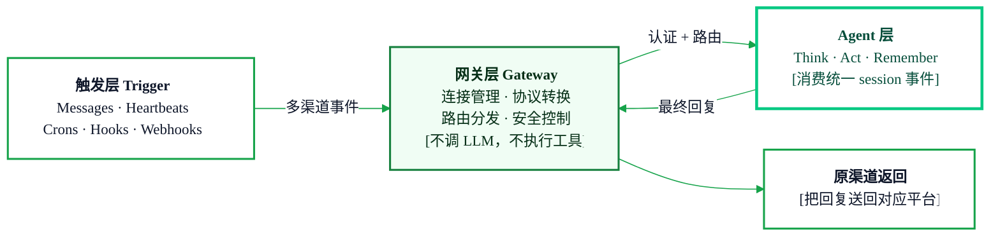
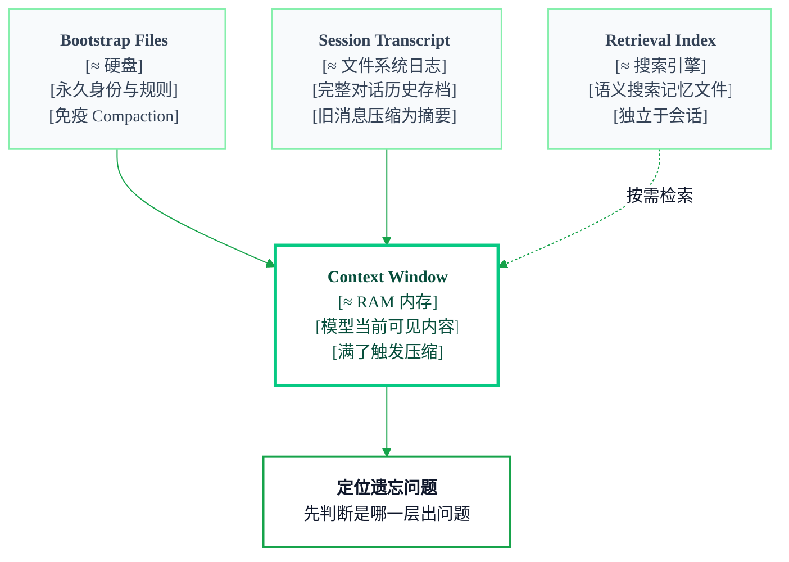
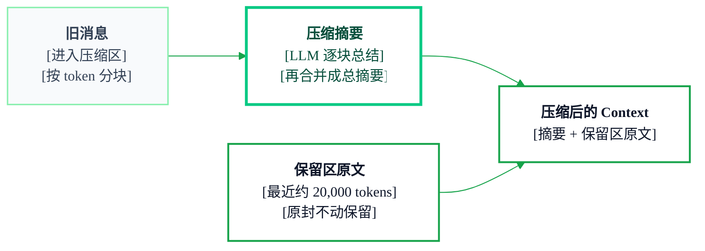
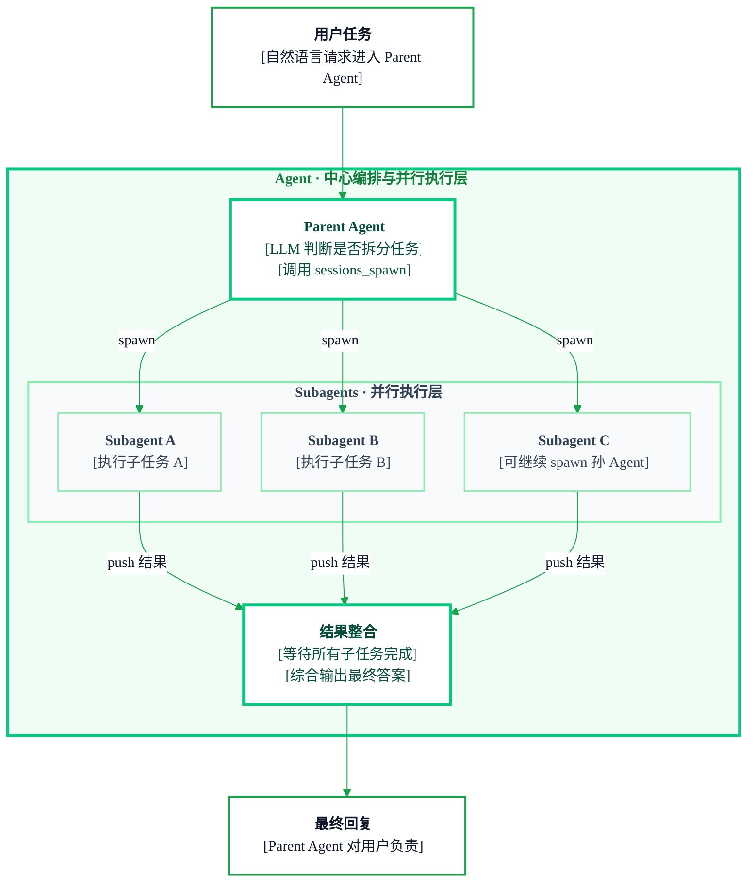

## Openclaw
<Badge icon="clock" color="green">Written: 2026.05</Badge>
OpenClaw 一定是个必考点，尤其是大模型应用岗、产品岗，基本绕不开。原因很简单：它现在就是最热门的 AI Agent 产品之一。大模型发展得这么快，真正出圈、被大量讨论的东西，面试里一定会被拿来考。有人说 2025 年是 Agent 元年，从 Manus 到 OpenClaw，Agent 的产品形态一直在往前演进，而 OpenClaw 就是这一波变化里很典型的风向标

对于这种行业爆品，不能只知道名字，最好要真的掌握它为什么火、解决了什么问题、背后用了哪些技术。网上讲 OpenClaw 怎么配置、怎么玩的视频很多，但真正拆它原理和架构的人不算多。所以这一章不会只停留在“怎么用”，而是重点讲 OpenClaw 的功能设计、技术实现和出圈原因。站在面试角度，不管你是做开发还是产品，都应该把它当成一个高频素材来准备。学完这一章，至少你可以很自然地和面试官说：OpenClaw 的源码和核心架构我认真看过

## 1.1 Openclaw是什么
>**一定会问的问题，一般面试官引入一个问题都是先问你概念，所以精心准备一个表达流畅的回答是非常必要的**

**OpenClaw 是一个开源的、可自托管的个人 AI 助手平台**

 - 核心用 `TypeScript (ESM)` 编写，运行在 `Node.js 22+` 上
 
- 通过 `npm install -g openclaw` 安装，`openclaw CLI` 是主要入口

- 所有数据和密钥都存在本地`~/.openclaw/`，不经过任何云中转

总结来说，它是一个事件驱动的 Agent 执行引擎，前面放了一个多渠道网关

## 1.2 Openclaw总体架构
>这节很核心哈，我结合这个架构图，然后把各个模块功能都讲清楚，你学明白了其实你就知道了它到底是个啥东西，为啥看上去很神奇很主动？Openclaw神秘的面纱就掀开了

**简单来说，OpenClaw 的架构分触发、网关、Agent 三层：**

- 触发层负责产生事件 - 五种来源(消息、心跳、定时任务、钩子、Webhook)不断向系统注入事件

- 网关层负责接入和路由 - 把不同协议的事件统一收进来，认证后分发到正确的 Agent 会话

- Agent 层负责智能执行 - 推理(Think)、调工具(Act)、记忆(Remember)
<Tip>
三层的本质是一个事件驱动的执行管道：事件产生 → 网关路由 → Agent 消费执行 → 状态持久化 → 等待下一个事件。这是一个永不停止的循环
</Tip>
### 1.2.1 触发层 - 5层信号源
Agent 不是只在用户发消息时才工作。OpenClaw 有**五种独立的触发维度**，每一种都能唤醒 Agent 执行：

- **Message(消息)**— 用户通过聊天渠道发消息，事件驱动，支持`Messages / CLI / App / Dashboard/ Feishu / Telegram` 等渠道

- **Heartbeat(心跳)**— 固定间隔定时器(如每 15 分钟)，固定间隔唤醒，让 Agent 主动执行

- **Cron(定时任务)**— 用户定义的计划任务(计划任务按 `cron 表达式`触发)，执行具体的定时工作

- **Webhook(外部推入)**— 外部系统通过 `HTTP POST` 触发，支持接入第三方事件

- **Hooks(生命周期钩子)**— `Gateway/Agent` 内部生命周期事件回调触发

通过上述图片，我们知道它触发的方式很多，我们通常给他发消息其实只是一种(Message)。不过 Message 可以触发的方式也很多：通过 `CLI`，通过应用(feishu, telegram)，包括 Openclaw 的 dashboard。所以其实看上去 Openclaw 好像一直在思考，很主动，其实不过是有记忆功能加上自动的触发源罢了(最后我会举例说明)

### 1.2.2 网关 - 大名鼎鼎的 Gateway
Gateway 是一个本地长驻 `Node.js` 进程，监听端口 :`18789(HTTP + WebSocket)`，是触发层和 Agent 层之间的中间件

{/* Original diagram image:

*/}
**Gateway 的核心职责**：连接管理、协议转换、路由分发、安全控制

**关键边界**：Gateway 不做推理，不调 LLM，不执行工具。它只负责“消息到了该给谁”和“回复该送回哪里”

### 1.2.3 Agent层
这层就是咱们熟悉的Agent的知识啦。React，LLM 的调用，Function Call，Memory都在这里啦~都是我们学过的知识啦
#### 1.2.3.1 推理(Think)
Agent 的核心是 <Tooltip tip="Pi 是 OpenClaw 嵌入的 Agent 执行内核，基于 Pi agent runtime 统一编排模型推理、工具调用、记忆读写与最终回复生成，形成可持续运行的多轮决策循环" cta="查看 Pi GitHub" href="https://github.com/badlogic/pi-mono">Pi Embedded Agent</Tooltip>，一个多轮推理循环。它收到消息后开始思考，决定是直接回复，还是需要调用工具获取更多信息，调完工具拿到结果后继续思考，如此循环直到生成最终回复

推理过程中需要调用 LLM。LLM 调用是从本地 Gateway 进程直接发往模型提供商 `API` 的(OpenAI、Anthropic、Gemini、Ollama 等)，不经过 OpenClaw 的任何云服务。如果用 Ollama 等本地模型，整个流程甚至完全不出你的局域网

Auth Profiles 管理多套 `API` 凭证，支持轮换和 `failover`，一个 key 被限速了会自动切到下一个。
Session Manager 维护多轮对话的上下文，当历史过长时自动压缩(compact)，管理 token 预算
#### 1.2.3.2 工具执行(Act)
Agent 推理时可以自主决定调用工具。内置的核心工具包括：

- `exec` - 执行 `Shell` 命令，有 `allowlist` 安全策略控制哪些命令可以运行

- `browser` - 通过 `CDP` 协议控制 `Chromium` 浏览器，可以浏览网页、截图、操作页面

- `message` - 向任意渠道发送消息，实现跨渠道通信

- `nodes` - 远程调用已配对的 `iOS`/`Android` 设备上的能力

- `subagents` - 启动子 Agent 并行处理复杂任务

- `apply_patch` - 修改代码文件

除了内置工具，插件也可以通过 `registerTool` 注册额外的工具，能力可以无限扩展。

#### 1.2.3.3 记忆(Memory)
记忆是 Agent 主动调用的，不是每次对话都自动塞入上下文(那样会浪费 token)。Agent 自己判断“需不需要回忆过去的信息”，然后调用 `memory_search` 工具进行混合检索，**70% 权重给向量语义搜索，30% 权重给 `BM25` 关键词搜索**(哇，这不就是RAG的稀疏向量和稠密向量双路检索吗~)。找到相关结果后，再通过 `memory_get` 读取完整的记忆内容

底层存储是一个 `SQLite` 数据库，同时维护向量 `embedding` 索引和全文索引。记忆的原始数据是 `Markdown` 文件(`MEMORY.md` 以及自动生成的会话摘要文件)

记忆的写入有两种方式。第一种是**自动捕获**：当会话结束时(用户输入 `/new` 或 `/reset`)，hook 会自动把最近的对话保存为 `memory/YYYY-MM-DD-slug.md` 文件。第二种是**文件同步**：用户手动编辑 `MEMORY.md` 或 memory 目录下的文件，`chokidar` 文件监听器检测到变化后，自动进行分块、计算 `embedding`、写入索引库。

### 1.2.4. 总结
朋友们，所以你看，Openclaw其实也没有什么特别大不了的对吗？比如Agent模块，我们的描述并不复杂，没有用什么深奥的技术。

先总结，OpenClaw的本质是事件驱动模型，看起来主动是有定时任务以及间隔触发，看起来能记事是因为有记忆，采用双路检索。看上去功能强大，可以用应用驱动是因为用了Gateway做适配。快速总结：

- **Time      → Heartbeats, Crons**

- **Humans    → Messages**

- **External  → Webhooks**

- **Internal  → Hooks → Queue → Agent Executes → State Persists**

- **Agents    → Subagents**

## 1.3 Openclaw 记忆

### 1.3.1 导语

为什么这一小节我认为很重要，给大家先说明原因：

1. **首先记忆功能是常考的，甚至必考，从面试的角度，Agent的记忆是如何实现的，这已经是背烂了的八股对吧**，这部分就是这个问题的经典实现，所以你学习这一部分是对这个高频考点的补充，我会将Openclaw的记忆功能融入笔记八股部分，更新我们的回答，让我们的回答结合现在最大的Agent的例子去答，是不是就比干巴巴回答概念要更好

2. 如果你想玩openclaw的话，Openclaw为什么总是忘记事情？如果你学了本节，那你自己就能够尝试去解决，你也可以修改里面的记忆文件，手动确定让你的龙虾能记住什么，高效组织你的龙虾记忆

3. 我想借助这个机会，学习Openclaw，大家可以理解这个产品的架构是怎么设计的，记忆模块是怎么组织的。**这样的好处是建立你的审美**，大家在设计自己的agent的时候，如果你去设计架构，你用上他这个心跳机制，定时机制，而不是干巴巴的只有一个用户输入作为触发，你用上它的4层记忆，哪怕你不改，你就去抄它的，是不是也比自己设计的高级一些，所以通过这个学习，也是为我们自己设计Agent项目打基础，站在他们的肩膀上设计你的项目，让面试官觉得你的项目是高级的，有想法，有深度的

### 1.3.2 四层记忆架构总览

OpenClaw 的记忆不是一个系统，而是 **四层独立机制** 协同工作，类似计算机的存储层次：

1. **`Bootstrap Files`(≈ 硬盘)**— Agent 的永久身份与规则，完全免疫 `Compaction`

2. **`Session Transcript`(≈ 文件系统日志)**— 完整对话历史存档，旧消息会被压缩为摘要

3. **`Context Window`(≈ RAM 内存)**— 模型当前能“看到”的所有内容，满了就触发压缩

4. **`Retrieval Index`(≈ 搜索引擎)**— 语义搜索记忆文件，独立于会话

> 知道哪一层出了问题，就能解决 90% 的“Agent 忘事”问题。

{/* Original diagram image:

*/}

### 1.3.3 Bootstrap Files（引导文件）
本质：工作空间里的 `Markdown` 文件，每次会话开始时从磁盘读取，注入上下文。

**文件清单**

`SOUL.md`— 人格、语气、边界

`AGENTS.md` — 操作指令、行为规则

`USER.md`— 用户身份信息

`TOOLS.md` — 工具使用说明

`IDENTITY.md` — Agent 名称与风格

`MEMORY.md` — 策展的长期记忆(仅主会话加载)

`HEARTBEAT.md` — 心跳任务清单(可选)

`BOOTSTRAP.md` — 首次运行仪式(一次性)

位置：`~/.openclaw/workspace/`

**关键要点**

每次会话重新从磁盘读取，不存在对话历史中 → 免疫 `Compaction`

字符限制：单文件 20,000 字符，总计 150,000 字符，超出会被截断

子 Agent 只收到 `AGENTS.md`、`SOUL.md`、`TOOLS.md`、`IDENTITY.md`、`USER.md`，拿不到 `MEMORY.md` 和 `HEARTBEAT.md`

用 `/context list` 可查看每个文件的注入状态

所有 `Bootstrap Files` 都应尽量精简
它们每轮都注入上下文，内容越多占用越大。实践中 `SOUL.md` 最容易被写过长，建议各文件都保持简洁。

### 1.3.4 Session Transcript（会话记录）
>我觉得这节还是挺重要的，他其实是你怎么组织Agent长短记忆的一些原理。我们做agent的时候都知道把历史对话记录每次拼接，放到下一轮对话。那么窗口满了，如何压缩，压缩保留什么东西，这时要把什么东西存到本地做长期记忆，这些技巧在本书都讲了，面试也是爱问的，建议掌握，要是能面试时候说出来，或者用到你的项目中，都会大大加分

**本质**：完整对话历史，以 `JSONL` 文件追加写入磁盘

**存储位置**

~~~text title="Session 存储结构" icon="folder-tree"
~/.openclaw/agents/agentId>/sessions/
├─ sessions.json            # 会话元数据
└─ sessionId>.jsonl         # 对话记录（包含消息、工具调用、压缩摘要）
~~~

**关键要点:**

- 每条消息自动追加到 `JSONL`，包括用户消息、助手回复、工具调用

- 继续会话时从 `JSONL` 重建上下文，跨重启持久

- 磁盘上的原始记录始终保留，但模型只看到上下文窗口中的部分

#### 1.3.4.1 Compaction（压缩）详解
**两种触发方式：**

- **自动触发(`Auto-Compaction`)：** 上下文使用量达到阈值时自动触发。有两种情况：

  - **溢出恢复：** 模型返回 `context overflow` 错误 → 压缩 → 重试

  - **阈值维护：** 成功完成一轮后，`contextTokens` > `contextWindow` - `reserveTokens` 时触发

- **手动触发：** 输入 `/compact`，可带自定义指令如 `/compact` 重点保留决策和待办事项

**触发公式：** 上下文窗口 - `reserveTokensFloor`(默认 20000)- `softThreshold`(默认 4000)，200K 模型 → 约 176K 时触发。

**压缩的具体过程：**

1. **划分保留区和压缩区：** 最近的 ~20,000 tokens 消息被划为“保留区”，原封不动保留，模型看到的就是原文。保留区之前的所有旧消息进入“压缩区”。
2. **分割压缩区：** 把压缩区的旧消息按 token 数分成若干块(默认分 2 块，自适应调整块大小)。
3. **逐块总结：** 用模型对每个块生成摘要(调用 generateSummary，失败会重试 3 次)。
4. **合并摘要：** 如果有多个块的摘要，再用模型把它们合并成一个连贯的总摘要。
5. **写入 Transcript：** 在 `JSONL` 文件中写入一条 compaction 类型的条目，包含摘要文本和 firstKeptEntryId(保留区最早消息的 ID)。

**压缩后模型看到的上下文结构：** [压缩摘要] + [保留区原文(最近 ~20,000 tokens)]

{/* Original diagram image:

*/}

**什么时候触发?**

总结过程有明确的指令

**必须保留：**

• 进行中的任务及其状态(进行中、阻塞、待办)

• 批量操作的进度(如“17 项中已完成 5 项”)

• 用户最后请求的内容以及正在做什么

• 已做出的决策及其理由

• TODO、开放问题和约束条件

• 承诺的后续行动

默认还会**完整保留所有不透明标识符**(UUID、哈希、ID、token、API key、主机名、IP、端口、URL、文件名)，不缩写不重构。这由 `identifierPolicy: "strict"` 控制。

**Pre-Compaction Memory Flush**

压缩前 OpenClaw 会静默运行一轮，提醒 Agent 把重要内容写入 `memory/YYYY-MM-DD.md`，用户不可见(NO_REPLY)。每个压缩周期只触发一次。

>聊天中说的指令不会自动保存到文件，不写入文件就会被压缩丢掉。这是最常见的“Agent 失忆”原因

### 1.3.5 Context Window(上下文窗口)
**本质：** 固定大小的 token 容器，大小由模型决定(如 Claude 200K、GPT-4 128K、Gemini Pro 1M)，模型每轮推理时所有信息都要挤进来。

**关键要点**

**• 每轮竞争空间的内容：** 系统提示 + `Bootstrap Files` + 对话历史 + 工具调用结果(包括 `memory_search / memory_get` 检索到的记忆片段)+ 当前消息

• **最大的 token 消耗者是工具结果**(文件读取、检索结果、网页快照、`API` 响应)

• `Bootstrap Files` 每轮都占空间，所以要尽量精简

• **满了就触发 `Compaction`**，旧对话被压缩

• 用 `/status` 监控使用量，建议在 75-80% 时手动压缩

### 1.3.6 Retrieval Index(检索索引)
**本质：** 为记忆文件建立的搜索索引，Agent 通过工具按需检索，不用把所有记忆都塞进上下文。

**索引范围**

• `MEMORY.md` + `memory/**/*.md`(默认)

• 可通过 `memorySearch.extraPaths` 添加额外路径(如 Obsidian 笔记库)

• 存储在 `~/.openclaw/memory/agentId>.sqlite`

**检索工具与触发方式**

OpenClaw 提供两个记忆工具：

• `memory_search` — 语义搜索，返回相关片段(文件路径 + 行号 + 分数)

• `memory_get` — 按路径读取指定记忆文件的具体内容

检索不是每次对话自动触发的.`memory_search` 是一个工具，由模型自己判断是否需要调用. 系统提示中会指导模型“在回答关于过去的决策、日期、人物、偏好、待办等问题前，先调用 `memory_search`”，但最终是模型自行决定何时搜索、用什么关键词搜索. 简单闲聊不会触发检索

工作流是两步走：先 `memory_search` 找到相关片段 → 再 `memory_get` 读取完整上下文

**混合搜索**

同时使用向量语义匹配(擅长同义词)+ `BM25` 关键词匹配(擅长精确 ID/代码符号)，加权合并：

$$
\text{finalScore} = 0.7 * \text{vectorScore} + 0.3 * \text{textScore}
$$

**关键要点**

• **只索引文件** - 聊天中说过但没写入文件的内容搜不到

• 文件变动后自动重新索引(去抖 1.5 秒)

• 支持 MMR 去重(过滤近似重复结果)和时间衰减(默认半衰期 30 天，新笔记排名更高)

• 常青文件(`MEMORY.md`、非日期命名的 `memory/*.md`)不受时间衰减影响

• 反复引用的重要知识建议直接放在 `memory/` 目录下按主题组织(如 `memory/trading-system/`)，而不是只存在外部

## 1.4 Openclaw Agent 架构解析
我们分析了 OpenClaw 的整体架构，它由三层构成：

{/* Original text diagram:
~~~
触发层 → 消息渠道（Discord、Telegram、Slack、WhatsApp 等）
网关层 → Gateway（路由、session 管理、并发控制）
Agent 层 → Agent（LLM 驱动，执行任务）
~~~
*/}

本文聚焦 **Agent 层**的内部架构。Agent 的架构其实是面试官非常喜欢问的高频考点，我们在笔记中有了很详细的总结。要说我们之前学的是理论，那么我希望通过这一章节从实践上看看，Openclaw 使用的 Agent 架构和我们之前的理论知识是否吻合。学习这一小节，除了从真正工程的角度加强对这个经典面试题的理解，另一方面其实也体现在自己的架构设计上，我们在设计自己的 Agent 的特性和架构上，能不能参考 Openclaw 的架构，把我们的项目做的更高级

在我们笔记的 Multi-Agent 典型架构章节中，讲过常见的架构模式：**`SAS`**、**`Independent`**、**`Centralized`**、**`Decentralized`**、**`Hybrid`**，这里简单回顾一下：

- **`SAS`(单智能体)**：只有一个 Agent 独立完成所有任务

- **`Independent`(独立型)**：多个 Agent 并行运行，互不通信，各自完成独立任务

- **`Centralized`(中心化)**：一个中心 Agent 负责编排，将子任务分发给 Worker Agent 执行

- **`Decentralized`(去中心化)**：Agent 之间 `P2P` 直接通信协作，无固定中心

- **`Hybrid`(混合型)**：以上模式的组合

今天我们将理论变成实践，解析 OpenClaw 这个真实项目中到底使用了什么架构，看看和我们之前讲的理论能不能匹配得上

### 1.4.1 概述

OpenClaw 的 Agent 框架本质上是一个递归 **`Centralized`** 架构：

• Parent Agent 作为中心，用 LLM 决策任务如何拆解，向下 spawn 子 Agent 执行

• 子 Agent 可以继续 spawn 孙 Agent，每一层都是该层的中心，形成一棵递归的 `Orchestrator-Worker` 树

• 路由和调度由无智能的 **Gateway** 承担，不是 Agent

**Agent 框架图**

{/* Original diagram image:

*/}

### 1.4.2 Openclaw Agent架构详解
OpenClaw 的多 Agent 能力没有专门的“调度引擎”或“编排框架”，而是完全基于 LLM 的标准 Tool Use 机制实现的：

- **工具(Tool)**：`sessions_spawn` 被注册为一个普通工具，和 `exec`、`web_search` 地位相同，调用它就会在系统层创建并启动一个子 Agent

- **提示词(Prompt)**：系统提示词注入一句触发规则，告诉 LLM 什么情况下应该使用这个工具

- **LLM 决策**：LLM 在每轮推理中自主判断是直接处理任务，还是调用 `sessions_spawn` 把任务委托给子 Agent

这意味着 OpenClaw 的多 Agent 编排能力，是从 LLM 的 tool call 能力“衍生”出来的，而不是独立构建的一套系统。架构简洁，扩展自然。

#### 1.4.2.1 为什么选 Centralized
Openclaw 的作者并没有说他自己为什么这么设计架构，不过我们之前笔记有讲不同的架构的抉择，我谈一谈我的理解，不过对于模型架构的选择，其实你很难说哪个是最好的，这没有固定答案，我觉得这一点就是你能够想清楚，面试能讲清楚，能自洽就行。

用户通过消息渠道发来一条消息，最终必须有一条连贯的回复发回去。这个“一进一出”的结构，天然要求有且只有一个 Agent 对最终回复负责
谁收到消息、谁整合结果、谁发出回复，必须是同一个主体。`Centralized` 的父子结构正好对应这个模型：Parent Agent 是唯一的回复责任人，子 Agent 只是它用来扩展执行能力的手段。

如果换成 `Decentralized`，多个 Agent `P2P` 协商，最终谁来发回复？没有确定的答案。如果换成 `Independent`，各 Agent 独立运行互不感知，结果根本无法拼合成一条完整的回复。

对话本身的结构就是中心化的
有一个确定的入口，有一个确定的出口，中间的执行可以分发，但责任链不能断。

#### 1.4.2.2 Spawn 的决策机制

**维度一：决策规则 - 谁来判断，依据什么**

是否 spawn 子 Agent，完全由 Parent Agent 的 LLM 自主判断，没有外部调度器介入。OpenClaw 给 LLM 的判断依据只有系统提示词中的一句话(`src/agents/system-prompt.ts`)：
~~~
If a task is more complex or takes longer, spawn a sub-agent.
Completion is push-based: it will auto-announce when done.
~~~
就这一句。没有复杂的拆分规则，“复杂”和“耗时长”的边界完全交给模型自己理解和判断

**维度二：执行工具 - spawn 是怎么实现的**

`sessions_spawn` 是系统注册给 Agent 的一个普通工具。LLM 决定 spawn 后，就像调用任何其他工具一样调用它

**系统提示词如何把这个工具介绍给 Agent：**

~~~text
sessions_spawn: Spawn an isolated sub-agent session
~~~
工具名 + 一句描述，Agent 就知道它的存在和用途了

**工具的调用参数：**

~~~text
sessions_spawn(
  task,          // 子任务描述（自然语言，直接成为子 Agent 的 prompt）
  agentId,       // 目标 Agent ID（可选）
  runtime,       // "subagent"（轻量）或 "acp"（重量级，支持外部 CLI）
  mode,          // "run"（一次性）或 "session"（持久线程绑定）
  model,         // 模型覆盖（可选）
  thinking,      // 思考强度覆盖（可选）
  attachments,   // 文件附件（可选）
)
~~~

**两种 `runtime`**

`sessions_spawn` 支持两种 `runtime`，决定子 Agent 以什么方式运行：

- `subagent`：轻量模式，子 Agent 在同一宿主进程中运行，继承父 Agent 的 workspace 目录，适合大多数常规任务拆分场景。来源：`src/agents/subagent-spawn.ts`

- `acp`：重量级模式，基于 OpenClaw 内置的 `ACP`(Agent Control Protocol)协议，子 Agent 在独立进程中运行，可以对接 Codex 等外部 `CLI` 编程工具，支持持久化 session 和恢复，适合需要长期运行或内嵌外部工具链的场景。来源：`src/agents/acp-spawn.ts`

**`ACP` 如何开启，LLM 如何选择**

`ACP` 由配置项 `acp.enabled` 控制，默认开启，用户可以显式设置 `acp.enabled=false` 关闭。沙箱化 session 中 `ACP` 会被自动禁用。

开启 `ACP` 不代表每次 spawn 都会用 `ACP`。开启只是“解锁了这个选项”，并在系统提示词中额外注入一段触发规则告知 LLM：
~~~
For requests like "do this in codex/claude code/gemini", treat it as ACP
and call sessions_spawn with runtime: "acp".
~~~
也就是说，LLM 默认 spawn 的仍然是 `subagent`，只有当用户明确表达“用 Codex 做”“用 Claude Code 做”之类的意图时，LLM 才会判断为 `ACP` 场景，切换到 `runtime="acp"`。选择哪种 `runtime` 和是否 spawn 的决策逻辑完全一致，都由 LLM 自主判断，提示词只是提供规则。

#### 1.4.2.3 子Agent限制条件

LLM 发出调用后，系统还会做一系列硬性检查，任一不通过就返回 `forbidden`，LLM 的意图不会被直接执行：

- **深度限制**：当前深度 `>= maxSpawnDepth` 就拒绝，默认 `maxSpawnDepth=1`(即子 Agent 默认不能再 spawn)

- **子 Agent 数量上限**：单个 session 的活跃子 Agent 数 `>= maxChildrenPerAgent` 就拒绝，默认 `maxChildrenPerAgent=5`

- **Agent ID 白名单**：若配置了 `allowAgents`，只有列出的 `agentId` 可被 spawn

更底层的封锁是：叶子节点(leaf)的 Agent 工具列表里根本没有 `sessions_spawn`，LLM 物理上无法调用它(`src/agents/pi-tools.policy.ts`)：
~~~text title="Agent 深度角色结构" icon="folder-tree"
深度 0（main）           → 角色：main          → sessions_spawn 可用
深度 1（maxDepth>=2）    → 角色：orchestrator  → sessions_spawn 可用
深度 1（maxDepth=1）     → 角色：leaf          → sessions_spawn 不可用（工具不存在）
深度 2+                  → 角色：leaf          → sessions_spawn 不可用（工具不存在）
~~~

### 1.4.3 Agent通信机制
**Agent 的通信机制其实也是一个高频考点，面试官喜欢问的，你的 Agent 之间是如何通信的？**

>在我们之前笔记的「Agent 之间的通信与状态管理」章节中，已经介绍过 Agent 间的两种主要通信>模式和消息传递策略。这里结合 OpenClaw 的实现，看看理论在真实项目中是如何落地的

#### 1.4.3.1 通信模式

**工具调用，而非移交**

Agent 间通信有两种常见模式(详细内容见笔记 Agent 之间通信和状态管理 部分)：

- **移交(Handoff)**：一个 Agent 将执行上下文和执行权完整传递给另一个 Agent，自身退出。控制权转移，像接力跑把棒交出去。

- **工具调用(Tool Call)**：一个 Agent(主管)将任务委托出去，保留控制权，等待结果回来后自己决定下一步，负责最终输出。

#### 1.4.3.2 消息传递

**仅最终结果，不传推理链**

>之前笔记的「Agent 之间的通信与状态管理」章节也介绍过消息传递内容的两种策略：
共享完整推理数据(中间步骤全部写入共享通道，协作能力强但上下文膨胀快)和仅共享最终结果(私有空间内完成计算，只把结论写入共享区，状态复杂度可控) OpenClaw 选择的是后者。

子 Agent 完成任务后，只把最终回复(`readLatestAssistantReply`)蒸馏成一条消息推回父 Agent，中间的 `tool call 链`、`chain-of-thought` 全部留在子 Agent 自己的私有 session 里，父 Agent 看不到。这有效控制了父 Agent 的上下文膨胀。每个子 Agent 都有独立的 session 状态，父 Agent 只收到一条结论性消息

#### 1.4.3.3 结果传递机制

**push-based announce**

具体实现上，子 Agent 不是同步返回值，而是异步 push：
1. 子 Agent 完成任务
2. `subagent-announce.ts` 把蒸馏后的结果以“用户消息”形式注入父 Agent 的消息队列
3. 父 Agent 在 LLM 下一轮 turn 中感知到了子 Agent 完成事件
4. 父 Agent 等所有期待的子 Agent 都 announce 后，才输出最终回复

这是工具调用模式的一个变体：spawn 时立刻返回 `accepted`(非阻塞)，结果通过消息通知而非返回值传回。可以看到以下这个代码注释，当子 agent 完成了结果后，会把结果发送到 Gateway 中，Gateway 会把这个结果当成一条用户消息发送给父 agent，当父 agent 收到这个消息时，就知道子 agent 完成了，当所有子 agent 都完成了，父 agent 就可以整合结果输出了。

>来源注释(代码原文)：
>
>*"After spawning children, do NOT call sessions_list, sessions_history, exec sleep, or any polling tool. Wait for completion events to arrive as user messages."*
>
— `subagent-spawn.ts`: `SUBAGENT_SPAWN_ACCEPTED_NOTE`
>

#### 1.4.3.4 结果的整合

假设 Parent spawn 了 5 个子 Agent，它们各自完成后依次 push 消息回来，Parent 的对话历史里会陆续积累：
~~~
[消息] 子 Agent A 完成：结果是 X
[消息] 子 Agent B 完成：结果是 Y
[消息] 子 Agent C 完成：结果是 Z
...
~~~
每来一条，Parent 都被触发一次 turn，发现还没收全就等待，直到最后一条到达时，所有结果已经在上下文里了。这时提示词(`subagent-announce.ts` 的 `Subagent` Context)告诉 Parent：

>"Coordinate their work and synthesize results before reporting back."

结合 `subagent-spawn.ts` 里的：

>"track expected child session keys, and only send your final answer after ALL expected completions arrive."

## 1.5 安全风险
OpenClaw 之所以强大，是因为它深度接入了你的系统——它可以运行 `Shell` 命令、读写文件、执行脚本、控制浏览器。但 access 是一把双刃剑：同样的能力让它能帮你干活，也让它成为潜在的攻击面。

**风险有多大?**

`Cisco` 的安全团队分析了 OpenClaw 的生态系统，发现 26% 的可用 skill 包含至少一种安全漏洞。他们称之为 "security nightmare"。主要风险包括：

• **Prompt Injection(提示词注入)**— 攻击者可以在邮件、文档、网页中嵌入恶意指令。当 Agent 读取这些内容时，可能被诱导执行非预期操作(比如泄露数据、发送消息、执行命令)。这是当前 AI Agent 最普遍且最难防御的攻击向量。

• **恶意 Skill / 插件** — Marketplace 上的第三方 skill 可能包含恶意代码。安装一个 skill 等于授予它 Agent 的全部能力——`Shell` 执行、文件访问、网络请求。一个看似无害的“天气查询” skill 可能在后台做任何事。

• **凭证泄露(Credential Exposure)**— Agent 运行在你的机器上，可以访问环境变量、配置文件、SSH key、`API` token 等。如果 Agent 的行为被 `prompt` injection 劫持，这些凭证可能被外泄。

• **命令误解(Command Misinterpretation)**— Agent 可能误解你的意图，执行了你不想要的操作。比如你说“清理一下这个目录”，Agent 可能删掉你没打算删的文件。`Shell` 命令是不可逆的，`rm -rf` 不会问你确认。

**官方怎么说**

OpenClaw 的官方文档也承认没有完美的**安全 setup**。他们建议：

• **使用隔离账号(isolated accounts)**— 不要用你的主账号运行 OpenClaw，创建一个权限受限的专用账号

• **使用次要设备(secondary machine)**— 最好在一台非关键机器上运行，而不是你的主力工作机

• **限制 skill 数量** — 只安装你确实需要的 skill，减少攻击面

• **监控日志(monitor logs)**— 定期检查 Agent 的执行日志，了解它做了什么

**本质矛盾**

这是所有 AI Agent 平台面临的根本矛盾：**能力越强，风险越大**。OpenClaw 的价值在于它能深度操作你的系统，但这也是它的风险所在。它不像一个沙箱里的聊天机器人，它拥有真实的系统权限，运行真实的命令，访问真实的文件。任何一次 `prompt injection`、一个恶意插件、一次命令误解，都可能造成真实的后果

## 1.6 面试问题
>吸收了上面的问题，我觉得你可以足够应付大部分的 openclaw 面试问题。这一小节快速总结上述知识，给出标准面试参考答案，毕竟面试时不可能哪里吧嗒说的一堆。用这些面试问题检验自己吧~

<AccordionGroup>
  <Accordion title="Q1: OpenClaw 是什么？">
    OpenClaw 是一个开源的、可自托管的个人 AI 助手平台。本质上是一个事件驱动的 Agent 执行引擎，前面放了一个多渠道网关。用 `TypeScript` 编写，运行在你自己的机器上，所有数据和密钥不离开本地
    
    ---
  </Accordion>

  <Accordion title="Q2: OpenClaw 的架构是什么？">
    **三层架构：触发层、网关层、Agent 层**。触发层有五种事件源(Messages、Heartbeats、Crons、Hooks、Webhooks)不断产生事件；网关层负责协议转换、认证和路由分发；Agent 层负责推理(Think)、工具执行(Act)和记忆(Remember)。本质是一个事件驱动的执行管道：事件产生 → 网关路由 → Agent 执行 → 状态持久化。
    
    ---
  </Accordion>

  <Accordion title="Q3: 网关层 Gateway 是什么？它的作用是什么？">
    Gateway 是一个本地长驻的 `Node.js` 进程，监听单一端口(默认 18789)，同时提供 `HTTP` 和 `WebSocket`。它是触发层和 Agent 层之间的中间件，负责渠道连接管理、协议转换、会话路由、认证鉴权、插件加载和设备配对。关键边界是：Gateway 不做推理、不调 LLM、不执行工具，只负责“消息到了该给谁”和“回复该送回哪里”
    
    ---
  </Accordion>

  <Accordion title="Q4: 有哪些消息源/触发源？">
    **五种：**

    **Messages** — 用户通过聊天渠道发消息，事件驱动

    **Heartbeats** — 固定间隔定时器(如每 15 分钟)，让 Agent 主动唤醒

    **Crons** — 用户定义的计划任务(`cron` 表达式)，执行具体的定时工作

    **Hooks** — Gateway/Agent 内部生命周期事件触发的回调

    **Webhooks** — 外部系统通过 `HTTP` POST 触发

    加上 Agents 可以派生 `Subagents`，形成递归执行。

    ---
  </Accordion>

  <Accordion title="Q5: 为什么能接入各个平台？">
    因为 Gateway 层的 Channel Manager 把每个渠道封装为一个独立的 `Channel Plugin`，每个插件实现统一的接口(ChannelGatewayAdapter、ChannelMessagingAdapter、ChannelOutboundAdapter)。不同渠道的协议差异(Telegram Bot `API`、Discord `WebSocket`、WhatsApp Baileys 等)被封装在各自插件内部，对上层 Agent 暴露一致的消息接口。加一个新渠道只需写一个 `Channel Plugin`，Agent 代码零改动。目前支持 20+ 个渠道。

    ---
  </Accordion>

  <Accordion title="Q6: 记忆能力是如何实现的（或者说是长期记忆，注意和后面的记忆系统区分开）？">
    记忆是 Agent 主动调用的工具，不是自动注入 `prompt`。Agent 通过 `memory_search` 工具进行混合检索(70% 向量语义搜索 + 30% `BM25` 关键词搜索)，再通过 `memory_get` 读取完整内容。底层是 `SQLite` 数据库，同时维护向量 `embedding` 索引和全文索引。记忆写入有两种方式：会话结束时自动捕获为 `Markdown` 文件，以及用户手动编辑记忆文件后通过文件监听增量索引

    ---
  </Accordion>

  <Accordion title="Q7: 相比传统 AI 聊天机器人，OpenClaw 的优势在哪？">
    四个核心差异：

    **不止聊天，能做事** — 可以执行 `Shell` 命令、控制浏览器、修改文件、远程操作设备，是一个真正的 Agent

    **不止等消息** — 五种触发源让它能定时唤醒、自主行动，而不是只等用户说话

    **隐私自主** — 本地部署，LLM `API` 直连，数据不经过第三方服务

    **渠道统一** — 一个 Agent 同时服务所有聊天平台，而不是每个平台各建一个 bot

    ---
  </Accordion>

  <Accordion title="Q8: OpenClaw 有什么优缺点？">
    **优点：**

    • 开源自托管，隐私可控，数据不离开本地

    • 支持 20+ 渠道，一个 Agent 统一服务

    • 插件化架构，核心精简，能力可无限扩展

    • 五种触发源，能主动行动而非只是被动回复

    • 支持多模型 `provider`，可灵活切换和 `failover`

    **缺点/风险：**

    • 深度系统权限带来安全风险 — `Cisco` 分析发现 26% 的可用 skill 包含漏洞

    • Prompt injection 攻击可能通过邮件/文档劫持 Agent 行为

    • 第三方插件可能包含恶意代码

    • 命令误解可能导致不可逆操作(如误删文件)

    • 官方也承认没有完美的安全 setup，建议用隔离账号和次要设备运行

    ---
  </Accordion>

  <Accordion title="Q10: 当对话超出上下文限制时，OpenClaw 的压缩策略是什么？">
    OpenClaw 采用的是**分阶段摘要式压缩**。当上下文 token 用量接近模型窗口上限时会自动触发，用户也可以通过 `/compact` 命令手动触发。

    具体过程是这样的：首先把对话历史分成两部分，最近大约 20,000 tokens 的消息作为“保留区”原封不动地留下来，更早的旧消息进入“压缩区”。然后把压缩区的内容按 token 数切成若干块，默认是 2 块，块大小会根据消息平均长度自适应调整，同时预留 20% 的安全裕量防止 token 估算不准。接着用 LLM 对每一块生成结构化摘要，如果有多块就再合并成一份连贯的总总结。摘要有严格的保留要求，必须包含进行中的任务状态、用户最后的请求、决策理由、TODO 和约束条件，以及所有不透明标识符比如 `UUID`、`URL`、文件路径等，都必须原样保留。

    另外还有一个亮点是压缩前记忆冲刷机制：在真正压缩之前，系统会静默触发一轮 agent 回合，提醒模型把重要信息写入记忆文件，这样即使对话被压缩，关键知识也不会丢失。压缩完成后，模型看到的上下文就变成了“压缩摘要加上保留区原文”这样的结构。

    ---
  </Accordion>

  <Accordion title="Q11: OpenClaw 如何组织长短期记忆？">
    OpenClaw 的记忆分为**短期记忆**和**长期记忆**两部分，各自有不同的存储形式和组织方式

    短期记忆就是当前会话的对话上下文，包括用户消息、助手回复、工具调用结果这些内容，全部在 `Context Window` 里以消息列表的形式存在。它的特点是容量受模型上下文窗口限制，比如 Claude 是 200K tokens，满了之后旧对话就会被压缩成一段结构化摘要，只保留最近约 20,000 tokens 的原始消息。所以短期记忆本质上是临时的、会被压缩的

    长期记忆则完全基于磁盘上的 `Markdown` 文件，分成两种组织方式。第一种是 `MEMORY.md`，这是一个策展式的长期记忆文件，存放的是用户偏好、持久性决策、重要事实这些需要长期保留的内容，由 Agent 主动维护和更新，每次会话启动时注入上下文，不受压缩影响。第二种是 `memory/YYYY-MM-DD.md`，按日期组织的追加式日志，存的是当天的运行笔记、阶段性进展、临时但值得回顾的上下文，会话启动时只读入今天和昨天的内容

    长期记忆还配有一套检索引擎机制。系统会对所有记忆文件建立混合搜索索引，包括向量语义搜索和 `BM25` 关键词搜索，Agent 在需要的时候通过 `memory_search` 工具按需检索，不用把全部历史记忆都塞进上下文里。这样即使记忆文件越积越多，也不会撑爆上下文窗口

    两者之间的衔接靠的是**压缩前记忆冲刷**：当短期记忆快满需要压缩时，系统会先静默提醒 Agent 把当前对话中重要的内容写入长期记忆文件，然后再做压缩。这就保证了短期记忆中真正有价值的信息能沉淀到长期记忆里，不会因为压缩而彻底丢失

    ---
  </Accordion>

  <Accordion title="Q12: 简述 OpenClaw 的记忆系统原理。">
    OpenClaw 的记忆模块并不是单一系统，而是由四层协同机制组成的，可以类比计算机的存储层次。

    第一层是 **`Bootstrap Files`**，相当于硬盘上的固件。包括 SOUL.md、AGENTS.md、USER.md、MEMORY.md 等 `Markdown` 文件，存放的是 Agent 的人格设定、行为规则、用户身份和策展过的长期知识。它们每次会话启动时都从磁盘重新读取注入上下文，完全免疫压缩，是最稳定的一层记忆。不过有字符上限，单文件 20,000 字符，总计 150,000 字符，所以要保持精简。

    第二层是 **`Session Transcript`**，相当于文件系统日志。完整的对话历史用 `JSONL` 格式逐条追加写入磁盘，包括用户消息、助手回复、工具调用和压缩摘要。它是跨重启持久的，继续会话时从 `JSONL` 重建上下文。但模型不是看全部记录，而是只看当前上下文窗口能装下的部分，更早的内容通过压缩变成摘要。

    第三层是 **`Context Window`**，相当于 RAM。就是模型每轮推理时实际能看到的所有内容，包括系统提示、`Bootstrap Files`、对话历史、工具返回结果都挤在这个固定大小的空间里。容量由模型决定，满了就触发 `Compaction`。压缩时把最近约 20,000 tokens 原样保留，更早的消息用 LLM 生成结构化摘要替代，摘要里必须保留任务状态、决策理由、TODO 和关键标识符。压缩前还会静默提醒 Agent 把重要信息写入记忆文件，防止信息丢失。

    第四层是 **`Retrieval Index`**，相当于搜索引擎。系统对所有记忆文件建立混合搜索索引，同时使用向量语义搜索和 `BM25` 关键词搜索，按 7:3 权重融合排序。Agent 通过 `memory_search` 和 `memory_get` 这两个工具按需检索，不需要把全部记忆都塞进上下文。检索是模型自主决策的，不是每轮自动触发。索引还支持时间衰减和去重，新笔记排名更靠前。

    这四层的协同逻辑是：`Bootstrap Files` 提供稳定的身份和规则基座，`Session Transcript` 保存完整的历史记录，`Context Window` 管理当前可见的工作记忆并在满时通过压缩保持可用，`Retrieval Index` 让 Agent 能按需回忆历史而不占用上下文空间。关键设计原则是只有写入磁盘文件的信息才是真正持久的记忆，纯对话中没有持久化的内容压缩后就不可恢复了。

    ---
  </Accordion>

  <Accordion title="Q13: OpenClaw 采用了什么 Agent 架构？">
    递归 `Centralized`(中心化)架构。Parent Agent 作为中心，通过 LLM 的 tool call 机制调用 `sessions_spawn` 工具创建子 Agent 执行子任务，子 Agent 完成后 push 结果回父，父 Agent 等所有子任务完成后整合输出。子 Agent 可以继续 spawn 孙 Agent，形成一棵 `Orchestrator-Worker` 树，每一层都是该层的中心。

    ---
  </Accordion>

  <Accordion title="Q14: OpenClaw 中的 Agent 是如何通信的？">
    **通信模式上是工具调用，控制权始终留在 Parent Agent。具体实现是 push-based 异步消息**：子 Agent 完成后通过 `subagent-announce.ts` 调用 `callGateway({ method: "agent" })`，Gateway 把结果以“用户消息”的形式投递到父 Agent 的消息队列，触发父 Agent 的下一轮 LLM 推理。父 Agent 不轮询，不阻塞线程，等消息触发即可。

    传递内容上只传最终结果，子 Agent 的中间推理步骤(tool call 链、`chain-of-thought`)全部留在私有 session 里，不传给父 Agent，有效控制上下文膨胀。

    ---
  </Accordion>

  <Accordion title="Q15: 为什么 OpenClaw 要选择中心化的 Agent 架构？">
    根本原因是对话本身的结构是中心化的。**有确定的入口(用户发消息)，有确定的出口(给用户一条完整回复)，中间的执行可以分发，但责任链不能断**

    如果换成去中心化(`P2P` 协商)，最终谁来发回复没有确定答案；如果换成 `Independent`(各自独立)，结果无法拼合成一条完整回复。`Centralized` 的父子结构正好对应这个“一进一出”的模型：Parent Agent 是唯一的回复责任人，子 Agent 只是它延伸执行能力的手段

    ---
  </Accordion>

  <Accordion title="Q16: 使用 Centralized 架构后，系统性能受限于 Parent Agent，如何解决？">
    这是 `Centralized` 架构的经典瓶颈

    OpenClaw 在设计上从三个方向缓解这个问题：

    1. **减少 Parent 的工作量**：Parent 只做编排和最终整合，不做具体执行。OpenClaw 在子 Agent 的系统提示词里明确约束(`subagent-announce.ts` 的 `Subagent` Context)："Stay focused - Do your assigned task, nothing else"、"NO user conversations (that's parent's job)"。子 Agent 不允许跑题，不允许主动发消息，Parent 只需要等结果、做最终决策，每轮 turn 的工作量被压到最低。

    2. **并行化子任务**：Parent 可以同时 spawn 多个子 Agent 并行执行，不需要串行一个一个等。总耗时取决于最慢的那个子 Agent，而不是所有子任务时间之和。Parent 在提示词里也被告知可以同时 spawn 多个任务，依靠 push-based announce 各自回来触发汇总。

    3. **并发数量限制(稳定性护栏)**：并行是加速手段，但无限并行会耗尽系统资源，所以 OpenClaw 同时设置了两层上限作为反向约束：单个 session 的活跃子 Agent 数由 `maxChildrenPerAgent` 控制(默认 5，来源：`subagent-spawn.ts:344`)，全局所有子 Agent 的并发数由 `DEFAULT_SUBAGENT_MAX_CONCURRENT` 控制(默认 8，来源：`src/config/agent-limits.ts`)。超出上限时 `sessions_spawn` 直接返回 `forbidden`，防止雪崩。

    4. **递归下推编排**：当配置 `maxSpawnDepth >= 2` 时(默认是 1)，子 Agent 本身也可以变成 Orchestrator(角色从 `leaf` 升级为 `orchestrator`，`sessions_spawn` 工具会被加入其工具列表)，继续向下 spawn 孙 Agent，把编排压力分散到子层。Parent 只负责顶层任务拆解，不需要直接接管所有叶子节点。

    5. **按角色分配模型**：`sessions_spawn` 的参数支持 `model` 和 `thinking` 覆盖，可以给 Parent 配置推理能力强的模型做决策，给执行型子 Agent 配置更快更轻量的模型做具体任务，按角色分配算力而不是一刀切。

    ---
  </Accordion>

</AccordionGroup>

## 1.7 参考资料
<Tabs>
  <Tab title="源码" icon="github">
    <Card
      title="OpenClaw 源代码"
      icon="github"
      href="https://github.com/openclaw/openclaw"
      horizontal
    >
      OpenClaw 开源的 OpenClaw 主仓库，适合查看 Agent 执行引擎、记忆系统、多 Agent 调度和工具调用源码
    </Card>
  </Tab>

  <Tab title="官网" icon="globe">
    <Card
      title="OpenClaw 官网"
      icon="globe"
      href="https://clawcn.net/"
      horizontal
    >
      OpenClaw 的官方入口，适合了解产品定位、功能介绍、安装方式和最新动态
    </Card>
  </Tab>

  <Tab title="视频" icon="play">
    <Card
      title="How OpenClaw Works: The Architecture Behind the 'Magic'"
      icon="play"
      href="https://www.youtube.com/watch?v=CAbrRTu5xcw"
      horizontal
    >
      Youtuber: Damian Galarza  
      用于快速了解 OpenClaw 的总体架构、执行机制和安全风险
    </Card>

    <Card
      title="OpenClaw Full Course: Setup, Skills, Voice, Memory & More"
      icon="play"
      href="https://www.youtube.com/watch?v=vte-fDoZczE"
      horizontal
    >
      Youtuber: Tech With Tim  
      更适合系统补充 OpenClaw 的使用方式、工程实现和技术细节
    </Card>

    <Card
      title="How OpenClaw Memory ACTUALLY Works (4 Memory Layers)"
      icon="play"
      href="https://www.youtube.com/watch?v=HM0ATQCHGP0"
      horizontal
    >
      Youtuber: BoxminingAI (Superbash)  
      用于对照理解 OpenClaw 的四层记忆架构，尤其适合复习记忆模块面试题
    </Card>
  </Tab>
</Tabs>

{/* No 文档 references detected.
<Tab title="文档" icon="file-text">
  <Card title="待补充" icon="file-text" horizontal>
    后续可以放官方文档、项目文档或技术文章
  </Card>
</Tab>
*/}

{/* No 论文 references detected.
<Tab title="论文" icon="book-open">
  <Card title="待补充" icon="book-open" horizontal>
    后续可以放论文、arXiv、PDF 等资料
  </Card>
</Tab>
*/}
