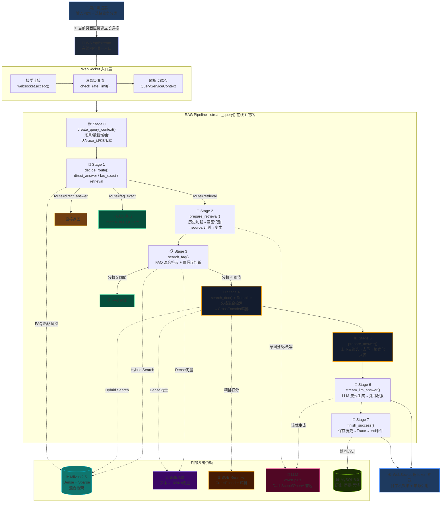
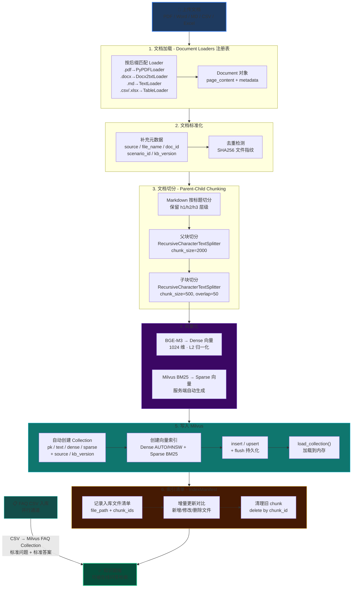
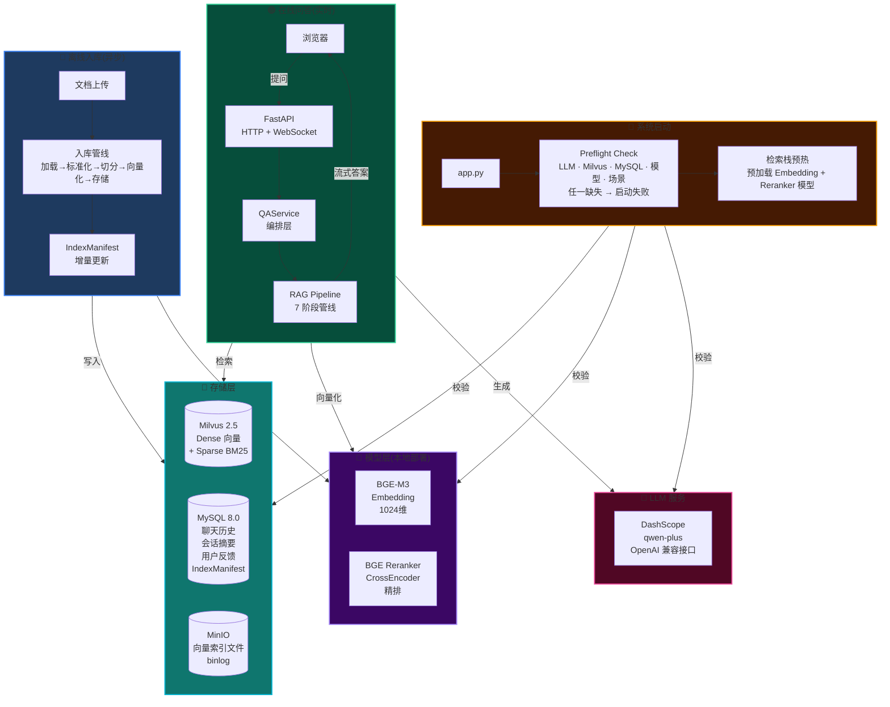
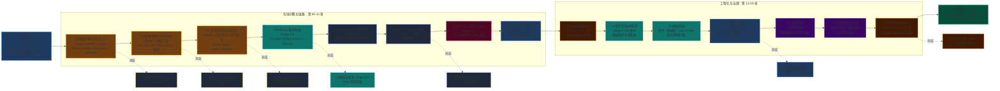

# Graph RAG

<Badge icon="clock" color="green">Written: 2026.06</Badge>
本页整理业务流程动画中的 Mermaid 流程图。

## 1. 在线提问流程

```mermaid
flowchart TD
    USER["👤 用户浏览器<br/>输入问题 + 选择业务分类"]
    WS["🔌 WS /api/stream<br/>在线问答唯一入口"]

    USER -->|"1. 当前页面直接建立长连接"| WS

    subgraph WSAPI["WebSocket 入口层"]
        WACCEPT["接受连接<br/>websocket.accept()"]
        WRATE["消息级限流<br/>check_rate_limit()"]
        WPARSE["解析 JSON<br/>QueryServiceContext"]
        WACCEPT --> WRATE --> WPARSE
    end

    WS --> WSAPI

    subgraph PIPELINE["RAG Pipeline - stream_query() 在线主链路"]
        S0["🏗️ Stage 0<br/>create_query_context()<br/>场景/数据域/会话/trace_id/KB版本"]
        S1["🧭 Stage 1<br/>decide_route()<br/>direct_answer / faq_exact / retrieval"]
        S3["🧠 Stage 2<br/>prepare_retrieval()<br/>历史加载→意图识别→source/计划→变体"]
        S4["📋 Stage 3<br/>search_faq()<br/>FAQ 混合检索 + 置信度判断"]
        S5["📄 Stage 4<br/>search_doc() + Reranker<br/>文档混合检索→CrossEncoder精排"]
        S6["📊 Stage 5<br/>prepare_answer()<br/>上下文筛选→去重→格式化来源"]
        S7["🤖 Stage 6<br/>stream_llm_answer()<br/>LLM 流式生成→引用增强"]
        S8["💾 Stage 7<br/>finish_success()<br/>保存历史→Trace→end事件"]

        S0 --> S1
        S1 -->|"route=retrieval"| S3
        S1 -->|"route=direct_answer"| DIRECT["🚫 直接返回"]
        S1 -->|"route=faq_exact"| FAST["⚡ FAQ 直出<br/>intent=FAQ_QUERY"]
        S3 --> S4
        S4 -->|"分数 < 阈值"| S5
        S4 -->|"分数 ≥ 阈值"| FAQOUT["📋 FAQ 直出"]
        S5 --> S6 --> S7 --> S8
    end

    WSAPI --> PIPELINE

    subgraph EXTERNAL["外部系统依赖"]
        MILVUS[("🗄️ Milvus 2.5<br/>Dense + Sparse<br/>混合检索")]
        EMBED["🧮 BGE-M3<br/>文本→1024维向量"]
        RERANK["⚖️ BGE Reranker<br/>CrossEncoder 精排"]
        LLM["🤖 LLM<br/>qwen-plus<br/>DashScope/OpenAI兼容"]
        MYSQL[("🗃️ MySQL 8.0<br/>历史·摘要·反馈")]
    end

    S4 -.->|"Dense向量"| EMBED
    S4 -.->|"Hybrid Search"| MILVUS
    S5 -.->|"Dense向量"| EMBED
    S5 -.->|"Hybrid Search"| MILVUS
    S5 -.->|"精排打分"| RERANK
    S7 -.->|"流式生成"| LLM
    S8 -.->|"读写历史"| MYSQL
    S3 -.->|"意图分类/改写"| LLM
    S1 -.->|"FAQ 精确试探"| MILVUS

    STREAMOUT["📤 WebSocket 逐 token 推送<br/>打字机效果 + 来源引用"]
    S7 --> STREAMOUT
    S8 --> STREAMOUT

    style USER fill:#1e3a5f,stroke:#3b82f6,stroke-width:2px
    style WS fill:#1e293b,stroke:#818cf8,stroke-width:2px
    style FAST fill:#064e3b,stroke:#34d399
    style FAQOUT fill:#064e3b,stroke:#34d399
    style DIRECT fill:#713f12,stroke:#fbbf24
    style STREAMOUT fill:#1e3a5f,stroke:#3b82f6,stroke-width:2px
    style S5 fill:#131c2e,stroke:#f59e0b,stroke-width:2px
    style S6 fill:#131c2e,stroke:#f59e0b,stroke-width:2px
    style LLM fill:#500724,stroke:#ec4899
    style MILVUS fill:#0f766e,stroke:#06b6d4
    style EMBED fill:#3b0764,stroke:#a78bfa
    style RERANK fill:#451a03,stroke:#f59e0b
    style MYSQL fill:#1a2e05,stroke:#84cc16
```

## 2. 离线建库流程

```mermaid
flowchart TD
    START["📁 上传文档<br/>PDF / Word / MD / CSV / Excel"]

    subgraph LOAD["1. 文档加载 - Document Loaders 注册表"]
        REGISTRY["按后缀匹配 Loader<br/>.pdf→PyPDFLoader<br/>.docx→Docx2txtLoader<br/>.md→TextLoader<br/>.csv/.xlsx→TableLoader"]
        LOADED["Document 对象<br/>page_content + metadata"]
        REGISTRY --> LOADED
    end

    START --> LOAD

    subgraph NORMALIZE["2. 文档标准化"]
        META["补充元数据<br/>source / file_name / doc_id<br/>scenario_id / kb_version"]
        DEDUP["去重检测<br/>SHA256 文件指纹"]
        META --> DEDUP
    end

    LOAD --> NORMALIZE

    subgraph CHUNK["3. 文档切分 - Parent-Child Chunking"]
        HEADER["Markdown 按标题切分<br/>保留 h1/h2/h3 层级"]
        PARENT["父块切分<br/>RecursiveCharacterTextSplitter<br/>chunk_size=2000"]
        CHILD["子块切分<br/>RecursiveCharacterTextSplitter<br/>chunk_size=500, overlap=50"]
        HEADER --> PARENT --> CHILD
    end

    NORMALIZE --> CHUNK

    subgraph EMBEDDING["4. 向量化"]
        DENSE["BGE-M3 → Dense 向量<br/>1024 维 · L2 归一化"]
        SPARSE["Milvus BM25 → Sparse 向量<br/>服务端自动生成"]
    end

    CHILD --> EMBEDDING

    subgraph STORE["5. 写入 Milvus"]
        SCHEMA["自动创建 Collection<br/>pk / text / dense / sparse<br/>+ source / kb_version"]
        INDEX["创建向量索引<br/>Dense AUTO/HNSW + Sparse BM25"]
        INSERT["insert / upsert<br/>+ flush 持久化"]
        LOADCOL["load_collection()<br/>加载到内存"]
        SCHEMA --> INDEX --> INSERT --> LOADCOL
    end

    EMBEDDING --> STORE

    subgraph MANIFEST["6. 索引清单 - IndexManifest"]
        RECORD["记录入库文件清单<br/>file_path + chunk_ids"]
        DIFF["增量更新对比<br/>新增/修改/删除文件"]
        CLEANUP["清理旧 chunk<br/>delete by chunk_id"]
        RECORD --> DIFF --> CLEANUP
    end

    STORE --> MANIFEST
    READY["✅ 知识就绪<br/>可被在线问答检索"]
    MANIFEST --> READY

    FAQIN["📋 FAQ CSV 入库<br/>并行通道"]
    FAQIN -->|"CSV → Milvus FAQ Collection<br/>标准问题 + 标准答案"| READY

    style START fill:#1e3a5f,stroke:#3b82f6,stroke-width:2px
    style READY fill:#064e3b,stroke:#34d399,stroke-width:2px
    style EMBEDDING fill:#3b0764,stroke:#a78bfa
    style STORE fill:#0f766e,stroke:#06b6d4
    style MANIFEST fill:#451a03,stroke:#fbbf24
    style FAQIN fill:#134e4a,stroke:#2dd4bf
```

## 3. 系统总览流程

```mermaid
flowchart TB
    subgraph STARTUP["🚀 系统启动"]
        APP["app.py"]
        PREFLIGHT["Preflight Check<br/>LLM · Milvus · MySQL · 模型 · 场景<br/>任一缺失 → 启动失败"]
        WARM["检索栈预热<br/>预加载 Embedding + Reranker 模型"]
        APP --> PREFLIGHT --> WARM
    end

    subgraph ONLINE["🟢 在线问答(实时)"]
        direction TB
        B["浏览器"]
        API2["FastAPI<br/>HTTP + WebSocket"]
        QASVC["QAService<br/>编排层"]
        PIPE["RAG Pipeline<br/>7 阶段管线"]
        B -->|"提问"| API2 --> QASVC --> PIPE -->|"流式答案"| B
    end

    subgraph OFFLINE["🔵 离线入库(异步)"]
        direction TB
        DOC["文档上传"]
        INGEST["入库管线<br/>加载→标准化→切分→向量化→存储"]
        MANIFEST2["IndexManifest<br/>增量更新"]
        DOC --> INGEST --> MANIFEST2
    end

    subgraph STORAGE["💾 存储层"]
        MILVUS2[("Milvus 2.5<br/>Dense 向量<br/>+ Sparse BM25")]
        MYSQL2[("MySQL 8.0<br/>聊天历史<br/>会话摘要<br/>用户反馈<br/>IndexManifest")]
        MINIO[("MinIO<br/>向量索引文件<br/>binlog")]
    end

    subgraph MODELS["🧠 模型层(本地部署)"]
        BGE3["BGE-M3<br/>Embedding<br/>1024维"]
        RERANKER["BGE Reranker<br/>CrossEncoder<br/>精排"]
    end

    subgraph LLM2["🤖 LLM 服务"]
        DASHSCOPE["DashScope<br/>qwen-plus<br/>OpenAI 兼容接口"]
    end

    ONLINE -->|"检索"| STORAGE
    ONLINE -->|"向量化"| MODELS
    ONLINE -->|"生成"| LLM2
    OFFLINE -->|"写入"| STORAGE
    OFFLINE -->|"向量化"| MODELS
    STARTUP -->|"校验"| STORAGE
    STARTUP -->|"校验"| MODELS
    STARTUP -->|"校验"| LLM2

    style ONLINE fill:#064e3b,stroke:#34d399,stroke-width:2px
    style OFFLINE fill:#1e3a5f,stroke:#3b82f6,stroke-width:2px
    style STARTUP fill:#451a03,stroke:#f59e0b,stroke-width:2px
    style STORAGE fill:#0f766e,stroke:#06b6d4,stroke-width:2px
    style MODELS fill:#3b0764,stroke:#a78bfa,stroke-width:2px
    style LLM2 fill:#500724,stroke:#ec4899,stroke-width:2px
```

## 4. 代码跟练流程

```mermaid
flowchart LR
    START["课程入口<br/>第 01-04 章<br/>环境/RAG/LangChain/Milvus 基础"]

    subgraph ONLINE_COURSE["在线问答主链路：第 05-12 章"]
        CH05["05 意图分类与路由入口<br/>Stage 1 decide_route()<br/>direct_answer / faq_exact / retrieval"]
        CH06["06 检索策略与动态计划<br/>Stage 2 检索计划<br/>run_faq / run_doc / top_k / 阈值"]
        CH07["07 查询改写与变体生成<br/>Stage 2 追问改写 + 查询变体<br/>rewrite_query / query_variants"]
        CH08["08 Milvus 混合检索<br/>Stage 3-4<br/>FAQ/doc Hybrid Search + Rerank"]
        CH09["09 QAService 核心编排<br/>服务编排层<br/>把检索能力封装成问答服务"]
        CH10["10 RAG Pipeline 主流程<br/>Stage 0-7 串联<br/>在线问答闭环"]
        CH11["11 Prompt 工程与 Profile<br/>Stage 5-6<br/>上下文组织 + 回答口径"]
        CH12["12 FastAPI 服务入口<br/>WebSocket / HTTP<br/>浏览器可调用"]
    end

    subgraph ENGINEERING_COURSE["工程化与治理：第 13-19 章"]
        CH13["13 启动前置校验<br/>Preflight Check<br/>依赖缺失直接失败"]
        CH14["14 知识库版本管理<br/>Stage 0 KB 版本<br/>查询绑定有效版本"]
        CH15["15 数据隔离<br/>场景 / 数据域 / source filter<br/>避免跨域回答"]
        CH16["16 文档入库链路<br/>离线入库流程<br/>加载→切分→向量化→写入 Milvus"]
        CH17["17 质量评估<br/>问答评测集<br/>衡量召回和回答质量"]
        CH18["18 测试体系与门禁<br/>自动化测试 / 接口验收<br/>防止链路回退"]
        CH19["19 可观测性与 Trace<br/>Stage 7 Trace / 日志<br/>定位每一步耗时和错误"]
    end

    DONE["最终项目闭环<br/>可启动 / 可入库 / 可问答 / 可测试 / 可观测"]

    START --> CH05 --> CH06 --> CH07 --> CH08 --> CH09 --> CH10 --> CH11 --> CH12
    CH12 --> CH13 --> CH14 --> CH15 --> CH16 --> CH17 --> CH18 --> CH19 --> DONE

    CH05 -.对应.-> ONLINE_STAGE1["动画在线流程 Stage 1<br/>decide_route()"]
    CH06 -.对应.-> ONLINE_STAGE2A["动画在线流程 Stage 2<br/>检索计划"]
    CH07 -.对应.-> ONLINE_STAGE2B["动画在线流程 Stage 2<br/>追问改写/查询变体"]
    CH08 -.对应.-> ONLINE_STAGE34["动画在线流程 Stage 3-4<br/>FAQ/文档检索"]
    CH10 -.对应.-> ONLINE_STAGE07["动画在线流程 Stage 0-7<br/>主链路串联"]
    CH16 -.对应.-> OFFLINE_FLOW["动画离线入库流程<br/>文档/FAQ 入库"]
    CH19 -.对应.-> TRACE_FLOW["动画在线流程 Stage 7<br/>Trace/end 事件"]

    style START fill:#1e3a5f,stroke:#3b82f6,stroke-width:2px
    style DONE fill:#064e3b,stroke:#34d399,stroke-width:2px
    style CH05 fill:#713f12,stroke:#fbbf24,stroke-width:2px
    style CH06 fill:#713f12,stroke:#fbbf24,stroke-width:2px
    style CH07 fill:#713f12,stroke:#fbbf24,stroke-width:2px
    style CH08 fill:#0f766e,stroke:#06b6d4,stroke-width:2px
    style CH09 fill:#1e293b,stroke:#818cf8,stroke-width:2px
    style CH10 fill:#1e293b,stroke:#818cf8,stroke-width:2px
    style CH11 fill:#500724,stroke:#ec4899,stroke-width:2px
    style CH12 fill:#1e3a5f,stroke:#3b82f6,stroke-width:2px
    style CH13 fill:#451a03,stroke:#f59e0b
    style CH14 fill:#0f766e,stroke:#06b6d4
    style CH15 fill:#0f766e,stroke:#06b6d4
    style CH16 fill:#1e3a5f,stroke:#3b82f6
    style CH17 fill:#3b0764,stroke:#a78bfa
    style CH18 fill:#3b0764,stroke:#a78bfa
    style CH19 fill:#451a03,stroke:#f59e0b
    style ONLINE_STAGE1 fill:#1e293b,stroke:#fbbf24
    style ONLINE_STAGE2A fill:#1e293b,stroke:#fbbf24
    style ONLINE_STAGE2B fill:#1e293b,stroke:#fbbf24
    style ONLINE_STAGE34 fill:#0f766e,stroke:#06b6d4
    style ONLINE_STAGE07 fill:#1e293b,stroke:#818cf8
    style OFFLINE_FLOW fill:#1e3a5f,stroke:#3b82f6
    style TRACE_FLOW fill:#451a03,stroke:#f59e0b
```