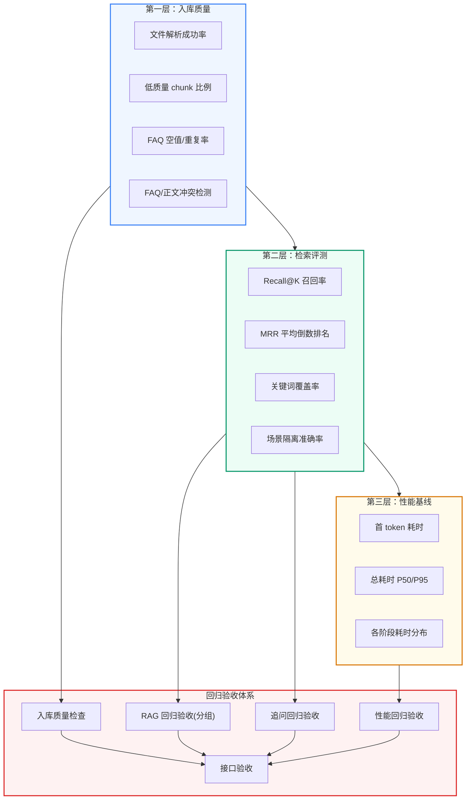
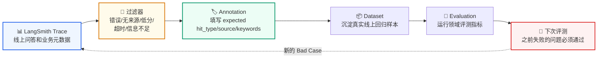
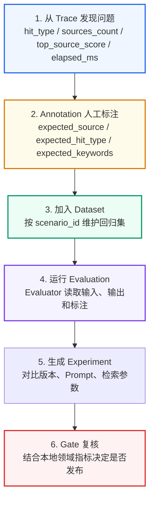
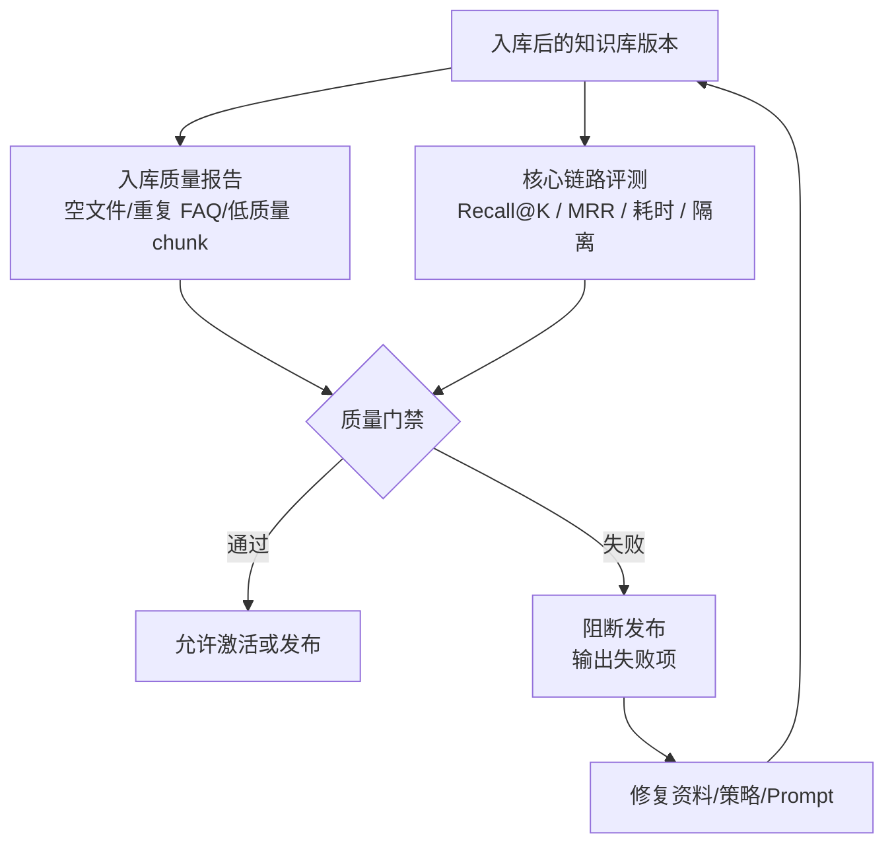
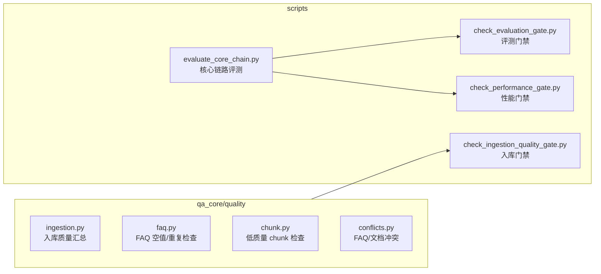

# RAG 评估
<Badge icon="clock" color="green">Written: 2026.06</Badge>
> 第 17 章跟敲代码：`codealong/chapters/ch17_quality_evaluation`。
> 这部分代码是本章跟敲版，用来先跑通核心闭环；完整项目源码仍以本讲后文标注的 `qa_core/`、`scripts/` 等路径为准。

**上一讲**：[文档入库与索引链路](/RAG/production/ingestion-pipeline)  
**下一讲**：[测试与接口验收](/RAG/production/testing-system)

> 企业路线
>
> 本讲以 LangSmith Evaluation 作为企业主线。项目本地只保留 source 推断准确率、场景隔离率、FAQ 直出准确率、Prompt Profile 命中率、表格行召回等领域指标；Trace、Annotation、Dataset 和 Evaluation 统一交给 LangSmith。

> 本讲边界
>
> 第 17 讲回答“知识和答案质量如何评估”。它关注入库质量、检索效果、性能基线和领域指标。第 18 讲会回答“代码和接口如何验收”，第 19 讲会回答“上线后如何观测、压测和扩容”。

## 1. 本讲目标

- 理解 RAG 系统的RAG 回归与入库质量全景
- 掌握入库质量、检索评测、性能基线的三层保障体系
- 理解验收(Gate)机制的设计思路
- 理解 Bad Case 如何从 LangSmith trace/annotation 沉淀为回归样本
- 能手算 Recall@K、MRR、关键词覆盖率(面试必考)

---

## 2. 前置知识 — 为什么 RAG 需要系统化评测

### 2.1 RAG 评测的挑战

传统软件测试通常是二元的(通过/失败)。但 RAG 系统的输出是**自然语言文本**，不能简单地用 `assertEqual(expected, actual)` 来判断。

```text
问题："入职流程有哪些步骤"

预期行为：
  ✅ 召回了正确的文档片段(检索质量)
  ✅ 答案包含了流程的完整步骤(完整性)
  ✅ 答案基于提供的资料而非幻觉(忠实性)
  ✅ 来源引用正确(可溯源性)

❌ 这些指标不能用一个简单的 test case 覆盖
```

### 2.2 三层保障体系



---

## 3. 入库质量报告

### 3.1 检查项

```text
python scripts/check_ingestion_quality_gate.py \
    --scenario enterprise_knowledge
```

生成报告覆盖以下维度：

**文件解析检查**：
- 哪些文件解析失败(PDF 损坏、编码错误)
- 哪些文件类型不被支持
- 哪些文件为空(没有任何有效文本)

**Chunk 质量检查**：
- 低质量 chunk：字符数过少(&lt;50 字符)或噪声占比过高
- 重复 chunk：内容高度相似的 chunk 对

**FAQ 质量检查**：
- question 或 answer 为空的记录
- 完全相同的 FAQ 对(重复录入)
- source 不在 valid\_sources 白名单中的 FAQ

### 3.2 FAQ/正文冲突检测

```python
# qa_core/quality/conflicts.py

def detect_faq_document_conflicts(faq_documents, doc_chunks):
    """检测 FAQ 标准答案与文档正文的矛盾。"""

    import jieba

    conflicts = []
    for faq_doc in faq_documents:
        faq_question = faq_doc.page_content
        faq_answer = faq_doc.metadata.get("answer", "")

        # 用 jieba 搜索分词提取 FAQ 问题中的关键概念
        faq_keywords = set(jieba.cut_for_search(faq_question))

        for chunk in doc_chunks:
            chunk_text = chunk.page_content
            chunk_keywords = set(jieba.cut_for_search(chunk_text))

            # 如果 FAQ 和文档都讨论了同一个概念
            common_keywords = faq_keywords & chunk_keywords
            if len(common_keywords) >= 3:
                # 比较判断是否有矛盾信息
                # (简化逻辑，实际会做更复杂的语义比较)
                similarity = compute_conflict_score(faq_answer, chunk_text)
                if similarity > 0.8:  # 疑似矛盾
                    conflicts.append({
                        "faq_question": faq_question,
                        "faq_answer": faq_answer,
                        "conflicting_chunk": chunk_text[:200],
                        "common_keywords": list(common_keywords),
                    })

    return conflicts
```

**为什么用 jieba.cut\_for\_search 而不是简单正则**：

`cut_for_search` 是 jieba 的搜索模式分词，会同时输出原词和更细粒度的子词。例如"管理员密码重置"会被分为 `["管理员", "管理", "密码", "重置"]`，这样"用户密码修改"也能匹配到"密码"这个公共关键词。

### 3.3 入库质量检查

```text
python scripts/check_ingestion_quality_gate.py \
    --report reports/ingestion/enterprise_knowledge_phase1_gate_check.json
```

验收检查不通过的条件：

| 条件 | 阈值 |
| --- | --- |
| 文件解析失败率 | > 5% |
| 低质量 chunk 比例 | > 10% |
| FAQ 空值 | > 0 条 |
| FAQ 完全重复 | > 3% |
| FAQ/正文高度冲突 | > 2 对 |

验收不通过时，**不激活新版本**。这样可以确保线上知识库始终是经过质量验证的。

---

## 4. 检索评测

### 4.1 评测数据集格式

```text
// eval_sets/multi_scenario_smoke.json
[
    {
        "scenario_id": "enterprise_knowledge",
        "query": "入职流程有哪些步骤",
        "expected_source": "hr",
        "expected_hit_type": "rag",
        "expected_keywords": ["入职", "流程", "步骤", "材料", "合同"],
        "min_expected_sources": 2
    },
    {
        "scenario_id": "enterprise_knowledge",
        "query": "忘记密码怎么办",
        "expected_source": "it",
        "expected_hit_type": "faq_direct",
        "expected_keywords": ["密码", "重置", "邮箱", "手机"],
        "min_expected_sources": 1
    }
]
```

### 4.2 评测指标

```python
# 以下 RAGEvaluationMetrics 为简化伪代码，实际评测逻辑分布在
# scripts/evaluate_core_chain.py 和 scripts/eval_common.py 中，不存在该独立类

class RAGEvaluationMetrics:
    def compute(self, test_cases, actual_results):
        metrics = {}

        # Recall@K：期望的关键词在召回的文档中出现了多少
        metrics["recall_at_k"] = sum(
            self._keyword_recall(tc, result)
            for tc, result in zip(test_cases, actual_results)
        ) / len(test_cases)

        # MRR：正确答案在召回列表中的排名的倒数平均值
        metrics["mrr"] = sum(
            1.0 / self._first_relevant_rank(tc, result)
            for tc, result in zip(test_cases, actual_results)
        ) / len(test_cases)

        # 关键词覆盖率
        metrics["avg_keyword_coverage"] = sum(
            self._keyword_coverage(tc, result)
            for tc, result in zip(test_cases, actual_results)
        ) / len(test_cases)

        # hit_type 准确率
        metrics["hit_type_accuracy"] = sum(
            1.0 if tc["expected_hit_type"] == result.get("hit_type")
            else 0.0
            for tc, result in zip(test_cases, actual_results)
        ) / len(test_cases)

        # source 推断准确率
        metrics["source_inference_accuracy"] = sum(
            1.0 if tc["expected_source"] == result.get("source_filter")
            else 0.0
            for tc, result in zip(test_cases, actual_results)
        ) / len(test_cases)

        # 场景隔离准确率
        metrics["scenario_isolation_accuracy"] = ...

        metrics["errors"] = sum(
            1 for r in actual_results if r.get("error")
        )

        return metrics
```

### 4.3 分组验收

**关键设计**：回归验收不只是看全局平均值，而是**按场景、source、hit\_type 分组检查**。

```python
# scripts/check_evaluation_gate.py

def check_evaluation_gate(report):
    """按维度分组检查 RAG 回归验收。"""
    failures = []

    # 全局验收
    global_metrics = report["metrics"]
    if global_metrics["recall_at_k"] < 0.85:
        failures.append(f"全局 Recall@K {global_metrics['recall_at_k']} < 0.85")

    # 按场景分组验收 ← 防止某个场景退化被全局均值掩盖
    for scenario_id, scenario_metrics in report["by_scenario"].items():
        if scenario_metrics["recall_at_k"] < 0.80:
            failures.append(
                f"场景 {scenario_id} Recall@K {scenario_metrics['recall_at_k']} < 0.80"
            )

    # 按 source 分组验收
    for source, source_metrics in report["by_source"].items():
        if source_metrics["recall_at_k"] < 0.75:
            failures.append(f"分类 {source} 召回率不达标")

    return len(failures) == 0, failures
```

---

## 5. 补充：评测指标手算示例

上面的代码展示了指标的计算公式，但面试时如果被问到"你的 MRR 是怎么算的"，光是背公式不够，需要能用具体例子讲清楚。以下用本项目的真实评测数据演示。

### 5.1 Recall@K 手算示例

**Recall@K** 衡量的是：在召回的 Top-K 个文档中，有多少期望的关键词被覆盖了。

```text
以测试样本为例：
  查询："入职流程有哪些步骤"
  期望关键词：["入职", "流程", "步骤", "材料", "合同"]

召回结果(Top-5 文档片段)：
  [1] "入职流程包括以下步骤：1. 提交个人材料..." → 命中：入职, 流程, 步骤, 材料 ✅
  [2] "新员工入职当天需要携带身份证、学历证书..." → 命中：入职 ✅
  [3] "劳动合同应在入职后一个月内签订..." → 命中：合同 ✅
  [4] "培训安排将在入职第二周进行..." → 命中：入职 ✅
  [5] "员工福利包括五险一金、带薪年假..." → 命中：无 ❌

已覆盖的关键词：{"入职", "流程", "步骤", "材料", "合同"} → 5/5 = 1.0
```

```python
def recall_at_k(expected_keywords, retrieved_docs, k=5):
    """计算单条测试样本的 Recall@K。"""
    # 取前 K 个文档
    top_k_docs = retrieved_docs[:k]

    # 合并所有召回文档的文本
    combined_text = " ".join(doc.page_content for doc in top_k_docs)

    # 统计被覆盖的关键词
    covered = {kw for kw in expected_keywords if kw in combined_text}

    return len(covered) / len(expected_keywords)

# 手算验证
expected = ["入职", "流程", "步骤", "材料", "合同"]
recalled_docs = [...]  # 上面 5 个文档
print(recall_at_k(expected, recalled_docs, k=5))  # 5/5 = 1.0

# 如果 k=2(只看前 2 个文档)
print(recall_at_k(expected, recalled_docs, k=2))  # 4/5 = 0.8
# 因为"合同"在第 3 个文档才出现
```

**K 值的选择**：

| K 值 | 含义 | 本项目使用 |
| --- | --- | --- |
| K=1 | 只看第 1 个召回结果 | 太严格 |
| K=3 | 看前 3 个 | 中等 |
| **K=5** | **看前 5 个** | **本项目使用** |
| K=10 | 看前 10 个 | 较宽松 |

### 5.2 MRR 手算示例

**MRR(Mean Reciprocal Rank)** 衡量的是：第一个真正相关的文档排在召回列表的第几位。

> MRR = (1/排名₁ + 1/排名₂ + ... + 1/排名n) / n

```text
假设有 3 个测试查询：

查询 1："入职流程有哪些步骤"
  召回结果：[doc_A(0.92), doc_B(0.85), doc_C(0.78), ...]
  第一个相关文档是 doc_A，排名第 1 位
  → Reciprocal Rank = 1/1 = 1.0

查询 2："VPN 连不上怎么办"
  召回结果：[doc_X(0.78), doc_Y(0.75), doc_Z(0.71), ...]
  前两个都不相关(虽然分数高，但内容不匹配)
  第一个相关文档是 doc_Z，排名第 3 位
  → Reciprocal Rank = 1/3 ≈ 0.333

查询 3："员工报销需要准备哪些材料"
  召回结果：[doc_M(0.95), doc_N(0.82), ...]
  第一个相关文档是 doc_M，排名第 1 位
  → Reciprocal Rank = 1/1 = 1.0

MRR = (1.0 + 0.333 + 1.0) / 3 ≈ 0.778
```

```python
def mean_reciprocal_rank(test_cases, search_fn):
    """计算 MRR。"""
    reciprocal_ranks = []

    for tc in test_cases:
        results = search_fn(tc["query"])  # 执行检索
        relevant_doc_id = tc["relevant_doc_id"]

        # 找第一个相关文档的排名
        rank = None
        for i, result in enumerate(results, start=1):
            if result.id == relevant_doc_id:
                rank = i
                break

        if rank is not None:
            reciprocal_ranks.append(1.0 / rank)
        else:
            reciprocal_ranks.append(0.0)  # 没找到 = 0

    return sum(reciprocal_ranks) / len(reciprocal_ranks)

# 手算验证
print(f"MRR = {mean_reciprocal_rank(test_cases, search_fn):.3f}")
# MRR = 0.778
```

**MRR 的直观理解**：

```text
MRR = 1.0  → 每个查询的第一个结果是相关的           → 完美
MRR = 0.9  → 第一个相关结果平均排在第 1.1 位          → 本项目水平
MRR = 0.5  → 第一个相关结果平均排在第 2 位            → 合格
MRR = 0.2  → 第一个相关结果平均排在第 5 位            → 需要改进
MRR = 0.05 → 几乎找不到相关结果                        → 严重问题
```

### 5.3 关键词覆盖率手算示例

**关键词覆盖率** 衡量的是：期望关键词中有多少出现在了召回的文档片段里。

```text
查询："跨境贸易中 HS 编码归类争议怎么处理"
期望关键词：["HS编码", "归类", "海关", "争议", "行政复议", "预裁定"]

召回文档片段(合并后)：
  "HS 编码归类争议可通过以下途径解决：1. 向海关申请预裁定
   2. 如对归类决定有异议可申请行政复议 3. 必要时走行政诉讼流程"

逐个检查关键词是否出现在文本中：
  "HS编码"     → 出现了 "HS 编码"   → ✅ 覆盖
  "归类"       → 出现了 "归类"       → ✅ 覆盖
  "海关"       → 出现了 "海关"       → ✅ 覆盖
  "争议"       → 出现了 "争议"       → ✅ 覆盖
  "行政复议"   → 出现了 "行政复议"   → ✅ 覆盖
  "预裁定"     → 出现了 "预裁定"     → ✅ 覆盖

关键词覆盖率 = 6/6 = 1.0
```

```python
def keyword_coverage(expected_keywords, retrieved_docs):
    """计算关键词覆盖率。"""
    combined_text = " ".join(doc.page_content for doc in retrieved_docs)
    covered = sum(1 for kw in expected_keywords if kw in combined_text)
    return covered / len(expected_keywords)
```

### 5.4 一个完整评测样本长什么样

```json
{
    "scenario_id": "engineering_project_qa",
    "query": "隐蔽工程验收需要哪些资料",
    "expected_source": "quality",
    "expected_hit_type": "rag",
    "expected_keywords": [
        "隐蔽工程",
        "验收",
        "质量验收报告",
        "隐蔽工程验收记录",
        "材料检测报告",
        "功能性试验报告"
    ],
    "expected_prompt_profile": "knowledge_answer",
    "min_expected_sources": 3,
    "relevant_doc_id": "engineering_project_qa/doc_chunk_quality_042",
    "notes": "期望从 quality 分类召回，覆盖至少 3 个关键词，使用 knowledge_answer 模板"
}
```

**一个好的评测样本需要**：
1. `expected_source`：验证 source 推断是否正确
2. `expected_keywords`：至少 4-6 个具体关键词，不是模糊描述
3. `expected_hit_type`：验证 FAQ 直出 vs 文档 RAG 的判断是否正确
4. `min_expected_sources`：验证是否跨 source 串库
5. `relevant_doc_id`(可选)：用于精确计算 MRR
6. `notes`：解释为什么期望这些值，帮助其他人理解评测意图

---

## 6. Bad Case 沉淀

### 6.1 企业中如何处理 Bad Case

Bad Case 是线上出现的检索或回答效果不佳的样本。企业路线下，优先在 LangSmith 中完成 trace 查看、人工标注和 dataset 沉淀：



### 6.2 自动识别

企业路线不再维护本地坏例导出逻辑。异常样本直接在 LangSmith 中通过 Trace 过滤和 Annotation 形成：

- `error=true`：运行时异常。
- `hit_type=insufficient_context`：上下文不足。
- `sources_count=0`：没有召回资料。
- `elapsed_ms` 或 `first_token_ms` 超阈值：性能异常。
- `top_source_score` 偏低：召回置信度不足。
- `scenario_id`、`source`、`kb_version`、`prompt_profile`：用于定位业务链路。

这里的关键点是：识别规则应沉淀为 LangSmith Trace 过滤器和 Dataset 构建条件，不再维护本地导出脚本。

### 6.3 人工复核

复核人员在 LangSmith Trace 页面完成 Annotation，重点填写：

- **实际应该命中的类型**(expected\_hit\_type)
- **应该召回的业务分类**(expected\_source)
- **问题归类**(检索问题 / 入库问题 / Prompt 问题 / 正常)
- **优先级**(高 / 中 / 低)
- **期望关键词或判分说明**(expected\_keywords / grading\_notes)

### 6.4 提升为评测样本

复核完成后，将 Trace 加入 LangSmith Dataset，形成真实线上问题回归集。下次变更前运行 LangSmith Evaluation，并用本地领域指标脚本复核关键结果。

### 6.5 LangSmith Evaluation 如何落到本项目

LangSmith Evaluation 不能只理解成“平台会自动评估”，还要和本项目的字段对应起来。一个完整闭环可以按下面 6 步展开：



**第 1 步：从 Trace 发现问题。**  
LangSmith Trace 里已经有本项目写入的业务 metadata，比如 `scenario_id`、`source_filter`、`kb_version`、`hit_type`、`sources_count`、`top_source_score`、`prompt_profile`、`first_token_ms`、`stage_timings_ms`。这些字段可以直接作为过滤条件。比如：

- `sources_count = 0`：没有引用来源，优先怀疑检索或数据隔离。
- `hit_type = insufficient_context`：系统认为资料不足，需要确认是否该补资料。
- `top_source_score &lt; 阈值`：召回置信度偏低，可能是 query rewrite 或 embedding 召回问题。
- `slowest_stage = search_doc`：文档检索慢，可能需要查 Milvus 索引或过滤表达式。

**第 2 步：Annotation 人工标注。**  
人工复核不是简单写“对/错”，而是要把业务期望结构化。建议标注：

| 标注字段 | 含义 | 示例 |
| --- | --- | --- |
| `expected_hit_type` | 期望命中路径 | `faq_direct` / `rag` / `out_of_scope` |
| `expected_source` | 应召回的业务分类 | `hr`、`customs`、`contract` |
| `expected_keywords` | 答案或证据中应出现的关键词 | `["入职材料", "劳动合同", "部门审批"]` |
| `expected_prompt_profile` | 应使用的 Prompt 档位 | `pricing_guard` / `compliance_guard` |
| `grading_notes` | 人工判分说明 | “答案漏掉信用证不符点风险” |

**第 3 步：加入 Dataset。**  
Dataset 建议按场景或问题类型维护，而不是全部混在一起。例如：

| Dataset | 用途 |
| --- | --- |
| `enterprise_knowledge_regression` | 企业知识助手常规回归 |
| `cross_border_risk_bad_cases` | 跨境贸易风控坏例集 |
| `contract_risk_compliance_cases` | 合同/招投标合规类问题 |
| `multi_turn_followup_cases` | 多轮追问回归 |

这样做的好处是，后续 Evaluation 可以按场景单独看退化，避免一个总分掩盖局部问题。

**第 4 步：运行 Evaluation。**  
Evaluation 的 evaluator 可以分两类：

| Evaluator 类型 | 判断什么 | 本项目对应指标 |
| --- | --- | --- |
| 规则型 evaluator | 字段是否命中 | `expected_source`、`expected_hit_type`、`prompt_profile` |
| 文本型 evaluator | 答案是否覆盖关键信息 | 关键词覆盖率、引用完整性、忠实性 |
| LLM-as-judge evaluator | 答案质量评分 | 完整性、准确性、是否越界 |

本项目本地脚本已经实现了规则型和领域指标型检查；LangSmith Evaluation 更适合承接 trace 样本、人工标注、实验对比和长期趋势。

**第 5 步：生成 Experiment 对比。**  
每次改动都应该形成一次 Experiment，例如：

- `rerank_threshold_v2`
- `prompt_profile_guard_update`
- `bge_m3_rebuild_202606`
- `cross_border_query_rewrite_v3`

对比时不要只看平均分，要看分组：

- 按 `scenario_id` 看是否某个场景退化。
- 按 `hit_type` 看 FAQ 直出和文档 RAG 是否分别稳定。
- 按 `source_filter` 看是否某个分类召回变差。
- 按 `prompt_profile` 看高风险问题是否仍然走正确模板。

**第 6 步：Gate 复核。**  
LangSmith Evaluation 给出趋势和样本级结果，本地 gate 负责把结果变成“能不能发布”的工程约束。推荐口径是：

```text
LangSmith Evaluation 负责发现和解释退化；
本地 Gate 负责给出是否允许发布的确定性结论。
```

也就是说，企业项目里二者不是替代关系，而是互补关系。

---

## 7. 回归验收体系汇总

### 7.1 全部回归验收

```bash
# 检查顺序
1. 项目守护检查 (check_project_guardrails.py)
2. 编译检查 (Python 语法)
3. 单元测试 (python -m pytest tests -q)
4. 入库质量检查 (check_ingestion_quality_gate.py)
5. RAG 回归验收 (check_evaluation_gate.py)
6. 追问回归验收 (check_followup_gate.py)
7. 性能回归验收 (check_performance_gate.py)
8. API 合同验收 (api_e2e_smoke.py)
```

### 7.2 接口验收

```text
python scripts/api_e2e_smoke.py --base-url http://127.0.0.1:8000
python scripts/acceptance_smoke.py --base-url http://127.0.0.1:8000
```

验证管理接口、问答页面和 WebSocket 流式事件是否可用。

### 7.3 评测趋势

状态页只保留回归报告入口；历次评测对比优先在 LangSmith Experiments 中查看：

```text
                Recall@K    MRR    关键词覆盖  Source 推断  场景隔离
2026-05-01 v1:   1.000     0.900    0.933      1.000       1.000
2026-05-07 v2:   1.000     0.920    0.945      1.000       1.000
2026-05-14 v3:   0.980 ⚠   0.910    0.940      0.980 ⚠     1.000
                                  ↑ 需要排查 v3 的退化原因
```

---

## 8. 核心评测结果

本项目已完成最终验收，核心指标如下：

| 指标 | 值 | 说明 |
| --- | --- | --- |
| errors | 0 | 零错误 |
| recall\_at\_k | 1.0 | 期望关键词全部被召回 |
| mrr | 0.9 | 正确答案平均排在第 1.1 位 |
| avg\_keyword\_coverage | 0.933 | 93.3% 的关键词出现在召回文档中 |
| hit\_type\_accuracy | 1.0 | 命中类型判断全部正确 |
| source\_inference\_accuracy | 1.0 | 业务分类推断全部正确 |
| prompt\_profile\_accuracy | 1.0 | Prompt 模板选择全部正确 |
| faq\_direct\_accuracy | 1.0 | FAQ 直出全部准确 |
| scenario\_isolation\_accuracy | 1.0 | 无跨场景数据泄露 |
| avg\_total\_ms | 3444 | 平均总耗时 3.4 秒 |
| p95\_total\_ms | 12810 | P95 耗时 12.8 秒 |
| avg\_first\_token\_ms | 2479 | 平均首 token 耗时 2.5 秒 |

---

## 9. 本讲实践闭环

| 项目 | 内容 |
| --- | --- |
| 本讲类型 | 工程治理 |
| 实践产物 | 入库质量报告、RAG Evaluation、质量门禁和 Bad Case 闭环 |
| 是否进入最终项目 | 是 |
| 验收方式 | 运行评测/门禁脚本，生成报告并能识别退化 |
| 后续落点 | 第 18 讲转成自动化测试，第 19 讲纳入生产观测 |

通过标准：系统质量不是凭感觉判断，而是通过指标、报告和门禁证明。

### 9.1 本讲从 0 到 1 实现闭环

这一讲把“我感觉效果还行”改成“指标和报告证明可以上线”。实现顺序如下：



1. 先做入库质量检查，发现空文件、重复 FAQ、无效 source、低质量 chunk。
2. 再准备回归评测集，覆盖 8 个场景、FAQ、文档、追问、高风险类别。
3. 然后运行核心链路评测，统计 Recall@K、MRR、首 token、总耗时、场景隔离准确率。
4. 最后执行质量门禁，指标低于阈值就拒绝激活或发布。

实现完成后，相关代码结构应该是下面这张图：



来源：真实代码调用点，见 `qa_core/quality/`。

```python
def build_ingestion_quality_report(data_dir, scenario):
    return {
        "empty_files": check_empty_files(data_dir),
        "duplicate_faq": check_duplicate_faq(scenario),
        "invalid_sources": check_invalid_sources(scenario),
        "low_quality_chunks": check_low_quality_chunks(data_dir),
    }
```

RAG 评测不是只看答案文本，还要看检索命中、场景隔离和耗时。否则模型恰好蒙对，也会掩盖检索退化。

来源：真实代码逻辑压缩版，对应 `scripts/evaluate_core_chain.py::run_case()`。

```python
def run_case(service, item, index, args):
    runtime = EvalCaseRuntime.from_item(item, index, args, session_prefix="eval")

    # 先跑 debug_retrieval，把“召回是否命中”和“最终生成是否答对”拆开看。
    try:
        debug_payload = service.debug_retrieval(
            runtime.question,
            runtime.source_filter,
            runtime.session_id,
            **runtime.service_kwargs(),
        )
    except Exception as exc:
        debug_payload = {"error": str(exc)}

    # 再跑正式 stream_query，收集 token、end 事件、hit_type、sources 和 retrieval 诊断。
    answer = ""
    for event in service.stream_query(
        runtime.question,
        runtime.source_filter,
        runtime.session_id,
        **runtime.service_kwargs(),
    ):
        if event["type"] == "token":
            answer += event.get("token", "")
        elif event["type"] == "end":
            hit_type = event.get("hit_type", "")
            sources = event.get("sources", [])
            retrieval = event.get("retrieval") or {}

    debug_sources = list(debug_payload.get("faq_sources") or []) + list(debug_payload.get("doc_sources") or [])
    rank = find_expected_source_rank(debug_sources or sources, expected_sources, prefer_table=prefer_table)
    coverage = keyword_coverage(answer, expected_keywords)
    return build_case_metrics(rank=rank, coverage=coverage, hit_type=hit_type, retrieval=retrieval)
```

设计解释：先 `debug_retrieval()` 再 `stream_query()` 是为了分离两类问题：如果 debug 阶段没召回预期来源，问题在入库、过滤、query variants 或阈值；如果 debug 命中但最终答案不对，问题更可能在 Prompt 或模型生成。

质量门禁要做成脚本，而不是人工看报告。这样入库脚本和 CI 都能复用同一套规则。

来源：真实代码调用点，见 `scripts/check_ingestion_quality_gate.py`、`scripts/check_evaluation_gate.py`、`scripts/check_performance_gate.py`。

```text
if report["recall_at_5"] < min_recall_at_5:
    raise SystemExit("quality gate failed: recall_at_5 too low")

if report["scenario_isolation_accuracy"] < 1.0:
    raise SystemExit("quality gate failed: scenario leakage")
```

验收时至少跑一次核心链路评测和门禁检查，确认报告能落盘、阈值能阻断退化。

来源：命令行验收，对应 `scripts/evaluate_core_chain.py`。

```text
python scripts/evaluate_core_chain.py --scenario enterprise_knowledge
python scripts/check_evaluation_gate.py --report reports/latest_eval_summary.json
python scripts/check_ingestion_quality_gate.py --report reports/latest_ingestion_quality.json
```

闭环验证重点：

| 验证项 | 验证方式 | 期望结果 |
| --- | --- | --- |
| 入库质量 | 生成质量报告 | 能发现空文件、重复 FAQ、低质量 chunk |
| 检索指标 | 运行核心链路评测 | 输出 Recall@K、MRR 等指标 |
| Debug/生成分离 | 查看单 case 报告 | 能区分召回失败和生成失败 |
| 场景隔离 | 评测跨场景问题 | 不出现跨场景召回 |
| 性能基线 | 检查耗时报告 | 首 token 和总耗时有统计 |
| 门禁阻断 | 设置严格阈值 | 不达标时脚本失败 |

验收重点：系统质量要能被报告证明，退化时 gate 应拒绝通过；不要靠主观体验判断是否上线。

## 10. 重点掌握

| 优先级 | 内容 | 原因 |
| --- | --- | --- |
| ★★★ 必会 | 三层保障体系：入库质量(资料健康)→ 检索评测(策略有效)→ 性能基线(响应合理) | RAG 系统RAG 回归与入库质量的全景图 |
| ★★★ 必会 | Recall@K 手算：期望关键词在前 K 个召回文档中的覆盖率 | 面试必考指标 |
| ★★★ 必会 | MRR(Mean Reciprocal Rank)手算：第一个相关文档在召回列表中排名的倒数平均值 | 面试必考指标 |
| ★★★ 必会 | 分组验收设计：按场景 / source / hit\_type 分组检查，防止局部退化被全局均值掩盖 | 回归验收体系的关键设计，避免"平均主义"陷阱 |
| ★★ 理解 | 入库质量检查的检查项：文件解析失败率、低质量 chunk 比例、FAQ 空值/重复率、FAQ/文档冲突 | 知识库上线前的质量把关 |
| ★★ 理解 | Bad Case 沉淀流程：LangSmith Trace → Annotation → Dataset → Evaluation | 持续改进的完整闭环 |
| ★★ 理解 | 质量检查总览：项目守护、单元测试、入库质量、评测、追问、性能和 API 合同 | 变更前后的质量证明 |
| ★ 了解 | 关键词覆盖率的手算方法和评测数据集 JSON 格式 | 了解评测数据的结构 |
| ★ 了解 | LangSmith Experiments 和本地领域指标如何配合 | 企业落地时用成熟平台承接评测趋势 |

## 11. 本讲小结

- **三层保障**：入库质量(资料健康)→ 检索评测(策略有效)→ 性能基线(响应合理)
- **分组验收**防止局部退化被全局均值掩盖：按场景、source、hit\_type 分别检查
- **Bad Case 沉淀**：LangSmith Trace → Annotation → Dataset → Evaluation
- **回归验收体系**是可执行的工程约束，不是建议性文档 —— 验收不通过时阻止继续发布或演示
- 评测数据全部保存在 `reports/` 和 `eval_sets/` 中，可版本管理、可历史对比

---

## 12. 阶段小结：到第 17 讲你已经具备的能力

学习到第 17 讲，你应该已经掌握了以下能力：

1. **RAG 系统架构设计**：从检索到生成的完整链路，不是 Demo 而是企业级工程
2. **分层检索策略**：FAQ 优先 + 文档补充，混合检索 + 动态阈值
3. **Prompt 工程**：按问题类别选择模板，确定性的 Profile 选择
4. **知识库治理**：多版本管理、数据隔离、增量入库
5. **RAG 回归与入库质量**：入库质量检查、LangSmith Evaluation、领域指标回归验收、Bad Case 沉淀
6. **工程化思维**：入口极薄、模块拆分、拥抱生态、不做技术降级

这些能力不仅适用于本项目，也适用于任何需要构建 RAG 系统的场景。后续第 18 讲会把这些质量目标转成可运行的测试与接口验收，第 19 讲会进一步讲线上观测、生产部署和容量评估。