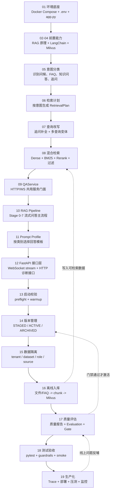

# RAG 优化
<Badge icon="clock" color="green">Written: 2026.06</Badge>
本目录包含 19 讲系统化课程，从零开始讲解如何构建一个企业级多场景 RAG 知识平台。

## 如何使用本课程

- **初学者**：先学 P0 主链路（01-11）建立完整的 RAG 闭环，再学 12-13 的 Web 服务基础设施，最后学 14-19 的治理与运维
- **有经验的开发者**：先看 [课程结构表](#course-overview) 速览全貌，再挑薄弱讲次精读
- **赶时间的面试准备**：优先看 01 → 02 → 03 → 04 → 05 → 08 → 10 → 11

## 主次分层

这套课程不要求第一遍把所有内容都学到同一深度。推荐按四层吸收：

| 层级 | 内容范围 | 学习要求 |
| --- | --- | --- |
| P0 主链路 | 01、02、03、04、05、06、07、08、09、10、11 | 第一遍必须掌握，能讲清一次在线问答闭环。 |
| P1 核心工程能力 | 12、13、14、15、16、17、18 | 第二阶段掌握，能讲清应用入口、Web 异步、入库、版本、隔离、评测和测试。 |
| P2 企业化增强 | 19、多场景、LangSmith Trace/Evaluation、生产部署、容量评估、企业 overlay、资料治理 | 面试加分，体现企业级项目经验。 |
| P3 扩展方向 | OCR/VLM、Agent 化编排、GraphRAG Agent、LangGraph、A2A | 知道边界和规划即可，不放进第一遍主线。 |

详细拆分见下方 [课程总览](#course-overview) 表格。

## 学习路线图

```mermaid
flowchart LR
    subgraph Phase1["第一阶段：基础概念"]
        L01["01 项目概述<br/>与环境搭建"]
        L02["02 RAG 核心<br/>概念深入"]
    end

    subgraph Phase2["第二阶段：核心 RAG 链路（P0）"]
        L03["03 LangChain<br/>生态系统 ⚠️"]
        L04["04 Milvus 索引<br/>机制与基本操作"]
        L05["05 意图<br/>分类"]
        L06["06 检索策略与<br/>动态计划"]
        L07["07 查询改写<br/>与变体生成"]
        L08["08 Milvus<br/>混合检索"]
        L09["09 QAService<br/>核心编排"]
        L10["10 RAG Pipeline<br/>主流程"]
        L11["11 Prompt 工程<br/>与 Profile"]
    end

    subgraph Phase3["第三阶段：Web 服务基础设施（P1）"]
        L12["12 FastAPI 与<br/>异步 Web 框架"]
        L13["13 应用入口与<br/>环境前置校验"]
    end

    subgraph Phase4["第四阶段：治理与运维（P1-P2）"]
        L14["14 知识库<br/>版本管理"]
        L15["15 数据隔离<br/>与多租户"]
        L16["16 文档入库<br/>与索引链路"]
        L17["17 RAG 回归验收<br/>与入库质量"]
        L18["18 测试与<br/>接口验收"]
        L19["19 观测 Trace<br/>与生产化"]
    end

    L01 --> L02 --> L03 --> L04 --> L05 --> L06 --> L07 --> L08 --> L09 --> L10 --> L11 --> L12 --> L13 --> L14 --> L15 --> L16 --> L17 --> L18 --> L19

    style L03 fill:#FFFBEB,stroke:#D97706,stroke-width:2px
    style Phase1 fill:#EFF6FF,stroke:#3B82F6,stroke-width:2px
    style Phase2 fill:#FEF2F2,stroke:#DC2626,stroke-width:2px
    style Phase3 fill:#ECFDF5,stroke:#059669,stroke-width:2px
    style Phase4 fill:#F5F3FF,stroke:#7C3AED,stroke-width:2px
```



**路线图的设计逻辑**：19 讲遵循"基础概念 → 框架基础（LangChain）→ 核心链路 → Web 基础设施 → 治理运维"的递进。先建立 RAG 概念和 LangChain 体系认知，再在 7 讲实战中反复应用，最后补上 Web 服务层和企业级治理能力。

**第一阶段（基础概念 · 2 讲）**：01 和 02 不涉及任何代码，只建立心智模型。01 让你跑通项目、看到效果；02 深入理解 Embedding、向量检索、混合检索这些 RAG 最核心的概念。学完这两讲，你至少知道 RAG 是什么、为什么需要它。

**第二阶段（核心 RAG 链路 · 9 讲，P0）**：这是课程的**核心区**。03 到 11 构成了一个完整 RAG 问答的数据流：LangChain 生态系统（03）→ Milvus 索引机制（04）→ 意图分类（05）→ 检索计划（06）→ 查询改写 + 变体（07）→ Milvus 混合检索（08）→ QAService 编排（09）→ Pipeline 主流程（10）→ Prompt 模板（11）。03 先打 LangChain 基础，04 深入 Milvus 底层操作，后续 7 讲在真实链路中反复用到——这 9 讲之间的依赖是**严格线性**的，跳过任何一讲都会导致后续出现理解断层。

> **离线构建在第二阶段怎么处理？** 第二阶段会把离线知识库构建作为“检索前置背景”轻量说明：Milvus 里的 FAQ、文档 chunk 和向量数据，是由离线脚本提前构建好的。第二阶段不展开 `rebuild_kb_version.py`、质量门禁、版本激活、增量入库等工程细节，完整实现统一放到第 16 讲讲解。
>
> **设计意图**：LangChain 放在 P0 最前面——先掌握模型调用、消息历史、Prompt、文档对象、切分器和 VectorStore 抽象，再在后续链路中看到它们被实际使用（"意图识别用了 with\_structured\_output""QAService 用了 stream()"），形成"先学后用"的正向循环。

**第三阶段（Web 服务基础设施 · 2 讲，P1）**：12 深入 FastAPI 的 async/await 和 WebSocket——这是整个项目的"骨架"。13 深入 `app.py` 和 preflight check，理解项目为什么"不做技术降级"。学完这阶段，你能理解项目的 Web 服务层和启动流程。

**第四阶段（治理与运维 · 6 讲，P1-P2）**：14 到 19 覆盖了"让 RAG 系统能上线"所需的一切——知识库版本管理（14）、多租户数据隔离（15）、知识库离线构建链路（16）、RAG 回归验收与入库质量（17）、测试与接口验收（18）、LangSmith 观测、Trace 与生产化部署（19）。14 → 15 → 16 建议按序学习（先理解版本和隔离，再看资料如何安全进入可检索知识库）。

**P3 扩展方向（二期规划）**：一期不把 GraphRAG 和 Agent 放进主线实现，避免干扰 RAG 基础链路。二期可以采用 Agent 化编排：由 Router/Planner 判断问题类型，再把任务分发给 RAG Agent、GraphRAG Agent、SQL Agent 或 Workflow Agent。GraphRAG Agent 作为独立关系推理能力，专门处理合同风险、跨境供应链、工程项目等强实体关系场景，并复用当前平台的数据隔离、知识库版本和 LangSmith Trace 能力。

**学习路径**：

| 路径 | 讲次 | 适合人群 |
| --- | --- | --- |
| 主链路路径 | 01 → 02 → 03 → 04 → 05 → 06 → 07 → 08 → 09 → 10 → 11 | 第一遍学习，先抓住 RAG 在线问答闭环（全 P0） |
| 框架深入路径 | 12 → 13 | 第二遍学习，理解 FastAPI 和应用入口原理 |
| 工程化路径 | 14 → 15 → 16 → 17 → 18 | 第二遍学习，补齐企业级工程能力 |
| 完整路径 | 01 → 19 顺序学 | 有充足时间，希望全面掌握 RAG 工程 |
| 速览路径 | 先读课程总览表再挑薄弱讲次精读 | 有经验的开发者 |
| 面试路径 | 01 → 02 → 03 → 04 → 05 → 08 → 10 → 11 → 18 → 19 | 赶时间准备面试，最后用生产部署和容量评估收口 |

## 课程总览

| 讲次 | 主题 | 优先级 | 核心收获 |
| --- | --- | --- | --- |
| 01 | 项目概述与环境搭建 | P0 | 理解 RAG 基本概念，完成环境搭建，跑通项目 |
| 02 | RAG 核心概念深入 | P0 | 掌握 Embedding、Dense/Sparse 检索、Reranker 原理 |
| 03 | LangChain 生态系统 | P0 | 掌握模型调用、消息历史、Prompt、文档对象、Loader/Splitter/VectorStore |
| 04 | Milvus 索引机制与基本操作 | P0 | 掌握四种索引类型（FLAT/IVF/HNSW）、pymilvus 基本操作、LangChain 底层封装 |
| 05 | 意图分类 | P0 | 理解规则优先+LLM 补充的意图识别策略 |
| 06 | 检索策略与动态计划 | P0 | 掌握 RetrievalPlan，理解不同问题用不同检索参数 |
| 07 | 查询改写与变体生成 | P0 | 理解追问改写和 query variants 生成机制 |
| 08 | Milvus 混合检索 | P0 | 掌握 Dense+Sparse 混合检索、BM25、过滤表达式 |
| 09 | QAService 核心编排 | P0 | 理解服务门面模式、事件生成器、HTTP 与 WS 分工 |
| 10 | RAG Pipeline 主流程 | P0 | 掌握 Stage 0-7 Pipeline、FAQ 快速路径、引用增强、流式事件协议 |
| 11 | Prompt 工程与 Profile 系统 | P0 | 理解 Prompt Profile、问题类别与模板映射、安全约束 |
| 12 | FastAPI 与异步 Web 框架 | P1 | 理解 async/await、WebSocket、FastAPI 路由设计 |
| 13 | 应用入口与环境前置校验 | P1 | 理解 preflight check 设计模式，读懂 app.py |
| 14 | 知识库多版本管理 | P1 | 掌握版本状态机、激活/回滚、版本对比 |
| 15 | 数据隔离与多租户 | P1 | 理解 tenant/dataset/visibility/role 四维隔离 |
| 16 | 文档入库与索引链路 | P1 | 掌握 8 场景全量初始化、知识库构建总链路、文档加载、FAQ 入库、资料治理边界 |
| 17 | RAG 回归验收与入库质量 | P1 | 理解入库质量、领域指标、LangSmith Evaluation 和验收机制 |
| 18 | 测试与接口验收 | P1 | 理解测试金字塔、纯逻辑测试设计、验收测试 |
| 19 | LangSmith 观测、Trace 与生产化部署 | P2 | 掌握 LangSmith Trace、业务 metadata、阶段耗时诊断、生产部署和容量评估 |

## 项目构建路线总表

本课程采用“双轨制”：知识轨负责讲清楚概念、原理和设计取舍；工程轨负责把这些能力逐步落到项目。不是每一讲都必须交付最终业务代码，前置知识讲可以用 demo 或实验闭环，业务实现讲再进入 `qa_core/` 主项目代码。

### 如何按讲义从 0 到 1 实现项目

学习时建议按“讲解 → 实现 → 验收 → 再进入下一讲”的节奏推进：

```text
1. 先读本讲知识点，知道为什么要做这个模块
2. 再看“本讲实践闭环”，确认本讲产物是否进入最终项目
3. 按“本讲从 0 到 1 实现闭环”的 Step 顺序编写核心代码
4. 写完后运行本讲验收命令
5. 验收通过后再进入下一讲
```

从项目实现视角看，整套课程可以理解为下面这张“施工总图”：



讲义中的代码片段分三类，后续会在核心片段前显式标注：

| 标注 | 含义 | 学习方式 |
| --- | --- | --- |
| `来源：真实代码节选` | 来自当前项目文件，只省略少量无关细节 | 可以打开对应文件对照阅读 |
| `来源：简化骨架` | 为了讲清实现顺序，对真实代码做了压缩 | 按思路实现，最终以项目真实文件为准 |
| `来源：命令行验收` | 可直接执行的测试、构建或脚本命令 | 用于证明本讲闭环完成 |

注意：讲义不会贴完整源码，避免变成源码转储。每讲只展示核心骨架和关键分支，完整实现以表格中的项目文件为准。

| 讲次 | 实践类型 | 实践产物 | 是否进入最终项目 | 验收方式 | 后续落点 |
| --- | --- | --- | --- | --- | --- |
| 01 | 系统集成 | Docker Compose、`.env.compose` / `.env`、页面和 API 启动 | 是 | `docker compose --env-file .env.compose ps` + 页面可访问 | 后续所有讲次的运行底座 |
| 02 | 原理实验 | Embedding、相似度、BM25、Reranker demo | 否，作为原理实验 | demo 中相似问题分数更高、rerank 能重排 | 第 8 讲检索实现、第 17 讲评测 |
| 03 | 原理实验 | LangChain LLM、History、Loader、Splitter、VectorStore demo | 部分进入最终项目 | demo 能独立运行，理解组件接口 | 第 5/8/10/16 讲落到业务代码 |
| 04 | 原理实验 | pymilvus 连接、建表、插入、搜索、删除 demo | 否，作为 Milvus 底层实验 | 能搜索到插入样本 | 第 8 讲封装为 HybridStore |
| 05 | 项目实现 | `intent/classifier.py` 意图分类 | 是 | 意图分类单测通过 | 第 6/10 讲驱动检索计划和 Pipeline |
| 06 | 项目实现 | `retrieval/strategy.py` 动态检索计划 | 是 | 策略单测通过，不同意图生成不同 plan | 第 8/10 讲使用 plan 检索 |
| 07 | 项目实现 | `rewrite.py`、`query_variants.py`、历史摘要 | 是 | 追问可改写，变体可生成并去重 | 第 8 讲多查询检索 |
| 08 | 项目实现 | `store.py`、`filters.py`、`ranking.py` Hybrid Search | 是 | 已入库问题能召回 FAQ/Doc | 第 10 讲进入完整 RAG Pipeline |
| 09 | 系统集成 | `QAService`、WebSocket stream、检索诊断 | 是 | WebSocket/HTTP 诊断冒烟测试通过 | 第 10 讲承接 Pipeline 事件 |
| 10 | 系统集成 | Stage 0-7 RAG Pipeline、上下文构建、引用增强 | 是 | 一次完整问答能返回阶段事件和引用 | 第 11 讲完善 Prompt 口径 |
| 11 | 项目实现 | Prompt Profile、模板选择、安全约束 | 是 | 不同问题命中不同 profile | 第 10/19 讲用于生成和追踪 |
| 12 | 系统集成 | FastAPI 路由、WebSocket、静态页面挂载 | 是 | `/health`、页面、WebSocket 可访问 | 第 13 讲加入启动校验 |
| 13 | 系统集成 | preflight、warmup、启动失败保护 | 是 | 缺配置会失败，配置正确能启动 | 第 19 讲生产启动排查 |
| 14 | 工程治理 | KB Version 状态机、激活/回滚 | 是 | staged → active → archived 可验证 | 第 16/17 讲构建和门禁 |
| 15 | 工程治理 | DataScope、Milvus expr 数据隔离 | 是 | expr 包含 tenant/dataset/source/version | 第 8/16 讲检索与入库过滤 |
| 16 | 项目实现 + 工程治理 | 入库链路、`rebuild_kb_version.py`、`rebuild_scenarios.py` | 是 | 8 场景可初始化并激活 | 第 17 讲质量验收 |
| 17 | 工程治理 | 质量报告、Evaluation、Gate | 是 | 评测脚本生成报告并能拒绝退化 | 第 18/19 讲测试和观测 |
| 18 | 工程治理 | pytest、接口验收、guardrails | 是 | 测试和守护检查通过 | 第 19 讲上线前检查 |
| 19 | 工程治理 | LangSmith Trace、部署、压测、监控、二期边界 | 是 | trace 可见、部署和排查流程可复述 | 课程收口与二期扩展 |

## 每讲详细内容

### 第一阶段：基础概念

#### 第 1 讲：项目概述与环境搭建

- **内容**：什么是 RAG、RAG 系统的基本组成、向量和向量检索的直观理解、8 个业务场景介绍、技术架构总览、环境搭建与验证
- **学完后**：能启动项目，在页面上完成一次完整问答
- **关键代码**：`docker-compose.yml`、`.env.compose` / `.env`

#### 第 2 讲：RAG 核心概念深入

- **内容**：Embedding 模型工作机制、向量相似度计算（余弦/欧几里得/内积）、BGE-M3 模型介绍、Dense 检索与 Sparse 检索对比、Reranker 原理、混合检索策略
- **学完后**：理解为什么 RAG 需要混合检索 + 重排
- **前置知识**：第 1 讲（了解 RAG 基本概念即可）

### 第二阶段：核心 RAG 链路（P0）

#### 第 3 讲：LangChain 生态系统

- **内容**：围绕在线问答和离线入库两条主线，理解 ChatModel 调用、结构化输出、Message 历史、Prompt 模板、SQLChatMessageHistory、Document、Loader、Splitter、VectorStore 这些组件在项目里的职责
- **学完后**：能解释 LangChain 在本项目中承担的是工程适配器角色，而不是替代完整 RAG 主流程
- **建议**：按“在线问答组件 → 离线入库组件 → 项目落点”顺序学习

#### 第 4 讲：Milvus 索引机制与基本操作

- **内容**：向量索引的本质（空间换时间）、四种索引类型图解（FLAT/IVF\_FLAT/IVF\_PQ/HNSW）、索引选型决策树、pymilvus 基本操作（连接→Schema→建索引→插入→搜索）、LangChain 底层隐藏操作、langchain-milvus 与 PyMilvus 的职责边界
- **学完后**：能写 pymilvus 代码操作 Milvus，理解 LangChain 封装了什么
- **前置知识**：第 2 讲（HNSW 概念）、第 3 讲（VectorStore 抽象）

#### 第 5 讲：意图分类

- **内容**：6 种意图类型、6 步决策顺序、规则优先 + LLM 补充策略、source 自动推断、structured output
- **学完后**：理解意图如何驱动后续检索策略
- **关键代码**：`qa_core/intent/classifier.py`

#### 第 6 讲：检索策略与动态计划

- **内容**：RetrievalPlan 数据结构、动态阈值设计、不同问题类别的参数分支、为什么不能所有问题用一套参数
- **学完后**：理解检索参数是如何按问题类型动态生成的
- **关键代码**：`qa_core/retrieval/strategy.py`

#### 第 7 讲：查询改写与变体生成

- **内容**：追问改写（代词消解）、query variants 生成（启发式+LLM）、多轮对话历史管理、历史摘要压缩
- **学完后**：理解"审批呢"如何变成"入职审批流程需要多长时间"
- **关键代码**：`qa_core/pipeline/rewrite.py`、`qa_core/pipeline/query_variants.py`

#### 第 8 讲：Milvus 混合检索

- **内容**：Milvus 2.5.x BM25BuiltInFunction、Collection Schema 设计、双向量字段（dense+sparse）、权重融合（0.55/0.45）、过滤表达式构建、多查询变体合并、CrossEncoder 重排
- **学完后**：理解一次混合检索的完整链路
- **关键代码**：`qa_core/retrieval/store.py`、`qa_core/retrieval/filters.py`

#### 第 9 讲：QAService 核心编排

- **内容**：服务门面模式、WebSocket stream 主链路、检索诊断半链路、事件生成器（start/status/token/end/error）、`asyncio.to_thread` 桥接
- **学完后**：理解 QAService 如何编排整个 RAG 流程
- **关键代码**：`qa_core/application/service.py`、`qa_core/api/chat.py`

#### 第 10 讲：RAG Pipeline 主流程

- **内容**：Stage 0-7 主流程（创建上下文 → 查询路由 → 检索准备 → FAQ 检索 → 文档检索 → 上下文构建 → LLM 生成/引用增强 → 保存历史/Trace）、FAQ exact route 复用机制、上下文筛选/去重/截断策略、答案引用增强、流式事件协议
- **学完后**：能完整追踪一个用户问题从输入到流式返回的全过程
- **关键代码**：`qa_core/pipeline/rag.py`、`qa_core/pipeline/steps.py`、`qa_core/pipeline/context.py`

#### 第 11 讲：Prompt 工程与 Profile 系统

- **内容**：System Prompt 编写原则（身份/边界/约束）、8 种 Prompt Profile、问题类别与模板映射、场景变量注入、高风险问题的安全约束
- **学完后**：理解费用/合规/安全类问题的回答边界控制
- **关键代码**：`qa_core/prompts/profiles.py`、`qa_core/prompts/selector.py`

### 第三阶段：Web 服务基础设施（P1）

#### 第 12 讲：FastAPI 与异步 Web 框架

- **内容**：Python async/await 机制、FastAPI 路由与依赖注入、WebSocket 通信原理
- **学完后**：理解 FastAPI 如何支撑 WebSocket 在线问答主通道和 HTTP 辅助接口
- **关键代码**：`app.py`、`qa_core/api/`

#### 第 13 讲：应用入口与环境前置校验

- **内容**：preflight check 设计模式、启动校验链（LLM/Milvus/MySQL/模型/场景配置/active KB 版本）、检索栈预热、为什么"不允许降级启动"
- **学完后**：理解 app.py 的每一行代码和启动流程
- **关键代码**：`app.py`、`qa_core/config/preflight.py`

### 第四阶段：治理与运维

#### 第 14 讲：知识库多版本管理

- **内容**：版本状态机（STAGED→ACTIVE→ARCHIVED）、激活与回滚、版本对比、metadata 版本字段（kb\_version/embedding\_model\_version/chunk\_schema\_version）
- **学完后**：理解如何安全地更新知识库而不影响在线服务
- **关键代码**：`qa_core/governance/kb_versions.py`

#### 第 15 讲：数据隔离与多租户

- **内容**：DataScope 四维隔离（tenant/dataset/visibility/role）、Milvus 表达式过滤、array\_contains 角色过滤、场景配置全貌（scenario.toml → ScenarioDefinition → 既有场景维护）
- **学完后**：理解同一套 collection 如何实现多租户数据隔离
- **关键代码**：`qa_core/governance/data_scope.py`

#### 第 16 讲：文档入库与索引链路

- **内容**：离线入库 vs 在线问答的边界、8 场景全量初始化（`rebuild_scenarios.py`）、单场景知识库构建（`rebuild_kb_version.py`）、Loader 注册表、文档标准化、父子块切分、CSV/Excel 表格行入库、表格练习与边界、FAQ CSV 入库、IndexManifest 增量机制、`data_packs` 企业增强资料包与 dirty samples 治理边界
- **学完后**：理解如何把 FAQ、文档和表格资料构建成带版本、带权限、可检索、可回滚的知识库
- **关键代码**：`qa_core/indexing/`

#### 第 17 讲：RAG 回归验收与入库质量

- **内容**：三层保障体系（入库质量 → LangSmith Evaluation → 质量检查）、评测指标（Recall@K/MRR/关键词覆盖/场景隔离率）、验收机制、Bad Case 沉淀
- **学完后**：理解如何用数据证明 RAG 系统的效果
- **关键代码**：`scripts/evaluate_core_chain.py`、`scripts/check_*_gate.py`

#### 第 18 讲：测试与接口验收

- **内容**：测试金字塔（纯逻辑/API 保护/E2E）、意图识别测试、检索过滤测试、Prompt 选择测试、验收逻辑测试、104 个 pytest 用例的组织方式
- **学完后**：理解 RAG 系统如何做分层测试
- **关键代码**：`tests/`

#### 第 19 讲：LangSmith 观测、Trace 与生产化部署

- **内容**：LangSmith Trace、业务 metadata、trace 字段含义、阶段耗时诊断、Bad Case 沉淀与复盘、生产部署拓扑、并发容量估算、硬件选型、压测方式、监控告警
- **学完后**：能通过 trace 定位"为什么这次答得不好"，也能回答生产环境怎么部署、怎么压测、怎么判断是否需要扩容
- **关键代码**：`qa_core/observability/`

## 附录

| 附录 | 主题 | 相关讲次 |
| --- | --- | --- |
| A | Pydantic 数据校验 | 第 3、4、8 讲 |
| B | SHA256 稳定指纹 | 第 16 讲（文档去重） |
| C | HNSW 索引算法 | 第 4、8 讲（HNSW 理论深入） |
| D | CrossEncoder 重排器 | 第 2、6、8 讲 |
| E | RecursiveCharacterTextSplitter 详解 | 第 3、16 讲 |
| F | Embedding 模型深入 | 第 2 讲（文本→向量的完整过程） |
| G | 文档切分策略（Parent-Child Chunking） | 第 3、16 讲（切分策略设计 + 参数选择） |
| H | 项目工具类开发详解 | 第 13、14、16 讲（跨模块基础设施） |