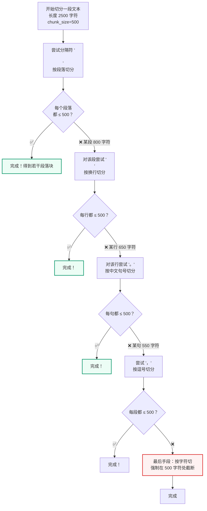

# Recursive Splitter
<Badge icon="clock" color="green">Written: 2026.06</Badge>
## 为什么需要这讲

本项目的文档切分（第 3 讲和第 16 讲）使用 LangChain 的 `RecursiveCharacterTextSplitter`，这是整个入库链路中最关键的参数决策点。主讲义只展示了分隔符列表，没有解释**递归降级切分**的核心算法。理解这个算法才能理解为什么 chunk\_size 和 overlap 的设置会影响检索质量。

## 一、朴素切分的问题

最直观的切分方式是**定长切分**：每 N 个字符切一刀。

```text
# 朴素定长切分（chunk_size=100）
text = "入职流程包括以下步骤：1. 提交入职材料（身份证复印件、学历证书、离职证明）。2. 签订劳动合同和保密协议。3. 部门负责人审批。"
chunks = [text[i:i+100] for i in range(0, len(text), 100)]

# 结果：
# chunk1: "入职流程包括以下步骤：1. 提交入职材料（身份证复印件、学历证书、离职证明）。2. 签订劳动"
#            ↑ 在第100个字符处截断，切断了"劳动合同"这个词
# chunk2: "合同和保密协议。3. 部门负责人审批。"
#            ↑ 孤立的半句话
```

问题：
- 句子被从中间切断，语义不完整
- LLM 看到"签订劳动"和"合同和保密协议"两个碎片，不如看到一个完整的"签订劳动合同和保密协议"

## 二、递归降级切分算法

`RecursiveCharacterTextSplitter` 的核心思想：**用一组分隔符，从粗到细递归尝试**。

```text
分隔符优先级（本项目的中文配置）：
1. "\n\n"   → 段落分隔（最理想）
2. "\n"     → 行分隔
3. "。"     → 中文句号
4. "！"     → 中文感叹号
5. "？"     → 中文问号
6. "；"     → 中文分号
7. "，"     → 中文逗号
8. " "      → 空格
9. ""       → 字符级切分（最后手段）
```



## 三、具体例子

假设有如下文本（chunk\_size=200）：

```text
入职流程包括以下步骤：

1. 提交入职材料。新员工需携带身份证复印件、
学历证书原件、离职证明和近六个月体检报告。
HR部门会在1个工作日内完成材料审核。

2. 签订劳动合同和保密协议。合同期限根据
岗位级别确定，一般为3年。
```

**第一轮：尝试 `\n\n`（段落）**

```yaml
段落1: "入职流程包括以下步骤：" → 长度 12 ✅
段落2: "1. 提交入职材料。新员工需携带身份证复印件、\n学历证书原件、离职证明和近六个月体检报告。\nHR部门会在1个工作日内完成材料审核。" → 长度 85 ✅  
段落3: "2. 签订劳动合同和保密协议。合同期限根据\n岗位级别确定，一般为3年。" → 长度 35 ✅
```

全部在 200 以内 → 完成！三个按段落划分的 chunk，语义边界完美。

**但如果 chunk\_size=50**：

```text
段落2 长度 85 > 50 → 继续用 '\n' 切分
  行1: "1. 提交入职材料。新员工需携带身份证复印件、" → 25 ✅
  行2: "学历证书原件、离职证明和近六个月体检报告。" → 21 ✅
  行3: "HR部门会在1个工作日内完成材料审核。" → 18 ✅
全部在 50 以内 → 完成！
```

## 四、Overlap 的作用

`chunk_overlap` 让相邻 chunk 之间有重叠内容：

```text
chunk_size=500, chunk_overlap=50

原始文本：
[0──────500]
         [450────950]
                  [900───1400]

重叠区域（50字符）保证了：
1. 不会因为切分边界刚好切断了关键信息
2. 相邻 chunk 的语义有连续性
```

对于中文，本项目配置：

```text
CHINESE_SEPARATORS = [
    "\n\n", "\n",
    "。", "！", "？", "；",
    ";", ".", "!", "?",
    "，", ",",
    " ",
    "",
]

parent_splitter = RecursiveCharacterTextSplitter(
    chunk_size=2000,    # 父块 2000 字符 → 完整上下文
    chunk_overlap=200,
    separators=CHINESE_SEPARATORS,
)

child_splitter = RecursiveCharacterTextSplitter(
    chunk_size=500,     # 子块 500 字符 → 精确检索
    chunk_overlap=50,
    separators=CHINESE_SEPARATORS,
)
```

## 五、Markdown 文件的特殊处理

对于 `.md` 文件，LangChain 提供了一个增强切分器：

```python
from langchain_text_splitters import MarkdownHeaderTextSplitter

markdown_headers = [("#", "h1"), ("##", "h2"), ("###", "h3")]

# 先按 Markdown 标题层级切分
header_splitter = MarkdownHeaderTextSplitter(headers_to_split_on=markdown_headers)

# 输入：
# # 入职管理
# ## 入职流程
# 入职需要提交以下材料...
# ## 转正流程
# 试用期结束后...

# 输出：
# Document(page_content="入职需要提交以下材料...", metadata={"h1": "入职管理", "h2": "入职流程"})
# Document(page_content="试用期结束后...", metadata={"h1": "入职管理", "h2": "转正流程"})
```

这使得后续 LLM 生成的答案可以引用"来源：入职管理 > 入职流程"这样的层级结构。

## 六、表格文件的特殊保护

```text
if content_type.startswith("table"):
    # 表格行不做递归切分！
    # 一行表格 = 一个语义单元
    # 如果切分，会把"金额：50000"和"状态：待审批"拆到两个 chunk
    parent_docs = [doc]
```

这是本项目的一个重要设计：表格行的内容（表头+行号+单元格键值对）是一个完整的语义单元。递归切分会破坏这个完整性。

## 七、chunk\_size 调优的权衡

| chunk\_size | 优点 | 缺点 |
| --- | --- | --- |
| 小（200-300） | 检索精确，匹配粒度细 | 上下文不完整，chunk 数量多 |
| 中（500-800） | 平衡精度和上下文 | 需要 overlap 来保证连续性 |
| 大（1000-2000） | 上下文完整 | 检索不精确，语义信号被稀释 |

本项目的选择（父块 2000 + 子块 500）是一种折中：
- 用子块（500）做检索 → 精确
- 用父块（2000）给 LLM → 完整

## 小结

- **递归降级**：从段落 → 换行 → 句号 → 逗号 → 字符，逐步降级
- **优先级**：优先在语义边界切分，只在必要时才强制截断
- **Overlap**：防止切分边界切断关键信息
- **父子块策略**：子块检索 + 父块生成，兼顾精度和完整性
- **表格保护**：表格行不参与递归切分，保持语义单元完整