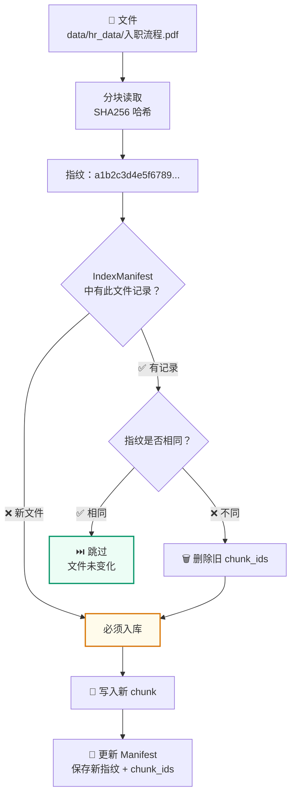

# SHA256 指纹
<Badge icon="clock" color="green">Written: 2026.06</Badge>
## 1. 为什么需要这讲

本项目的文档入库系统(第16讲)使用 SHA256 哈希实现**增量入库**——只更新变化的文件，跳过未变化的。这一机制是 `IndexManifest` 的核心，但主讲义没有展开解释哈希算法本身。

## 2. 什么是哈希(Hash)

**哈希函数**是一种将任意长度的数据映射为固定长度摘要的算法。

```text
输入：任意长度的文件内容
  ↓  SHA256 哈希函数
输出：64 个十六进制字符(256 bits)

例如：
"入职流程包括..."        → a1b2c3d4e5f6789...(64字符)
"入职流程包括..."(完全相同)→ a1b2c3d4e5f6789...(完全相同的64字符)
"入职流程包含..."(一个字符不同)→ 8f3e9a2b1c7d456...(完全不同的64字符)
```

核心特性：
1. **确定性**：同一输入永远产生同一输出
2. **雪崩效应**：输入改一个比特，输出天差地别
3. **单向性**：无法从哈希值反推原始内容
4. **碰撞抵抗**：找到两个不同内容产生相同哈希值在计算上不可行

## 3. 为什么选择 SHA256

| 算法 | 输出长度 | 碰撞安全性 | 速度 |
| --- | --- | --- | --- |
| MD5 | 128 bit | ❌ 已破解 | 快 |
| SHA1 | 160 bit | ❌ 已破解 | 较快 |
| SHA256 | 256 bit | ✅ 安全 | 中等 |
| SHA512 | 512 bit | ✅ 非常安全 | 慢 |

SHA256 是**安全性和速度的最佳平衡点**。对于文件指纹来说，SHA256 的碰撞概率约为 1/2^128(生日攻击)，远低于硬件故障概率。

## 4. 本项目的指纹计算

```python
# qa_core/utils.py
import hashlib

def file_fingerprint(file_path: str | Path) -> str:
    """计算文件的 SHA256 指纹。"""
    hasher = hashlib.sha256()
    with open(file_path, "rb") as f:
        while True:
            chunk = f.read(8192)  # 分块读取，避免大文件撑爆内存
            if not chunk:
                break
            hasher.update(chunk)
    return hasher.hexdigest()  # 返回 64 字符的十六进制字符串
```

**为什么分块读取(8192 字节/块)**：
- 如果知识库有一个 500MB 的 PDF，`f.read()` 会把整个文件加载到内存
- 分块读取每次只在内存中保留 8KB，无论文件多大都不会 OOM

## 5. 增量检测机制



**具体例子**：

```text
第一次入库：
  hr_data/入职流程.pdf → SHA256: a1b2c3... → 写入 Milvus → Manifest: {fingerprint: "a1b2c3...", chunk_ids: [...]}

第二次入库(文件未改)：
  hr_data/入职流程.pdf → SHA256: a1b2c3... → Manifest 中相同 → 跳过 ✅

第三次入库(文件改了)：
  hr_data/入职流程.pdf → SHA256: 8f3e9a... → Manifest 中不同 → 删除旧 chunk_ids → 重新入库 → 更新 Manifest
```

## 6. 为什么不用文件修改时间

很多开发者第一时间想到用 `os.path.getmtime()` 来判断文件是否变化。但这不可靠：

| 方法 | 问题 |
| --- | --- |
| `mtime` | Git clone 后 mtime 是克隆时间，不是编辑时间；CI 环境 mtime 不稳定 |
| 文件大小 | 修改一个字不改变文件大小，但内容已不同 |
| SHA256 | ✅ 内容变化即指纹变化，跨平台可靠 |

## 7. 在版本号中的应用

SHA256 不仅用于文件指纹，还用于生成知识库版本号的**配置哈希**：

```python
def generate_kb_version(prefix="kb", scenario_id=None) -> str:
    config_hash = stable_hash(
        scenario.scenario_id,
        settings.embedding_model_version,
        settings.reranker_model_version,
        settings.chunk_schema_version,
        scenario.doc_collection,
        scenario.faq_collection,
    )[:8]  # 取前 8 位
    return f"{prefix}_{scenario_id}_{timestamp}_{config_hash}"
```

如果版本号的配置哈希不同，说明 Embedding 模型、Reranker 或 Chunk 方案有变化——这是需要重点关注的版本变更。

## 8. 小结

- **SHA256** = 任意输入 → 固定 256bit 输出，雪崩效应保证微小差异可检测
- **分块读取**避免大文件撑爆内存
- **增量检测** = 文件指纹比较，跳过未变化文件
- **优于 mtime**：Git clone、CI 环境下 mtime 不可靠