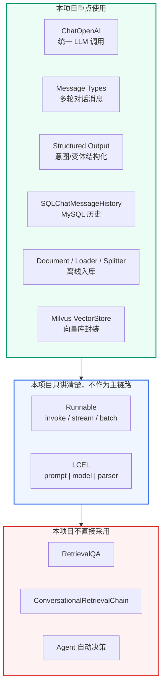
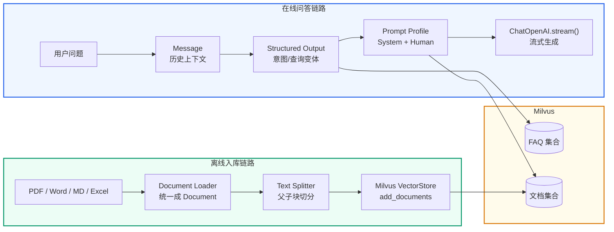
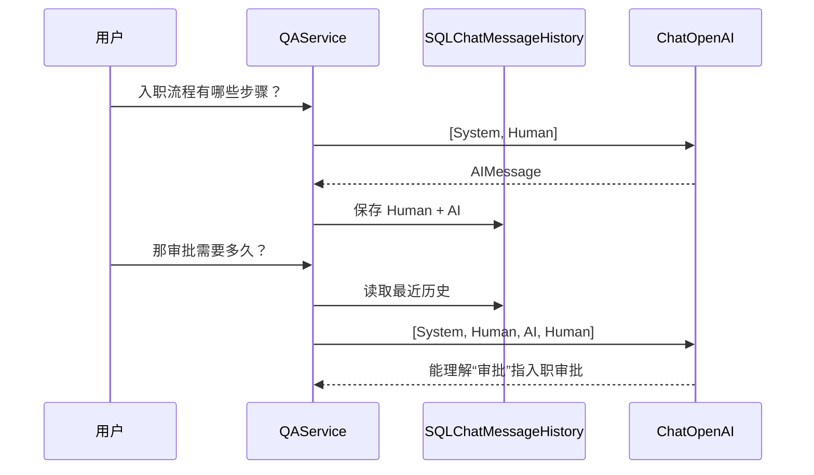
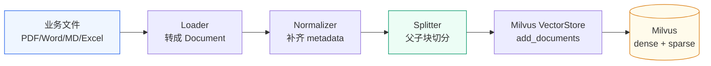
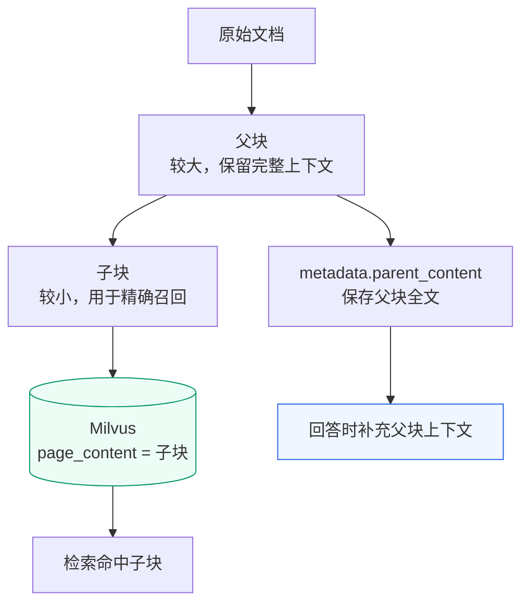
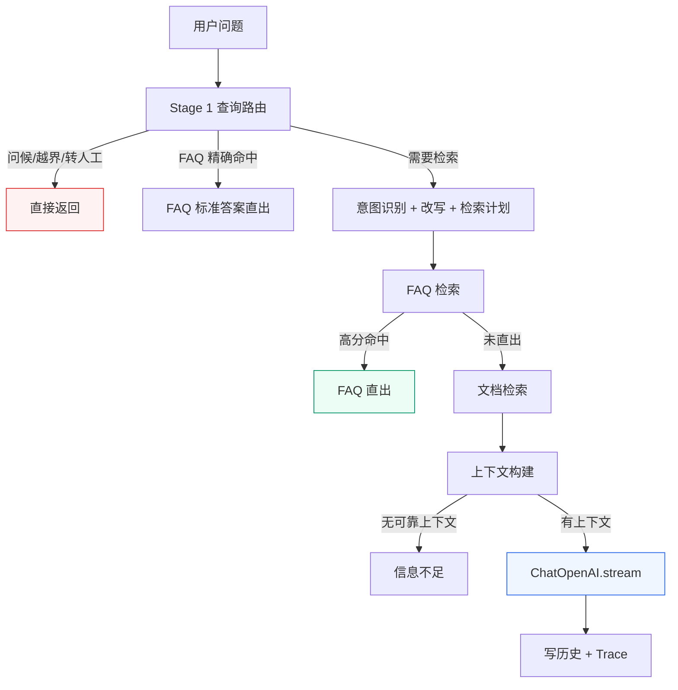

# LangChain 生态
<Badge icon="clock" color="green">Written: 2026.06</Badge>
**上一讲**：[RAG 核心概念深入](/RAG/foundations/rag-fundamentals)  
**下一讲**：[Milvus 索引机制与基本操作](/RAG/retrieval/milvus-index-and-operations)

---

## 1. 本讲导入

LangChain 的组件很多：Runnable、Prompt、Message、Parser、History、Loader、Splitter、VectorStore 都是常见概念。学习这些组件时，最重要的不是记住每个类名，而是看清它们在企业级 RAG 项目中分别出现在什么位置、解决什么工程问题。

本讲只围绕三个问题：

1. **LangChain 在本项目里到底是什么角色？**
2. **一次在线问答中，哪些步骤用到了 LangChain？**
3. **一次离线入库中，哪些步骤用到了 LangChain？**

先记住一句话：

> 本项目没有把 LangChain 当成“一键 RAG 框架”，而是把它当成一组可靠的工程适配器：模型适配器、消息对象、结构化输出、历史记录、文档对象、加载器、切分器和向量库封装。

---

## 2. 本讲目标

学完本讲后，需要能说清楚：

- 为什么项目用 `ChatOpenAI` 接入 DashScope，而不是直接绑定某个厂商 SDK。
- `SystemMessage`、`HumanMessage`、`AIMessage` 在多轮对话和 Prompt 中分别承担什么角色。
- `with_structured_output()` 为什么比让模型返回自由文本更适合意图识别和查询变体生成。
- `SQLChatMessageHistory`、`Document`、`TextSplitter`、`Milvus VectorStore` 分别位于项目哪条链路。
- 为什么本项目没有直接使用 `RetrievalQA`、`ConversationalRetrievalChain` 或一条 LCEL 管道完成全部 RAG。

---

## 3. LangChain 在项目中的角色

### 3.1 LangChain 不是完整业务流程

LangChain 不是模型，也不是知识库，更不是项目的业务大脑。它更像一组标准接口：

| 项目问题 | LangChain 提供的抽象 |
| --- | --- |
| 不同 LLM 厂商 API 不一致 | `ChatOpenAI` 等 ChatModel 统一接口 |
| 多轮对话消息结构容易混乱 | `SystemMessage` / `HumanMessage` / `AIMessage` |
| LLM 输出格式不稳定 | `with_structured_output()` + Pydantic |
| 历史消息要持久化 | `SQLChatMessageHistory` |
| 文件格式不同 | Document Loader |
| 大文档需要切块 | Text Splitter |
| 向量库写入和检索 API 复杂 | VectorStore |

也就是说，LangChain 解决的是**接口标准化**和**工程胶水**问题。本项目真正的业务流程仍然由 `qa_core` 自己编排。

### 3.2 本项目的使用边界



这里要特别区分：**不用高层 Chain，不代表不用 LangChain**。本项目用的是 LangChain 的底层稳定组件，把分支、阈值、追问改写、FAQ 直出、文档检索、Prompt 档位这些业务决策留在项目代码里。

---

## 4. 一张图看清两条主线

本项目中 LangChain 的使用分成两条线：

1. **在线问答链路**：用户提问 -> 意图识别 -> 检索准备 -> Prompt -> LLM 流式生成。
2. **离线入库链路**：业务文件 -> Document -> 切分 -> Milvus VectorStore 写入。



这张图就是本讲主线。后面所有组件都放回这两条线里讲。

---

## 5. 在线问答链路中的 LangChain

### 5.1 ChatOpenAI：统一模型调用入口

项目文件：`qa_core/llm/client.py`

本项目实际使用 DashScope 的 OpenAI-compatible 接口，但代码里不直接写 DashScope SDK，而是统一用 LangChain 的 `ChatOpenAI`：

```python
from functools import lru_cache

from langchain_core.messages import HumanMessage
from langchain_openai import ChatOpenAI

from qa_core.config.settings import get_settings

@lru_cache(maxsize=2)
def get_chat_model(streaming: bool = False) -> ChatOpenAI:
    settings = get_settings()
    return ChatOpenAI(
        model=settings.llm_model,
        api_key=settings.llm_api_key,
        base_url=settings.llm_base_url,
        temperature=settings.llm_temperature,
        timeout=settings.llm_timeout,
        streaming=streaming,
    )
```

这里的设计点：

- `base_url` 可以指向 DashScope、DeepSeek 或其他 OpenAI-compatible 服务。
- `streaming=False` 用于意图识别、查询改写、结构化输出。
- `streaming=True` 用于最终答案生成，方便 WebSocket 逐 token 推送。
- `@lru_cache(maxsize=2)` 只缓存两个客户端实例，不缓存模型答案。

### 5.2 Message：让多轮对话结构稳定

LangChain 的消息对象对应 OpenAI API 的角色格式：

| LangChain 对象 | API role | 项目用途 |
| --- | --- | --- |
| `SystemMessage` | `system` | 设定助手身份、回答边界、风险约束 |
| `HumanMessage` | `user` | 用户问题、改写请求、检索上下文问题 |
| `AIMessage` | `assistant` | 历史回答，进入多轮上下文 |

项目文件：`qa_core/memory/history.py`

```python
from langchain_core.messages import AIMessage, HumanMessage, SystemMessage

def add_turn(self, session_id: str, question: str, answer: str) -> None:
    history = self.for_session(session_id)
    history.add_messages([
        HumanMessage(content=question),
        AIMessage(content=answer),
    ])

def get_context_messages(self, session_id: str):
    recent = self.get_messages(session_id, limit=self.settings.history_recent_messages)
    summary = self.get_summary(session_id)
    if summary:
        return [SystemMessage(content=f"历史摘要：{summary}")] + recent
    return recent
```

需要理解：LLM 本身没有会话记忆。所谓“多轮对话”，本质是每次调用模型时，把必要的历史消息重新发给模型。



### 5.3 Structured Output：把 LLM 输出变成业务对象

项目文件：`qa_core/intent/classifier.py`

意图识别不能让模型自由发挥。自由文本会出现这些情况：

```text
这是一个知识库查询问题。
用户应该是在问 FAQ。
INTENT = KNOWLEDGE_QUERY, confidence is high.
```

这些格式都不稳定。项目里使用 Pydantic 结构约束：

```python
from pydantic import BaseModel, Field
from typing import Literal

Intent = Literal[
    "GREETING",
    "FOLLOW_UP",
    "KNOWLEDGE_QUERY",
    "FAQ_QUERY",
    "HUMAN_SERVICE",
    "OUT_OF_SCOPE",
]

class IntentLLMDecision(BaseModel):
    intent: Intent = Field(description="用户问题意图")
    confidence: float = Field(default=0.6, ge=0.0, le=1.0)
    reason: str = Field(default="")
    requires_rewrite: bool = Field(default=False)
    suggested_source: str | None = Field(default=None)

model = get_chat_model(streaming=False).with_structured_output(IntentLLMDecision)
decision = model.invoke([
    SystemMessage(content=INTENT_SYSTEM_PROMPT),
    HumanMessage(content="用户问题：入职流程有哪些步骤？"),
])
```

返回值不是字符串，而是一个 Pydantic 对象：

```text
decision.intent           # "KNOWLEDGE_QUERY"
decision.confidence       # 0.84
decision.requires_rewrite # False
```

这一步是 LangChain 在项目中非常关键的价值：**让 LLM 的输出进入可校验、可分支、可记录的工程世界**。

同样的方式也用于查询变体生成：

```text
model = get_chat_model(streaming=False).with_structured_output(QueryVariants)
```

### 5.4 Prompt Profile：不是一个 Prompt 走天下

项目文件：

- `qa_core/prompts/profiles.py`
- `qa_core/prompts/selector.py`

项目没有把所有问题都塞进同一个 Prompt，而是按意图和风险类别选择不同模板：

```text
PROMPT_PROFILES = {
    "FAQ_QUERY": PromptProfile(
        name="faq_answer",
        system_template=FAQ_ANSWER_SYSTEM_PROMPT,
        user_template=FAQ_ANSWER_USER_TEMPLATE,
        reason="FAQ 类问题优先复用标准答案，控制回答长度和业务口径。",
    ),
    "KNOWLEDGE_QUERY": PromptProfile(
        name="knowledge_answer",
        system_template=KNOWLEDGE_ANSWER_SYSTEM_PROMPT,
        user_template=KNOWLEDGE_ANSWER_USER_TEMPLATE,
        reason="业务知识咨询需要整合文档资料。",
    ),
    "FOLLOW_UP": PromptProfile(
        name="follow_up",
        system_template=FOLLOW_UP_ANSWER_SYSTEM_PROMPT,
        user_template=FOLLOW_UP_ANSWER_USER_TEMPLATE,
        reason="追问需要结合历史理解指代。",
    ),
}
```

可以这样理解：

- Prompt 不是一段固定文案，而是**回答策略配置**。
- `system_template` 控制助手身份、边界、风险口径。
- `user_template` 注入历史、检索上下文、用户问题。
- `reason` 进入调试信息，帮助解释为什么选择这个模板。

### 5.5 最终答案：ChatOpenAI.stream() 推给前端

项目文件：`qa_core/pipeline/steps.py`

```python
from langchain_core.messages import HumanMessage, SystemMessage

def stream_llm_answer(system_prompt: str, user_prompt: str):
    llm = get_chat_model(streaming=True)
    return llm.stream([
        SystemMessage(content=system_prompt),
        HumanMessage(content=user_prompt),
    ])
```

项目主流程会把每个 chunk 转成 WebSocket token 事件：

```text
for chunk in stream_llm_answer(answer_prepared.system_prompt, answer_prepared.user_prompt):
    token = str(getattr(chunk, "content", "") or "")
    if not token:
        continue
    yield build_token_event(token, context.session_id)
```

注意：这里不是 LangChain 替我们完成整个 RAG。LangChain 只负责模型流式调用；FAQ 直出、文档检索、上下文筛选、引用补强、写历史这些仍由项目代码控制。

---

## 6. 离线入库链路中的 LangChain

在线问答依赖的是“可检索的知识库”。这个知识库来自离线入库链路：



### 6.1 Document：入库链路的统一数据结构

LangChain 的 `Document` 很简单，只有两个核心字段：

```python
from langchain_core.documents import Document

doc = Document(
    page_content="入职流程包括提交材料、签订劳动合同、部门审批和账号开通。",
    metadata={
        "source": "hr",
        "file_name": "入职制度.md",
        "page": 1,
    },
)
```

本项目的约定：

- `page_content` 存正文，用于 embedding、BM25 和最终上下文。
- `metadata` 存来源、场景、权限、知识库版本、文件名、行号等治理字段。

需要记住：**RAG 入库不是只存文本，还要存 metadata**。没有 metadata，就无法做来源引用、权限过滤、版本隔离和质量追踪。

### 6.2 Document Loader：不同文件格式统一成 Document

项目文件：`qa_core/indexing/document_loaders.py`

项目用注册表模式管理 Loader，而不是在主流程里写一堆 `if/elif`：

```text
DOCUMENT_LOADER_SPECS = (
    DocumentLoaderSpec(
        suffixes=(".txt", ".md"),
        factory=_utf8_text_loader,
        description="UTF-8 文本/Markdown",
    ),
    DocumentLoaderSpec(
        suffixes=(".pdf",),
        factory=_pdf_loader,
        description="PDF 文档",
    ),
    DocumentLoaderSpec(
        suffixes=(".docx",),
        factory=_word_loader,
        description="Word 文档",
    ),
    DocumentLoaderSpec(
        suffixes=(".csv", ".xlsx", ".xls"),
        factory=_table_loader,
        description="表格文件",
    ),
)
```

重点不是背 Loader 名称，而是理解模式：

> 文件格式不同，但进入后续入库链路之前，都要统一成 `list[Document]`。

### 6.3 Text Splitter：为什么默认使用 RecursiveCharacterTextSplitter

项目文件：`qa_core/indexing/chunking.py`

```python
from langchain_text_splitters import RecursiveCharacterTextSplitter

CHINESE_SEPARATORS = [
    "\n\n",
    "\n",
    "。", "！", "？", "；",
    ";", ".", "!", "?",
    "，", ",",
    " ",
    "",
]

parent_splitter = RecursiveCharacterTextSplitter(
    chunk_size=settings.parent_chunk_size,
    chunk_overlap=settings.parent_overlap,
    separators=CHINESE_SEPARATORS,
)

child_splitter = RecursiveCharacterTextSplitter(
    chunk_size=settings.child_chunk_size,
    chunk_overlap=settings.child_overlap,
    separators=CHINESE_SEPARATORS,
)
```

为什么用它作为默认方案：

- 它快、稳定、便宜，不依赖 embedding 模型。
- chunk 大小可控，适合向量库检索。
- 对制度、流程、手册、FAQ、Markdown 这类企业资料足够可靠。
- 参数容易解释，适合学习、排查和生产调优。

`SemanticChunker` 不是不能用，但不适合作为默认切分器。它更适合无明显结构、话题自然漂移的长文，例如访谈、会议纪要、研究报告。企业 RAG 的主链路更需要稳定、可控、可复现。

### 6.4 MarkdownHeaderTextSplitter：先保留章节结构

项目中 Markdown 文件会先按标题拆分，再进入递归切分：

```python
from langchain_text_splitters import MarkdownHeaderTextSplitter

markdown_headers = [("#", "h1"), ("##", "h2"), ("###", "h3")]
header_splitter = MarkdownHeaderTextSplitter(headers_to_split_on=markdown_headers)
header_docs = header_splitter.split_text(doc.page_content)
```

这样做的好处是：标题层级会进入 metadata，后续回答可以显示更清晰的来源，例如：

```text
来源：入职制度.md > 入职管理 > 入职流程
```

### 6.5 父子块策略：检索要精确，回答要完整



一句话解释：

> 子块负责“找得准”，父块负责“答得完整”。

更深入的 chunk size、overlap 和质量检查放到 [附录 G：文档切分策略](/RAG/appendix/chunking-strategy-appendix) 和第 16 讲展开。本讲只建立在 LangChain 生态中的位置感。

### 6.6 VectorStore：把 Document 写入 Milvus

项目文件：`qa_core/retrieval/store.py`

```python
from langchain_milvus import Milvus

self._store = Milvus(
    embedding_function=get_embeddings(),
    builtin_function=bm25_function(),
    collection_name=self.collection_name,
    connection_args=connection_args,
    vector_field=["dense", "sparse"],
    text_field="text",
    primary_field="pk",
    auto_id=False,
    enable_dynamic_field=True,
    consistency_level="Session",
    drop_old=False,
)
```

这里先只讲抽象：

- `embedding_function` 生成 dense 向量。
- `builtin_function=bm25_function()` 让 Milvus 服务端生成 sparse 向量。
- `add_documents()` 写入 `Document`。
- `similarity_search_with_score()` 检索并返回 `Document + score`。

下一讲再进入 Milvus 自身：Collection、Schema、Index、Load、Insert、Search。

---

## 7. Runnable 和 LCEL 只作为统一接口理解

### 7.1 Runnable 的意义

Runnable 是 LangChain 的统一调用协议。无论 Prompt、Model、Parser，核心调用都收敛到三个方法：

| 方法 | 语义 | 本项目对应 |
| --- | --- | --- |
| `invoke()` | 一个输入，返回完整结果 | 意图识别、查询改写、结构化输出 |
| `stream()` | 一个输入，持续返回片段 | 最终答案逐 token 输出 |
| `batch()` | 多个输入，批量处理 | 批量测试、批量解析、离线评测可用 |

```text
response = model.invoke([HumanMessage(content="入职流程有哪些步骤？")])

for chunk in model.stream([HumanMessage(content="入职流程有哪些步骤？")]):
    print(chunk.content, end="")

results = parser.batch([message_a, message_b, message_c])
```

### 7.2 LCEL 是线性链路语法，不是项目主流程

LCEL 可以把 Prompt、Model、Parser 串成线性管道：

```python
from langchain_core.output_parsers import StrOutputParser
from langchain_core.prompts import ChatPromptTemplate

prompt = ChatPromptTemplate.from_template("用一句话回答：{question}")
chain = prompt | model | StrOutputParser()

answer = chain.invoke({"question": "入职流程有哪些步骤？"})
```

它适合简单线性任务：

```text
输入变量 -> Prompt -> Model -> Parser -> 输出
```

但本项目的 RAG 主流程不是一条直线：



所以本项目选择显式编排，而不是高层 Chain：

```text
route = decide_route(context)
if route.answer:
    return direct_answer

prepared = prepare_retrieval(context)
faq_result = search_faq(context, prepared)
doc_result = search_doc(context, prepared)
answer_prepared = prepare_answer(context, prepared, faq_result, doc_result)

for chunk in stream_llm_answer(system_prompt, user_prompt):
    yield token_event(chunk)
```

可以这样总结：

> LCEL 很适合教“组件怎么串起来”，但企业 RAG 主链路有大量分支、阈值、提前退出和诊断信息，所以本项目不用一条 LCEL 链包到底。

---

## 8. 自研与生态的分工

### 8.1 交给 LangChain 的部分

| 能力 | 原因 |
| --- | --- |
| LLM 客户端 | 多厂商 OpenAI-compatible 统一接口 |
| Message 类型 | 对话历史结构稳定 |
| 结构化输出 | Pydantic 约束，减少自由文本解析 |
| SQLChatMessageHistory | 省掉历史消息 CRUD |
| Document / Loader | 文件解析后统一结构 |
| Text Splitter | 成熟切分策略，减少手写边界问题 |
| VectorStore | 统一向量库写入和检索入口 |

### 8.2 项目自己实现的部分

| 能力 | 为什么自己做 |
| --- | --- |
| 查询路由 | 要优先处理问候、转人工、越界、FAQ 精确命中 |
| 意图规则 | 高频确定场景不应都调用 LLM |
| 检索计划 | 不同意图、风险类别、source 需要不同参数 |
| FAQ 直出 | 标准答案命中后不需要 LLM 生成 |
| 上下文筛选 | 要做分数阈值、重排、来源整理 |
| Prompt Profile | 不同业务类别要有不同口径 |
| 引用补强 | 企业 RAG 必须给出可追溯来源 |
| Trace 和诊断 | 教学、调试、验收都需要可解释过程 |

这就是本项目的工程取舍：**底层组件用生态，业务编排自己掌控**。

---

## 9. 学习路径建议

为了避免把 LangChain 学成零散组件，建议按下面顺序学习，而不是按组件名孤立学习：

| 顺序 | 学什么 | 目标 |
| --- | --- | --- |
| 1 | LangChain 在项目里的边界 | 先防止误解成“一键 RAG” |
| 2 | 在线问答主线 | 看清 Message、ChatOpenAI、结构化输出在哪里用 |
| 3 | 离线入库主线 | 看清 Document、Loader、Splitter、VectorStore 在哪里用 |
| 4 | Runnable / LCEL | 解释统一接口，但不把主项目讲成 LCEL 链 |
| 5 | 自研 vs 生态 | 回答“为什么不用 RetrievalQA” |
| 6 | 进入 demo | 用小 demo 验证每个组件，不把 demo 当项目主线 |

配套 demo 可以按这个顺序练习：

| demo | 建议放在 |
| --- | --- |
| `demo02_runnable_interface.py` | Runnable 统一协议 |
| `demo03_chatopenai_structured_output.py` | ChatOpenAI + 结构化输出 |
| `demo04_message_types.py` | Message 类型 |
| `demo05_prompt_templates.py` | Prompt 模板 |
| `demo09_sql_chat_history.py` | 历史持久化 |
| `demo10_document_loaders_splitters.py` | Loader + Splitter |
| `demo11_loader_registry.py` | 注册表模式 |
| `demo14_vectorstore_milvus.py` | VectorStore + Milvus |

---

## 10. 常见误区

### 10.1 误区一：用了 LangChain 就应该用 RetrievalQA

不对。`RetrievalQA` 适合快速 demo，但企业级 RAG 需要：

- FAQ 标准答案直出
- 意图识别
- 追问改写
- 多场景 source 过滤
- 知识库版本隔离
- 风险 Prompt Profile
- 引用来源补强
- Trace 和诊断面板

这些都很难塞进一个黑盒 Chain 里。

### 10.2 误区二：LCEL 越多越工程化

LCEL 适合表达线性链路，但不是所有流程都应该写成管道。复杂业务分支用显式函数更清楚，也更容易调试。

### 10.3 误区三：SemanticChunker 一定比 RecursiveCharacterTextSplitter 更好

不一定。企业 RAG 里的切分要可控、稳定、便宜、可复现。`RecursiveCharacterTextSplitter` 更适合作为默认方案；`SemanticChunker` 可以作为特殊文档的增强策略，而不是主链路默认切分器。

### 10.4 误区四：VectorStore 就是 Milvus

不是。VectorStore 是 LangChain 的抽象，Milvus 是具体后端。本项目选择 Milvus，是因为需要服务端 BM25、混合检索、多集合、多版本和企业级部署能力。

---

## 11. 本讲实践闭环

| 项目 | 内容 |
| --- | --- |
| 本讲类型 | 项目地图 + 组件定位 |
| 主线 | 在线问答链路、离线入库链路 |
| 核心产物 | 能画出 LangChain 在项目中的使用位置 |
| 是否进入最终项目 | 是，多个组件已在 `qa_core` 中使用 |
| 验收方式 | 能解释为什么项目“用 LangChain 组件，但不用高层 Chain 包办 RAG” |
| 后续落点 | 第 4 讲 Milvus、第 5 讲意图识别、第 8 讲混合检索、第 10 讲 RAG 主流程、第 16 讲入库 |

---

## 12. 重点掌握

| 优先级 | 内容 | 要求 |
| --- | --- | --- |
| 必会 | LangChain 在本项目中的定位 | 生态适配器，不是业务编排核心 |
| 必会 | `ChatOpenAI` 工厂 | 知道 `streaming=True/False` 分别用于哪里 |
| 必会 | Message 类型 | 能解释多轮对话为什么要带历史消息 |
| 必会 | `with_structured_output()` | 能解释它如何让 LLM 输出变成业务对象 |
| 必会 | Document / Loader / Splitter / VectorStore | 能放回离线入库链路 |
| 理解 | Runnable 的 `invoke/stream/batch` | 知道统一调用协议 |
| 理解 | LCEL 的适用边界 | 适合线性任务，不适合本项目完整 RAG 主链路 |
| 了解 | SQLChatMessageHistory | 知道它负责历史持久化，不负责检索 |

---

## 13. 本讲小结

- LangChain 在本项目里不是“一键 RAG 框架”，而是一组工程适配器。
- 在线问答链路中主要用到 `ChatOpenAI`、Message、结构化输出、Prompt Profile 和流式生成。
- 离线入库链路中主要用到 `Document`、Loader、Splitter 和 Milvus VectorStore。
- Runnable 统一了 `invoke / stream / batch`，LCEL 统一了简单线性链路写法。
- 本项目没有使用高层 Chain 包办 RAG，是因为企业级链路有分支、阈值、直出、过滤、追问、版本、引用和诊断。
- 先看项目主线，再看组件 API，会更容易建立整体感。

**下一讲**：[Milvus 索引机制与基本操作](/RAG/retrieval/milvus-index-and-operations) — 进入向量库底层：Collection、Schema、Index、Insert、Search，以及 LangChain Milvus 封装隐藏了哪些操作。