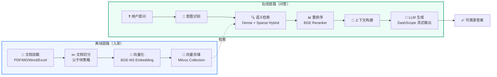
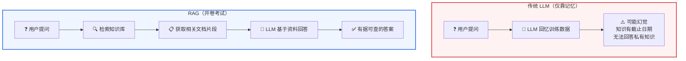
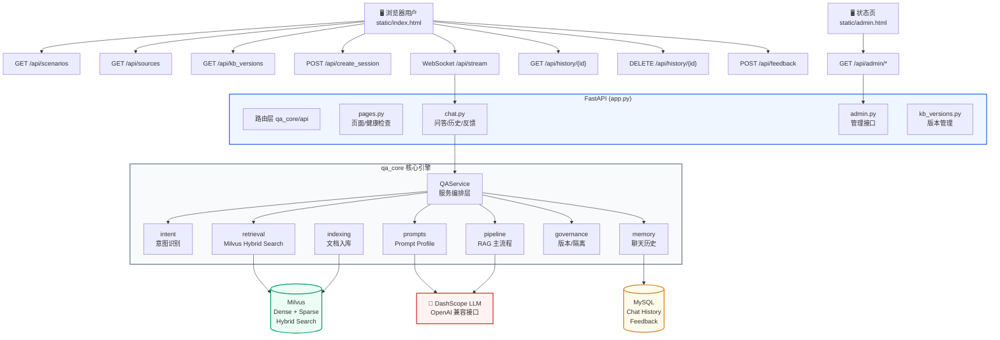
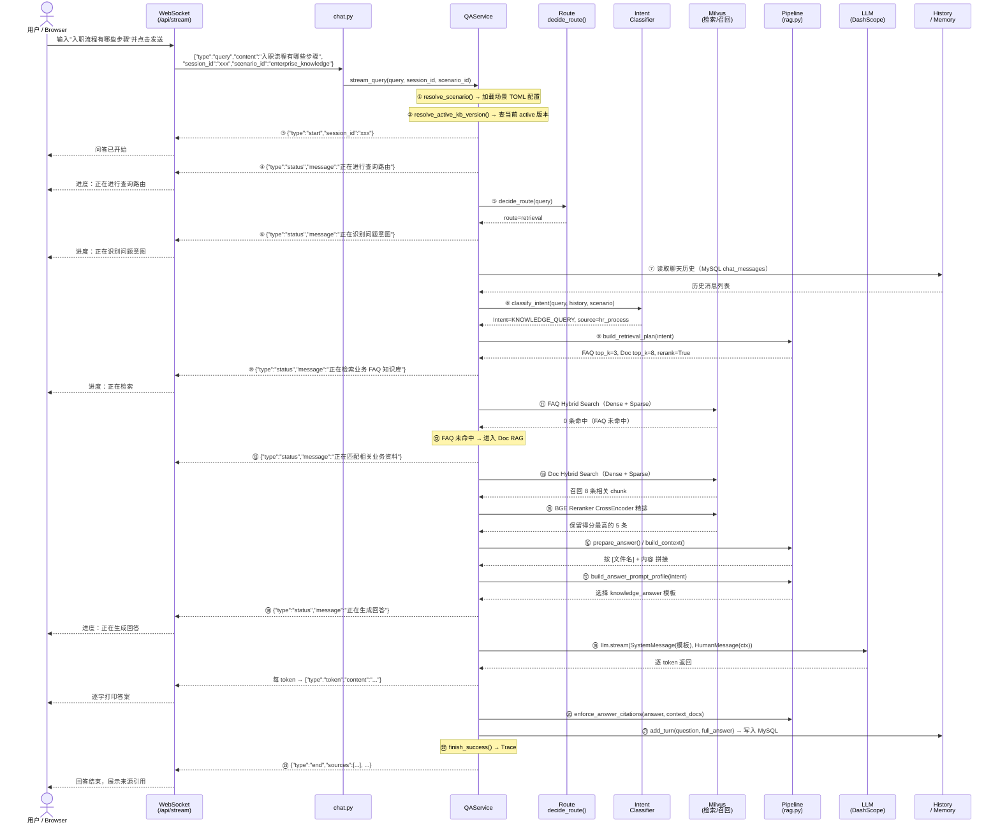
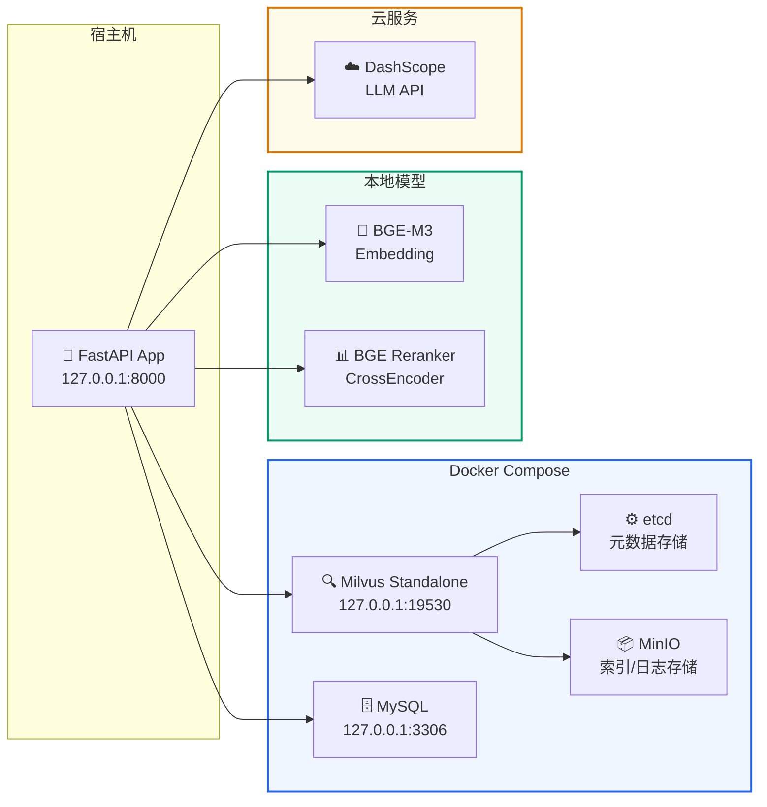
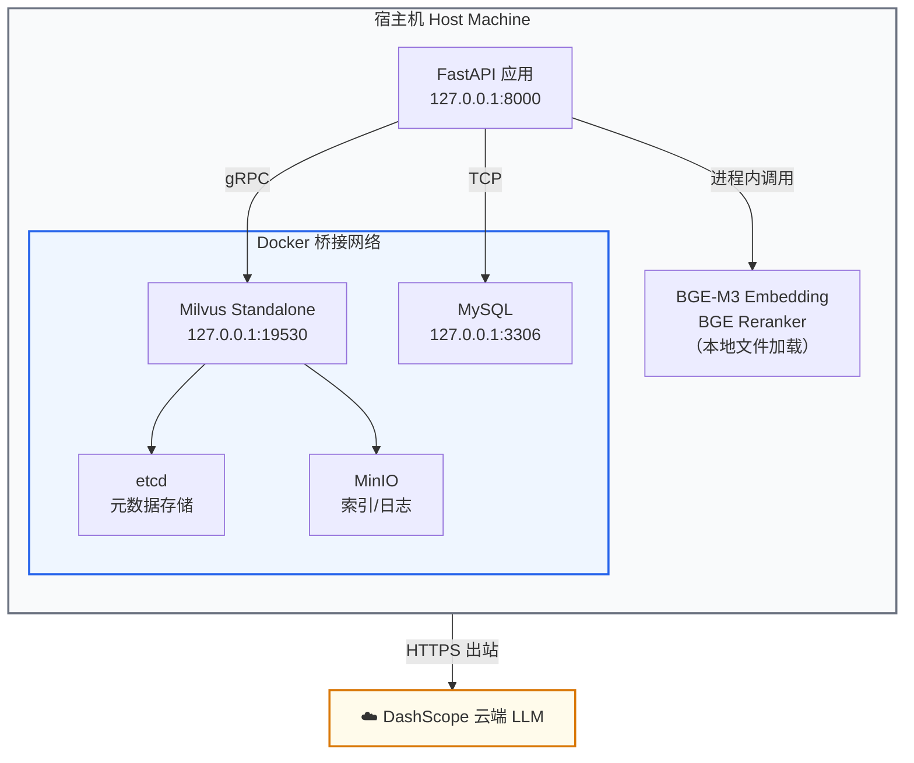
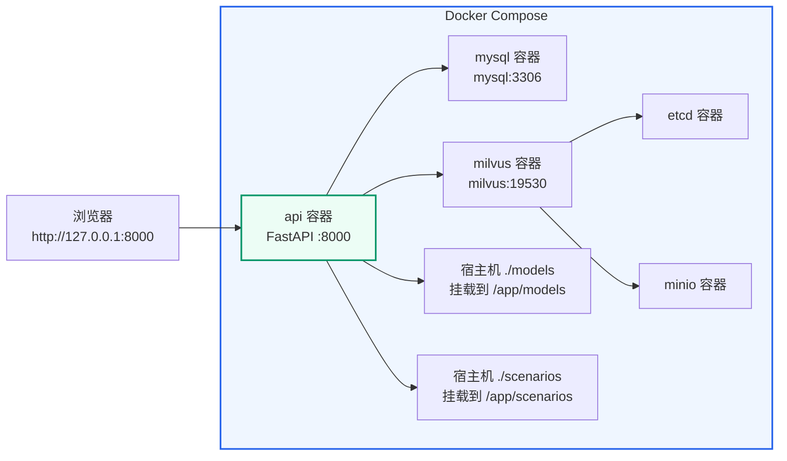
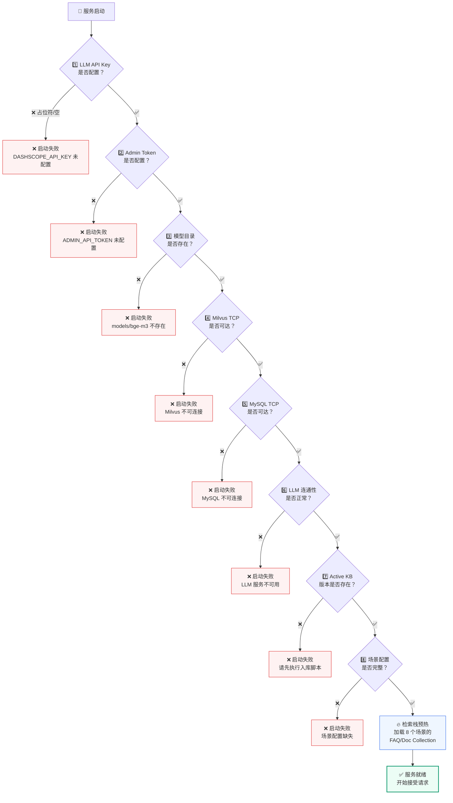
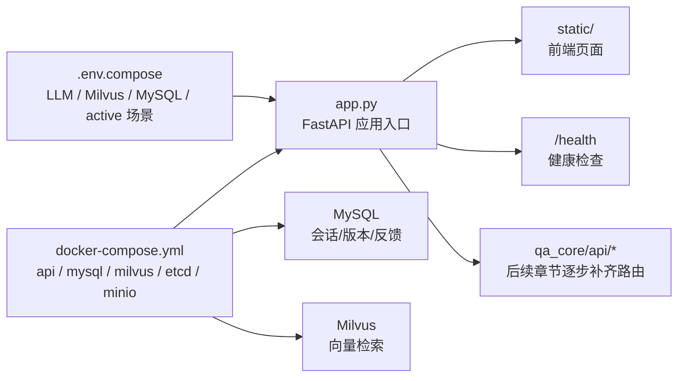

# 项目概述与环境搭建
<Badge icon="clock" color="green">Written: 2026.06</Badge>
> 🎬 **推荐**：在学习本讲之前或之后，观看 [RAG Pipeline 执行流程动画演示](/RAG/demos/pipeline-demo) 建立对系统整体执行流程的直观认识。

## 本讲目标

- 理解 RAG 系统的基本概念和应用场景
- 了解本项目的整体架构和技术栈
- 完成开发环境的搭建和验证

---

## 第一部分：前置知识

### 1.1 什么是 RAG（检索增强生成）

**RAG = Retrieval-Augmented Generation**，即"检索增强生成"。

在没有 RAG 之前，大语言模型（LLM）存在几个核心问题：

1. **知识截止日期**：模型训练完成后，无法获取训练数据之后的新信息。例如 GPT-4 的知识截止到 2023 年某月，之后发生的事情它不知道。
2. **幻觉问题**：当模型不确定某个答案时，它可能会"编造"一个看起来很合理但实际上是错误的内容。这在企业场景中是不可接受的。
3. **私有知识无法覆盖**：企业内部的制度、流程、业务文档是私有数据，从未进入过公开训练集，模型自然无法回答。

**RAG 的解决思路**非常简单：

```text
用户提问 → 先从知识库中检索相关文档 → 把检索到的文档和问题一起发给 LLM → LLM 基于文档生成答案
```

可以把 RAG 理解成"开卷考试"：LLM 不再只靠记忆回答，而是可以查阅我们提供的资料后再作答。

**RAG 的核心价值**：
- 答案是**可溯源**的（每个回答都能追溯到具体的文档片段）
- 知识可以**实时更新**（更新知识库不需要重新训练模型）
- 幻觉大幅**减少**（模型被约束在提供的文档范围内回答）

### 1.2 RAG 系统的基本组成

一个完整的 RAG 系统包含两条核心链路：



**对比：传统 LLM vs RAG**



**离线链路（入库）**：
1. **文档加载**：读取 PDF、Markdown、Word 等各种格式的文档
2. **文档切分**：把长文档按语义边界切成小块（chunk），每块通常是几百到一千字
3. **向量化**：用 Embedding 模型把每个 chunk 转成一串数字（向量），表达其语义
4. **存储**：把向量和原文一起存入向量数据库

**在线链路（问答）**：
1. **意图识别**：判断用户问的是什么类型的问题
2. **查询向量化**：把用户问题转成向量
3. **语义检索**：在向量数据库中找最相似的文档片段
4. **上下文构建**：把检索到的片段整理成 LLM 的参考资料
5. **答案生成**：LLM 基于资料生成回答

### 1.3 向量和向量检索是什么

这是理解 RAG 最关键的概念。我们通过一个类比来理解：

**类比：图书馆找书**

传统关键词搜索（比如 MySQL LIKE 查询）就像你告诉图书管理员"我要找书名里有'Python'的书"。问题在于：
- 一本叫《Python 机器学习实战》的书会被找到
- 但一本叫《用编程语言做数据分析》的书不会被找到，虽然它也讲 Python

向量检索就像你告诉图书管理员"我要找一本关于'用代码分析数据'的书"。图书管理员理解了这个概念的"语义"，然后去书架上找到《Python 机器学习实战》、《R 语言统计分析》、《数据科学入门》等语义相近的书。

**技术层面**：
- Embedding 模型把一段文本（比如一句话、一个段落）转换成一个固定长度的浮点数数组，例如 1024 维的向量
- 语义相近的文本，它们的向量在数学空间中的"距离"也近
- 向量数据库就是专门存储和检索这些向量的系统

```text
# 伪代码示例
文本1 = "Python 是一门编程语言"
文本2 = "Java 也是一门编程语言"
文本3 = "今天天气很好"

向量1 = embedding(文本1)  # [0.12, 0.34, -0.56, ...] (1024个数字)
向量2 = embedding(文本2)  # [0.11, 0.33, -0.54, ...] (与向量1很接近)
向量3 = embedding(文本3)  # [0.89, -0.21, 0.67, ...] (与向量1差异很大)

# 向量1和向量2的余弦相似度 ≈ 0.95（很高）
# 向量1和向量3的余弦相似度 ≈ 0.12（很低）
```

---

## 第二部分：项目架构

### 2.1 一句话描述

> 这是一个基于 LangChain + Milvus 2.5 Hybrid Search 的多场景 RAG 教学平台。不是简单的 Demo，而是补齐了企业级 RAG 完整工程闭环的项目。

### 2.2 全景架构图



#### 2.2.1 架构分层解读

全景架构图从上到下可以划分为 **五个层次**，每一层各司其职：

| 层次 | 名称 | 包含组件 | 一句话职责 |
| --- | --- | --- | --- |
| 第一层 | 用户入口层 | 浏览器用户（问答页）、状态页（admin 页） | 用户看得见、点得到的地方 |
| 第二层 | 路由层 | FastAPI `qa_core/api`（pages / chat / admin / kb\_versions） | 把 HTTP/WebSocket 请求分发给正确的后端模块 |
| 第三层 | 核心引擎层 | `qa_core` 八大模块（QAService、Intent、Retrieval 等） | 所有 RAG 业务逻辑的真正执行者 |
| 第四层 | 外部依赖层 | Milvus、MySQL、DashScope LLM | 提供向量检索、会话存储、文本生成能力 |
| 第五层 | 入库链路（离线） | Indexing → Milvus | 文档和 FAQ 怎么进知识库 |

**为什么要分层？** 每一层只跟相邻层打交道：浏览器不直接调 Milvus，API 路由不直接拼 Prompt，核心引擎不直接写 HTTP 响应。这保证了任何一层被替换时，其他层不受影响。

#### 2.2.2 第一层：用户入口 — 问答页和状态页各做什么

全景架构图的顶部有两个入口角色：

**问答页（`static/index.html`）** 是面向普通用户的交互界面，它会发出以下常用请求：

| 端点 | 方法 | 触发时机 | 作用 |
| --- | --- | --- | --- |
| `GET /api/scenarios` | HTTP | 页面加载时 | 拉取所有可用业务场景列表（下拉框的数据来源） |
| `GET /api/sources` | HTTP | 切换业务场景时 | 拉取当前场景可选的 source 过滤项 |
| `GET /api/kb_versions` | HTTP | 切换业务场景时 | 查看当前场景的知识库版本状态 |
| `POST /api/create_session` | HTTP | 用户选择场景后 | 创建新会话，返回 `session_id`（后续所有问答都绑定这个 ID） |
| `WebSocket /api/stream` | WebSocket | 用户每次发送问题 | 走完整 RAG 流式问答链路，逐 token 推送答案 |
| `GET /api/history/&#123;id&#125;` | HTTP | 用户刷新页面或切换会话 | 恢复之前的聊天记录 |
| `DELETE /api/history/&#123;id&#125;` | HTTP | 用户清空会话时 | 删除该会话历史和摘要 |
| `POST /api/feedback` | HTTP | 用户点赞/点踩 | 记录用户对某个回答的满意度 |

> **关键理解**：这些端点里，只有 `/api/stream` 是 WebSocket 长连接——它承载了最重的 RAG 逻辑。其他端点都是轻量 HTTP 请求，负责页面初始化、历史、反馈、版本或过滤项查询。

**状态页（`static/admin.html`）** 是面向开发者/管理员的诊断界面，它通过 `GET /api/admin/*` 访问 LangSmith 状态、active 版本、入库质量报告和回归报告入口。状态页不参与在线问答，只做"事后排查"。

#### 2.2.3 第二层：FastAPI 路由层 — 请求如何分发

`app.py` 只做四件事：创建 FastAPI 应用、配置 CORS、启动时执行环境校验、注册路由。业务逻辑全在路由模块里：

| 路由模块 | 文件 | 承接的请求 |
| --- | --- | --- |
| `pages.py` | `qa_core/api/pages.py` | 页面渲染（`GET /`、`GET /admin`）、健康检查（`GET /health`）、创建会话 |
| `chat.py` | `qa_core/api/chat.py` | **主链路**：WebSocket 流式问答、历史查询、反馈、检索诊断 |
| `admin.py` | `qa_core/api/admin.py` | 管理接口：LangSmith 状态、入库报告、回归报告入口、回归状态 |
| `kb_versions.py` | `qa_core/api/kb_versions.py` | 知识库版本查看、激活、归档 |

**关键设计决策**：在线问答统一走 WebSocket（`/api/stream`），不再提供额外的 HTTP 问答入口。如果 HTTP 和 WebSocket 两套问答入口并存，容易出现"HTTP 返回的结果和 WebSocket 不一样"的不一致问题。问候、越界、人工客服短句这些无需检索的问题，也在 WebSocket 主链路的意图识别阶段直接返回。

#### 2.2.4 第三层：qa\_core 核心引擎 — 八大模块如何协作

这是整个项目的大脑。图表中的八个模块各自承担独立的职责，通过 `QAService`（服务编排层）统一调度：

**① QAService — 服务编排层（总指挥）**

QAService 是唯一对外的业务入口。路由层的 `chat.py` 不直接调 Intent、不直接拼 Prompt，一切通过 QAService 调度。它提供两个问答相关核心方法：

```text
# 流式主链路：完整 RAG，通过 Generator 逐事件产出
service.stream_query(query, source_filter, session_id, ...)

# 检索诊断：只查不生成，用于调试和评测
service.debug_retrieval(query, source_filter, session_id, ...)
```

QAService 是进程级单例（应用启动时创建一次，全局复用），但**不保存任何请求级状态**——所有变化的数据都在方法局部变量中，多用户并发不会互相覆盖。

**② Intent — 意图识别（检索准备中的业务判断）**

在线主链路的第一个决策点是 `decide_route()`：先处理问候、转人工、越界、场景边界和 FAQ 精确命中。只有 `route=retrieval` 时，才进入 `classify_intent()` 做检索类意图识别。Intent 模块回答三个问题：

1. 这是什么类型的问题？（问候 / 标准问答 / 知识咨询 / 追问 / 人工客服 / 越界）
2. 能不能直接回答？（问候直接回"你好"，越界直接拒答）
3. 如果不能直接回答，后续该怎么处理？（改写成独立问题？FAQ 优先还是文档优先？）

检索类意图识别的核心策略是 **规则优先 + LLM 补充**：

```text
在线主链路顺序：
1. decide_route() 先收口 direct_answer / faq_exact / retrieval
2. route=retrieval 后加载历史并 classify_intent()
3. 有历史且像追问                 →  标记 requires_rewrite
4. 强规则命中高频业务问题          →  直接返回 FAQ_QUERY / KNOWLEDGE_QUERY
5. 以上都不命中                   →  调 LLM 结构化输出做最终判断
```

这一步的决策结果会影响后面的所有步骤：检索计划、查询改写、Prompt 模板选择、FAQ 直出阈值。

**③ Retrieval — 检索系统（查什么、怎么查）**

Retrieval 模块负责和 Milvus 打交道，它封装了：

- **MilvusHybridStore**：连接管理、Collection 操作、add\_documents / search
- **检索计划（RetrievalPlan）**：把意图转成具体参数——FAQ 查几条、Doc 查几条、阈值多高、是否 rerank
- **过滤表达式**：把 `scenario_id`、`kb_version`、`tenant_id`、`dataset_id`、`visibility`、`source` 拼成 Milvus expr，保证不会跨场景、跨版本混查
- **重排序（Reranker）**：用 BGE Reranker CrossEncoder 对召回结果精排
- **去重**：FAQ 和 Doc 各自的去重逻辑

检索不是"一把梭"，而是分层策略：先查 FAQ（高频确定答案），FAQ 不命中再查文档（需要整合资料），两者分开决策、分开返回。

**④ Pipeline — RAG 主流程（流水线）**

Pipeline 是问答的"流水线车间"，包含五个关键环节：

| 环节 | 触发条件 | 做了什么 |
| --- | --- | --- |
| 查询改写（rewrite） | 意图为 FOLLOW\_UP 时 | "那审批呢" → "入职流程中的审批步骤是什么"，把省略的主语和背景补全 |
| 查询变体（query\_variants） | 所有 RAG 问题 | 原问题 + 等价问法（规则命中本地生成，否则 LLM 生成），提高召回覆盖 |
| 上下文构建（context） | Doc RAG 时有多个 chunk | FAQ 前 2 条 + Doc 得分达标片段，按 `[1] 来源 + 内容` 格式拼接 |
| 事件生成（events） | 流式问答全程 | 产出 `start → status → token... → end` 事件序列，前端按 type 渲染 |
| 引用标注（citations） | Doc RAG 时 | 为每个来源片段标注文件名和 chunk 位置 |

**⑤ Prompts — 提示词工程（给 LLM 的指令）**

不同的意图和问题类别需要不同的 System Prompt。例如：

- `faq_answer`：严格用标准答案回答，不要自行发挥
- `knowledge_answer`：基于提供的文档资料整合回答
- `follow_up`：结合对话历史理解用户追问的上下文
- `default`：通用问答模板

Prompt 选择由 `build_answer_prompt_profile` 根据意图和问题类别自动决定，而不是 hardcode 一个通用模板。

**⑥ Memory — 聊天记忆（上下文连续性）**

Memory 模块管理两件事：

- **聊天历史（HistoryStore）**：基于 LangChain 的 `SQLChatMessageHistory`，每次问答后写入 MySQL 的 `chat_messages` 表。下次提问时读取最近 N 条消息 + 历史摘要，让模型知道"刚才在聊什么"
- **反馈（FeedbackStore）**：用户点赞/点踩后写入 MySQL，用于后续 bad case 分析和评测集补充

**⑦ Governance — 知识库治理（版本与隔离）**

Governance 模块保证不同场景、不同版本、不同权限的数据不会"串门"：

- **kb\_version**：每个 FAQ 和 chunk 都标记了入库版本号。在线检索时自动拼入 `kb_version == "xxx"` 过滤条件，确保只查 active 版本
- **data\_scope**：每条数据还有 `tenant_id`、`dataset_id`、`visibility`、`allowed_roles` 字段。检索时拼成 Milvus 表达式，实现租户级数据隔离

**⑧ Indexing — 文档入库（离线链路）**

Indexing 模块不在在线问答链路中执行（太慢），而是通过离线脚本触发：

```text
文档/FAQ → 加载（按后缀选 loader）→ normalize（补 metadata）→ 切分（父子块策略）→ 向量化（BGE-M3）→ 写入 Milvus
```

入库时还会做增量判断：通过文件 fingerprint（哈希指纹）检查内容是否变化，没变化的跳过，有变化的先删旧 chunk 再写新的。

#### 2.2.5 第四层：外部依赖 — 三个独立服务各管什么

全景架构图底部有三个圆柱形节点（`[(...)]`），代表独立部署的外部服务：

**Milvus — 向量数据库**

```text
职责：存储 Dense 向量 + Sparse 向量，支持 Hybrid Search
部署：Docker Compose 中的 milvus 容器
端口：19530
依赖：etcd（元数据）+ MinIO（索引和日志文件）
```

每次入库时，BGE-M3 为每个 chunk 同时生成两种向量——Dense（语义向量，1024 维浮点数）和 Sparse（关键词权重，由 Milvus 内置 BM25 函数生成）。检索时两种向量一起查，兼顾语义相近和关键词命中。

**MySQL — 关系型数据库**

```text
职责：只存聊天历史（chat_messages）、会话摘要（chat_session_summaries）、用户反馈
部署：Docker Compose 中的 MySQL 容器
端口：3306
```

MySQL **不承担知识检索**。FAQ 和文档的检索全在 Milvus 中进行。MySQL 的角色非常单一——"聊天记录存储"。这个边界很重要，避免了"用 MySQL LIKE 模糊查询冒充语义检索"的情况。

**DashScope LLM — 大语言模型**

```text
职责：意图分类（结构化输出）+ 答案生成（流式输出）
接口：OpenAI 兼容 API（通过 LangChain ChatOpenAI 统一调用）
部署：阿里云 DashScope 云端服务
```

项目中有两处调用 LLM：意图识别不确定时的结构化输出（`with_structured_output`），以及最终答案的流式生成（`llm.stream`）。两处共用同一个 `get_chat_model()` 工厂方法，只是 streaming 参数不同。

#### 2.2.6 完整问答链路走读：一次用户提问经历了什么

把全景架构图的箭头串起来，就是一次完整问答请求的真实轨迹。以下用"入职流程有哪些步骤"这个提问来走一遍：



> **耗时分布（典型值）**：意图识别 ~50ms | FAQ 检索 ~80ms | Doc 检索 ~120ms | Rerank ~200ms | LLM 生成首 token ~2500ms | 总计 ~3000-4000ms。最慢的环节永远是 LLM 生成——因为需要等待云端模型推理，这是所有 RAG 系统的共性。

**两条特殊路径**（图中箭头覆盖但上面没走到的）：

1. **问候/越界快速通道**：`User → /api/stream → chat.py → QAService.stream_query → decide_route()` 在主链路内直接产出答案事件，后面的检索准备、检索和 LLM 全部跳过。耗时取决于运行环境和限流/数据库状态，通常远低于完整 RAG。
2. **FAQ 直出通道**：分两种情况：Stage 1 的 `route=faq_exact` 只允许标准问题精确匹配；Stage 3 的 FAQ 标准直出则发生在检索准备之后，允许精确匹配或达到动态阈值。两者都会返回 `metadata.answer`，不进入 Doc 检索和 LLM 生成。
3. **追问改写通道**：用户说"那审批呢"→ 意图识别为 FOLLOW\_UP → Pipeline 读取历史，把"入职流程中的审批步骤"补全 → 后续流程和普通 RAG 一样。

### 2.3 部署架构图



#### 2.3.1 部署拓扑解读

部署架构图将整个系统划分为**四个物理区域**，每个区域的部署方式和选型理由各不相同：

| 区域 | 位置 | 包含组件 | 部署方式 | 为什么放这里 |
| --- | --- | --- | --- | --- |
| 宿主机 | 本地 | FastAPI App (127.0.0.1:8000) | Python 进程直接运行 | 应用代码需要频繁修改调试，不适合容器化 |
| Docker | 本地容器 | Milvus + etcd + MinIO + MySQL | Docker Compose 编排 | 这些是"基础设施"，不需要修改代码，容器化能一键启动、统一管理 |
| 本地模型 | 本地磁盘 | BGE-M3 + BGE Reranker | Python 进程加载本地文件 | Embedding 和 Rerank 延迟敏感，不能走网络；且涉及私有数据不适合上传 |
| 云服务 | 阿里云 | DashScope LLM API | HTTPS 远程调用 | LLM 推理需要 GPU 集群，本地跑不动；API 调用按量付费，成本可控 |

#### 2.3.2 六条连接线逐一解读

图中的每一条箭头都是一条运行时依赖，按调用频率和延迟敏感度排列：

**① FastAPI → Milvus（高频 · 延迟敏感）**

```text
协议：gRPC（pymilvus）
端口：127.0.0.1:19530
每次问答调用：1-2 次（FAQ 检索 + Doc 检索）
数据量：Dense 向量(1024维) + Sparse 向量 + metadata
```

这是调用最频繁的外部依赖。每次用户提问，FastAPI 都要把问题向量化后发给 Milvus 做语义检索。部署在本地 Docker 是因为延迟必须可控——如果 Milvus 在云端，每次检索多 50-100ms 网络延迟，用户体验会明显变差。

**② FastAPI → MySQL（中频 · 延迟不敏感）**

```text
协议：TCP（pymysql / SQLAlchemy）
端口：127.0.0.1:3306
每次问答调用：2-3 次（读历史 + 写消息 + 刷新摘要）
数据量：每轮对话约 1-5KB 文本
```

MySQL 只存聊天记录和反馈。部署在本地 Docker 同样是为了避免网络延迟累积——虽然单次 MySQL 查询很快（&lt;5ms），但每次问答要读写多次，走公网会显著拖慢。

**③ FastAPI → BGE-M3（高频 · 极度延迟敏感）**

```text
协议：本地函数调用（transformers / sentence-transformers）
每次问答调用：每个 chunk 入库时 1 次 + 每次查询 1 次
数据量：输入文本 → 输出 1024 维 float32 向量
```

BGE-M3 是 CPU/GPU 本地推理，不走网络。为什么必须本地？因为 Embedding 调用极其高频——入库时每个 chunk 都要向量化，在线问答时每个 query variant 都要向量化。如果走 API，不仅延迟不可控，API 调用费用也会非常高。而且，私有文档内容发送给第三方 Embedding 服务本身就有数据安全风险。

**④ FastAPI → BGE Reranker（中频 · 延迟敏感）**

```text
协议：本地函数调用（CrossEncoder）
每次问答调用：1 次（对召回结果统一排序）
数据量：输入 query+doc 对 → 输出相关性分数 (0-1)
```

Reranker 用 CrossEncoder 架构对 Milvus 召回的候选文档逐对打分。这个环节对精度影响最大——同样的召回结果，Rerank 前后 MRR 可能差 10-15 个百分点。本地部署保证了延迟和精度都可控。

**⑤ FastAPI → DashScope LLM（低频 · 延迟最高）**

```text
协议：HTTPS（OpenAI 兼容 API）
每次问答调用：0-2 次（意图分类可能需要 1 次 + 答案生成 1 次）
数据量：输入 System Prompt + 上下文 ~2000-4000 token，输出 ~200-800 token
```

LLM 是整个链路中唯一部署在云端的组件，也是最慢的环节（首 token 延迟 ~2500ms）。为什么 LLM 可以走云端而 Embedding 不行？

- LLM 推理需要 GPU 显存（至少 16GB+），本地开发机通常跑不动
- LLM 调用频率相对低（每次问答 1-2 次），不像 Embedding 那样一次入库就调用上百次
- API 调用按 token 计费，成本可控
- LLM 是文本进文本出，不涉及向量数据，传输量小

**⑥⑦ Milvus → etcd / MinIO（内部依赖 · 用户无感）**

```text
协议：gRPC / S3 兼容 API
触发：Milvus 内部读写元数据和索引文件
用户不需要关心这两条线，Docker Compose 自动管理
```

- **etcd**：存 Milvus 的元数据（Collection Schema、索引配置、段信息）。类比 MySQL 的 information\_schema。
- **MinIO**：存 Milvus 的索引文件、日志和 binlog。类比 MySQL 的 ibdata 文件。

#### 2.3.3 端口与网络边界



所有本地组件都绑定在 `127.0.0.1`，不暴露到公网，安全性由操作系统网络栈保证。

### 2.4 技术栈详解

| 层级 | 技术 | 为什么选它 |
| --- | --- | --- |
| API 框架 | FastAPI | 原生支持异步、WebSocket、自动生成 OpenAPI 文档 |
| RAG 编排 | LangChain | 开源生态成熟，封装了 ChatModel、VectorStore、MessageHistory 等 |
| 向量数据库 | Milvus 2.5.x | 支持 Dense + Sparse 混合检索，一次入库同时生成两种向量 |
| Embedding | BGE-M3 | 中文语义理解能力强，支持本地部署，生成 1024 维 Dense 向量 |
| Sparse 向量 | Milvus BM25BuiltInFunction | 服务端内置函数，不需要额外部署分词器 |
| Reranker | BGE Reranker Large | CrossEncoder 架构，对召回结果做精细排序 |
| LLM | DashScope (OpenAI 兼容) | 通过 LangChain ChatOpenAI 统一调用 |
| 会话存储 | MySQL | LangChain SQLChatMessageHistory 自动管理表结构 |
| 配置 | `.env.compose` / `.env` + `scenario.toml` | 运行时环境变量 + 场景级 TOML 配置 |

### 2.5 八大业务场景

项目内置 8 个行业场景，共享同一套核心引擎：

| 场景 ID | 行业 | 典型问题 |
| --- | --- | --- |
| `enterprise_knowledge` | 企业内部知识 | "入职流程有哪些步骤" |
| `saas_support` | SaaS 客服 | "API 限流导致接口失败怎么排查" |
| `equipment_ops` | 设备运维 | "日检异常怎么升级" |
| `compliance_qa` | 合规风控 | "供应商尽调需要哪些材料" |
| `cross_border_risk` | 跨境贸易 | "HS 归类争议怎么处理" |
| `tender_contract_risk` | 招投标合同 | "合同变更流程是什么" |
| `insurance_claims` | 保险理赔 | "收款账户不一致可以打款吗" |
| `engineering_project_qa` | 工程项目 | "施工图纸和强制性规范冲突怎么办" |

### 2.6 核心模块一览

```text
qa_core/
├── api/              # FastAPI 路由 — HTTP/WebSocket 请求入口
├── application/      # 服务编排 — QAService 统一业务入口
├── intent/           # 意图识别 — 判断用户想干什么
├── retrieval/        # 检索系统 — Milvus 连接、过滤、重排
├── pipeline/         # RAG 主流程 — 事件生成、上下文构建
├── prompts/          # 提示词 — 模板选择、场景注入
├── indexing/         # 入库 — 文档加载、切分、FAQ 入库
├── governance/       # 治理 — 知识库版本、数据隔离
├── memory/           # 记忆 — 聊天历史、摘要、反馈
├── quality/          # 质量 — 入库质量、冲突检测
├── scenarios/        # 场景 — 多行业配置、source 推断
├── config/           # 配置 — 设置、日志、启动校验
└── observability/    # 可观测 — 追踪、评测、Bad Case
```

---

## 第三部分：环境搭建与部署

### 3.1 前置依赖

| 组件 | 用途 | 必需？ |
| --- | --- | --- |
| Python 3.11+ | 应用运行环境 | 是 |
| Docker + Docker Compose | 运行 Milvus、MySQL | 是 |
| 约 4GB 磁盘空间 | 存放本地模型 (BGE-M3 + BGE Reranker) | 是 |
| DashScope API Key | LLM 调用 | 是 |

项目只保留两个环境模板，先按运行模式选一个，不要混用：

| 文件 | 是否提交 | 用途 |
| --- | --- | --- |
| `.env.compose.example` | 是 | Docker Compose 模板，地址使用 `mysql`、`milvus`、`/app/models/...` |
| `.env.compose` | 否 | Docker Compose 实际运行配置，由 `.env.compose.example` 复制后填写 |
| `.env.local.example` | 是 | 本机 API 调试模板，地址使用 `localhost` 和 `models/...` |
| `.env` | 否 | 本机 API 实际运行配置，由 `.env.local.example` 复制后填写 |

仓库不再保留通用 `.env.example`，因为这个名字无法表达“容器内视角”还是“宿主机视角”，容易把 Milvus/MySQL 地址和模型路径写错。

### 3.2 推荐启动路径：全 Docker 验收

第 1 讲优先使用全 Docker 模式：MySQL、Milvus 和 FastAPI API 都由 Docker Compose 管理。这样不需要同时处理“宿主机进程”和“容器网络”两套视角，启动顺序也能交给脚本统一处理。

#### 3.2.1 部署拓扑



全 Docker 模式和本机 API 调试模式最容易混淆的是地址和模型路径：

| 配置项 | 本地开发模式 | 生产 Compose 模式 |
| --- | --- | --- |
| `MYSQL_HOST` | `localhost` | `mysql` |
| `MILVUS_URI` | `http://localhost:19530` | `http://milvus:19530` |
| `EMBEDDING_MODEL_PATH` | `models/bge-m3` | `/app/models/bge-m3` |
| `RERANKER_MODEL_PATH` | `models/bge-reranker-large` | `/app/models/bge-reranker-large` |

原因很简单：API 如果在宿主机上运行，访问的是宿主机暴露端口；API 如果在 Compose 网络里运行，访问的是容器服务名。

#### 3.2.2 首次启动

进入项目根目录后，先生成 Compose 模式配置。仓库只提交 `.env.compose.example`，真正运行
`docker compose --env-file .env.compose ...` 前，必须先生成本地 `.env.compose`：

```text
if (!(Test-Path .env.compose)) { Copy-Item .env.compose.example .env.compose }
notepad .env.compose
```

至少确认这些项已经改成真实值：

```text
DASHSCOPE_API_KEY=真实可用的 DashScope Key
ADMIN_API_TOKEN=随机长令牌
```

同时确认 Compose 模式地址保持为容器服务名，不要改成 `localhost`：

```text
APP_ENV=dev
API_PORT=8000
ENV_FILE=.env.compose
ACTIVE_SCENARIO_ID=enterprise_knowledge

MYSQL_HOST=mysql
MYSQL_PORT=3306
MILVUS_URI=http://milvus:19530

EMBEDDING_MODEL_PATH=/app/models/bge-m3
RERANKER_MODEL_PATH=/app/models/bge-reranker-large

DASHSCOPE_API_KEY=真实可用的 DashScope Key
ADMIN_API_TOKEN=随机长令牌
CORS_ALLOW_ORIGINS=["http://localhost:8000","http://127.0.0.1:8000"]
```

确认模型目录存在：

```text
Test-Path models/bge-m3
Test-Path models/bge-reranker-large
```

推荐直接使用项目提供的部署脚本。它会按顺序启动 MySQL/Milvus、构建 API 镜像、重建并激活知识库，然后启动 API：

```text
.\scripts\deploy_docker.ps1
```

如果你没有提前创建 `.env.compose`，脚本会先从 `.env.compose.example` 生成文件并退出，提示你填写
`DASHSCOPE_API_KEY` 和 `ADMIN_API_TOKEN`。填好后再运行一次同一条命令即可。

如果要一次性初始化 8 个冻结业务场景：

```text
.\scripts\deploy_docker.ps1 -AllScenarios
```

这个顺序不能反过来，因为 API 启动前会检查 active KB 版本；空库直接启动 API 会被 preflight 拒绝。

#### 3.2.3 手动等价命令

如果不用部署脚本，也可以按下面的手动顺序执行。第一遍只初始化当前 active 场景：

```bash
docker compose --env-file .env.compose up -d mysql etcd minio milvus
docker compose --env-file .env.compose build api
docker compose --env-file .env.compose run --rm api python scripts/rebuild_kb_version.py --scenario enterprise_knowledge --new-version --force --quality-gate --activate
docker compose --env-file .env.compose up -d api
docker compose --env-file .env.compose ps
```

新环境首次部署，如果要一次性初始化全部 8 个冻结业务场景，把单场景命令替换为：

```bash
docker compose --env-file .env.compose run --rm api python scripts/rebuild_scenarios.py --reset-collections
```

如果之前已经存在知识库，只是资料内容变化，批量刷新全部 8 个场景时不要删除 collection：

```bash
docker compose --env-file .env.compose run --rm api python scripts/rebuild_scenarios.py
```

如果只重建一个已有场景，例如企业知识场景：

```bash
docker compose --env-file .env.compose run --rm api python scripts/rebuild_kb_version.py --scenario enterprise_knowledge --new-version --force --quality-gate --activate
```

只有在新环境全量初始化、旧 collection schema 不兼容，或明确要清空重建单场景 collection 时，才追加 `--reset-collections`：

```bash
docker compose --env-file .env.compose run --rm api python scripts/rebuild_kb_version.py --scenario enterprise_knowledge --new-version --force --reset-collections --quality-gate --activate
```

注意：`--force` 只表示忽略文件指纹、强制重新写入数据；它不会修改已经存在的 Milvus
Collection Schema。只有 `--reset-collections` 才会删除旧 collection，让入库链路按当前
代码重新创建 `text + dense + sparse + BM25 Function` 的 Hybrid Search 结构。

#### 3.2.4 访问和验收

查看容器状态和 API 日志：

```bash
docker compose --env-file .env.compose ps
docker compose --env-file .env.compose logs --tail 80 api
```

看到 `Runtime preflight passed` 后，说明 API 已经通过启动前置校验。

浏览器访问：

- 问答页：http://127.0.0.1:8000/
- 状态页：http://127.0.0.1:8000/admin
- 文档页：http://127.0.0.1:8000/docs
- 健康检查：http://127.0.0.1:8000/health

执行接口冒烟测试：

```bash
docker compose --env-file .env.compose exec api python scripts/api_e2e_smoke.py --base-url http://127.0.0.1:8000
```

讲义站点由宿主机 `./site` 挂载到 API 容器的 `/app/site`。修改 `docs/` 或
`docs/animation/` 后，在宿主机执行下面命令即可刷新 `/docs`，不需要为了讲义内容重建 API 镜像：

```bash
python -m mkdocs build --clean
```

### 3.3 可选路径：本机 API 调试

本机 API 调试适合改 Python 代码时使用：MySQL、Milvus 仍由 Docker 管理，FastAPI 在宿主机上用 `uvicorn` 启动。第一遍验收不建议从这条路径开始。

#### 3.3.1 准备本机模式配置

```text
if (!(Test-Path .env)) { Copy-Item .env.local.example .env }
notepad .env
```

至少填写：

```text
DASHSCOPE_API_KEY=真实可用的 DashScope Key
ADMIN_API_TOKEN=随机长令牌
```

同时确认本机模式地址保持为宿主机地址：

```text
MYSQL_HOST=localhost
MYSQL_PORT=3306
MILVUS_URI=http://localhost:19530
EMBEDDING_MODEL_PATH=models/bge-m3
RERANKER_MODEL_PATH=models/bge-reranker-large
```

#### 3.3.2 启动依赖并安装依赖

```bash
docker compose --env-file .env.compose up -d mysql etcd minio milvus
pip install -r requirements.txt
```

确认模型目录存在：

```text
Test-Path models/bge-m3
Test-Path models/bge-reranker-large
```

#### 3.3.3 构建知识库并启动 API

```bash
python scripts/rebuild_kb_version.py --scenario enterprise_knowledge --new-version --force --quality-gate --activate
python scripts/check_langchain_stack.py
python -m uvicorn app:app --host 127.0.0.1 --port 8000
```

启动成功后会看到类似：

```text
Runtime preflight passed: {
  "scenario_id": "enterprise_knowledge",
  "milvus_uri": "http://localhost:19530",
  "mysql": "localhost:3306/subjects_kg",
  "embedding_model_path": "models/bge-m3",
  "reranker_model_path": "models/bge-reranker-large",
  "active_kb_version": "kb_enterprise_knowledge_20260506_103000_9f2a1b3c"
}
```

另开一个 PowerShell 窗口执行验收：

```text
python scripts/check_project_guardrails.py
python scripts/api_e2e_smoke.py --base-url http://127.0.0.1:8000
```

### 3.4 配置变更后如何重启

`.env.compose` 是 API 容器启动时读取的环境文件。**修改 `.env.compose` 后，不能只执行 `docker compose restart api`。** `restart` 通常只重启已有容器，旧容器创建时注入的环境变量可能不会重新加载。

正确做法是重新创建 API 容器：

```bash
notepad .env.compose
docker compose --env-file .env.compose up -d --force-recreate api
docker compose --env-file .env.compose logs --tail 80 api
```

如果 `.env.compose` 变更涉及镜像构建相关内容，或者你同时修改了 `Dockerfile`、`requirements.txt`、依赖包版本，需要重新构建镜像：

```bash
docker compose --env-file .env.compose up -d --build --force-recreate api
```

如果只修改了这些内容，通常不需要重建镜像，只需要重新创建 API 容器：

| 变更内容 | 推荐命令 |
| --- | --- |
| `DASHSCOPE_API_KEY`、`LLM_MODEL`、`ADMIN_API_TOKEN` | `docker compose --env-file .env.compose up -d --force-recreate api` |
| `ACTIVE_SCENARIO_ID`、`LANGSMITH_TRACING`、`CORS_ALLOW_ORIGINS` | `docker compose --env-file .env.compose up -d --force-recreate api` |
| `MYSQL_HOST`、`MILVUS_URI`、模型路径 | `docker compose --env-file .env.compose up -d --force-recreate api`，并检查日志 |
| Python 依赖、Dockerfile、镜像内文件 | `docker compose --env-file .env.compose up -d --build --force-recreate api` |
| 文档/动画 | `python -m mkdocs build`，刷新 `/docs` |
| 场景资料、静态文件、模型文件 | 通常不需要重建镜像；必要时重建知识库或重启 API |

验证 `.env.compose` 是否已生效：

```python
docker compose --env-file .env.compose exec api python scripts/tools/check_local_runtime.py
docker compose --env-file .env.compose exec api python -c "from qa_core.config.settings import get_settings; s=get_settings(); print('active_scenario_id =', s.active_scenario_id); print('milvus_uri =', s.milvus_uri); print('mysql_host =', s.mysql_host); print('embedding_model_path =', s.embedding_model_path)"
```

常见误区：

- **只改 `.env.compose` 不重建 API 容器**：页面还在使用旧配置。
- **把生产 `.env.compose` 写成 localhost**：API 容器内的 `localhost` 指向 API 容器自己，不是宿主机，也不是 Milvus/MySQL 容器。
- **改了 `ACTIVE_SCENARIO_ID` 但没构建该场景知识库**：启动前置校验会失败，提示没有 active KB 版本。
- **改了 `API_PORT` 但访问旧端口**：`API_PORT` 控制宿主机端口映射，变更后要重新创建容器并访问新端口。

如果部署在远程虚拟机上，把访问地址中的 `127.0.0.1` 替换成虚拟机 IP，并同步调整 `.env.compose` 中的 `CORS_ALLOW_ORIGINS`。

如果使用本机 API 调试模式，修改 `.env` 后直接停止并重新启动 `uvicorn` 进程；如果修改了 Python 依赖，再执行一次 `pip install -r requirements.txt`。

### 3.5 启动前置校验的工作机制

Milvus、MySQL、本地模型、LLM Key、场景配置和 active 知识库版本都是启动必需条件，任一缺失直接启动失败。



```text
# qa_core/config/preflight.py — 启动时校验的完整流程
#
# 下方 ── Flowchart Step N ── 标注与上方的 mermaid 流程图步骤对应。
# 流程图 Step 8「场景配置完整性」在代码中展开为多个子校验（配置目录、
# active 场景 ID、文档目录、FAQ 文件），这些子校验在实际执行顺序中
# 位于模型检查之后、基础设施检查之前。

def validate_runtime_environment():
    # ── Flowchart Step 1 ──
    # 检查 API Key 是否配置（非占位符）
    if _is_placeholder(settings.llm_api_key):
        raise RuntimeError("DASHSCOPE_API_KEY 未配置")

    # ── Flowchart Step 2 ──
    # 检查 Admin Token 是否配置
    if _is_placeholder(settings.admin_api_token):
        raise RuntimeError("ADMIN_API_TOKEN 未配置")

    # ── Flowchart Step 3 ──
    # 检查本地 Embedding / Reranker 模型目录是否存在
    _require_path("Embedding 模型目录", settings.embedding_model_path)
    _require_path("Reranker 模型目录", settings.reranker_model_path)

    # ── Flowchart Step 8 展开：场景配置完整性 ──
    _require_path("场景配置目录", settings.scenario_config_dir)
    # 校验 active_scenario_id 在注册表中存在
    # 校验场景数据目录和 FAQ CSV 文件

    # ── Flowchart Step 4 ──
    # 检查 Milvus TCP 可达性
    _require_milvus_uri()

    # ── Flowchart Step 5 ──
    # 检查 MySQL TCP 可达性
    _require_tcp("MySQL", settings.mysql_host, settings.mysql_port)

    # ── Flowchart Step 6 ──
    # 验证 LLM 真实连通性
    validate_llm_connectivity()

    # ── Flowchart Step 7 ──
    # 确认存在 active 知识库版本
    active_version = get_kb_version_store(scenario.scenario_id).resolve_active_version()
```

**设计意图**：如果允许部分组件缺失时"降级启动"，就会出现"页面能打开但提问时才报错"的情况。这会让排查路径变得很绕：看起来像前端或网络问题，最后才发现是模型文件没下载。

---

## 本讲实践闭环

| 项目 | 内容 |
| --- | --- |
| 本讲类型 | 系统集成 |
| 实践产物 | Docker Compose、`.env.compose`、基础页面和 API 启动流程 |
| 是否进入最终项目 | 是，作为后续所有模块运行底座 |
| 验收方式 | `docker compose --env-file .env.compose ps`、访问页面、执行 API 冒烟测试 |
| 后续落点 | 第 12/13/19 讲继续完善 Web 服务、启动校验和生产部署 |

通过标准：服务容器处于 running/healthy，页面可访问，API 冒烟请求能返回正常响应。

### 本讲从 0 到 1 实现闭环

本讲不展开业务算法，重点是把项目运行骨架搭起来。这里先完成“能启动、能访问、能看日志”，不要在第 1 讲就实现完整 RAG。

1. 先准备 `docker-compose.yml`，定义 api、mysql、milvus、etcd、minio。
2. 再准备 `.env.compose`，配置 LLM、Milvus、MySQL、active 场景。
3. 然后写最小 `app.py`，提供 `/health` 或首页访问。
4. 最后挂载静态页面，确认前端能请求 API。

实现完成后，相关运行底座结构应该是下面这张图：



来源：真实配置文件，见 `docker-compose.yml`。

```yaml
services:
  api:
    build: .
    env_file:
      - ${ENV_FILE:-.env.compose}
    ports:
      - "${API_PORT:-8000}:8000"
  mysql:
    image: mysql:8.4
  milvus:
    image: milvusdb/milvus:v2.5.15
```

来源：真实配置文件，见 `.env.compose.example` 和本地 `.env.compose`。

```text
ACTIVE_SCENARIO_ID=enterprise_knowledge
API_PORT=8000
MILVUS_URI=http://milvus:19530
MYSQL_HOST=mysql
MYSQL_PORT=3306
```

来源：真实代码调用点，见 `app.py`。

```text
app = FastAPI(title="KnowForge RAG Platform")

@app.get("/health")
def health():
    return {"status": "ok"}
```

来源：命令行验收，对应 Docker Compose 启动流程。

```bash
.\scripts\deploy_docker.ps1
docker compose --env-file .env.compose ps
Invoke-RestMethod http://127.0.0.1:8000/health
```

闭环验证重点：

| 验证项 | 验证方式 | 期望结果 |
| --- | --- | --- |
| 容器启动 | `docker compose --env-file .env.compose ps` | api、mysql、milvus 等服务处于 running/healthy |
| 配置读取 | 查看 API 日志 | `.env.compose` 中的 active 场景、Milvus、MySQL 配置被加载 |
| 健康检查 | `Invoke-RestMethod http://127.0.0.1:8000/health` | 返回正常状态 |
| 页面访问 | 浏览器打开站点 | 前端页面可加载 |
| 日志定位 | 故意缺少关键配置 | 启动日志能提示问题方向 |

建议先只做“能启动、能访问、能看日志”，不要在第 1 讲就实现完整 RAG。

## 重点掌握

| 优先级 | 内容 | 原因 |
| --- | --- | --- |
| ★★★ 必会 | RAG 核心概念（检索+生成、开卷考试类比、解决幻觉/私有知识问题） | 本项目的根本出发点，所有后续内容建立在此之上 |
| ★★★ 必会 | 离线链路（文档加载→切分→向量化→存储）和在线链路（意图识别→检索→重排→生成）的职责划分 | 理解两条链路的边界是理解整个项目架构的钥匙 |
| ★★★ 必会 | 全景架构图的五层分层（用户入口→路由→核心引擎→外部依赖→入库） | 每一层各司其职，面试高频考点 |
| ★★★ 必会 | 部署架构：宿主机（FastAPI）、Docker（Milvus/MySQL）、本地模型（BGE-M3/Reranker）、云服务（DashScope）分别部署的原因 | 理解每类组件的部署选型依据 |
| ★★ 理解 | 向量检索的基本概念（语义相似度 vs 关键词匹配） | 为第 2 讲深入做铺垫 |
| ★★ 理解 | 20 步问答链路走读（从用户输入到 end 事件的完整路径） | 串联全部模块的整体认知 |
| ★★ 理解 | 三条特殊路径（问候/越界快速通道、FAQ 直出通道、追问改写通道） | 理解 RAG 的分支逻辑 |
| ★ 了解 | 项目启动的 7 个步骤和前置校验 | 实操需要，但非概念重点 |
| ★ 了解 | 8 大业务场景和核心模块一览 | 了解项目覆盖范围即可 |

## 本讲小结

- RAG = 检索 + 生成，让 LLM 能够基于外部知识库回答，解决幻觉和私有知识问题
- 向量检索通过语义相似度（而非关键词匹配）找到相关文档
- 本项目采用 FastAPI + LangChain + Milvus + BGE-M3 + DashScope 的技术栈
- 启动前需要完整的环境配置，项目不做技术降级

**下一讲**：[RAG 核心概念深入](/RAG/foundations/rag-fundamentals) — 向量检索原理、Embedding 模型、混合检索策略