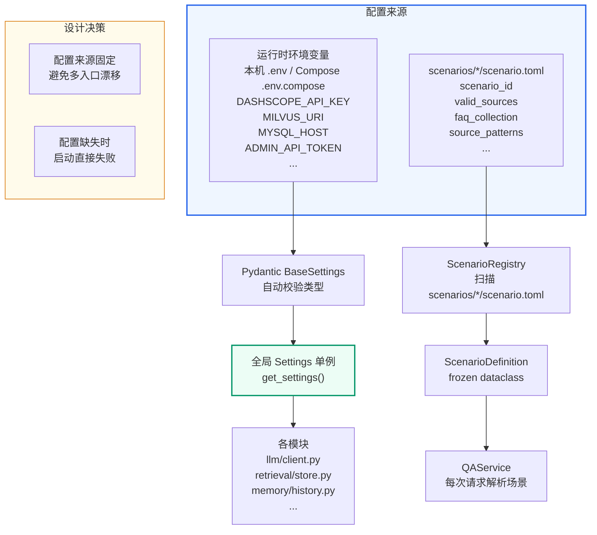
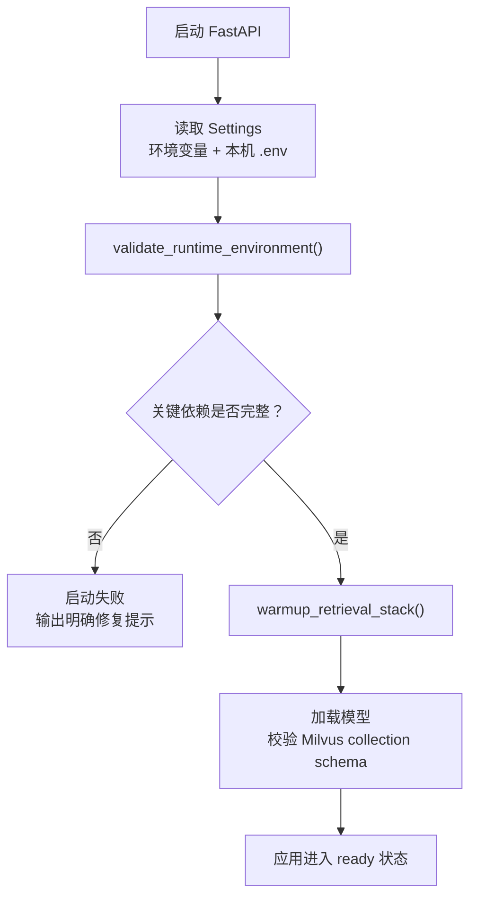
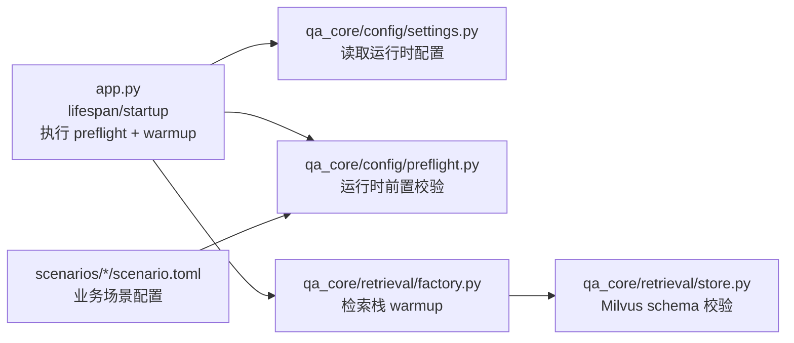

# 应用入口与启动校验
<Badge icon="clock" color="green">Written: 2026.06</Badge>
> 第 13 章跟敲代码：`codealong/chapters/ch13_preflight_checks`。
> 这部分代码是本章跟敲版，用来先跑通核心闭环；完整项目源码仍以本讲后文标注的 `qa_core/`、`scripts/` 等路径为准。

**上一讲**：[FastAPI 与异步 Web 框架](/RAG/pipeline/fastapi-asynchronous-service)  
**下一讲**：[知识库多版本管理](/RAG/production/kb-versioning)

> ## 本讲定位
>
> 前 9 讲你一直在用 `app.py` 启动项目，但可能没有逐行理解过它。`app.py` 是整个系统的入口——它负责在接收第一个请求之前，验证 LLM 是否可达、Milvus 是否在线、模型文件是否存在、知识库是否有 active 版本。任何一项不满足，进程直接退出，不做"降级启动"。
>
> 这个设计选择很关键：它保证了系统不会在运行时出现"咦，怎么某个功能坏了"的诡异问题。本讲拆解这个设计。

## 本讲目标

- 理解 FastAPI 应用的完整启动流程
- 掌握环境前置校验（Preflight Check）的设计模式
- 理解为什么本项目"不允许降级启动"
- 读懂 app.py 的每一行代码

---

## 第一部分：前置知识 — 软件的"启动校验"模式

### 1.1 什么是 Preflight Check

**Preflight Check（前置校验）** 来源于航空术语，指飞机起飞前的地面检查清单。在软件工程中，它指的是**在服务正式接受请求之前，验证所有关键依赖是否可用**。

类似地，当你开车前会检查油量、轮胎、灯光——你不会开到高速公路上才发现没油了。

### 1.2 为什么 Web 服务需要启动校验

考虑一个没有启动校验的服务：

```text
服务启动 → 页面正常打开 → 用户提问"入职流程" → Milvus 连不上 → 报错
                                    ↑
                            用户体验极差：页面看起来正常，实际不可用
```

这种"假启动"是生产环境中最危险的情况之一：
- 健康检查端点可能返回 200 OK
- 但核心业务链路根本没通电
- 等发现问题时已经影响了真实用户

**正确的做法**：在服务启动时，把核心依赖都检查一遍。缺了就**立即失败**，而不是假装一切正常。

### 1.3 启动校验 vs 运行时降级

| 方案 | 行为 | 优缺点 |
| --- | --- | --- |
| 启动校验（本项目采用） | 缺依赖→启动失败 | 问题暴露早，但要求环境完整 |
| 运行时降级（常见反模式） | 缺依赖→用到时才报错 | 看起来能启动，但不可靠 |
| 功能开关 | 缺依赖→关闭相关功能 | 适合大规模分布式系统，不适合当前项目 |

本项目选择启动校验是因为当前运行环境是可控的。系统应该先确认完整环境再启动，而不是在一个半残的环境里排查奇怪的问题。

---

## 第二部分：app.py 逐行详解

### 2.1 完整代码

```python
# app.py — KnowForge RAG Platform 的 FastAPI 应用入口
#
# 本文件现在只负责四件事：
# 1. 创建 FastAPI 应用
# 2. 配置 CORS 和静态资源
# 3. 启动时执行必需环境校验和检索栈预热
# 4. 注册 qa_core.api 下拆分后的路由
#
# 为什么要保持入口文件很薄：
# - app.py 是服务启动点，不应该继续堆 HTTP、WebSocket、管理接口和 RAG 细节
# - 接口按页面、聊天、管理、知识库版本拆分后，后续二期 Agent 增加路由时
#   不会污染一期 RAG 主链路
# - 入口越薄，越容易确认当前项目没有旧链路、没有技术降级路径、
#   没有隐藏旁路

from __future__ import annotations

import asyncio
import os

from fastapi import FastAPI
from fastapi.middleware.cors import CORSMiddleware
from fastapi.staticfiles import StaticFiles
import uvicorn

from qa_core.api import admin, chat, kb_versions, pages
from qa_core.config.logging_config import get_logger
from qa_core.config.preflight import validate_runtime_environment
from qa_core.config.settings import get_settings
from qa_core.retrieval.factory import warmup_retrieval_stack
```

### 2.2 应用实例创建

```text
settings = get_settings()
logger = get_logger(__name__)

app = FastAPI(
    title="多场景知识问答教学平台 API",
    description="LangChain + Milvus Hybrid 多场景智能问答系统"
)
```

**`get_settings()`** 是一个全局配置单例，返回一个 `Settings` 对象。它使用 Pydantic 的 `BaseSettings`，优先读取进程环境变量；本机 API 调试时，再读取项目根目录下的 `.env` 作为本地配置文件。Docker Compose 模式下，`.env.compose` 由 Compose 注入到 API 容器的进程环境变量里，`Settings` 本身不直接读取 `.env.compose`：

> **前置知识**：如果你不熟悉 Pydantic BaseSettings，请先阅读 [附录A：Pydantic 数据校验](/RAG/appendix/pydantic)

```python
# qa_core/config/settings.py — Settings 部分字段示例
class Settings(BaseSettings):
    llm_api_key: str = ""
    milvus_uri: str = "http://localhost:19530"
    mysql_host: str = "localhost"
    mysql_port: int = 3306
    embedding_model_path: str = str(PROJECT_ROOT / "models" / "bge-m3")
    reranker_model_path: str = "models/bge-reranker-large"
    admin_api_token: str = ""
    active_kb_version: str = ""
    active_scenario_id: str = "enterprise_knowledge"
    api_rate_limit_per_minute: int = 120
    # ... 还有更多字段

    model_config = SettingsConfigDict(
        env_file=str(PROJECT_ROOT / ".env"),
        env_file_encoding="utf-8",
        extra="ignore",
    )
```

### 2.3 CORS 中间件配置

```text
# 当前前端和 API 默认同源部署，但保留 CORS 配置是为了方便本地调试：
# 例如单独启动 Vite/React 页面时，只需要在本机 .env 中追加允许来源即可。
app.add_middleware(
    CORSMiddleware,
    allow_origins=settings.cors_allow_origins,
    allow_credentials=True,
    allow_methods=["GET", "POST", "DELETE", "OPTIONS"],
    allow_headers=["*"],
)
```

理解重点：
- `allow_origins`：生产环境应该设置为具体的域名列表，而非 `["*"]`
- `allow_credentials=True`：允许前端携带 Cookie/Authorization Header
- 本项目前后端同源部署在 8000 端口，CORS 主要是为本地开发场景保留

### 2.4 静态资源挂载

```text
os.makedirs("static", exist_ok=True)
app.mount("/static", StaticFiles(directory="static"), name="static")
```

`app.mount()` 将一个完整的子应用挂载到路由前缀。这里把 `static/` 目录挂载到 `/static` 路径，所以：
- `static/index.html` → `http://127.0.0.1:8000/static/index.html`
- `static/css/base.css` → `http://127.0.0.1:8000/static/css/base.css`

### 2.5 启动事件

```python
@app.on_event("startup")
async def warmup_runtime() -> None:
    """服务启动时执行前置校验，并预热本地检索模型和 Milvus 连接。

    当前项目的环境是必需前置条件：LLM Key、Milvus、MySQL、本地模型、场景配置和
    active 知识库版本缺失时，服务直接启动失败。这样可以避免页面看似能打开，但真正
    提问时才发现核心链路没有通电。
    """
    summary = validate_runtime_environment()
    logger.info("Runtime preflight passed: %s", summary)
    await asyncio.to_thread(warmup_retrieval_stack)
```

启动时做了两件事：

1. **`validate_runtime_environment()`**：逐个检查所有前置条件，任何一个不满足就抛 `RuntimeError`，FastAPI 会阻止服务启动。
2. **`warmup_retrieval_stack()`**：预热全部 8 个场景的 FAQ 和文档 Milvus Collection。这个操作是同步的（涉及模型加载和网络连接），用 `asyncio.to_thread` 放到线程池执行。

### 2.6 路由注册

```text
app.include_router(pages.router)       # 页面渲染、健康检查、会话创建、场景列表
app.include_router(chat.router)        # 问答、历史、反馈、检索诊断
app.include_router(admin.router)       # 管理接口（trace、报告、bad case）
app.include_router(kb_versions.router) # 知识库版本查看、激活、归档
```

### 2.7 启动入口

```bash
if __name__ == "__main__":
    uvicorn.run("app:app", host="0.0.0.0", port=8000, reload=False)
```

`reload=False` 是因为生产环境不需要热重载。本地调试时可以加 `--reload` 参数。

---

## 第三部分：环境前置校验详解

### 3.1 校验清单

`validate_runtime_environment()` 在 `qa_core/config/preflight.py` 中实现，按以下顺序检查：

> **与 Lecture 01 (2.3 部署架构) 的流程图对应关系**：步骤 1-8 覆盖了 Lecture 01 中展示的各项依赖校验（API Key、模型文件、Milvus/MySQL 可达性）。**步骤 9-11 是本项目额外增加的深层校验**——MySQL TCP 连通性（区别于 Milvus 的独立检查）、LLM 真实连通性（发送测试请求而非仅检查 Key 格式）、以及 Active 知识库版本存在性（确保上线时的知识库版本已就绪）。

```text
1.  LLM API Key 是否配置（非占位符）
2.  Admin Token 是否配置（非占位符）
3.  Embedding 模型目录是否存在
4.  Reranker 模型目录是否存在
5.  场景配置目录是否存在
6.  活跃场景文档目录是否存在
7.  活跃场景 FAQ 文件是否存在
8.  Milvus TCP 可达性
9.  MySQL TCP 可达性
10. LLM 真实连通性（发送测试请求）
11. Active 知识库版本是否存在
```

### 3.2 占位符检测

```python
PLACEHOLDER_VALUES = {"", "replace-with-real-key", "replace-with-random-token",
                      "changeme", "change-me"}

def _is_placeholder(value: str | None) -> bool:
    """判断配置值是否为空或仍是示例占位符。"""
    normalized = str(value or "").strip()
    return normalized.lower() in PLACEHOLDER_VALUES
```

这是为了防止忘记修改环境模板中的示例值。Docker Compose 模式检查 `.env.compose` 注入到容器里的值，本机 API 调试模式检查 `.env` 中的值。如果 API Key 还是 `replace-with-real-key`，系统会直接拒绝启动并给出明确的错误信息。

### 3.3 TCP 连接校验

```python
def _require_tcp(name: str, host: str, port: int, timeout: float = 3.0) -> None:
    """校验 TCP 端口可连接。

    这里只做连接性检查，不做业务读写。真实集合、表结构和模型预热会在后续
    warmup 中完成。把端口检查放在这里，是为了让"服务没启动"这类基础问题
    在最早阶段暴露。
    """
    try:
        with socket.create_connection((host, port), timeout=timeout):
            return
    except OSError as exc:
        raise RuntimeError(
            f"{name} 不可连接：{host}:{port}。请先启动必需环境。"
        ) from exc
```

只检查 TCP 端口是否可以建立连接（相当于 `telnet host port`），不进行业务读写。这是最快速的检查方式：
- 如果 Milvus 没启动，不用等到查询时才报错
- 如果 MySQL 没启动，不用等到写入历史时才报错

### 3.4 路径校验

```python
def _require_path(name: str, raw_path: str) -> None:
    """校验本地目录或文件存在。"""
    path = Path(raw_path)
    if not path.exists():
        raise RuntimeError(f"{name} 不存在：{path}")
```

用于检查模型目录（`models/bge-m3`、`models/bge-reranker-large`）、场景文档目录、FAQ CSV 文件等本地资源。

### 3.5 Milvus URI 校验

```text
def _require_milvus_uri() -> None:
    """校验 Milvus URI 格式和 TCP 可达性。"""
    settings = get_settings()
    parsed = urlparse(settings.milvus_uri)  # 解析 http://127.0.0.1:19530
    host = parsed.hostname
    port = parsed.port or 19530  # 默认端口
    if not host:
        raise RuntimeError(f"MILVUS_URI 无效：{settings.milvus_uri}")
    _require_tcp("Milvus", host, port)
```

先检查 URI 格式是否合法，再检查主机和端口是否可达。

### 3.6 LLM 连通性验证

```text
# qa_core/llm/client.py
def validate_llm_connectivity():
    """发送一个最小请求验证 LLM API Key 和网络连通性。

    不是所有启动校验都是简单的 TCP 连接。LLM API 是 HTTP 服务，
    需要在应用层验证 API Key 是否有效、余额是否充足、网络是否可达。
    """
    model = get_chat_model(streaming=False)
    response = model.invoke("ping")  # 发送测试请求
    # 如果 API Key 无效、欠费或网络不通，这里会直接抛异常
```

### 3.7 Active 知识库版本校验

```text
version_store = get_kb_version_store(scenario.scenario_id)
try:
    active_version = version_store.resolve_active_version()
except ValueError as exc:
    raise RuntimeError(
        f"{exc}。请先执行入库并激活版本，例如 "
        "scripts/rebuild_kb_version.py --new-version --force --activate。"
    ) from exc
```

如果没有任何版本被激活，给出明确的命令行建议。这比"集合不存在"这种底层错误信息友好得多。

### 3.8 校验结果

校验通过后返回一个摘要字典，既有场景信息、也有环境配置信息：

```text
return {
    "scenario_id": "enterprise_knowledge",
    "scenario_name": "企业内部知识助手",
    "milvus_uri": "http://127.0.0.1:19530",
    "mysql": "127.0.0.1:3306/subjects_kg",
    "embedding_model_path": "models/bge-m3",
    "reranker_model_path": "models/bge-reranker-large",
    "active_kb_version": "kb_enterprise_knowledge_20260506_103000_9f2a1b3c",
    "available_scenarios": ["compliance_qa", "cross_border_risk", ...]
}
```

---

## 第四部分：检索栈预热

### 4.1 为什么需要预热

BGE-M3 Embedding 模型和 Milvus 的连接初始化都有首次访问延迟：

- **模型加载**：BGE-M3 模型文件约 2GB，首次加载需要 5-15 秒
- **Milvus 连接**：首次创建 Collection 对象需要获取 schema 信息

如果不在启动时预热，**第一个提问的用户将承受所有这些延迟**。

### 4.2 warmup\_retrieval\_stack() 实现

```python
# qa_core/retrieval/factory.py
def warmup_retrieval_stack():
    """预热全部已冻结场景的 FAQ 和文档 Collection。

    这里不发送检索请求，只确保：
    1. BGE-M3 Embedding 模型已加载到内存
    2. BGE Reranker 模型已加载到内存
    3. 每个场景的 FAQ store 和 doc store 已完成 Milvus 连接
    """
    from qa_core.scenarios.registry import get_scenario_registry

    for scenario in get_scenario_registry().list_scenarios():
        # 逐个场景预热
        get_faq_store(scenario_id=scenario.scenario_id)
        get_doc_store(scenario_id=scenario.scenario_id)
```

### 4.3 为什么用 asyncio.to\_thread 包裹

```text
# app.py
await asyncio.to_thread(warmup_retrieval_stack)
```

`warmup_retrieval_stack()` 内部有：
1. 磁盘 I/O（读取模型文件）
2. CPU 密集操作（加载模型到内存）
3. 网络 I/O（连接 Milvus）

这些都是阻塞操作。如果直接在主线程中执行，会阻塞整个事件循环。`asyncio.to_thread` 将这些操作放到线程池中，启动过程不阻塞其他异步任务的执行。

---

## 第五部分：配置管理体系

### 5.1 配置来源



**配置来源的架构解读**：这张图展示了项目的两条配置通道，它们在职责上有明确的分工：

**左路：运行时环境变量通道（`环境变量 / .env → Settings → 各模块`）**

运行时环境变量存放的是"这个服务怎么跑"的基础设施配置——LLM API Key、Milvus 地址、MySQL 连接串、Admin Token、模型路径。本机 API 调试时，这些值来自 `.env`；Docker Compose 运行时，这些值来自 `.env.compose` 注入到容器的环境变量。这些值的特点是：

- **全局唯一**：不管切换到哪个业务场景，Milvus 地址和 LLM Key 都不会变
- **启动即加载**：通过 Pydantic BaseSettings 在应用启动时一次性读取并校验类型（端口号必须是 int、API Key 不能是占位符）
- **全局单例访问**：任何模块需要基础设施配置时，调用 `get_settings()` 就能拿到同一个 Settings 实例，避免多处解析环境变量导致不一致

**右路：场景配置通道（`scenario.toml → ScenarioRegistry → QAService`）**

`scenarios/*/scenario.toml` 存放的是"这个场景的业务是什么"的领域配置——scenario\_id、valid\_sources、FAQ collection 名称、source\_patterns。这些值的特点是：

- **按场景变化**：`enterprise_knowledge` 的 sources 是 `["hr_process", "it_policy"]`，`compliance_qa` 的 sources 是 `["privacy", "audit", "contract"]`
- **启动时扫描**：ScenarioRegistry 在启动时遍历 `scenarios/` 目录，把所有 `scenario.toml` 解析成 `ScenarioDefinition`（frozen dataclass，创建后不可变）
- **每次请求时解析**：QAService 根据用户请求中的 `scenario_id`，从 Registry 中取出对应的 ScenarioDefinition，注入到后续的检索过滤和 Prompt 选择中

**为什么分成两条通道？**

环境变量和场景配置的变更节奏完全不同——API Key 一旦配好可能几个月不动，但场景配置（新增 source、调整 source\_patterns）是日常运营工作。如果把业务配置也塞进运行时环境变量，每次加一个 source 就要改环境变量、重启服务，运维成本极高。分成两条通道后，改场景配置只需要编辑 TOML 文件然后重启（不需要接触敏感的环境变量）。

**设计决策框的落实**：图中右下角标注了"配置来源固定"和"配置缺失时启动直接失败"。前者把配置入口收敛到“运行时环境变量”和 `scenario.toml` 两条通道，后者由 preflight check 在启动时强制执行——详见本讲第四部分。

### 5.2 运行时环境变量中的必需配置项

运行时环境变量有两个模板，不再提供通用 `.env.example`：

| 运行模式 | 模板 | 实际配置 | 地址视角 |
| --- | --- | --- | --- |
| Docker Compose | `.env.compose.example` | `.env.compose` | API 在容器内，使用 `mysql`、`milvus`、`/app/models/...` |
| 本机 API 调试 | `.env.local.example` | `.env` | API 在宿主机，使用 `localhost`、`models/...` |

| 配置项 | 用途 | 缺失后果 |
| --- | --- | --- |
| `DASHSCOPE_API_KEY` | LLM API Key | 启动失败 |
| `ADMIN_API_TOKEN` | 管理接口认证令牌 | 启动失败 |
| `MILVUS_URI` | Milvus 连接地址 | 启动失败 |
| `MYSQL_HOST` / `MYSQL_PORT` | MySQL 连接 | 启动失败 |
| `EMBEDDING_MODEL_PATH` | BGE-M3 模型路径 | 启动失败 |
| `RERANKER_MODEL_PATH` | Reranker 模型路径 | 启动失败 |
| `ACTIVE_KB_VERSION` | 默认知识库版本 | 启动失败（如版本清单也无 active） |
| `ACTIVE_SCENARIO_ID` | 默认业务场景 | 可选，缺失用第一个场景 |

### 5.3 当前配置边界

当前版本的配置边界非常明确：所有基础设施配置只从运行时环境变量读取，所有业务场景配置只从 `scenario.toml` 读取。

**为什么坚持两条配置通道？**
- 环境变量是云原生部署的标准做法
- TOML 更适合表达场景包中的结构化配置，例如 source 列表、collection 名称和文档匹配规则
- 配置来源固定以后，排查问题时只需要检查两处，不会被额外配置入口分散注意力

---

## 本讲实践闭环

| 项目 | 内容 |
| --- | --- |
| 本讲类型 | 系统集成 |
| 实践产物 | `app.py` 生命周期、preflight check、检索栈 warmup |
| 是否进入最终项目 | 是 |
| 验收方式 | 故意缺关键配置时启动失败，配置完整时启动成功 |
| 后续落点 | 第 19 讲生产启动和事故排查 |

通过标准：系统不会在 LLM、Milvus、MySQL、模型或 active 版本缺失时带病启动。

### 本讲从 0 到 1 实现闭环

这一讲要建立“服务不能带病启动”的工程习惯。实现顺序如下：



1. 先用 `Settings` 统一读取运行时环境变量，所有基础设施配置从这里进入系统。
2. 再写 `validate_runtime_environment()`，逐项检查 LLM、Milvus、MySQL、模型目录、场景和 active 版本。
3. 然后在 `app.py` 的生命周期里执行 preflight，失败就让服务启动失败。
4. 最后执行检索栈 warmup，提前加载模型和检查 Milvus collection schema。

实现完成后，相关代码结构应该是下面这张图：



来源：真实代码节选，见 `qa_core/config/settings.py`。

```python
class Settings(BaseSettings):
    active_scenario_id: str = "enterprise_knowledge"
    milvus_uri: str
    mysql_host: str
    embedding_model_path: str
    reranker_model_path: str
```

Preflight 不只是检查“变量有没有值”，还要按顺序检查占位符、本地路径、网络依赖和 active 版本。这个顺序可以避免“数据库都没连上却提示版本不存在”这类误导性错误。

来源：真实代码逻辑压缩版，对应 `qa_core/config/preflight.py::validate_runtime_environment()`。

```text
def validate_runtime_environment() -> dict[str, object]:
    settings = get_settings()
    registry = get_scenario_registry()
    scenario = resolve_scenario(settings.active_scenario_id)

    if _is_placeholder(settings.llm_api_key):
        raise RuntimeError("DASHSCOPE_API_KEY 未配置。")
    if _is_placeholder(settings.admin_api_token):
        raise RuntimeError("ADMIN_API_TOKEN 未配置。")

    _require_path("Embedding 模型目录", settings.embedding_model_path)
    _require_path("Reranker 模型目录", settings.reranker_model_path)
    if not Path(settings.scenario_config_dir).exists():
        raise RuntimeError("SCENARIO_CONFIG_DIR 不存在")
    if scenario.scenario_id not in {item.scenario_id for item in registry.list_scenarios()}:
        raise RuntimeError("ACTIVE_SCENARIO_ID 无效")
    _require_path("场景文档目录", scenario.data_root)
    _require_path("场景 FAQ 文件", scenario.faq_csv_path)

    _require_milvus_uri()
    _require_tcp("MySQL", settings.mysql_host, settings.mysql_port)
    validate_llm_connectivity()

    active_version = get_kb_version_store(scenario.scenario_id).resolve_active_version()
    return {"scenario_id": scenario.scenario_id, "active_kb_version": active_version}
```

入口文件只负责组织生命周期，不把校验细节写在 `app.py` 里。

来源：真实代码调用点，见 `app.py`。

```python
@app.on_event("startup")
async def warmup_runtime():
    validate_runtime_environment()
    await asyncio.to_thread(warmup_retrieval_stack)
```

检索栈 warmup 的价值是把 schema 不匹配、collection 缺失、模型路径错误提前暴露，而不是等用户提问时才炸。

来源：真实代码调用点，见 `qa_core/retrieval/factory.py::warmup_retrieval_stack()`。

```text
def warmup_retrieval_stack():
    collection_name = current_scenario().faq_collection
    _ = get_hybrid_store(collection_name).store
```

闭环验证重点：

| 验证项 | 验证方式 | 期望结果 |
| --- | --- | --- |
| 缺 API Key | 使用占位配置启动 | 启动失败并提示修复 |
| 模型路径缺失 | 改错模型目录 | 启动失败 |
| Milvus/MySQL 不通 | 停止依赖服务 | preflight 拒绝启动 |
| active 版本缺失 | 未初始化知识库 | 明确提示先重建知识库 |
| schema 不兼容 | 旧 collection | warmup 阶段暴露错误 |
| 场景配置缺失 | 删除场景目录或 FAQ | 启动失败并指出缺失路径 |
| LLM 不可用 | Key 错误或网络失败 | 启动阶段失败，不等用户请求 |

验收重点：系统必须“配置完整才启动”，不能静默降级到不可控状态。启动失败时，错误信息要能指向明确修复动作。

## 重点掌握

| 优先级 | 内容 | 原因 |
| --- | --- | --- |
| ★★★ 必会 | Preflight Check 的概念：服务启动时校验所有核心依赖，缺失即失败 | 防止"假启动"（页面能打开但核心链路不通），面试常问 |
| ★★★ 必会 | validate\_runtime\_environment() 的 11 项校验清单（API Key → 模型目录 → TCP 连通性 → LLM 连通性 → Active 版本） | 启动校验链的具体实现 |
| ★★★ 必会 | app.py 极薄入口：只做创建应用、CORS、静态资源、预热、路由注册五件事 | 入口文件的设计哲学 |
| ★★ 理解 | 配置管理体系：运行时环境变量（基础设施配置，全局唯一） vs scenario.toml（业务配置，按场景变化） | 理解两条配置通道的职责分工 |
| ★★ 理解 | warmup\_retrieval\_stack() 预热模型和 Milvus 连接，避免冷启动 | 用户体感优化，面试常见问题 |
| ★★ 理解 | asyncio.to\_thread 将阻塞操作放到线程池 | 异步编程中的关键模式 |
| ★ 了解 | \_is\_placeholder() 占位符检测 | 防呆设计 |
| ★ 了解 | 配置边界：基础设施配置来自运行时环境变量，业务配置来自 scenario.toml | 了解设计原则即可 |

## 本讲小结

- **Preflight Check** 在服务启动时验证所有关键依赖，缺失即失败，避免"假启动"
- **app.py** 保持极薄：创建应用 + CORS + 静态资源 + 启动预热 + 路由注册，总共不到 80 行
- **启动校验链** 覆盖 LLM Key、模型目录、Milvus/MySQL 连通性、场景配置和知识库版本
- **检索栈预热** 在启动时加载模型和建立连接，避免首个用户承受冷启动延迟
- 配置来源统一为运行时环境变量 + `scenario.toml`，环境配置和业务场景配置各自负责一类问题

**下一讲**：[知识库多版本管理](/RAG/production/kb-versioning) — 版本状态机、激活/回滚、版本清单设计