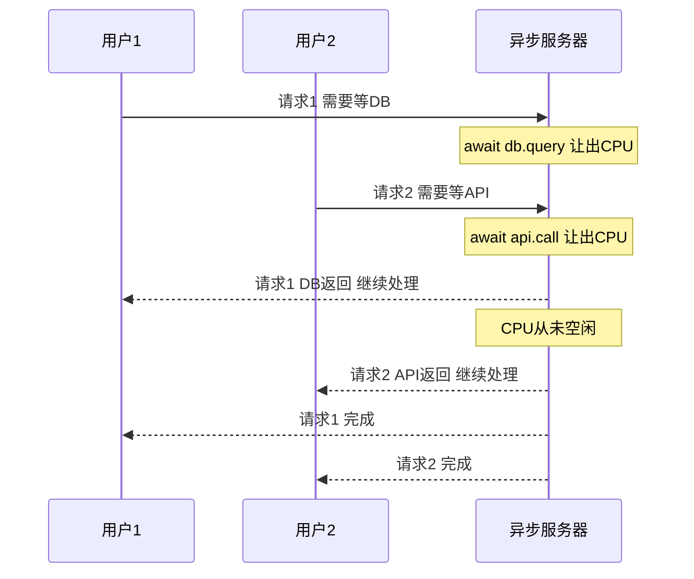
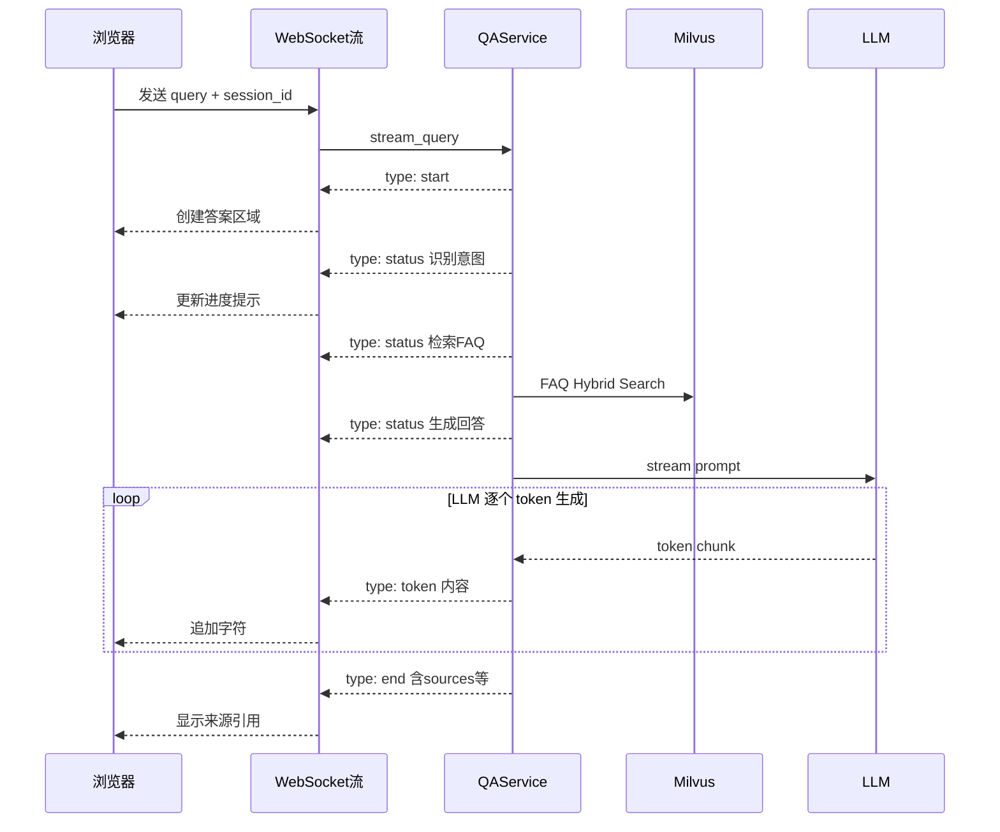
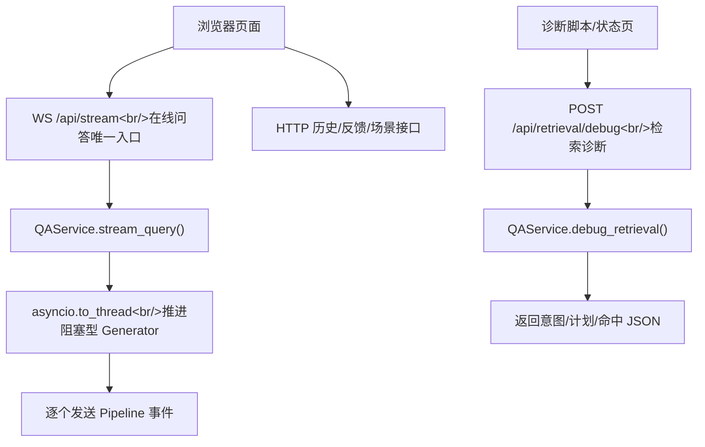
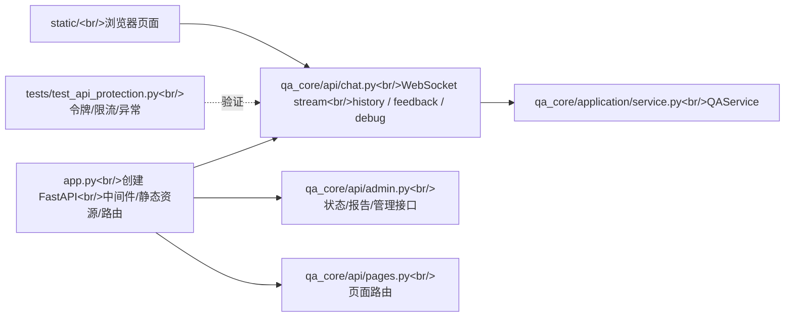

# FastAPI 异步服务
<Badge icon="clock" color="green">Written: 2026.06</Badge>
> 第 12 章跟敲代码：`codealong/chapters/ch12_fastapi_service`。
> 这部分代码是本章跟敲版，用来先跑通核心闭环；完整项目源码仍以本讲后文标注的 `qa_core/`、`scripts/` 等路径为准。

**上一讲**：[Prompt 工程与 Profile 系统](/RAG/pipeline/prompt-engineering)
**下一讲**：[应用入口与环境前置校验](/RAG/pipeline/app-entry-preflight)

> ## 本讲定位
>
> P0 主链路(第 3-11 讲)你已经学完了 LangChain 和完整的 RAG 管线。接下来两讲(本讲 + 第 13 讲)进入 Web 服务基础设施——理解整个项目运行在什么"骨架"上。
>
> 本讲先讲 FastAPI 框架本身(async/await、路由、WebSocket)，第 13 讲再讲基于 FastAPI 的应用入口和启动校验。学完这两讲，你对第 9-10 讲(QAService、Pipeline)中用到的 `async def`、`yield`、WebSocket 事件推送将有透彻理解。

## 1. 本讲目标

- 理解同步 vs 异步编程在 Web 服务中的区别
- 掌握 FastAPI 的核心概念：路由、中间件、依赖注入
- 理解 WebSocket 协议及其在流式输出中的应用
- 读懂本项目的 API 层代码

---

## 2. 前置知识 — 同步 vs 异步

### 2.1 传统同步 Web 服务的瓶颈

假设一个 Web 服务收到一个请求，需要做三件事：

```text
请求 → 查数据库(100ms) → 调外部API(200ms) → 查Milvus(150ms) → 返回
```

在传统的同步模型(如 Flask 默认模式)中：

```text
时间线(3个请求先后到达)：
Req1: [===查DB===][===调API===][===查Milvus===]         (450ms)
Req2:                                            [===查DB===][===调API===][===查Milvus===] (450ms)
Req3:                                                                                     [===等...===]
```

每个请求必须等前一个请求完全处理完才开始。当有 100 个并发请求时，第 100 个用户要等 45 秒。

这是因为同步模型用**线程**处理并发，每个请求占用一个线程。当线程在等数据库返回时，它什么也不做，只是"阻塞"在那里。

### 2.2 异步(Async)模型

异步模型的核心思想：当一个操作在等待时(如等待数据库返回)，切换到处理另一个请求。

```mermaid
gantt
    title 同步 vs 异步请求处理对比
    dateFormat X
    axisFormat %s

    section 同步模式 3线程
    Req1-等待DB :r1a, 0, 100
    Req1-等待API:r1b, 100, 200
    Req1-等待Milvus:r1c, 200, 300
    Req2-等待DB :r2a, 300, 400
    Req2-等待API:r2b, 400, 500
    Req2-等待Milvus:r2c, 500, 600
    Req3-等待DB :r3a, 600, 700
    Req3-等待API:r3b, 700, 800
    Req3-等待Milvus:r3c, 800, 900

    section 异步模式 事件循环
    Req1-DB :e1a, 0, 40
    Req2-DB :e2a, 40, 80
    Req3-DB :e3a, 80, 120
    Req1-API:e1b, 120, 160
    Req2-API:e2b, 160, 200
    Req3-API:e3b, 200, 240
    Req1-Milvus:e1c, 240, 280
    Req2-Milvus:e2c, 280, 320
    Req3-Milvus:e3c, 320, 360
```





```python
# 同步写法
def get_user(id):
    result = db.query("SELECT * FROM users WHERE id = ?", id)  # 阻塞在这里
    return result

# 异步写法
async def get_user(id):
    result = await db.query("SELECT * FROM users WHERE id = ?", id)  # await = 可以切换
    return result
```

`await` 关键字的意思是："这个操作需要等待，我先让出 CPU 去处理其他请求，等结果回来了再继续执行"。

```text
时间线(3个请求在异步模型中)：
Req1: [查DB][     ][调API][     ][查Milv][     ]
Req2:      [查DB][     ][调API][     ][查Milv]
Req3:           [查DB][     ][调API][     ][查Milv]
                    ↑ CPU 在等待间隙处理其他请求
```

所有请求的总完成时间大幅缩短。因为服务器在等待 I/O 的时候不会闲着。

### 2.3 async/await 核心语法

```python
# async def 定义一个协程函数
async def fetch_data(url):
    # await 等待一个可等待对象(协程、Task、Future)
    response = await http_client.get(url)
    return response.json()

# 在 async 函数内部才能用 await
async def main():
    data = await fetch_data("https://api.example.com")
    print(data)

# 运行方式
import asyncio
asyncio.run(main())
```

**关键区别**：

| 同步 | 异步 |
| --- | --- |
| `def func()` | `async def func()` |
| `requests.get(url)` | `await httpx.AsyncClient().get(url)` |
| `time.sleep(1)` | `await asyncio.sleep(1)` |
| 多线程处理并发 | 单线程事件循环处理并发 |

### 2.4 为什么 RAG 系统需要异步

RAG 系统是典型的 **I/O 密集型** 应用：

- 查 Milvus(网络 I/O)
- 调 LLM API(网络 I/O)
- 读 MySQL 历史(网络 I/O)
- 读 Embedding 模型文件(磁盘 I/O)
- 计算 Embedding(CPU 密集型，用 `asyncio.to_thread` 放到线程池)

这些操作中，大部分时间都在等待外部系统响应。异步模型可以让服务器在等待期间处理其他用户的请求。

---

## 3. FastAPI 基础

### 3.1 FastAPI 是什么

FastAPI 是一个现代 Python Web 框架，专为构建 API 设计。它的核心特点：

1. **原生异步支持**：直接使用 `async/await`，不依赖第三方层
2. **自动生成 OpenAPI 文档**：访问 `/docs` 即可看到 Swagger UI
3. **基于 Pydantic 的数据校验**：请求和响应自动校验类型
4. **WebSocket 支持**：内置双向通信协议

### 3.2 最小 FastAPI 应用

```python
from fastapi import FastAPI

app = FastAPI(title="我的 API")

@app.get("/hello")
async def hello():
    return {"message": "Hello World"}

@app.get("/items/{item_id}")
async def read_item(item_id: int, q: str = None):
    return {"item_id": item_id, "q": q}

# 运行：uvicorn main:app --reload
```

### 3.3 路由(Router)

当 API 变多时，把所有端点写在 `app.py` 会导致文件很长。FastAPI 提供了 `APIRouter` 来做模块化拆分：

```python
# qa_core/api/chat.py
from fastapi import APIRouter
router = APIRouter()

@router.websocket("/api/stream")
async def websocket_endpoint(websocket: WebSocket):
    ...

@router.get("/api/history/{session_id}")
async def get_history(session_id: str):
    ...
```

```python
# app.py — 注册路由
from qa_core.api import chat, admin, pages, kb_versions

app.include_router(pages.router)
app.include_router(chat.router)
app.include_router(admin.router)
app.include_router(kb_versions.router)
```

### 3.4 Pydantic 数据校验

> **前置知识**：如果你不熟悉 Pydantic，请先阅读 [附录A：Pydantic 数据校验](/RAG/appendix/pydantic)

FastAPI 使用 Pydantic 模型做请求/响应的自动校验。当前项目里，在线问答只走 WebSocket payload；HTTP 请求模型只保留给检索诊断接口：

```python
from pydantic import BaseModel, Field

class RetrievalDebugRequest(BaseModel):
    """POST /api/retrieval/debug 的请求体。"""

    query: str = Field(..., min_length=1)
    session_id: str | None = None
    scenario_id: str | None = None
    source_filter: str | None = None
    tenant_id: str | None = None
    dataset_id: str | None = None
    visibility: str | None = None
    user_role: str | None = None
    user_roles: list[str] = Field(default_factory=list)
    kb_version: str | None = None

# FastAPI 会自动：
# 1. 检查 query 最短为 1 个字符
# 2. 把 JSON 中的字段映射到对象属性
# 3. 如果缺少必填字段或类型不对，返回 422 错误(附带清晰的错误信息)
```

设计口径：不要再为在线问答保留单独的 HTTP 请求模型。浏览器提问直接连 `WebSocket /api/stream`，检索诊断才使用 `RetrievalDebugRequest`。

### 3.5 CORS 中间件

```python
from fastapi.middleware.cors import CORSMiddleware

app.add_middleware(
    CORSMiddleware,
    allow_origins=settings.cors_allow_origins,
    allow_credentials=True,
    allow_methods=["GET", "POST", "DELETE", "OPTIONS"],
    allow_headers=["*"],
)
```

**CORS(跨域资源共享)** 是浏览器的安全机制。默认情况下，`http://localhost:3000` 上的前端页面不能请求 `http://localhost:8000` 的 API。CORS 中间件告诉浏览器哪些来源被允许跨域访问。

### 3.6 启动事件与依赖注入

```python
# 启动事件：服务启动时执行一次
@app.on_event("startup")
async def warmup_runtime():
    validate_runtime_environment()  # 校验环境
    await asyncio.to_thread(warmup_retrieval_stack)  # 预热模型

# 依赖注入：在路由函数执行前注入共享资源
from fastapi import Depends

def require_admin_token(x_admin_token: str | None = Header(default=None)) -> None:
    ...

@router.get("/api/admin/langsmith")
async def get_langsmith_status(_=Depends(require_admin_token)):
    ...
```

**`asyncio.to_thread`** 的作用：把 CPU 密集或阻塞操作放到线程池中执行，避免阻塞事件循环。BGE-M3 模型加载和 Milvus 连接预热都是阻塞操作，但它们只在启动时执行一次，所以放到线程池中是最合适的做法。

---

## 4. WebSocket 协议

### 4.1 为什么需要 WebSocket

HTTP 协议是"请求-响应"模式：客户端发一个请求，服务端返回一个响应，通信就结束了。

RAG 系统的答案生成有个特点：**LLM 是一个 token 一个 token 生成的**。如果等完整答案生成完再返回，用户可能等 5-10 秒才能看到任何内容。

WebSocket 是**全双工通信协议**：建立连接后，服务端可以持续向客户端推送消息，不需要客户端反复请求。

### 4.2 HTTP vs WebSocket 对比

```yaml
HTTP:
  客户端 ──请求──→ 服务端
  客户端 ←──响应── 服务端
  (连接关闭，下次需要重新建立)

WebSocket:
  客户端 ──握手──→ 服务端
  客户端 ←──确认── 服务端
  客户端 ←──消息1─ 服务端  (逐 token 推送)
  客户端 ←──消息2─ 服务端
  客户端 ←──消息3─ 服务端
  ...
  客户端 ←──关闭── 服务端
```

### 4.3 本项目中的 WebSocket 实现

```python
# qa_core/api/chat.py — 简化的 WebSocket 流式问答

@router.websocket("/api/stream")
async def websocket_endpoint(websocket: WebSocket):
    await websocket.accept()  # 接受连接

    try:
        raw_data = await websocket.receive_text()  # 接收原始 JSON 字符串
        data = json.loads(raw_data)  # 手动解析 JSON
        service = get_qa_service()

        # stream_query 返回一个同步 Generator
        # asyncio.to_thread 把它放到线程池中执行
        # 每次 yield 生成一个事件，我们通过 WebSocket 发送
        generator = await asyncio.to_thread(
            lambda: service.stream_query(
                query=data["query"],
                session_id=data.get("session_id"),
                ...
            )
        )

        for event in generator:
            await websocket.send_json(event)  # 推送事件给前端

    except WebSocketDisconnect:
        pass  # 用户关闭页面，正常处理
```

### 4.4 流式事件协议

本项目定义了一套事件协议，主流程通过 Generator 产出不同事件：



```text
&#123;"type": "start", "session\_id": "..."&#125;
# ↓ 告知前端：请求已接收，准备展示答案区域

&#123;"type": "status", "message": "正在识别问题意图..."&#125;
# ↓ 告知前端：当前进行到哪一步了

&#123;"type": "token", "content": "入职"&#125;
&#123;"type": "token", "content": "流程"&#125;
&#123;"type": "token", "content": "包括"&#125;
# ↓ 逐字推送，前端实时渲染

&#123;"type": "end", "sources": [...], "intent": &#123;...&#125;, "retrieval": &#123;...&#125;&#125;
# ↓ 告知前端：回答完毕，附带来源引用和诊断信息

```
**设计要点**：
- `status` 事件让用户知道系统在做什么，不是卡住了
- `token` 事件让答案逐步出现，体验类似 ChatGPT
- `end` 事件携带诊断信息，方便前端展示"参考来源 X 条"、命中路径、耗时等

### 4.5 为什么用同步 Generator 而非异步 Generator

```python
# 本项目使用同步 Generator
def stream_query(...) -> Generator[dict, None, None]:
    yield &#123;"type": "status", ...&#125;
    # Milvus 检索(同步)
    # LLM 流式调用(同步)
    yield &#123;"type": "token", ...&#125;

# FastAPI 层用 asyncio.to_thread 包裹
generator = await asyncio.to_thread(lambda: service.stream_query(...))
```

原因：
1. LangChain 的 Milvus 检索和 ChatOpenAI 流式调用的底层是同步的
2. `asyncio.to_thread` 将整个同步流程放到线程池，不阻塞事件循环
3. 保持业务代码简洁，不需要在每一层都写 async/await

---

## 5. ：本项目 API 层详解

### 5.1 路由拆分架构

```text
app.py  ← 极薄入口：创建 FastAPI、CORS、静态资源、注册路由

qa_core/api/
├── pages.py       ← GET /, GET /admin, GET /health, POST /api/create_session
├── chat.py        ← WS /api/stream, GET /api/history/&#123;id&#125;,
│                     DELETE /api/history/&#123;id&#125;, POST /api/feedback,
│                     POST /api/retrieval/debug, GET /api/sources,
│                     GET /api/scenarios
├── admin.py       ← GET /api/admin/status, GET /api/admin/langsmith,
│                     GET /api/admin/ingestion_reports,
│                     GET /api/admin/kb_version_compare,
│                     GET /api/admin/gate_reports, GET /api/admin/performance_reports,
│                     GET /api/admin/enterprise_governance
└── kb_versions.py ← GET /api/kb_versions,
                      POST /api/kb_versions/&#123;kb_version&#125;/activate,
                      POST /api/kb_versions/&#123;kb_version&#125;/archive
```

### 5.2 在线问答唯一入口：WebSocket /api/stream

```python
@router.websocket("/api/stream")
async def websocket_endpoint(websocket: WebSocket):
    await websocket.accept()
    while True:
        raw_data = await websocket.receive_text()
        if not check_rate_limit(client_key(websocket)):
            await websocket.send_json(&#123;"type": "error", "error": "请求过于频繁，请稍后再试。"&#125;)
            continue

        request_data = json.loads(raw_data)
        context = QueryServiceContext.from_ws_payload(request_data)
        stream = get_qa_service().stream_query(*context.service_args())

        while True:
            has_event, event = await asyncio.to_thread(_next_stream_event, stream)
            if not has_event:
                break
            await websocket.send_json(event)
            if event.get("type") in &#123;"end", "error"&#125;:
                break
```

前端逻辑：

```js
const ws = new WebSocket(`$&#123;protocol&#125;//$&#123;window.location.host&#125;/api/stream`);
ws.onopen = () => ws.send(JSON.stringify(&#123; query, session_id, scenario_id, source_filter &#125;));
ws.onmessage = (message) => renderStreamEvent(JSON.parse(message.data));
```

**设计意图**：
- 在线问答只走一套连接、限流、事件协议和历史写入逻辑
- 问候、越界、转人工等直答在 Pipeline 意图识别阶段通过 WebSocket 事件返回
- FAQ 命中、文档检索、LLM 生成也沿用同一条事件链路，避免 HTTP 与 WebSocket 两套实现产生不一致

### 5.3 管理接口认证

```python
# qa_core/api/dependencies.py
from fastapi import Header, HTTPException

def require_admin_token(x_admin_token: str | None = Header(default=None)) -> None:
    """校验管理接口令牌。"""
    expected = settings.admin_api_token.strip()
    if not expected:
        raise HTTPException(status_code=500, detail="ADMIN_API_TOKEN 未配置")
    if x_admin_token != expected:
        raise HTTPException(status_code=401, detail="管理接口令牌无效")

# 使用
@router.get("/api/admin/langsmith")
async def get_langsmith_status(_=Depends(require_admin_token)):
    ...
```

前端状态页面提供令牌输入框，后端从 HTTP Header `X-Admin-Token` 中读取。命令行脚本默认从运行时配置读取令牌：本机调试来自 `.env`，Docker Compose 模式来自容器环境变量，避免把真实令牌写入终端历史。

### 5.4 限流保护

下面的滑动窗口示意图直观展示 `check_rate_limit` 的工作过程(limit=3，窗口=60 秒)：

```mermaid
gantt
    title 滑动窗口限流示例(limit=3，窗口=60秒)
    dateFormat  HH:mm:ss
    axisFormat  %M:%S

    section 窗口位置
    窗口① (t=0~60)  :crit, 00:00:00, 00:01:00
    窗口② (t=10~70)  :crit, 00:00:10, 00:01:00

    section 请求到达
    A @5s  接受  :milestone, 00:00:05, 0
    B @12s 接受  :milestone, 00:00:12, 0
    C @35s 接受  :milestone, 00:00:35, 0
    D @50s 拒绝  :milestone, 00:00:50, 0
    E @70s 接受  :milestone, 00:01:10, 0
    F @80s 接受  :milestone, 00:01:20, 0
```



横向为时间轴，窗口①和窗口②展示滑动前后的两个位置——窗口②比①向右滑动 10 秒。图中 A~F 依次到达，D 到达时 deque 中已有 3 个时间戳(已达上限)，因此被拒绝；t=70 时旧请求 A 过期弹出，释放空间后 E 得以加入。

| 时间 | 请求 | 操作 | deque 状态(左→右) | 窗口计数 | 结果 |
| --- | --- | --- | --- | --- | --- |
| t=5 | A | 追加 | [5] | 1 | 接受 |
| t=12 | B | 追加 | [5, 12] | 2 | 接受 |
| t=35 | C | 追加 | [5, 12, 35] | 3 | 接受 |
| t=50 | D | 不追加(已达上限 3) | [5, 12, 35] | 3 | 拒绝 |
| t=70 | E | 弹出 5 → 追加 70 | [12, 35, 70] | 3 | 接受 |
| t=80 | F | 弹出 12 → 追加 80 | [35, 70, 80] | 3 | 接受 |

关键：`while bucket and now - bucket[0] >= 60` 循环从 deque **左端**弹出超过 60 秒的旧时间戳，新请求追加到**右端**。达到上限时请求被拒绝，其时间戳 **不会** 加入 deque，避免恶意请求撑爆窗口。

```python
# qa_core/api/dependencies.py
import time
from collections import defaultdict, deque

RATE_BUCKETS: dict[str, deque[float]] = defaultdict(deque)

def client_key(scope: Request | WebSocket) -> str:
    """从 HTTP/WebSocket 连接中提取限流 key。"""
    client = getattr(scope, "client", None)
    if client and getattr(client, "host", None):
        return str(client.host)
    return "local"

def check_rate_limit(key: str) -> bool:
    """执行进程内滑动窗口限流。"""
    limit = max(int(settings.api_rate_limit_per_minute or 0), 0)
    if limit &lt;= 0:
        return True
    now = time.time()
    bucket = RATE_BUCKETS[key]
    while bucket and now - bucket[0] >= 60:
        bucket.popleft()
    if len(bucket) >= limit:
        return False
    bucket.append(now)
    return True

def enforce_http_rate_limit(request: Request) -> None:
    """HTTP 请求限流依赖，超限时返回 429。"""
    if not check_rate_limit(client_key(request)):
        raise HTTPException(status_code=429, detail="请求过于频繁，请稍后再试。")
```

---

## 6. 本讲实践闭环

| 项目 | 内容 |
| --- | --- |
| 本讲类型 | 系统集成 |
| 实践产物 | FastAPI 路由、WebSocket、静态页面挂载和异步桥接 |
| 是否进入最终项目 | 是 |
| 验收方式 | `/health`、聊天接口、WebSocket 和前端页面均可访问 |
| 后续落点 | 第 13 讲加入启动前置校验，第 19 讲用于生产部署 |

通过标准：API 层只负责协议转换和连接管理，核心 RAG 逻辑仍在 service/pipeline 层。

### 6.1 本讲从 0 到 1 实现闭环

这一讲把项目从“Python 模块能调用”变成“浏览器和接口能访问”。实现时按四层推进：



1. 在 `app.py` 创建 FastAPI 应用，只做路由注册、中间件、静态资源和生命周期。
2. 在 `qa_core/api/chat.py` 定义 WebSocket stream 接口，承载所有在线问答。
3. 在同一个路由模块里保留历史、反馈和检索诊断等真实 HTTP 接口。
4. 对阻塞型 RAG generator 使用线程桥接，避免卡住异步事件循环。

实现完成后，相关代码结构应该是下面这张图：



来源：真实代码调用点，见 `app.py`。

```python
app = FastAPI(title="KnowForge RAG Platform")
app.add_middleware(CORSMiddleware, allow_origins=settings.cors_origins)
app.include_router(chat_router, prefix="/api")
app.mount("/", StaticFiles(directory="static", html=True), name="static")
```

WebSocket 接口的职责很薄：保持连接、接收请求、逐个发送 service 事件。它不拼 Prompt、不检索、不重排。

来源：真实代码逻辑压缩版，对应 `qa_core/api/chat.py::websocket_endpoint()` 和 `_send_stream_events()`。

```python
@router.websocket("/api/stream")
async def websocket_endpoint(websocket: WebSocket):
    await websocket.accept()
    while True:
        raw_data = await websocket.receive_text()
        if not check_rate_limit(client_key(websocket)):
            await websocket.send_json(&#123;"type": "error", "error": "请求过于频繁，请稍后再试。"&#125;)
            continue

        request_data = json.loads(raw_data)
        context = QueryServiceContext.from_ws_payload(request_data)
        if not context.query:
            await websocket.send_json(&#123;"type": "error", "error": "查询内容不能为空"&#125;)
            continue

        stream = get_qa_service().stream_query(*context.service_args())
        while True:
            has_event, event = await asyncio.to_thread(_next_stream_event, stream)
            if not has_event or event is None:
                break
            await websocket.send_json(event)
            await asyncio.sleep(0)
            if event.get("type") == "end":
                _schedule_summary_refresh(str(event.get("session_id") or context.session_id))
                break
            if event.get("type") == "error":
                break
```

涉及限流、管理令牌、CORS 这类保护逻辑时，要写成独立函数或依赖，避免散落在每个接口里。

来源：真实代码调用点，见 `qa_core/api/chat.py` 和 `tests/test_api_protection.py`。

```bash
python -m pytest tests/test_api_protection.py -q
```

闭环验证重点：

| 验证项 | 验证方式 | 期望结果 |
| --- | --- | --- |
| 健康检查 | 请求 `/health` | 返回服务健康状态 |
| WebSocket | 连接 `/api/stream` | 能收到流式事件 |
| 检索诊断 | 请求 `/api/retrieval/debug` | 返回意图、计划、FAQ/Doc 命中 |
| 静态页面 | 浏览器访问首页 | 页面可加载并能发起请求 |
| API 保护 | 跑保护测试 | 管理令牌和限流生效 |

验收重点：异步框架负责并发连接，阻塞型 RAG 工作通过线程桥接；API 层不承担业务算法。

## 7. 重点掌握

| 优先级 | 内容 | 原因 |
| --- | --- | --- |
| ★★★ 必会 | 同步 vs 异步模型：异步在 I/O 等待时让出 CPU 处理其他请求 | RAG 系统(I/O 密集型)选择 FastAPI 的根本原因 |
| ★★★ 必会 | async/await 核心语法和与同步代码的区别 | 阅读和理解本项目所有 API 层代码的前置条件 |
| ★★★ 必会 | WebSocket 协议：全双工通信，服务端主动推送，逐 token 流式输出 | RAG 流式问答体验的底层技术 |
| ★★★ 必会 | 本项目 WebSocket 事件协议：start / status / token / end / error 五种事件 | 前后端协作的核心契约，理解 QAService Generator 的前提 |
| ★★ 理解 | FastAPI 路由拆分：APIRouter 实现模块化(pages/chat/admin/kb\_versions) | 理解本项目 API 层的组织方式 |
| ★★ 理解 | 在线问答唯一入口：浏览器直接连接 WebSocket `/api/stream` | 避免多套在线入口造成状态、限流和回答口径不一致 |
| ★★ 理解 | 滑动窗口限流(check\_rate\_limit 的 deque 实现) | 生产环境必备的保护机制 |
| ★ 了解 | CORS 中间件配置 | 开发调试需要 |
| ★ 了解 | Pydantic 请求校验、依赖注入 | FastAPI 基础功能，回顾即可 |

## 8. 本讲小结

- **异步(async/await)** 让服务器在等待 I/O 时处理其他请求，适合 RAG 这种 I/O 密集型场景
- **FastAPI** 提供原生异步支持、自动 Pydantic 校验、WebSocket 和模块化路由
- **WebSocket** 支持服务端主动推送，让 LLM 的流式输出能逐 token 展示
- 本项目 API 层按职责拆分为 pages、chat、admin、kb\_versions 四个路由模块
- 在线问答统一由 WebSocket(`/api/stream`)承载；HTTP 只保留健康检查、历史、反馈、检索诊断和管理接口
- `asyncio.to_thread` 将同步业务逻辑放到线程池，保持事件循环不受阻塞

**下一讲**：[应用入口与环境前置校验](/RAG/pipeline/app-entry-preflight) — app.py 详解、启动校验链、检索栈预热
