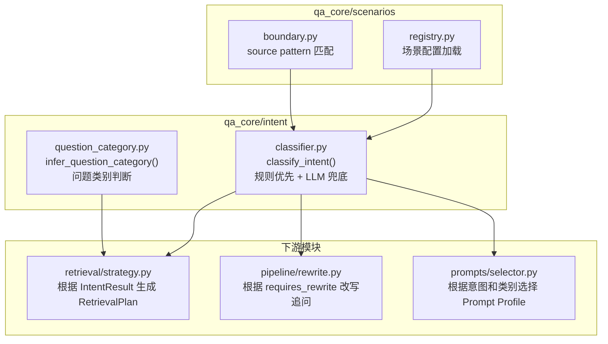
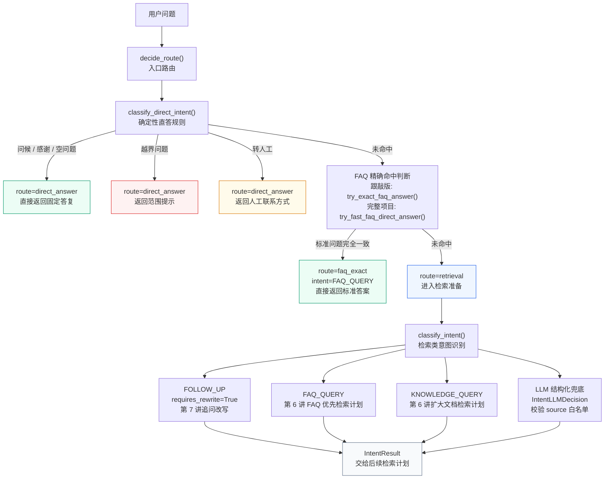
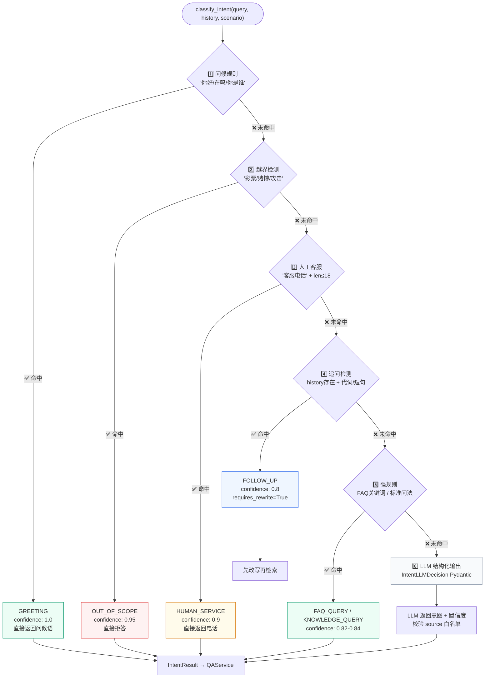
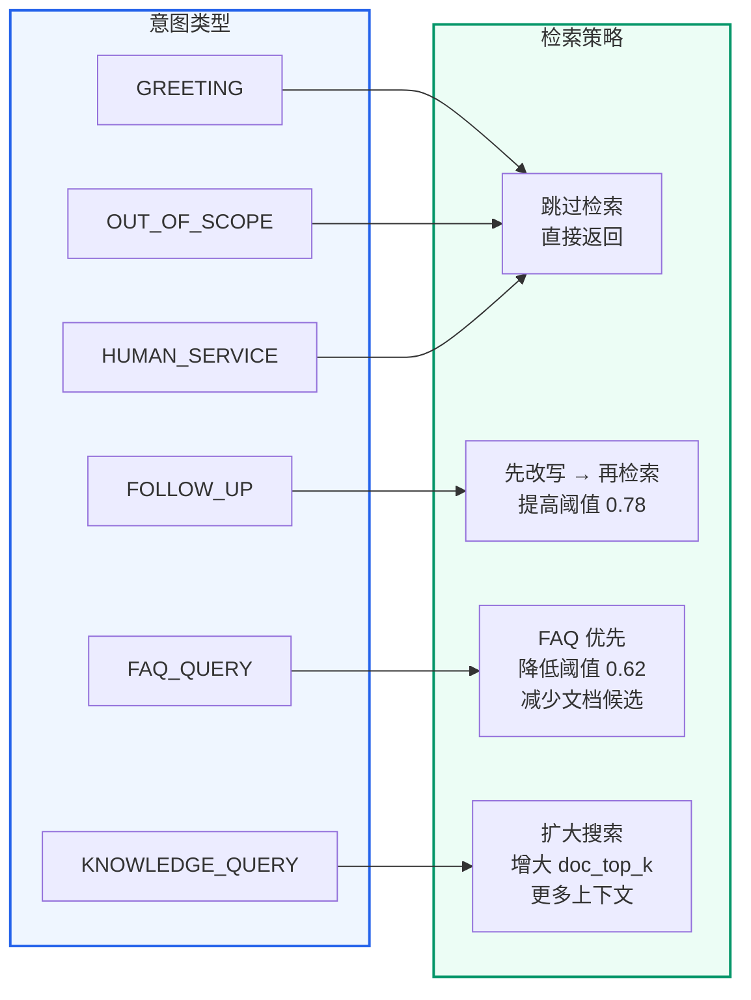
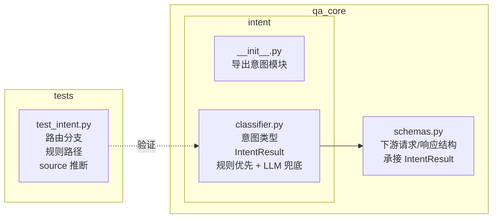

# 意图识别
<Badge icon="clock" color="green">Written: 2026.06</Badge>
> 第 05 章跟敲代码：`codealong/chapters/ch05_intent_classification`。
> 这部分代码是本章跟敲版，用来先跑通核心闭环；完整项目源码仍以本讲后文标注的 `qa_core/`、`scripts/` 等路径为准。

**上一讲**：[Milvus 索引机制与基本操作](/RAG/retrieval/milvus-index-and-operations)  
**下一讲**：[检索策略与动态计划](/RAG/retrieval/retrieval-strategy)

## 本讲目标

- 理解意图识别在 RAG 链路中的关键作用
- 掌握"规则优先 + LLM 补充"的混合分类策略
- 读懂 `classify_intent()` 的六步判断顺序及其设计理由
- 理解 Source 自动推断的机制

---

## 本讲项目交付闭环

这一讲不是只讲“什么是意图分类”，而是要把在线问答链路的第一个业务判断模块落到项目代码里。完成本讲后，需要能清楚回答三个问题：用户问题进来后先被分成哪类、为什么按这个顺序判断、这个分类结果会怎样影响后面的检索和生成。

| 项目交付项 | 说明 |
| --- | --- |
| 核心模块 | `qa_core/pipeline/steps.py`、`qa_core/intent/classifier.py` |
| 核心函数 | `decide_route()`、`classify_direct_intent()`、`classify_intent()`、`infer_source()` |
| 输出对象 | `RouteDecision`、`IntentResult` |
| 下游衔接 | 第 6 讲 `build_retrieval_plan()`、第 7 讲 `rewrite_query_if_needed()`、第 10 讲 RAG Pipeline |
| 验证入口 | 跟敲代码：`codealong/chapters/ch05_intent_classification/tests/test_intent.py`；完整项目：`tests/test_intent_and_scenarios.py`、`tests/test_retrieval_and_prompt.py` |

本讲实现完成后的代码结构：



闭环验证方式：

```bash
cd D:\workspace\knowforge-rag-platform\codealong\chapters\ch05_intent_classification
python -m unittest discover -s tests

cd D:\workspace\knowforge-rag-platform
pytest tests/test_intent_and_scenarios.py tests/test_retrieval_and_prompt.py -q
```

验证时重点看四类结果：问候/越界/人工客服是否直接返回，追问是否标记 `requires_rewrite=True`，FAQ 问法是否优先走 `FAQ_QUERY`，流程/制度/文档类问题是否走 `KNOWLEDGE_QUERY`。

---

## 本章内部流程

本章对应在线问答动画中的 Stage 1 `decide_route()`，并提前实现 Stage 2 `prepare_retrieval()` 中的检索类意图识别。可以把本章理解成两层判断：

- 第一层是 **route**：系统下一步怎么走，是直接返回、FAQ 精确直出，还是进入检索。
- 第二层是 **intent**：如果进入检索，当前问题更像追问、FAQ 查询、知识查询，还是需要结构化分类器兜底。



这张图只展开第 05 讲内部逻辑。完整 Stage 2 里的历史加载、检索计划、查询变体和 Prompt Profile 会在第 06 讲、第 07 讲和后续章节继续补齐。

---

## 第一部分：前置知识 — NLU 中的意图识别

### 1.1 什么是意图识别

在自然语言理解（NLU）中，**意图识别（Intent Classification）** 是判断用户"想干什么"的技术。

```text
用户说："入职流程有哪些步骤"
意图：知识咨询（KNOWLEDGE_QUERY）
→ 需要检索文档 + LLM 生成答案

用户说："你好"
意图：问候（GREETING）
→ 直接返回问候语，不需要检索
```

### 1.2 传统做法 vs 本项目做法

**传统 NLU 意图分类**（如 Rasa、BERT 分类器）：
- 训练一个专门的分类模型
- 需要标注训练数据
- 意图类型固定，新增意图需要重新训练

**本项目做法（规则 + LLM）**：
- 高频确定场景用正则规则（快、稳定、零成本）
- 模糊场景用 LLM 结构化输出（灵活、无需标注数据）
- 不需要训练任何模型

### 1.3 意图识别在 RAG 中的特殊角色

在 RAG 系统中，意图识别**不只是贴标签**。它直接影响后续所有决策：

```text
意图识别结果
├─ 是否直接返回答案（跳过检索和生成）
├─ 是否需要结合历史改写追问
├─ FAQ 和文档各召回多少条
├─ FAQ 直出阈值应该高还是低
├─ 是否能自动推断业务分类过滤项
└─ 使用哪套 Prompt Profile 生成答案
```

---

## 第二部分：六种意图类型

```text
Intent = Literal[
    "GREETING",        # 问候 → 你好、在吗、你是谁
    "FOLLOW_UP",       # 追问 → 那审批呢、费用呢
    "KNOWLEDGE_QUERY", # 知识咨询 → 入职流程有哪些步骤
    "FAQ_QUERY",       # 标准问答 → API 限流怎么办
    "HUMAN_SERVICE",   # 人工客服 → 客服电话、转人工
    "OUT_OF_SCOPE",    # 越界 → 彩票、赌博、攻击
]
```

| 意图 | 触发场景举例 | 后续行为 |
| --- | --- | --- |
| GREETING | "你好"、"在吗" | 直接返回问候语，不检索 |
| FOLLOW\_UP | "那审批呢"、"费用呢" | 先改写再检索，提高直出阈值 |
| KNOWLEDGE\_QUERY | "入职流程有哪些步骤" | FAQ+文档都查，更多文档上下文 |
| FAQ\_QUERY | "API 限流怎么办" | FAQ 优先，降低直出阈值 |
| HUMAN\_SERVICE | "客服电话"、"转人工" | 直接返回联系方式 |
| OUT\_OF\_SCOPE | "怎么买彩票" | 直接拒答 |

---

## 第三部分：六步判断顺序（核心设计）

`classify_intent()` 的判断顺序是**刻意设计**的，不是随意排列。每一步都有它的理由。



### 意图到检索策略的映射



**这张图是整个检索决策链的起点**。意图识别不只是"贴标签"——标签一旦确定，后续的检索行为就完全不同了。六种意图对应四种检索策略，每一条映射都有明确的设计理由：

**策略一：跳过检索（GREETING / OUT\_OF\_SCOPE / HUMAN\_SERVICE）**

这三种意图的共同特征是"答案不依赖知识库"。问候就是打招呼、越界就是拒答、人工客服就是返回电话号码——它们不需要查 Milvus，不需要调 LLM 生成，甚至不需要构建上下文。这个策略的价值在于：**省掉一次无意义的检索 + LLM 调用**。在实际运行中，这三类问题占所有请求的 5-10%，每次都跳过能显著降低延迟和成本。

**策略二：先改写再检索（FOLLOW\_UP）**

追问的问题是"不完整的"。"那审批呢"这四个字如果不结合历史，任何人都看不懂。所以 FOLLOW\_UP 不能直接检索——必须先调用 LLM 把省略的主语和背景补全（"入职流程中的审批步骤是什么"），再用改写后的问题去检索。`threshold=0.78` 是本项目当前的保护阈值，不是行业标准：它比基础 FAQ 直出阈值更谨慎，用来过滤"看起来有点相关但其实不相关"的结果。生产环境应通过 FAQ 误直出率、召回率和人工评测集继续校准。

**策略三：FAQ 优先（FAQ\_QUERY）**

FAQ\_QUERY 的问题形态通常是短问题 + 标准问法（如"xxx 怎么办""xxx 流程是什么"），这类问题大概率在 FAQ 库中有精确匹配。策略参数 `threshold=0.62` 是本项目为了“FAQ 标准答案优先”设置的相对宽松阈值，不是通用标准。它成立的前提是 FAQ 质量高、问题覆盖稳定、误直出率可控。同时 `doc_top_k` 减少到较少候选，因为 FAQ 已经覆盖了答案，不需要召回大量文档。

**策略四：扩大搜索（KNOWLEDGE\_QUERY）**

知识咨询类问题（"入职流程有哪些步骤""如何申请预算"）答案通常分散在多个文档片段中，需要 LLM 对多个 chunk 做综合和归纳。所以 `doc_top_k` 会增大——召回更多候选给 Reranker 筛选，保证 LLM 有足够完整的上下文。这类问题对"漏召回"非常敏感：少召回一个关键段落，LLM 就可能生成不完整的答案。

**映射规则的实际代码**在 `qa_core/retrieval/strategy.py` 的 `build_retrieval_plan()` 中，它接收 `IntentResult` 作为输入，输出一个 `RetrievalPlan` 对象（包含 faq\_top\_k、doc\_top\_k、threshold、use\_rerank 等字段），后续的检索环节只使用 Plan 中的参数，不再关心原始意图。

### 完整源码解读

```text
def classify_intent(
    query: str,
    history: list[BaseMessage],
    scenario: ScenarioDefinition | None = None
) -> IntentResult:
    normalized = query.strip().lower()
    suggested_source = infer_source(query, scenario)
```

**步骤 1：问候和身份问题最先处理**

```text
    # 第一步：问候
    greeting_answers = [
        f"你好！我是{assistant_name}，可以帮你查询{business_domain}中的...",
        f"我是{assistant_name}，负责解答{business_domain}相关问题。",
    ]
    for pattern, answer in zip(GREETING_PATTERNS, greeting_answers):
        if re.match(pattern, normalized, re.IGNORECASE):
            return IntentResult(
                intent="GREETING",
                direct_answer=answer,
                confidence=1.0,
                reason="greeting_rule"
            )
```

**为什么最先处理**：问候是最常见、最确定的场景。不需要任何上下文或外部信息。放在最前面可以最快返回，避免无意义的后续处理。

**步骤 2：越界检测**

```text
    # 第二步：安全拦截
    if OFF_TOPIC_HINTS.search(normalized):
        return IntentResult(
            intent="OUT_OF_SCOPE",
            direct_answer=f"这个问题超出了{business_domain}的问答范围，我无法提供帮助。",
            confidence=0.95,
            reason="safety_rule"
        )
```

**为什么必须有这一步**：越界问题如果进入 RAG 流程，LLM 可能从知识库片段中拼出看似相关但不应回答的内容。安全拦截必须在任何检索之前完成。

`OFF_TOPIC_HINTS` 匹配的关键词：`彩票|赌博|股票内幕|色情|违法|攻击|破解|黑客入侵`

**步骤 3：人工客服短句**

```text
    # 第三步：人工客服
    if HUMAN_SERVICE_HINTS.search(normalized) and len(normalized) <= 18:
        return IntentResult(
            intent="HUMAN_SERVICE",
            direct_answer=f"可以联系人工支持，联系方式：{support_contact}。",
            confidence=0.9,
            reason="human_service_rule",
        )
```

**为什么有长度限制（≤18 字符）**：
- "客服电话"、"转人工" → 短句，确实在要联系方式
- "客服电话打不通怎么办，我在线等了一个小时了" → 长句，可能是在抱怨或问怎么联系客服的流程，不应直接截断

**步骤 4：追问检测**

```text
    # 第四步：追问识别
    if history and (
        FOLLOW_UP_HINTS.search(query.strip()) or len(query.strip()) <= 8
    ):
        return IntentResult(
            intent="FOLLOW_UP",
            confidence=0.8,
            reason="follow_up_rule",
            requires_rewrite=True,
        )
```

**追问的两个触发条件**：
1. **代词或追问词开头**：`那|这个|那个|它|上面|刚才|还有|审批呢|费用呢`
2. **问题很短（≤8 字符）**：极短的问题在有历史上下文时更可能是追问

`requires_rewrite=True` 意味着后续流程会先结合历史改写问题，再进入检索。

**步骤 5：强规则判断**

```text
    # 第五步：强规则覆盖高频业务场景
    strong_rule_intent = _strong_rule_domain_intent(query, suggested_source)
    if strong_rule_intent is not None:
        return strong_rule_intent
```

这是规则最丰富的一层，见第四部分详解。

**步骤 6：LLM 兜底**

```text
    # 第六步：仍不确定才调用 LLM
    return _classify_with_llm(query, history, suggested_source, scenario)
```

只有前面五步都无法确定时，才调用 LLM。对于大多数高频业务问题，前五步已经覆盖。

---

## 第四部分：强规则设计详解

### 4.1 \_strong\_rule\_domain\_intent()

```text
def _strong_rule_domain_intent(
    query: str, suggested_source: str | None
) -> IntentResult | None:
    normalized = query.strip().lower()

    # 规则 1：FAQ 关键词 → FAQ_QUERY
    if FAQ_HINTS.search(normalized):
        return IntentResult(
            intent="FAQ_QUERY", confidence=0.82,
            reason="strong_faq_rule", suggested_source=suggested_source
        )

    # 规则 2：source 已推断 + 短问题 + 标准问法 → FAQ_QUERY
    if (suggested_source and len(normalized) <= 32
        and FAQ_QUESTION_SHAPE_HINTS.search(normalized)):
        return IntentResult(
            intent="FAQ_QUERY", confidence=0.83,
            reason="source_question_shape_rule", suggested_source=suggested_source
        )

    # 规则 3：source 已推断 + 口语化短问法 → FAQ_QUERY
    if (suggested_source and len(normalized) <= 36
        and DIRECT_FAQ_SHAPE_HINTS.search(normalized)):
        return IntentResult(
            intent="FAQ_QUERY", confidence=0.84,
            reason="direct_faq_shape_rule", suggested_source=suggested_source
        )

    # 规则 4：知识库关键词 + 有 source 或短问题 → KNOWLEDGE_QUERY
    if (KNOWLEDGE_HINTS.search(normalized)
        and (suggested_source or len(normalized) <= 24)):
        return IntentResult(
            intent="KNOWLEDGE_QUERY", confidence=0.84,
            reason="strong_knowledge_rule", suggested_source=suggested_source
        )

    return None  # 规则无法确定，交给 LLM
```

### 4.2 各规则的关键词设计

**FAQ\_HINTS** — 触发标准问答检索：

```text
FAQ_HINTS = re.compile(
    r"(费用|价格|安装|环境|失败|报错|地址|时间|退费|优惠|"
    r"发票|账号|登录|权限|审批|合同|隐私|账单|支付|开票|工单|售后)"
)
```

这些词通常是具体的、有标准答案的问题。例如"API 调用失败怎么办"→ 大概率 FAQ 里有标准答案。

**FAQ\_QUESTION\_SHAPE\_HINTS** — 标准问答的问法形态：

```text
FAQ_QUESTION_SHAPE_HINTS = re.compile(
    r"(怎么办|如何处理|怎么处理|需要什么|需要哪些|"
    r"需要准备哪些|有哪些|为什么|什么时候|由谁|能不能|会不会)"
)
```

这些词表示用户在问一个具体的"How-to"类问题，这类问题通常有标准答案。

**DIRECT\_FAQ\_SHAPE\_HINTS** — 口语化的短问答形态：

```text
DIRECT_FAQ_SHAPE_HINTS = re.compile(
    r"(资料呢|材料呢|是什么|如何回收|怎么排查|怎么处理|能不能|可以吗|要看什么)"
)
```

这些是真实业务场景中更口语化的问法，比如"那隐蔽工程验收资料呢"、"API 限流导致接口失败怎么排查"。

**KNOWLEDGE\_HINTS** — 触发知识文档检索：

```text
KNOWLEDGE_HINTS = re.compile(
    r"(知识库|文档|手册|流程|制度|规范|说明|配置|接口|功能|"
    r"排查|故障|步骤|sop|告警|巡检|设备|合规|条款|入职|"
    r"审批|合同|隐私|webhook|回调|发票|账单)"
)
```

这些词表示用户需要综合性的知识解答，不一定是 FAQ 能覆盖的。

### 4.3 置信度阶梯

注意置信度的设计：`0.82 → 0.83 → 0.84`

这不是随意设置的。随着条件越来越具体（有 source 推断 + 短问题 + 特定问法），置信度逐步提高，但仍然留有余地（不设为 1.0 或 0.95）。这是因为规则毕竟是规则，总有一些边缘情况可能误判。

---

## 第五部分：LLM 结构化分类

### 5.1 何时调用 LLM

只有当前面五步规则都无法确定时，才调用 LLM：

- 问题较长，无法用简单关键词判断
- 没有推断出 source
- 问题表达模糊但仍在业务范围内

### 5.2 实现代码

```text
def _classify_with_llm(
    query: str, history: list[BaseMessage],
    suggested_source: str | None,
    scenario: ScenarioDefinition | None = None,
) -> IntentResult:
    # 格式化最近 6 条历史消息
    history_text = format_messages(history[-6:]) if history else "无"

    # 创建带结构化输出的模型
    model = get_chat_model(streaming=False).with_structured_output(
        IntentLLMDecision
    )

    # 调用 LLM
    decision = model.invoke([
        SystemMessage(content=INTENT_SYSTEM_PROMPT),
        HumanMessage(content=f"对话历史：\n{history_text}\n\n当前问题：{query}"),
    ])

    # 校验 LLM 返回的 source 是否在场景白名单中
    source = decision.suggested_source or suggested_source
    valid_sources = scenario.valid_sources if scenario else []
    if source and source not in valid_sources:
        # 模型可能输出不在白名单中的分类名，必须丢弃
        source = suggested_source

    return IntentResult(
        intent=decision.intent,
        confidence=decision.confidence,
        reason=decision.reason or "llm_structured",
        requires_rewrite=(
            decision.requires_rewrite or decision.intent == "FOLLOW_UP"
        ),
        suggested_source=source,
    )
```

### 5.3 白名单校验的重要性

```text
if source and source not in valid_sources:
    source = suggested_source  # 丢弃 LLM 的无效输出
```

LLM 可能会返回不在场景配置中的 source 名（比如把 `hr` 识别为 `human_resources`）。如果不校验就直接拼入 Milvus 过滤表达式，会导致运行时查询错误。这里丢弃无效值并使用规则推断的 source 作为兜底。

### 5.4 LLM 失败的处理

```text
# 注意：LLM 失败时直接抛异常，而不是悄悄改用规则
# 规则路径只在 LLM 之前运行，不作为 LLM 失败时的降级方案
```

这是一个重要的设计选择：**LLM 失败必须暴露依赖问题**，不能静默改用低配规则路径。如果 LLM 不可用，意图识别可能不准，后续的检索策略、Prompt 模板都会偏——与其让用户看到一个可能错误的答案，不如在意图识别阶段就报错。

---

## 第六部分：Source 自动推断

### 6.1 为什么需要 Source 推断

用户在页面上提问时，不一定手动选择业务分类。系统需要自动判断"入职流程有哪些步骤"属于 HR 分类，"API 限流怎么办"属于 IT 分类。

前端也有业务分类下拉框，但很多用户不会手动选择。自动推断可以作为默认值，也可以作为前端选择的补充。

### 6.2 infer\_source() 实现

```python
def infer_source(query: str, scenario: ScenarioDefinition | None = None) -> str | None:
    """只根据当前业务场景配置推断可能的业务分类过滤项。

    该结果只是建议值，不会覆盖前端显式选择；如果没有传入场景，直接返回 None。
    """
    if scenario is None:
        return None
    best_source, _ = score_source_matches(query, scenario)
    return best_source
```

当前项目是多业务场景知识问答平台，`source` 会参与 Milvus 过滤表达式和数据隔离，必须来自当前场景的 `valid_sources`。新增业务分类时，只修改 `scenario.toml` 的 `valid_sources` 和 `source_patterns`，不要在 Python 主链路里堆业务硬编码。

### 6.3 场景级 Source Pattern 的优先级

```python
# qa_core/scenarios/boundary.py
def score_source_map(query: str, scenario: ScenarioDefinition) -> dict[str, int]:
    """计算问题在某个场景内命中各 source 的分数。

    分数来自场景 TOML 里的 source_patterns。命中次数越多、命中文本越长，
    分数越高；source 配置顺序用于平局时的优先级（后配置的 index 小、惩罚少）。
    """
    normalized = query.strip().lower()
    scores: dict[str, int] = {}
    for index, (source, pattern) in enumerate(scenario.compiled_source_patterns().items()):
        matches = list(pattern.finditer(query)) + list(pattern.finditer(normalized))
        if not matches:
            continue
        scores[source] = len(matches) * 10 + sum(len(match.group(0)) for match in matches) - index
    return scores

def score_source_matches(query: str, scenario: ScenarioDefinition) -> tuple[str | None, int]:
    """返回问题在某个场景内最像的 source 及其加权分数。"""
    scores = score_source_map(query, scenario)
    best_source = None
    best_score = 0
    for source, score in scores.items():
        if score > best_score:
            best_source = source
            best_score = score
    return best_source, best_score
```

---

## 第七部分：IntentResult 与下游联动

### 7.1 IntentResult 的所有字段

```python
@dataclass(frozen=True)
class IntentResult:
    intent: Intent                          # 意图枚举值
    direct_answer: str | None = None        # 直接答案（非空时跳过检索）
    confidence: float = 0.6                 # 置信度
    reason: str = "rule"                    # 判断原因（可解释性）
    requires_rewrite: bool = False          # 是否需要改写追问
    suggested_source: str | None = None     # 建议的业务分类
```

### 7.2 各字段的下游影响

```text
# intent → 检索计划参数
if intent.intent == "FAQ_QUERY":
    doc_top_k = doc_top_k // 2        # 减少文档候选
    direct_threshold = 0.62           # 降低直出阈值

elif intent.intent == "KNOWLEDGE_QUERY":
    doc_top_k *= 2                    # 增加文档上下文

# direct_answer → 是否跳过检索和生成
if intent.direct_answer:
    return direct_answer  # 不走 RAG 流程

# requires_rewrite → 是否调用改写模型
if intent.requires_rewrite:
    query = rewrite_query_if_needed(query, history)

# suggested_source → Milvus 过滤表达式
if suggested_source and not source_filter:
    source_filter = suggested_source
```

---

## 本讲实践闭环

| 项目 | 内容 |
| --- | --- |
| 本讲类型 | 项目实现 |
| 实践产物 | `qa_core/pipeline/steps.py` 路由模块、`qa_core/intent/classifier.py` 意图分类模块 |
| 是否进入最终项目 | 是 |
| 验收方式 | 运行意图分类相关单测或用典型问题手动验证 |
| 后续落点 | 第 6 讲根据意图生成检索计划，第 10 讲进入 Pipeline 主流程 |

通过标准：问候、转人工、越界可直接处理，知识类/FAQ/追问类问题能输出稳定 `IntentResult`。

### 本章实现闭环

前面的“本章内部流程”已经说明运行路径。这里从代码实现角度看落点：先完成 `qa_core/pipeline/steps.py` 的查询路由，再完成 `qa_core/intent/classifier.py` 的意图分类，最后用 `tests/test_intent.py` 验证直答、FAQ 精确命中和检索类意图三条分支。

实现完成后，相关代码结构应该是下面这张图：



#### Step 1：先定义意图分类的输出结构

目标：不要只返回一个字符串，而是把后续链路需要的决策一起返回。

来源：真实代码节选，见 `qa_core/intent/classifier.py`。

```python
@dataclass(frozen=True)
class IntentResult:
    intent: Intent
    confidence: float = 0.6
    reason: str = ""
    direct_answer: str | None = None
    requires_rewrite: bool = False
    suggested_source: str | None = None
```

设计解释：

- `direct_answer`：问候、越界、转人工可以直接返回，不进入 RAG。
- `requires_rewrite`：追问类问题必须先补全上下文。
- `suggested_source`：下游会变成 Milvus `source == "hr"` 这类过滤条件。
- `reason`：进入 Trace 和诊断面板，说明为什么这么判断。

#### Step 2：实现 6 步规则优先路径

目标：高频、确定、低风险的问题先用规则处理，只有前 5 条规则都无法判断时才调用 LLM。

来源：真实代码逻辑压缩版，对应 `qa_core/intent/classifier.py::classify_intent()` 和 `_strong_rule_domain_intent()`。

```python
def classify_intent(query, history, scenario):
    normalized = query.strip().lower()
    suggested_source = infer_source(query, scenario)

    # 规则 1：问候/自我介绍，直接返回
    if GREETING_PATTERNS.match(normalized):
        return IntentResult("GREETING", direct_answer=greeting_text, confidence=1.0)

    # 规则 2：越界/风险话题，直接拒答
    if OFF_TOPIC_HINTS.search(normalized):
        return IntentResult("OUT_OF_SCOPE", direct_answer=refuse_text, confidence=0.95)

    # 规则 3：短句转人工，避免长文本偶然包含“客服”被误判
    if HUMAN_SERVICE_HINTS.search(normalized) and len(normalized) <= 18:
        return IntentResult("HUMAN_SERVICE", direct_answer=support_text, confidence=0.9)

    # 规则 4：有历史 + 省略表达，判定为追问，需要后续改写
    if history and (FOLLOW_UP_HINTS.search(query.strip()) or len(query.strip()) <= 8):
        return IntentResult("FOLLOW_UP", requires_rewrite=True, confidence=0.8)

    # 规则 5：强领域规则，识别 FAQ_QUERY / KNOWLEDGE_QUERY
    strong_rule_intent = _strong_rule_domain_intent(query, suggested_source)
    if strong_rule_intent is not None:
        return strong_rule_intent

    # 规则 6：前 5 条都不命中，再调用 LLM 结构化兜底
    return _classify_with_llm(query, history, suggested_source, scenario)
```

规则顺序不能随便换：

| 顺序 | 规则 | 为什么放在这里 |
| --- | --- | --- |
| 1 | GREETING | 最快返回，不需要任何业务检索 |
| 2 | OUT\_OF\_SCOPE | 安全拦截必须靠前，避免进入 LLM 或检索 |
| 3 | HUMAN\_SERVICE | 只识别短句，避免长文本中的“客服”误触发 |
| 4 | FOLLOW\_UP | 必须有历史，否则“费用呢”无法判断指代对象 |
| 5 | 强领域规则 | FAQ/知识类高频问题用规则节省 LLM 调用 |
| 6 | LLM 兜底 | 只处理长尾和模糊表达，成本最高所以放最后 |

强领域规则内部又分为 4 类：

来源：真实代码逻辑压缩版，对应 `qa_core/intent/classifier.py::_strong_rule_domain_intent()`。

```text
if FAQ_HINTS.search(normalized):
    return IntentResult("FAQ_QUERY", confidence=0.82, reason="strong_faq_rule")

if suggested_source and len(normalized) <= 32 and FAQ_QUESTION_SHAPE_HINTS.search(normalized):
    return IntentResult("FAQ_QUERY", confidence=0.83, reason="source_question_shape_rule")

if suggested_source and len(normalized) <= 36 and DIRECT_FAQ_SHAPE_HINTS.search(normalized):
    return IntentResult("FAQ_QUERY", confidence=0.84, reason="direct_faq_shape_rule")

if KNOWLEDGE_HINTS.search(normalized) and (suggested_source or len(normalized) <= 24):
    return IntentResult("KNOWLEDGE_QUERY", confidence=0.84, reason="strong_knowledge_rule")
```

这里的 `confidence=0.82/0.83/0.84` 不是模型计算结果，也不是 Milvus 相似度分数，而是人工设计的**规则置信度标签**。它表达的是“这条规则判断意图的可靠程度”，主要用于诊断面板和 LangSmith Trace。

| 数值 | 命中规则 | 设计含义 |
| --- | --- | --- |
| `0.82` | `FAQ_HINTS` | 只命中 FAQ 高频词，例如费用、发票、报错、审批，大概率是 FAQ，但还不算最强约束 |
| `0.83` | `suggested_source + FAQ_QUESTION_SHAPE_HINTS` | 已经推断出业务 source，并且符合“怎么办/需要哪些/为什么”等标准问法 |
| `0.84` | `suggested_source + DIRECT_FAQ_SHAPE_HINTS` | 已有业务 source，又是“是什么/可以吗/怎么处理”等直接 FAQ 问法，规则更确定 |
| `0.84` | `KNOWLEDGE_HINTS + source/短句` | 命中文档、流程、制度、规范等知识类关键词，并且有 source 或短句约束 |

为什么没有给到 `0.9` 以上？因为这些只是规则层的意图判断，只说明“用户问题大概率属于某类意图”，不代表知识库一定能检索到答案，更不代表最终答案一定可靠。最终是否可信，还要看第 8 讲的检索分数、第 10 讲的上下文构建，以及第 17 讲的评测指标。

#### Step 3：实现 source 自动推断

目标：根据场景配置推断业务分类，但不把 HR、IT、财务等业务词写死在 Python 主链路里。

来源：简化骨架，对应 `qa_core/intent/classifier.py::infer_source()`。

```python
def infer_source(query: str, scenario: ScenarioDefinition | None) -> str | None:
    if scenario is None:
        return None
    for source, patterns in scenario.source_patterns.items():
        if any(pattern in query for pattern in patterns):
            return source
    return None
```

设计解释：业务分类来自 `scenario.toml`，新增场景时改配置，不改主链路代码。

#### Step 4：接入 LLM 结构化输出兜底

目标：规则判断不了的问题交给 LLM，但 LLM 输出必须被结构校验。

来源：简化骨架，对应 `qa_core/intent/classifier.py::_classify_with_llm()`。

```text
model = get_chat_model(streaming=False).with_structured_output(IntentLLMDecision)
decision = model.invoke(messages)

return IntentResult(
    intent=decision.intent,
    confidence=decision.confidence,
    reason=decision.reason,
    requires_rewrite=decision.requires_rewrite or decision.intent == "FOLLOW_UP",
    suggested_source=validated_source,
)
```

关键点：LLM 建议的 `source` 必须经过当前场景 `valid_sources` 白名单校验，不能直接拼进 Milvus 表达式。

#### Step 5：写测试并接入下游

验收命令：

来源：命令行验收。跟敲代码对应 `codealong/chapters/ch05_intent_classification/tests/test_intent.py`；完整项目对应 `tests/test_intent_and_scenarios.py`。

```bash
cd D:\workspace\knowforge-rag-platform\codealong\chapters\ch05_intent_classification
python -m unittest discover -s tests

cd D:\workspace\knowforge-rag-platform
python -m pytest tests/test_intent_and_scenarios.py -q
```

闭环验证重点：

| 验证项 | 输入示例 | 期望结果 |
| --- | --- | --- |
| 问候直接返回 | `你好` | `intent=GREETING`，带 `direct_answer` |
| 越界拦截 | `教我攻击系统` | `intent=OUT_OF_SCOPE`，带拒答话术 |
| 转人工直接返回 | `转人工` | `intent=HUMAN_SERVICE`，不进入检索 |
| 追问识别 | 有历史时问 `审批呢` | `intent=FOLLOW_UP`，`requires_rewrite=True` |
| FAQ 强规则 | `发票怎么开？` | `intent=FAQ_QUERY`，`reason=strong_faq_rule` |
| 知识强规则 | `新人入职流程有哪些？` | `intent=KNOWLEDGE_QUERY` 或带明确业务 source 的知识类判断 |
| 场景 source 推断 | `VPN 连不上怎么办` | 命中 IT 或对应场景 source |
| source 安全校验 | LLM 输出非法 source | 不进入 Milvus expr |

通过标准：

- `你好` 走 `GREETING`，返回 `direct_answer`。
- 越界或风险话题走 `OUT_OF_SCOPE`，不进入检索和 LLM。
- `转人工` 走 `HUMAN_SERVICE`，不检索知识库。
- `审批呢` 在有历史时走 `FOLLOW_UP`，`requires_rewrite=True`。
- 高频 FAQ/知识类问题能通过强领域规则命中 `FAQ_QUERY` 或 `KNOWLEDGE_QUERY`。
- 企业知识、跨境风险、工程项目等场景的 `infer_source()` 都能命中正确 source。
- 非法 source 不会进入下游 Milvus 过滤表达式。

## 重点掌握

| 优先级 | 内容 | 原因 |
| --- | --- | --- |
| ★★★ 必会 | 六种意图类型（GREETING / FOLLOW\_UP / KNOWLEDGE\_QUERY / FAQ\_QUERY / HUMAN\_SERVICE / OUT\_OF\_SCOPE）及各自后续行为 | 整个 RAG 链路的第一决策点 |
| ★★★ 必会 | 六步判断顺序的设计理由：问候（最快返回）→ 越界（安全拦截）→ 人工客服（短句限制）→ 追问（指代消解）→ 强规则（高频覆盖）→ LLM（兜底） | 每一步的位置都有工程考量，面试高频 |
| ★★★ 必会 | "规则优先 + LLM 补充"策略：高频确定用规则（快、零成本），模糊用 LLM（灵活） | 核心设计哲学，避免 LLM 过度依赖 |
| ★★ 理解 | IntentResult 各字段的下游影响（direct\_answer → 跳过检索、requires\_rewrite → 改写、suggested\_source → Milvus 过滤） | 理解意图识别如何串联后续模块 |
| ★★ 理解 | 置信度阶梯设计（0.82→0.83→0.84）和原因 | 面试可能问到的设计细节 |
| ★★ 理解 | Source 自动推断（infer\_source）：只读取场景 TOML source\_patterns，不写业务硬编码兜底 | 理解"不选分类也能自动匹配"的实现 |
| ★★ 理解 | LLM 结构化输出（with\_structured\_output → IntentLLMDecision）和白名单校验 | LLM 输出不可信，必须验证 |
| ★ 了解 | 关键词正则的设计思路（FAQ\_HINTS、KNOWLEDGE\_HINTS 等） | 了解设计模式即可 |

## 本讲小结

- **意图识别不只是贴标签**，它决定后续全部检索和生成策略
- **判断顺序至关重要**：问候→越界→人工客服→追问→强规则→LLM，每一步都有理由
- **规则优先 + LLM 补充**：高频确定用规则（快、稳、省钱），模糊用 LLM（灵活）
- **LLM 失败即暴露**，不静默降级到规则路径
- **Source 推断**只查场景 TOML source\_patterns，顺序即优先级，不在主链路代码中保留业务分类硬编码
- **LLM 输出的 source 必须经白名单校验**，防止无效值进入 Milvus 表达式
- 所有判断都有 `reason` 字段，确保可解释和可追踪

**下一讲**：[检索策略与动态计划](/RAG/retrieval/retrieval-strategy) — RetrievalPlan、动态阈值、不同问题类别的特殊保护