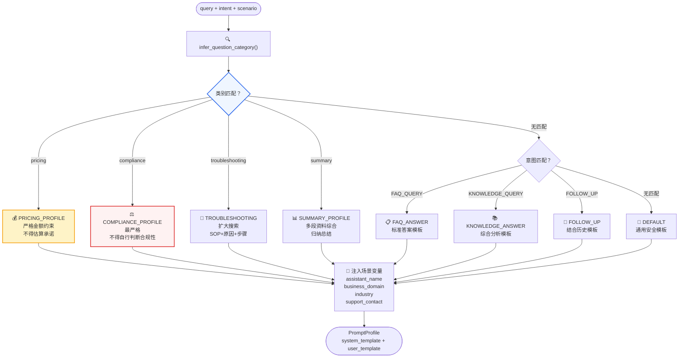
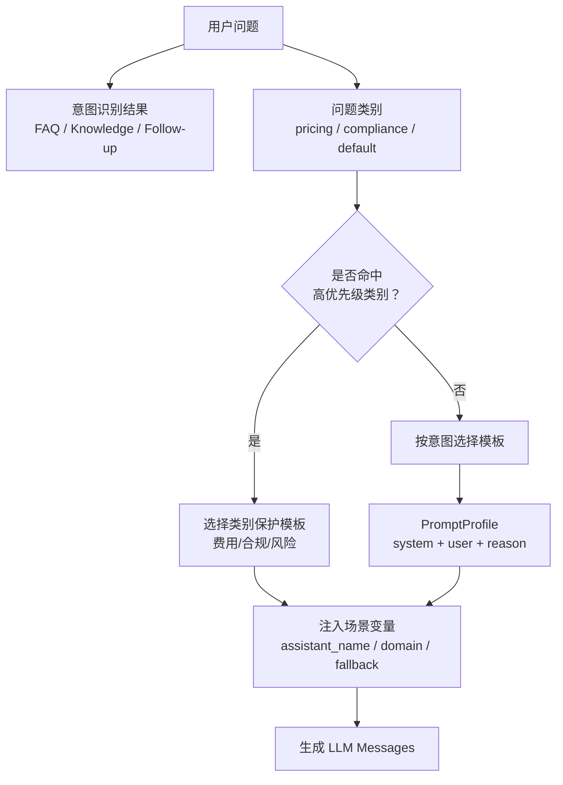
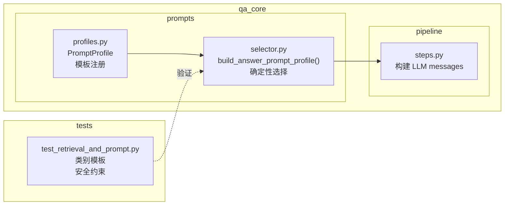

# Prompt 工程
<Badge icon="clock" color="green">Written: 2026.06</Badge>
> 第 11 章跟敲代码：`codealong/chapters/ch11_prompt_engineering`。
> 这部分代码是本章跟敲版，用来先跑通核心闭环；完整项目源码仍以本讲后文标注的 `qa_core/`、`scripts/` 等路径为准。

**上一讲**：[RAG Pipeline 主流程深度解析](/RAG/pipeline/rag-pipeline)  
**下一讲**：[FastAPI 与异步 Web 框架](/RAG/pipeline/fastapi-asynchronous-service)

## 1. 本讲目标

- 理解 Prompt Profile 的概念和设计动机
- 掌握 System Prompt 的编写原则(身份、边界、约束)
- 理解问题类别与 Prompt 模板的映射关系
- 理解为什么让 LLM 自行判断模板会引入不稳定性

---

## 2. 前置知识 — Prompt 工程基础

### 2.1 什么是 Prompt 工程

**Prompt 工程**是设计和优化发送给 LLM 的指令文本的过程。

一个完整的 Chat Prompt 通常由两部分组成：

```text
System Prompt(系统提示)：
  告诉 LLM "你是谁"、"你的行为边界"、"你应该如何回答"
  → 对整个对话有效，通常不随用户问题改变

User Prompt(用户提示)：
  具体的用户问题 + 上下文资料
  → 每次提问都不同
```

### 2.2 为什么 System Prompt 很重要

没有 System Prompt 的 LLM 是一个"通用聊天机器人"，它可能会：
- 用搞笑的口吻回答严肃的企业制度问题
- 在没有资料的情况下自信地编造答案
- 忘记自己的专业领域，回答任何问题

有了明确的 System Prompt，LLM 成为一个"有角色的专业助手"。

---

## 3. Prompt Profile 系统设计

### 3.1 什么是 Prompt Profile

**Prompt Profile** 是一组预设的 System Prompt + User Prompt 模板，针对不同类型的问题使用不同的回答策略。

当前代码中共有 8 个最终回答档位：`faq_answer`、`knowledge_answer`、`follow_up`、`pricing_guard`、`compliance_guard`、`troubleshooting_steps`、`source_bound_summary`、`default_answer`。其中前 3 个按意图兜底选择，后 4 个按问题类别优先选择，`default_answer` 只用于未知意图或新增意图兜底。

```python
@dataclass(frozen=True)
class PromptProfile:
    name: str              # 模板名称(用于 trace)
    system_template: str   # System Prompt 模板
    user_template: str     # User Prompt 模板
    reason: str            # 选择此模板的原因
```

### 3.2 模板注册

```text
# qa_core/prompts/profiles.py

# 默认模板(最宽松)
DEFAULT_PROMPT_PROFILE = PromptProfile(
    name="default",
    system_template=(
        "你是{assistant_name}，专门解答{business_domain}相关问题。\n"
        "请基于提供的参考资料回答用户问题，给出清晰、准确的信息。\n"
        "如果资料不足以回答，请诚实说明。"
    ),
    user_template="参考资料：\n{context}\n\n用户问题：{query}",
    reason="通用知识问答模板",
)

# 按意图选择(兜底)
PROMPT_PROFILES: dict[str, PromptProfile] = {
    "FAQ_QUERY": PromptProfile(
        name="faq_answer",
        system_template=(
            "你是{assistant_name}。以下标准答案来自{business_domain}的官方 FAQ。\n"
            "直接使用标准答案回复用户，可以适当简化但不能改变原意。"
        ),
        user_template="标准答案：{context}\n\n用户问题：{query}",
        reason="FAQ 类问题优先复用标准答案，控制回答长度和业务口径。",
    ),
    "KNOWLEDGE_QUERY": PromptProfile(
        name="knowledge_answer",
        system_template=(
            "你是{assistant_name}，专门解答{business_domain}相关问题。\n"
            "回答要求：\n"
            "1. 严格基于提供的参考资料，不得超出资料范围\n"
            "2. 条理清晰，必要时分点或分步骤说明\n"
            "3. 引用资料中的具体条款或流程\n"
            "4. 如果涉及多份资料，请综合后给出完整答案\n"
            "5. 不确定的信息请明确标注"
        ),
        user_template="参考资料：\n{context}\n\n用户问题：{query}",
        reason="业务知识咨询需要整合文档资料，允许按流程、规则、步骤或说明结构化回答。",
    ),
    "FOLLOW_UP": PromptProfile(
        name="follow_up",
        system_template=(
            "你是{assistant_name}，专门解答{business_domain}相关问题。\n"
            "请结合对话历史回答用户的追问。\n"
            "注意指代消解，但回答焦点仍限定在当前问题。"
        ),
        user_template="对话历史：\n{history}\n\n参考资料：\n{context}\n\n用户问题：{query}",
        reason="追问需要结合历史理解指代，但回答焦点仍限定在当前问题。",
    ),
}
```

### 3.3 场景变量注入

注意模板中的 `&#123;assistant_name&#125;`、`&#123;business_domain&#125;`、`&#123;industry&#125;` 等变量。这些变量在运行时从场景配置注入：

```python
# qa_core/prompts/selector.py
def _scenario_prompt_context(scenario):
    return {
        "assistant_name": scenario.assistant_name,      # "企业知识助手"
        "business_domain": scenario.business_domain,    # "企业内部制度与流程"
        "industry": scenario.industry,                   # "企业服务"
        "support_contact": scenario.support_contact,    # "400-xxx-xxxx"
        "phone": scenario.support_contact,
    }
```

这样同一套 Prompt 模板可以用于所有 8 个场景，只需配置不同的业务身份。

---

## 4. 问题类别的严格模板

### 4.1 费用类(Pricing)模板

```yaml
CATEGORY_PROMPT_PROFILES: dict[str, PromptProfile] = {
    "pricing": PromptProfile(
        name="pricing_guard",
        system_template=(
            "你是{assistant_name}，专门解答{business_domain}中的费用、价格、退款、"
            "支付相关问题。\n\n"
            "⚠ 重要规则：\n"
            "1. 只能基于参考资料中明确写明的金额、费率、退款条件来回答\n"
            "2. 不得估算、猜测或自行承诺任何金额\n"
            "3. 不得做出'应该可以退款'、'大概多少钱'等不确定表述\n"
            "4. 如果资料中没有明确说明，必须回答'资料中没有明确说明该费用/退款条件，"
            "建议联系{phone}确认'\n"
            "5. 金额相关回答必须注明依据的具体条款"
        ),
        user_template="参考资料：\n{context}\n\n用户问题：{query}",
        reason="费用、退款、优惠、发票等强口径问题必须保守回答，并区分已确认/未确认。",
    ),
    "compliance": PromptProfile(
        name="compliance_guard",
        system_template=(
            "你是{assistant_name}，专门解答{business_domain}中的合规、法律、"
            "合同、审计相关问题。\n\n"
            "⚠ 严格规则：\n"
            "1. 只能逐条引用参考资料中的具体规定来回答\n"
            "2. 不得对合规性做任何主观判断(不能说'这是合规的'或'这不违规')\n"
            "3. 只能表述为'根据XX规定，该情况下需要XX'\n"
            "4. 涉及法律责任时，必须注明具体的责任条款编号\n"
            "5. 信息不足时，必须引导用户联系{phone}进行专业合规咨询\n"
            "6. 不得简化或省略合规流程中的任何步骤"
        ),
        user_template="参考资料：\n{context}\n\n用户问题：{query}",
        reason="合规、合同、隐私、审计类问题需要更严格的确认边界和风险提示。",
    ),
    "troubleshooting": PromptProfile(
        name="troubleshooting_steps",
        system_template=(
            "你是{assistant_name}，专门解答{business_domain}中的故障排查、"
            "异常处理相关问题。\n\n"
            "回答要求：\n"
            "1. 严格基于提供的参考资料，按步骤输出排查流程\n"
            "2. 每个步骤说明操作目的和预期结果\n"
            "3. 如果资料中未说明某步骤，不得自行编造\n"
            "4. 区分'确定原因'和'可能原因'"
        ),
        user_template="参考资料：\n{context}\n\n用户问题：{query}",
        reason="故障排查类问题需要步骤化输出，同时不能编造文档外操作。",
    ),
    "summary": PromptProfile(
        name="source_bound_summary",
        system_template=(
            "你是{assistant_name}，专门解答{business_domain}相关问题。\n"
            "请根据提供的参考资料进行总结。\n\n"
            "要求：\n"
            "1. 只能总结资料中已出现的信息\n"
            "2. 整合多份资料时需指出信息来源于哪些资料\n"
            "3. 不得添加资料外的任何额外解读"
        ),
        user_template="参考资料：\n{context}\n\n用户问题：{query}",
        reason="总结类问题需要整合更多上下文，但只能总结资料中已出现的信息。",
    ),
}
```

### 4.2 合规类(Compliance)模板

```text
# CATEGORY_PROMPT_PROFILES(完整定义见 3.1 节)中的合规档位：
"compliance": PromptProfile(
    name="compliance_guard",
    system_template=(
        "你是{assistant_name}，专门解答{business_domain}中的合规、法律、"
        "合同、审计相关问题。\n\n"
        "⚠ 严格规则：\n"
        "1. 只能逐条引用参考资料中的具体规定来回答\n"
        "2. 不得对合规性做任何主观判断(不能说'这是合规的'或'这不违规')\n"
        "3. 只能表述为'根据XX规定，该情况下需要XX'\n"
        "4. 涉及法律责任时，必须注明具体的责任条款编号\n"
        "5. 信息不足时，必须引导用户联系{phone}进行专业合规咨询\n"
        "6. 不得简化或省略合规流程中的任何步骤"
    ),
    user_template="参考资料：\n{context}\n\n用户问题：{query}",
    reason="合规、合同、隐私、审计类问题需要更严格的确认边界和风险提示。",
),
```

### 4.3 问题类别与模板的映射

```text
# qa_core/prompts/profiles.py

# 按问题类别选择(优先级更高)—— 每个档位在字典中内联定义
CATEGORY_PROMPT_PROFILES: dict[str, PromptProfile] = {
    "pricing": PromptProfile(
        name="pricing_guard", ...),       # 费用/价格类严格模板
    "compliance": PromptProfile(
        name="compliance_guard", ...),    # 合规/法律类最严格模板
    "troubleshooting": PromptProfile(
        name="troubleshooting_steps", ...), # 故障排查步骤化模板
    "summary": PromptProfile(
        name="source_bound_summary", ...), # 总结归纳模板
}

# 按意图选择(兜底)—— 每个档位在字典中内联定义
PROMPT_PROFILES: dict[str, PromptProfile] = {
    "FAQ_QUERY": PromptProfile(
        name="faq_answer", ...),           # FAQ 标准答案模板
    "KNOWLEDGE_QUERY": PromptProfile(
        name="knowledge_answer", ...),     # 知识咨询综合回答模板
    "FOLLOW_UP": PromptProfile(
        name="follow_up", ...),            # 追问结合历史模板
}
```

### 4.4 选择优先级



```python
def build_answer_prompt_profile(intent, scenario, query):
    question_category = infer_question_category(query or "")

    # 1. 问题类别优先(pricing/compliance 等高风险类别)
    profile = CATEGORY_PROMPT_PROFILES.get(question_category)

    # 2. 再按意图选择
    if profile is None:
        profile = PROMPT_PROFILES.get(intent)

    # 3. 都不命中用默认模板
    if profile is None:
        profile = DEFAULT_PROMPT_PROFILE

    # 注入场景上下文变量
    context = _scenario_prompt_context(scenario)
    return PromptProfile(
        name=profile.name,
        system_template=profile.system_template.format(**context),
        user_template=profile.user_template,
        reason=profile.reason,
    )
```

---

## 5. 为什么不用 LLM 选择模板

这是一个值得讨论的设计决策。

**方案 A(不使用)**：让 LLM 每次自己判断该用哪个模板。

```text
问题：LLM 判断 → "这是合规类问题，用严格模板" → 生成答案
```

**方案 B(本项目采用)**：确定性规则选择。

```text
问题 → 意图识别(规则/LLM)→ 问题类别推断(规则)→ 确定模板
```

选择方案 B 的原因：

1. **检索策略和 Prompt 模板必须一致**：如果检索时判断为 FAQ\_QUERY(FAQ 优先)，但 Prompt 时 LLM 判断为 knowledge\_answer(综合分析)，就会出现"只召回了 FAQ 但要求综合分析"的不匹配。
2. **减少一次 LLM 调用**：每次生成答案前再让 LLM 选一次模板，增加延迟和成本。
3. **确定性 > 灵活性**：在高风险场景(费用、合规)，我们希望模板选择是 100% 确定的，不能依赖 LLM 的"判断"。LLM 可能在一次调用中正确选择了合规模板，下一次却用了默认模板。

---

## 6. System Prompt 编写原则

从本项目的 Prompt 设计中可以总结出几个原则：

### 6.1 身份明确

```text
✅ "你是企业知识助手，专门解答企业内部制度与流程相关问题。"
❌ "你是一个 AI 助手。"
```

### 6.2 行为边界清晰

```text
✅ "严格基于提供的参考资料。不得超出资料范围。"
❌ "尽量基于参考资料回答。"("尽量"给了模型太多自由)
```

### 6.3 对高风险场景做显式约束

```text
✅ "涉及合规、金额、法律责任时，必须注明依据的具体条款。"
✅ "不得估算、猜测或自行承诺任何金额。"
```

### 6.4 提供失败兜底行为

```text
✅ "如果资料不足，必须回答'信息不足，请联系 XXX'"
❌ (不写兜底，模型可能即兴发挥)
```

---

## 7. 本讲实践闭环

| 项目 | 内容 |
| --- | --- |
| 本讲类型 | 项目实现 |
| 实践产物 | `prompts/profiles.py`、`prompts/selector.py` 和场景化 Prompt Profile |
| 是否进入最终项目 | 是 |
| 验收方式 | 不同问题类别命中不同模板，高风险问题进入安全约束模板 |
| 后续落点 | 第 10 讲生成阶段使用，第 17/19 讲观察答案质量和 trace |

通过标准：Prompt 选择有明确优先级，模板变量能从场景配置注入，回答边界可控。

### 7.1 本讲从 0 到 1 实现闭环

这一讲要完成的是“Prompt 可治理”，不是写一个越来越长的大提示词。实现顺序如下：



1. 先把回答模板抽象成 `PromptProfile`，每个 profile 说明适用场景和选择原因。
2. 再把 FAQ、知识问答、追问、高风险费用/合规问题拆成不同 profile。
3. 然后实现确定性的选择器：先看问题类别，再看意图，最后才用默认模板。
4. 最后把场景配置中的助手名称、业务领域、兜底话术注入模板。

实现完成后，相关代码结构应该是下面这张图：



来源：真实代码逻辑压缩版，对应 `qa_core/prompts/profiles.py`。

```python
@dataclass(frozen=True)
class PromptProfile:
    name: str
    system_template: str
    user_template: str
    reason: str

PROMPT_PROFILES = {
    "FAQ_QUERY": PromptProfile(name="faq_answer", ...),
    "KNOWLEDGE_QUERY": PromptProfile(name="knowledge_answer", ...),
    "FOLLOW_UP": PromptProfile(name="follow_up", ...),
}

CATEGORY_PROMPT_PROFILES = {
    "pricing": PromptProfile(name="pricing_guard", ...),
    "compliance": PromptProfile(name="compliance_guard", ...),
    "troubleshooting": PromptProfile(name="troubleshooting_steps", ...),
    "summary": PromptProfile(name="source_bound_summary", ...),
}

DEFAULT_PROMPT_PROFILE = PromptProfile(name="default_answer", ...)
```

选择逻辑必须是确定性的。费用、合规、合同风险这类高风险类别不能交给 LLM 自己判断，否则一次误判就可能造成错误承诺。

来源：真实代码节选，见 `qa_core/prompts/selector.py::build_answer_prompt_profile()`。

```text
def build_answer_prompt_profile(
    intent: str,
    scenario: ScenarioDefinition | None = None,
    query: str | None = None,
) -> PromptProfile:
    question_category = infer_question_category(query or "")
    profile = (
        CATEGORY_PROMPT_PROFILES.get(question_category)
        or PROMPT_PROFILES.get(intent, DEFAULT_PROMPT_PROFILE)
    )
    context = _scenario_prompt_context(scenario)
    return PromptProfile(
        name=profile.name,
        system_template=profile.system_template.format(**context),
        user_template=profile.user_template,
        reason=profile.reason,
    )
```

场景变量不要写死在 Prompt 里。8 个业务场景共用一套模板，只把 `assistant_name`、`business_domain`、`fallback_contact` 等配置注入进去。

来源：真实代码逻辑压缩版，对应 `qa_core/prompts/selector.py::_scenario_prompt_context()`。

```python
def _scenario_prompt_context(scenario=None) -> dict[str, str]:
    settings = get_settings()
    return {
        "assistant_name": scenario.assistant_name if scenario else "知识助手",
        "business_domain": scenario.business_domain if scenario else "业务知识库",
        "industry": scenario.industry if scenario else "通用知识问答",
        "support_contact": scenario.support_contact if scenario else settings.customer_service_phone,
        "phone": scenario.support_contact if scenario else settings.customer_service_phone,
    }
```

验收时不要只看“能回答”，还要验证不同类别是否命中正确 profile。

来源：命令行验收，对应 `tests/test_retrieval_and_prompt.py`。

```bash
python -m pytest tests/test_retrieval_and_prompt.py -q
```

闭环验证重点：

| 验证项 | 输入条件 | 期望结果 |
| --- | --- | --- |
| FAQ 模板 | `intent=FAQ_QUERY` | 命中 FAQ 直出模板 |
| 知识问答模板 | `intent=KNOWLEDGE_QUERY` | 命中知识回答模板 |
| 追问模板 | `intent=FOLLOW_UP` | 命中追问上下文模板 |
| 费用类保护 | `category=pricing` | 命中费用安全模板 |
| 合规类保护 | `category=compliance` | 命中合规安全模板 |
| 场景变量 | 切换业务场景 | assistant/domain 等变量正确注入 |
| 默认兜底 | 新增未知 intent | 使用 `DEFAULT_PROMPT_PROFILE` |
| 模板脱敏 | 调试信息 | `as_dict()` 只返回 name/reason，不暴露完整 prompt |

验收重点：Prompt 是一组可选择、可解释、可测试的业务回答策略，不是散落在代码里的长字符串。

## 8. 重点掌握

| 优先级 | 内容 | 原因 |
| --- | --- | --- |
| ★★★ 必会 | Prompt Profile 的概念和结构：name + system\_template + user\_template + reason，8 个最终回答档位 | 本项目的提示词管理方式 |
| ★★★ 必会 | Profile 选择优先级：问题类别(pricing/compliance/troubleshooting/summary)> 意图(FAQ\_QUERY/KNOWLEDGE\_QUERY/FOLLOW\_UP)> 默认模板 | 确定性的选择策略，面试常问 |
| ★★★ 必会 | 高风险问题类别的特殊模板：费用类(不得估算金额)、合规类(不得主观判断合规性) | 高风险场景的 Prompt 安全约束 |
| ★★ 理解 | 确定性选择 > LLM 判断的原因：检索策略和 Prompt 模板必须一致、减少一次 LLM 调用、高风险场景必须 100% 确定 | 重要的设计决策依据 |
| ★★ 理解 | 场景变量注入(\_scenario\_prompt\_context)：assistant\_name、business\_domain 等从 TOML 注入 | 同一套模板跨 8 个场景复用的机制 |
| ★★ 理解 | build\_answer\_prompt\_profile() 的完整选择逻辑 | Profile 选择的代码实现 |
| ★ 了解 | System Prompt 编写原则：身份明确、行为边界清晰、高风险显式约束、提供失败兜底 | Prompt 工程通用技巧 |
| ★ 了解 | CATEGORY\_PROMPT\_PROFILES 和 PROMPT\_PROFILES 两个字典的注册方式 | 了解模板组织方式 |

## 9. 本讲小结

- **Prompt Profile** 是预设的 System/User Prompt 模板集合，针对不同问题类别使用不同策略
- 选择优先级：**问题类别(费用/合规等)> 意图(FAQ/知识咨询)> 默认模板**
- **场景变量注入**使同一套模板可以跨 8 个场景复用
- **确定性选择 > LLM 判断**：高风险模板(费用、合规)的选择必须是 100% 确定的
- 关键在于让 LLM 知道"能做什么"比"不能做什么"更难，所以约束性指令要明确

**下一讲**：[FastAPI 与异步 Web 框架](/RAG/pipeline/fastapi-asynchronous-service) — async/await、WebSocket、FastAPI 路由设计