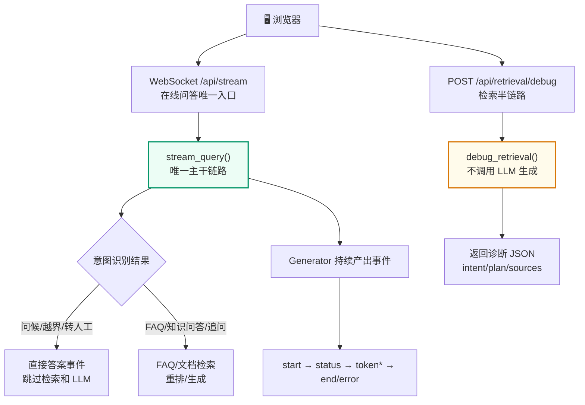
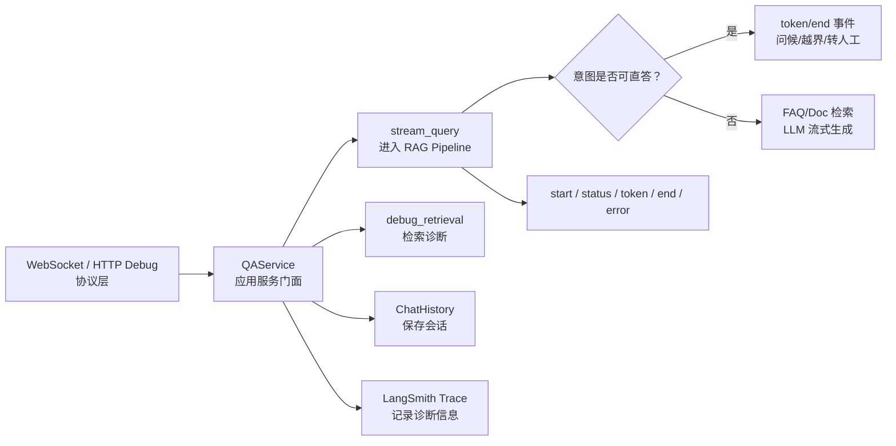
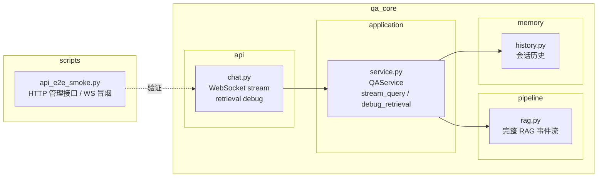

# QAService 编排
<Badge icon="clock" color="green">Written: 2026.06</Badge>
> 第 09 章跟敲代码：`codealong/chapters/ch09_qaservice_orchestration`。
> 这部分代码是本章跟敲版，用来先跑通核心闭环；完整项目源码仍以本讲后文标注的 `qa_core/`、`scripts/` 等路径为准。

**上一讲**：[Milvus 混合检索深度解析](/RAG/retrieval/milvus-hybrid-search)  
**下一讲**：[RAG Pipeline 主流程深度解析](/RAG/pipeline/rag-pipeline)

## 1. 本讲目标

- 理解 QAService 作为服务编排层(Orchestration Layer)的设计理念
- 掌握"服务门面"模式在 RAG 系统中的应用
- 理解两个核心方法的职责分工
- 理解 Generator(生成器)在流式问答中的角色

---

## 2. 前置知识 — 服务编排模式

### 2.1 什么是服务编排

**服务编排(Service Orchestration)** 是软件架构中的一种模式：用一个中心化的"编排器"来协调多个子服务的调用顺序和数据流转。

打个比方：
- **没有编排**：每个厨师自己决定做什么菜、用什么食材、先炒哪个后炒哪个 → 混乱
- **有编排**：主厨(编排器)决定菜单、分配任务、协调出菜顺序 → 有序

在 RAG 系统中，"子服务"包括：
- 意图识别 → 判断用户想干什么
- 历史读取 → 获取会话上下文
- 查询改写 → 补全追问
- 检索计划 → 决定如何检索
- FAQ 检索 → 查标准答案
- 文档检索 → 查业务资料
- 上下文构建 → 组织参考资料
- LLM 生成 → 产生答案
- 历史写入 → 保存对话

QAService 就是协调这些子服务的"主厨"。

### 2.2 QAService 不做什么(边界)

```python
class QAService:
    """
    这层代码承担的职责：
    1. 读取历史并决定是否需要改写追问
    2. 判断问题意图，过滤无需 RAG 的场景
    3. 根据意图构建检索计划
    4. 先查 FAQ，再查文档
    5. 生成最终上下文，调用 LLM 流式输出
    6. 保存历史，返回诊断信息

    这层不做的事情：
    1. 不创建 FastAPI 响应对象
    2. 不直接操作静态页面
    3. 不实现底层 Milvus 连接细节
    4. 不新增绕过 Pipeline 的并行检索入口
    """
```

---

## 3. QAService 的两个核心方法

### 3.1 方法职责对照



### 3.2 stream\_query() — 唯一主干链路

```python
def stream_query(self, query, source_filter, session_id, ...):
    """委托 RAGPipeline 执行完整流式问答。"""
    yield from rag_stream_query(
        self.history,        # 历史存储适配器
        self.validate_source, # source 校验函数
        query,
        source_filter,
        session_id,
        kb_version=kb_version,
        scenario_id=scenario_id,
        ...
    )
```

`yield from` 是 Python 的委托语法。`rag_stream_query` 是 `qa_core.pipeline.rag` 模块中 `stream_query` 函数的 import alias(`from qa_core.pipeline.rag import stream_query as rag_stream_query`)，它是一个生成器函数，每次 `yield` 产生一个事件。`yield from` 把这些事件"透传"给调用方(FastAPI WebSocket 路由)，所以 QAService 不需要自己维护生成循环。

### 3.3 debug\_retrieval() — 检索诊断半链路

```python
def debug_retrieval(self, query, source_filter, session_id=None, ...):
    """复用主链路的场景、数据域、意图和检索逻辑，但不调用最终回答 LLM。"""
    return rag_debug_retrieval(
        self.history,
        self.validate_source,
        query,
        source_filter,
        session_id=session_id,
        ...
    )
```

这个方法服务于状态页、评测脚本和排障。它可以告诉开发者"意图是什么、检索计划是什么、FAQ/Doc 命中了什么"，但不会生成面向用户的最终答案。

注意：`debug_retrieval()` 是**检索诊断半链路**，它故意从 `prepare_retrieval()` 开始，以便观察检索类意图、source 推断、按需改写、检索计划和召回质量；线上用户问答仍从 `stream_query()` 进入，并先执行 `decide_route()`。因此，调试接口没有走 `route=direct_answer / faq_exact / retrieval`，并不代表在线主链路跳过查询路由。

### 3.4 source 白名单校验

```python
def validate_source(self, source_filter, scenario):
    """在访问 Milvus 之前拒绝不支持的业务分类过滤项。"""
    if source_filter and source_filter not in scenario.valid_sources:
        raise ValueError(
            f"无效的业务分类。当前场景支持: {scenario.valid_sources}"
        )
```

这个校验放在 QAService 层(而非 API 层或 retrieval 层)是经过考虑的：
- **API 层**：不应该知道 Milvus 过滤规则(它只管 HTTP 参数校验)
- **Retrieval 层**：不应该承担业务白名单判断(它只管执行检索)
- **QAService(编排层)**：最清楚"前端筛选项 + 意图推断分类"如何进入主链路

---

## 4. Generator 模式在 RAG 中的应用

### 4.1 什么是 Generator

Generator(生成器)是 Python 的一个核心特性，使用 `yield` 关键字：

```text
def simple_generator():
    yield "第一步完成"
    yield "第二步完成"
    yield "第三步完成"

for event in simple_generator():
    print(event)  # 逐个输出，而不是等全部完成
```

Generator 的特点是**惰性求值**：每次只产生一个值，调用方可以在每个值之间做其他事情。

### 4.2 为什么 RAG 适合用 Generator

RAG 的问答过程不是一个"输入→等待→输出"的单步操作，而是一个**多阶段持续产出**的过程：

```text
def stream_query(...):
    # 阶段 1：查询路由
    yield {"type": "status", "message": "正在进行查询路由..."}
    route = decide_route(context)
    if route.answer:
        yield {"type": "token", "token": route.answer}
        yield {"type": "end", ...}
        return

    # 阶段 2：检索准备
    yield {"type": "status", "message": "正在识别问题意图..."}
    prepared = prepare_retrieval(context)

    # 兜底：处理直接答案(通常已在阶段 1 返回)
    if prepared.intent.direct_answer:
        yield {"type": "token", "token": prepared.intent.direct_answer}
        yield {"type": "end", ...}
        return

    # 阶段 4：FAQ 检索
    yield {"type": "status", "message": "正在检索业务 FAQ 知识库..."}
    faq_result = search_faq(context, prepared)

    # 阶段 5：文档 RAG
    yield {"type": "status", "message": "正在匹配相关业务资料..."}
    doc_result = search_doc(context, prepared)

    # 阶段 6：LLM 流式生成
    yield {"type": "status", "message": "正在生成回答..."}
    for chunk in stream_llm_answer(system_prompt, user_prompt):
        yield {"type": "token", "token": chunk.content}

    # 阶段 7：保存 + 收尾
    yield {"type": "end", "sources": [...], "retrieval": {...}}
```

每个 `yield` 都是**一个可以立即推送给前端的事件**。用户不需要等全部流程跑完才能看到任何东西。

### 4.3 前端接收到的体验

```json
[0.0s] 用户点击发送 "入职流程有哪些步骤"
[0.1s] 页面显示 "正在进行查询路由..."
[0.5s] 页面显示 "正在识别问题意图..."
[1.2s] 页面显示 "正在检索业务 FAQ 知识库..."
[2.0s] 页面显示 "正在匹配相关业务资料..."
[3.5s] 页面显示 "正在生成回答..."
[3.8s] 页面开始逐字出现 "入" "职" "流" "程" "包" "括" ...
[6.0s] 回答完成，显示来源引用
```

如果不用 Generator 而是一次性返回：

```text
[0.0s] 用户点击发送
[6.0s] 空白等待...
[6.0s] 整个答案突然出现
```

---

## 5. 应用工厂模式

### 5.1 get\_qa\_service() 工厂函数

```python
# qa_core/application/factory.py
from functools import lru_cache

@lru_cache(maxsize=1)
def get_qa_service() -> QAService:
    """返回进程级缓存的 QAService 实例。

    单例缓存确保了 settings 和 history store 在整个进程中只加载一次。
    QAService 本身不保存请求级状态(所有变量都在方法局部作用域内)，
    所以多用户并发是安全的。
    """
    return QAService()
```

**为什么用单例**：
- `settings` 是只读配置，加载一次即可
- `history` 是历史存储适配器，本身负责按 session\_id 隔离会话
- 每次请求创建新的 QAService 会重复加载配置，但没有好处

**为什么不担心并发**：
- QAService 只保存 `settings`(只读)和 `history`(线程安全适配器)
- 请求级变量(query、intent、plan、sources 等)都不在 QAService 上，而在方法局部变量中

### 5.2 在 API 中使用

```python
# qa_core/api/chat.py
from qa_core.application.factory import get_qa_service

@router.websocket("/api/stream")
async def websocket_endpoint(websocket: WebSocket):
    service = get_qa_service()  # 同一个单例
    generator = await asyncio.to_thread(
        lambda: service.stream_query(...)
    )
    ...
```

---

## 6. 错误处理与事件协议

### 6.1 异常不抛给 WebSocket 路由

```text
# qa_core/pipeline/rag.py
try:
    # 完整的 RAG 流程...
    for chunk in stream_llm_answer(...):
        yield build_token_event(token, context.session_id)
    yield finish_success(context, answer=answer)

except Exception as exc:
    logger.exception("QA stream failed")
    # 错误以事件形式返回给前端，不抛出到路由层
    yield finish_error(context, exc)
```

**设计意图**：如果抛出异常到 WebSocket 路由，前端收到的就是一个 WebSocket 协议级别的错误，页面无法优雅地展示错误信息。以事件形式返回错误，前端可以按同一套 UI 渲染错误信息，并允许用户继续下一轮提问。

### 6.2 事件类型汇总

| 事件类型 | 含义 | 前端处理 |
| --- | --- | --- |
| `start` | 请求已接收 | 创建答案区域，显示加载状态 |
| `status` | 当前进行到哪个阶段 | 更新进度提示文字 |
| `token` | LLM 生成的一个 token | 追加到答案文本末尾 |
| `end` | 问答完成 | 显示来源引用、诊断信息、耗时 |
| `error` | 可恢复的错误 | 显示错误信息，允许继续提问 |

---

## 7. 本讲实践闭环

| 项目 | 内容 |
| --- | --- |
| 本讲类型 | 系统集成 |
| 实践产物 | `QAService`、WebSocket stream、检索诊断的服务编排 |
| 是否进入最终项目 | 是 |
| 验收方式 | WebSocket 能持续输出事件，检索诊断能返回命中明细 |
| 后续落点 | 第 10 讲接入完整 Pipeline 事件，第 12 讲纳入 FastAPI 路由 |

通过标准：在线问答只有 WebSocket 主入口；同一个业务服务能支撑流式回答和检索诊断，但不把 RAG 细节泄露给 API 层。

### 7.1 本讲从 0 到 1 实现闭环

这一讲的目标不是再写一个 RAG 算法，而是把前面已经具备的能力包装成一个稳定的应用服务层。实现时按这个顺序推进：



1. 先定义 `QAService`，让 API 层以后只调用 service，不直接碰 Milvus、Prompt、Pipeline。
2. 实现 `stream_query()`，把完整 RAG Pipeline 产出的事件原样透传给 WebSocket；问候、越界、转人工等直答也在这条链路内完成。
3. 实现 `debug_retrieval()`，复用检索准备逻辑但不调用最终回答 LLM。
4. 最后补一个工厂函数 `get_qa_service()`，避免每个请求重复初始化 settings、history、retriever。

实现完成后，相关代码结构应该是下面这张图：



来源：真实代码逻辑压缩版，对应 `qa_core/application/service.py::QAService`。

```python
class QAService:
    def __init__(self) -> None:
        self.settings = get_settings()
        self.history = get_history_store()

    def validate_source(self, source_filter, scenario):
        validate_source_filter(source_filter, scenario.valid_sources)

    def stream_query(self, query, source_filter, session_id, **kwargs):
        yield from rag_stream_query(
            self.history,
            self.validate_source,
            query,
            source_filter,
            session_id,
            **kwargs,
        )

    def debug_retrieval(self, query, source_filter, session_id=None, **kwargs):
        return rag_debug_retrieval(
            self.history,
            self.validate_source,
            query,
            source_filter,
            session_id,
            **kwargs,
        )
```

直答场景不再放在额外 API 入口处理，而是在 Pipeline 的意图识别阶段处理。这样历史保存、Trace、限流、事件协议都只走一套实现，问候、越界、转人工和复杂 RAG 问题不会分裂成两条在线链路。

WebSocket 不应该知道 RAG 内部有多少阶段，它只消费 service 产出的事件。这样以后 Pipeline 从 7 阶段变成 9 阶段，API 层也不需要跟着大改。

来源：真实代码调用点，见 `qa_core/api/chat.py`。

```python
@router.websocket("/api/stream")
async def websocket_endpoint(websocket: WebSocket):
    await websocket.accept()
    raw_data = await websocket.receive_text()
    request_data = json.loads(raw_data)
    context = QueryServiceContext.from_ws_payload(request_data)
    stream = get_qa_service().stream_query(*context.service_args())

    while True:
        has_event, event = await asyncio.to_thread(_next_stream_event, stream)
        if not has_event:
            break
        await websocket.send_json(event)
```

验收时重点看两件事：WebSocket 能持续收到 `start/status/token/end/error` 事件；`/api/retrieval/debug` 能返回检索诊断信息但不生成最终答案。

来源：命令行验收，对应 `scripts/api_e2e_smoke.py`。

```text
python scripts/api_e2e_smoke.py --base-url http://127.0.0.1:8001
```

闭环验证重点：

| 验证项 | 验证方式 | 期望结果 |
| --- | --- | --- |
| WebSocket stream | 连接 `/api/stream` | 持续收到事件 |
| 检索诊断 | 请求 `/api/retrieval/debug` | 返回意图、计划、FAQ/Doc 命中 |
| 业务分层 | 查看 `chat.py` | 路由只调用 service，不写检索细节 |
| 历史保存 | 连续追问 | 下一轮能读取上下文 |
| Trace 记录 | 查看诊断字段 | 有 hit\_type、intent、kb\_version、data\_scope、耗时等信息 |
| 调试入口 | 调用 `debug_retrieval()` | 只跑检索半链路，不调用最终 LLM |

验收重点：API 层只负责协议和连接，业务编排集中在 service；service 再把请求交给 Pipeline，而不是把每个模块揉在路由函数里。

## 8. 重点掌握

| 优先级 | 内容 | 原因 |
| --- | --- | --- |
| ★★★ 必会 | QAService 服务编排层的定位：协调意图识别、历史、检索、生成、存储，不直接处理 HTTP 或 Milvus 细节 | 理解"编排层"在分层架构中的角色，面试常问 |
| ★★★ 必会 | 两个核心方法：stream\_query(唯一在线问答主干链路，yield from 透传事件)、debug\_retrieval(只查不生成) | QAService 对外的完整接口 |
| ★★★ 必会 | Generator(生成器)模式在流式问答中的应用：惰性求值，每个 yield 产生一个可立即推送给前端的事件 | 理解 RAG 流式体验的技术实现 |
| ★★ 理解 | 直答分流放在 Pipeline 主链路中：问候、越界、转人工也通过 WebSocket 事件返回 | 避免多套在线入口导致口径和状态不一致 |
| ★★ 理解 | 单例工厂 get\_qa\_service() + @lru\_cache：只缓存 settings 和 history，请求级状态在局部变量中 | 并发安全的保证 |
| ★★ 理解 | 错误以事件(error 类型)形式返回给前端，不抛异常到 WebSocket 路由 | 用户体验和安全设计 |
| ★ 了解 | source 白名单校验放在 QAService 层的理由 | 理解分层职责的划分依据 |
| ★ 了解 | 事件类型汇总：start / status / token / end / error | 回顾第 11 讲的 WebSocket 事件协议 |

## 9. 本讲小结

- **QAService 是服务编排层**，协调意图、历史、检索、生成、存储，但不直接处理 HTTP 或 Milvus 细节
- **stream\_query** 是唯一在线问答主干链路，通过 Generator 持续产出事件
- **debug\_retrieval** 是检索诊断半链路，只查不生成
- **yield from** 将 RAG Pipeline 的事件透传给调用方
- **单例工厂**确保 settings 和 history 只加载一次，请求级状态全在局部变量中
- **错误以事件形式返回**，前端可以优雅展示并允许继续提问

**下一讲**：[RAG Pipeline 主流程深度解析](/RAG/pipeline/rag-pipeline) — Stage 0-7 事件生成、上下文构建、答案引用增强