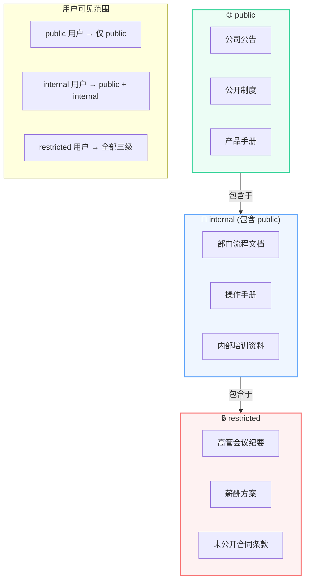
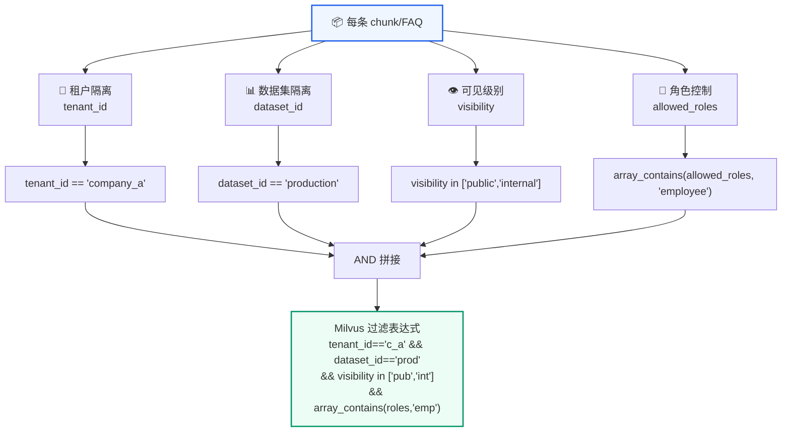
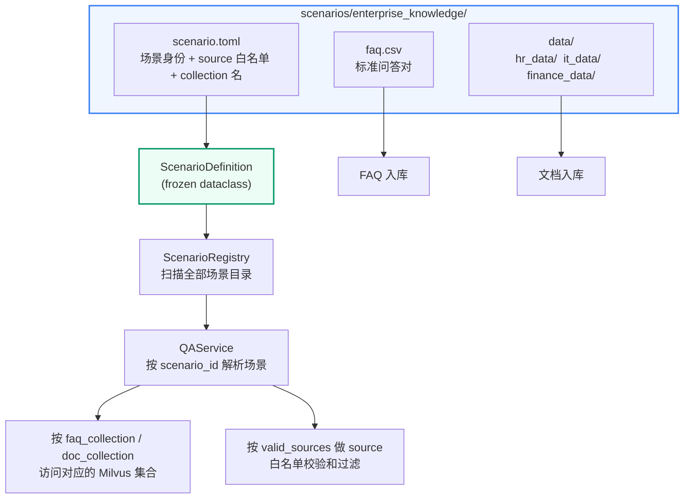
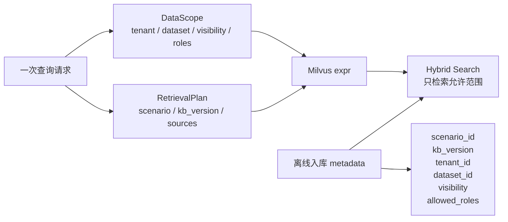
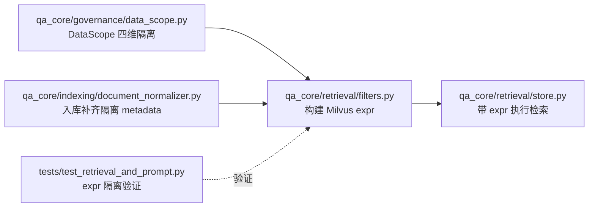

# 数据隔离
<Badge icon="clock" color="green">Written: 2026.06</Badge>
> 第 15 章跟敲代码：`codealong/chapters/ch15_data_isolation`。
> 这部分代码是本章跟敲版，用来先跑通核心闭环；完整项目源码仍以本讲后文标注的 `qa_core/`、`scripts/` 等路径为准。

**上一讲**：[知识库多版本管理](/RAG/production/kb-versioning)  
**下一讲**：[文档入库与索引链路](/RAG/production/ingestion-pipeline)

## 本讲目标

- 理解 RAG 系统中的数据隔离需求
- 掌握 DataScope 的结构和各字段含义
- 理解隔离字段如何拼入 Milvus 过滤表达式
- 理解轻量多租户方案的适用场景和局限性

---

## 第一部分：前置知识 — 多租户与数据隔离

### 1.1 什么是多租户

**多租户（Multi-Tenancy）** 是指同一个软件实例同时服务多个客户（租户），每个客户的数据必须完全隔离。

```text
传统系统（单租户）：
  一家公司 → 一套部署 → 一个数据库

多租户系统：
  公司 A ─┐
  公司 B ─┼─ 同一套部署 ─ 同一个 Milvus Collection
  公司 C ─┘   ↓
           通过 tenant_id 字段区分数据
```

### 1.2 RAG 系统中的隔离维度

在 RAG 知识问答系统中，数据隔离有几个维度：

| 维度 | 问题 | 例子 |
| --- | --- | --- |
| 租户隔离 | A 公司能看到 B 公司的资料吗？ | `tenant_id="company_a"` 不应查到 `tenant_id="company_b"` 的数据 |
| 数据集隔离 | 生产环境和测试环境的数据混查？ | `dataset_id="production"` 不应查到 `dataset_id="test"` 的数据 |
| 可见性 | 实习生能看到高管会议纪要吗？ | `visibility="restricted"` 的内容不应被普通员工检索到 |
| 角色隔离 | HR 能看到财务数据吗？ | HR 角色不应查到 `allowed_roles=["finance_admin"]` 的数据 |

---

## 第二部分：DataScope 数据结构

```python
# qa_core/governance/data_scope.py
@dataclass(frozen=True)
class DataScope:
    """一次查询的数据访问范围。"""
    tenant_id: str = "default"        # 租户标识
    dataset_id: str = "default"       # 数据集标识
    visibility: str = "public"         # 可见级别
    user_roles: list[str] = field(default_factory=lambda: ["public"])  # 当前请求用户具备的角色

    def expr_clauses(self) -> list[str]:
        """生成 Milvus 过滤表达式子句。"""
        clauses = []

        if self.tenant_id:
            safe_tenant = escape_expr_value(self.tenant_id)
            clauses.append(f'tenant_id == "{safe_tenant}"')

        if self.dataset_id:
            safe_dataset = escape_expr_value(self.dataset_id)
            clauses.append(f'dataset_id == "{safe_dataset}"')

        if self.visibility:
            safe_vis = escape_expr_value(self.visibility)
            # IN 表达式：支持多级别可见性
            if self.visibility == "public":
                clauses.append(f'visibility in ["public"]')
            elif self.visibility == "internal":
                clauses.append(f'visibility in ["public", "internal"]')
            elif self.visibility == "restricted":
                clauses.append(f'visibility in ["public", "internal", "restricted"]')

        # 角色过滤：当前用户角色必须在文档允许的角色列表中
        if self.user_role and self.allowed_roles:
            # 使用 array_contains 或 IN 表达式
            safe_role = escape_expr_value(self.user_role)
            clauses.append(f'array_contains(allowed_roles, "{safe_role}")')

        return clauses
```

### 2.2 可见性层级



**这张图定义了数据可见性的层级模型——它决定了"谁能看到什么"。**

三层从外到内呈同心圆嵌套关系（外层内容被内层包含）：

| 层级 | 典型数据 | 谁能看到 |
| --- | --- | --- |
| `public` | 公司公告、公开制度、产品手册 | **所有人**（包括未登录用户） |
| `internal` | 部门流程文档、操作手册、内部培训资料 | internal 用户 + restricted 用户（**包含** public 内容） |
| `restricted` | 高管会议纪要、薪酬方案、未公开合同 | 仅 restricted 用户（**包含** public + internal 内容） |

关键的包含关系：`public ⊂ internal ⊂ restricted`。箭头从外指向内（"包含于"），而不是从内指向外。这个设计意味着：

- 标记为 `internal` 的用户，检索时自动包含 `public` 和 `internal` 的数据
- 标记为 `restricted` 的用户，检索时自动包含全部三级数据
- 不存在"只查 restricted 不查 internal"的情况——上级天然覆盖下级

**为什么不是"各层级独立，用户属于哪个层级就只查哪个"？** 因为在企业场景中，高层级用户（如合规审计员）查资料时，如果搜不到公司公告（public），会很困惑。嵌套模型让权限高的用户看到的信息更全，而不是更窄。

对应的 Milvus 过滤表达式（见 2.1 节代码）：
- `visibility="public"` → `visibility in ["public"]`
- `visibility="internal"` → `visibility in ["public", "internal"]`
- `visibility="restricted"` → `visibility in ["public", "internal", "restricted"]`

### 多维度隔离全景



**这张图展示了数据隔离的完整拼图——不是只有 visibility 一个维度。**

每条存入 Milvus 的 chunk 和 FAQ 都携带四个独立的隔离字段，检索时通过 AND 拼接成完整过滤表达式：

| 维度 | 字段 | 解决的问题 | 典型值 |
| --- | --- | --- | --- |
| 租户隔离 | `tenant_id` | 不同公司/部门的数据不能互查 | `"company_a"`, `"company_b"` |
| 数据集隔离 | `dataset_id` | 同一租户下，生产数据和测试数据不能混 | `"production"`, `"staging"`, `"default"` |
| 可见级别 | `visibility` | 同一数据集下，敏感资料仅限特定用户 | `"public"`, `"internal"`, `"restricted"` |
| 角色控制 | `allowed_roles` | 同一可见级别下，特定角色才能访问 | `["legal", "hr", "admin"]` |

四个维度从上到下逐步收紧：先限定租户（最粗粒度），再限定数据集，再限定可见级别，最后检查角色。最终拼成的 Milvus 表达式类似：

```text
tenant_id == "company_a" && dataset_id == "production" && visibility in ["public", "internal"] && array_contains(allowed_roles, "employee")
```

**为什么不用一个大而全的字段（如 access\_level）把四个维度都编码进去？** 因为运维场景中这四个维度的管理节奏完全不同：
- `tenant_id` 几乎不变（一套部署服务一家公司）
- `dataset_id` 在知识库版本更新时可能切换（从 staging 切到 production）
- `visibility` 随文档敏感性逐文档设置
- `allowed_roles` 随组织架构调整而增减

拆成四个独立字段后，每个维度的管理脚本可以独立运行，不需要拼一个复杂的编码规则。Milvus 的 AND 拼接天然支持这种多字段组合，性能没有额外损耗。

### 2.3 DataScope 的解析

```text
def resolve_data_scope(
    *,
    tenant_id: str | None = None,
    dataset_id: str | None = None,
    visibility: str | None = None,
    user_roles: list[str] | tuple[str, ...] | None = None,
    user_role: str | None = None,
) -> DataScope:
    """构建当前请求或入库任务的数据域。"""
    return DataScope.from_request(
        tenant_id=tenant_id,
        dataset_id=dataset_id,
        visibility=visibility,
        user_roles=user_roles,
        user_role=user_role,
    )
```

---

## 第三部分：入库时的隔离字段

### 3.1 每个 chunk 的 metadata 中包含隔离信息

```text
# 文档入库时
chunk_metadata = {
    "chunk_id": "abc123",
    "source": "hr",
    "tenant_id": "company_a",         # 租户
    "dataset_id": "production_v2",    # 数据集
    "visibility": "internal",         # 可见级别
    "allowed_roles": ["employee", "manager", "hr_admin"],  # 允许的角色
    "kb_version": "kb_...",
    ...
}

# FAQ 入库时
faq_metadata = {
    "faq_id": "faq_001",
    "source": "billing",
    "tenant_id": "company_a",
    "dataset_id": "production_v2",
    "visibility": "internal",
    "allowed_roles": ["employee", "billing_admin"],
    "kb_version": "kb_...",
    ...
}
```

### 3.2 入库时指定数据范围

```text
# ingest_directory() 接收完整的隔离参数
ingest_directory(
    directory_path="scenarios/enterprise_knowledge/data/hr_data",
    source="hr",
    tenant_id="company_a",
    dataset_id="production_v2",
    visibility="internal",
    allowed_roles=["employee", "manager", "hr_admin"],
    kb_version=current_version,
)
```

---

## 第四部分：检索时的过滤表达式

### 4.1 拼接完整过滤表达式

```text
# 一次实际检索的过滤器拼接
clauses = []

# source 过滤
if source_filter:
    clauses.append(f'source == "{escape_expr_value(source_filter)}"')

# 版本过滤
if kb_version:
    clauses.append(f'kb_version == "{escape_expr_value(kb_version)}"')

# 数据隔离
if data_scope:
    clauses.extend(data_scope.expr_clauses())

# 最终表达式
expr = " and ".join(clauses)
# 结果：'source == "hr" and kb_version == "kb_xxx" and tenant_id == "company_a" and dataset_id == "production_v2" and visibility in ["public", "internal"] and array_contains(allowed_roles, "employee")'
```

### 4.2 在前端请求中传入隔离参数

```text
// WebSocket 请求
{
    "query": "入职流程有哪些步骤",
    "session_id": "...",
    "scenario_id": "enterprise_knowledge",
    "source_filter": "hr",
    "tenant_id": "company_a",
    "dataset_id": "production_v2",
    "visibility": "internal",
    "user_role": "employee",
    "user_roles": ["employee", "manager"]
}
```

---

## 第五部分：安全转义

### 5.1 为什么要安全转义

Milvus 的过滤表达式是一个类 SQL 的字符串。如果直接把用户输入拼入表达式，存在注入风险：

```text
# 危险！如果用户输入 source_filter = 'hr" or 1==1 or "'
expr = f'source == "{source_filter}"'
# 结果：source == "hr" or 1==1 or "" → 绕过了 source 过滤！
```

### 5.2 escape\_expr\_value() 实现

```python
def escape_expr_value(value: str) -> str:
    """转义 Milvus 表达式中的特殊字符。"""
    return value.replace('\\', '\\\\').replace('"', '\\"')
```

Milvus 表达式使用双引号包裹字符串值，因此只需要转义反斜杠和双引号。

### 5.3 白名单 + 转义双重保护

```text
# 双重保护
if source_filter:
    # 第一层：白名单校验
    if valid_sources and source_filter not in valid_sources:
        raise ValueError(f"无效的业务分类：{source_filter}")

    # 第二层：安全转义
    safe_source = escape_expr_value(source_filter)
    clauses.append(f'source == "{safe_source}"')
```

---

## 第六部分：本方案的适用场景与局限

### 6.1 适用场景

- **轻量多租户**：几个到几十个租户，通过 tenant\_id 区分
- **教学和演示**：展示多租户隔离的概念
- **企业内部**：按部门、角色做数据隔离

### 6.2 当前局限

- **共享 Collection**：所有租户的数据在同一个 Milvus Collection 中，通过表达式过滤实现逻辑隔离
- **角色过滤**：`allowed_roles` 存储为数组，使用 `array_contains` 过滤，在小规模场景下可行
- **不是真正的多租户架构**：如果扩展到数百个租户，建议使用 Milvus 的 Partition Key 功能

### 6.3 升级路径

如果项目需要更严格的隔离：

```text
当前方案：共享 Collection + 表达式过滤
  ↓
升级方案 1：Partition Key（按 tenant_id 分区）
  ↓
升级方案 2：Database 级隔离（每个租户独立的 Milvus Database）
```

但当前方案对于教学和演示目的已经足够，而且实现简单、易于理解。

---

## 第七部分：场景配置全貌 — 如何维护既有业务场景

虽然本讲的主题是数据隔离，但数据隔离和场景配置是紧密相关的。一个业务场景的完整配置决定了它的 source 白名单、数据范围、知识库版本和隔离策略。当前项目已经冻结为 8 个业务场景，一期不再新增第 9 个场景；这里重点讲清楚既有场景如何维护，以及为什么维护 source、FAQ 和资料不需要改主链路代码。

### 6.1 场景配置的层级结构



### 6.2 scenario.toml 完整字段说明

以 `enterprise_knowledge` 场景为例：

```text
# scenarios/enterprise_knowledge/scenario.toml

# === 必填：场景身份 ===
scenario_id = "enterprise_knowledge"    # 唯一标识，用于 API 切换
display_name = "企业内部知识助手"         # 页面标题、回答中显示的助手名
industry = "通用企业"                   # 行业标签
assistant_name = "小知"                 # LLM System Prompt 中的角色名
business_domain = "企业内部制度与流程"    # LLM System Prompt 中的业务域描述
support_contact = "IT 服务台 分机 1234"  # 人工客服/信息不足时提供的联系方式
description = "面向 HR、IT、财务等内部制度的知识问答"  # 场景说明

# === 必填：数据源白名单 ===
valid_sources = ["hr", "it", "finance"]
# ↑ 这三个值会在 QAService.validate_source() 中做白名单校验
# ↑ 页面的 source 下拉框也基于这个列表生成

# === 必填：Milvus 集合名 ===
faq_collection = "enterprise_knowledge_faq"
doc_collection = "enterprise_knowledge_doc"
# ↑ 每个场景有独立的 FAQ 和文档集合，避免跨场景串库

# === 选填：source 中文标签（页面下拉框展示用） ===
[source_labels]
hr = "HR 制度"
it = "IT 支持"
finance = "财务报销"

# === 选填：source 推断正则（用于自动推断用户问题属于哪个 source） ===
[source_patterns]
hr = "(入职|离职|转正|调岗|考勤|请假|年假|加班|薪酬|绩效|社保)"
it = "(VPN|密码|网络|打印机|电脑|邮箱|账号|wifi|系统|OA|审批流|服务器)"
finance = "(报销|发票|预算|付款|采购|差旅|费用|借款|对公|对私)"

# === 选填：简历包装 ===
resume_project_name = "企业内部知识库智能问答平台"
resume_keywords = ["企业制度", "HR", "IT", "财务", "知识库"]

# === 选填：页面快捷提问 ===
sample_questions = [
    "新人入职流程怎么走",
    "VPN 连不上怎么处理",
    "员工报销需要准备哪些材料",
]

# === 选填：数据目录（默认值 = 场景目录下的 data/） ===
# data_root = "data"
# faq_csv_path = "faq.csv"
```

### 6.3 维护一个既有场景的完整步骤

假设要维护 `engineering_project_qa` 场景，补充“图纸会审”资料。只需以下步骤：

**步骤 1**：创建场景目录和配置文件

```text
scenarios/
└── engineering_project_qa/
    ├── scenario.toml    ← 维护 source 白名单、关键词和页面示例问题
    ├── faq.csv          ← 补充或修正 FAQ 标准问答
    └── data/
        ├── drawing_data/    ← 图纸资料
        ├── quality_data/    ← 质量验收资料
        └── safety_data/     ← 安全资料
```

**步骤 2**：维护 scenario.toml

```text
scenario_id = "engineering_project_qa"
display_name = "工程项目资料助手"
industry = "工程项目管理"
assistant_name = "工程资料助手"
business_domain = "工程图纸、规范、质量、安全和验收资料"
support_contact = "项目资料室"
description = "面向工程项目资料、施工规范和验收要求的知识问答"

valid_sources = ["drawing", "specification", "quality", "safety", "acceptance"]
faq_collection = "engineering_project_qa_faq"
doc_collection = "engineering_project_qa_doc"

[source_labels]
drawing = "图纸资料"
specification = "标准规范"
quality = "质量资料"
safety = "安全资料"
acceptance = "验收资料"

[source_patterns]
drawing = "(图纸|施工图|设计变更|图纸会审|深化图)"
specification = "(规范|标准|强制性条文|条文|规程)"
quality = "(质量|检验批|隐蔽工程|验收记录|实测实量)"
safety = "(安全|交底|危大工程|专项方案|防护)"
acceptance = "(验收|竣工|移交|资料归档|备案)"

resume_project_name = "工程项目资料与施工规范 RAG 问答助手"
resume_keywords = ["工程资料", "标准规范", "图纸会审", "质量验收"]

sample_questions = [
    "图纸会审记录和设计变更冲突时怎么办",
    "隐蔽工程验收资料需要哪些附件",
    "安全技术交底只有口头说明可以吗",
]
```

**步骤 3**：编写 FAQ CSV

```text
question,answer,source
图纸会审记录和设计变更冲突时怎么办,应以审批后的设计变更或最新有效图纸为准，并保留会审记录、变更通知和审批记录，禁止直接按口头说明施工。,drawing
隐蔽工程验收资料需要哪些附件,通常需要隐蔽验收记录、影像资料、检验批资料、材料合格证明和监理签认记录，具体以项目资料管理要求为准。,quality
```

**步骤 4**：准备知识库资料

在 `data/drawing_data/`、`data/quality_data/`、`data/safety_data/` 等既有 source 目录下放入 Markdown、PDF、Word、Excel 等资料。

**步骤 5**：执行入库

```text
python scripts/rebuild_kb_version.py --scenario engineering_project_qa --new-version --force --quality-gate --activate
```

**步骤 6**：评测验证（可选但推荐）

在 `eval_sets/` 下补充该场景的回归样本，然后运行：

```text
python scripts/evaluate_core_chain.py --dataset eval_sets/business_depth_regression.json --limit 32 --output reports/evaluation/business_depth_regression_live_32.json
python scripts/check_evaluation_gate.py --report reports/evaluation/business_depth_regression_live_32.json
```

**步骤 7**：启动后验证

重启服务，在页面选择「工程项目资料助手」后提问新增 FAQ 或资料相关问题。维护既有场景时仍然是**代码零修改，不需要改任何 Python 文件**。

### 6.4 场景配置如何影响主链路

```mermaid
flowchart LR
    subgraph Request["用户请求"]
        Q["query: '二类医疗器械注册需要哪些材料'"]
        SF["source_filter: null（未选）"]
        SID["scenario_id: 'medical_compliance'"]
    end

    subgraph ScenarioResolve["场景解析"]
        Registry["ScenarioRegistry.resolve('medical_compliance')"]
        Def["ScenarioDefinition<br/>valid_sources=['drug','device','privacy']<br/>faq_collection='medical_compliance_faq'"]
    end

    subgraph SourceInfer["Source 自动推断"]
        Patterns["compiled_source_patterns()<br/>drug: /(药品|GMP|...)/<br/>device: /(医疗器械|...)/<br/>privacy: /(患者|...)/"]
        Match["query 匹配 device 正则 → source='device'"]
    end

    subgraph MilvusQuery["Milvus 检索"]
        Filter["source_filter='device'<br/>kb_version='20260515_xxx'<br/>tenant_id='default'"]
        Search["MilvusHybridStore.search_many()<br/>collection='medical_compliance_faq'<br/>expr='source==\"device\" and kb_version==\"20260515_xxx\"...'"]
    end

    Request --> ScenarioResolve --> SourceInfer --> MilvusQuery

    style Request fill:#EFF6FF,stroke:#3B82F6,stroke-width:2px
    style ScenarioResolve fill:#ECFDF5,stroke:#059669,stroke-width:2px
    style SourceInfer fill:#FFFBEB,stroke:#D97706,stroke-width:2px
```

### 6.5 场景边界检测

为了防止用户在 A 场景下提问 B 场景的问题（导致低质量召回），系统内置了场景边界检测。

`detect_scenario_boundary()` 会遍历**所有已注册场景的 source\_patterns**，如果用户问题命中了其他场景的 source 正则，则返回提示：

```text
输入场景：enterprise_knowledge
用户问题："安全技术交底只有口头说明可以吗？"
→ 命中 engineering_project_qa 的 safety source_pattern
→ 返回："当前场景是'企业内部知识助手'，未在该场景资料中确认这个问题的依据。
         这个问题更像'工程项目资料问答'中的'安全资料'分类。请切换到对应场景后再查询。"
```

```python
# qa_core/scenarios/boundary.py

MIN_OTHER_SCENARIO_SCORE = 12
CURRENT_SCENARIO_SAFE_SCORE = 8

def detect_scenario_boundary(query: str, current_scenario: ScenarioDefinition) -> ScenarioBoundaryDecision:
    """判断当前问题是否明显属于其他场景。

    只有当当前场景几乎没有匹配，而其他场景有明确匹配时才阻断。这样可以避免"合同"
    "付款""安全"这类通用词在多个行业中出现时被误判为跨场景。
    """
    # 计算问题在当前场景中对各 source 的匹配分数，返回最像的 source 和对应分数
    current_source, current_score = score_source_matches(query, current_scenario)
    if current_source and current_score >= CURRENT_SCENARIO_SAFE_SCORE:
        return ScenarioBoundaryDecision(crossed=False, reason="current_scenario_matched")

    best_scenario: ScenarioDefinition | None = None
    best_source = None
    best_score = 0
    # 获取所有已注册业务场景，逐一判断问题是否更匹配其他场景
    for scenario in get_scenario_registry().list_scenarios():
        if scenario.scenario_id == current_scenario.scenario_id:
            continue
        source, score = score_source_matches(query, scenario)
        if source and score > best_score:
            best_scenario = scenario
            best_source = source
            best_score = score

    if best_scenario is None or best_source is None or best_score < MIN_OTHER_SCENARIO_SCORE:
        return ScenarioBoundaryDecision(crossed=False, reason="no_strong_other_scenario")

    return ScenarioBoundaryDecision(
        crossed=True,
        matched_scenario_id=best_scenario.scenario_id,
        matched_scenario_name=best_scenario.display_name,
        matched_source=best_source,
        matched_source_label=best_scenario.label_for_source(best_source),
        reason=f"other_scenario_score={best_score}, current_score={current_score}",
    )
```

**工作流程**：

1. 先用 `score_source_matches()` 计算当前场景的匹配分数。如果当前场景已有足够证据（`>= CURRENT_SCENARIO_SAFE_SCORE`），说明问题在本场景内有明确归属，直接放行。
2. 遍历所有其他已注册场景，逐一计算 `score_source_matches()`，找到匹配分数最高的那个（`best_score`）。
3. 如果最高分低于 `MIN_OTHER_SCENARIO_SCORE`（12 分），说明没有足够强的跨场景证据，不阻断。
4. 否则返回 `crossed=True` 和匹配到的目标场景信息，由上游决定如何提示用户切换。

辅助函数 `score_source_matches()` 和 `score_source_map()` 负责计算得分：命中 source\_pattern 正则的次数乘以 10，加上匹配文本总长度，再减去 source 配置顺序的优先级偏移。这样分数高的 source 一定是"频率高、命中长、配置靠前"的那个。

这个机制保护了检索质量——用户不会因为场景选错而得到错误来源的资料。

### 6.6 场景配置与数据隔离的关系

| 配置层 | 作用 | 数据隔离维度 |
| --- | --- | --- |
| `valid_sources` | 限制用户可选的 source | source 级过滤 |
| `faq_collection` / `doc_collection` | 每个场景独立集合 | 物理级隔离 |
| `source_patterns` | 自动推断 source | 意图驱动的过滤 |
| DataScope (`tenant/dataset/visibility/role`) | 同一场景内的进一步隔离 | 逻辑级隔离 |

场景配置定义了"这个问题应该去哪查"，数据隔离定义了"这个用户能看哪些数据"。两者叠加构成了完整的访问控制。

---

## 本讲实践闭环

| 项目 | 内容 |
| --- | --- |
| 本讲类型 | 工程治理 |
| 实践产物 | `DataScope`、租户/数据集/可见性/角色过滤表达式 |
| 是否进入最终项目 | 是 |
| 验收方式 | 生成 Milvus expr，确认包含 scenario、kb\_version、tenant、dataset、source 等条件 |
| 后续落点 | 第 8 讲检索过滤，第 16 讲入库 metadata 标准化 |

通过标准：同一 collection 中的数据不会跨场景、跨版本、跨租户混查。

### 本讲从 0 到 1 实现闭环

这一讲要实现的是“同一个 collection 里可以放多场景、多版本、多租户数据，但查询时不能混查”。实现顺序如下：



1. 先定义 `DataScope`，描述一次请求允许访问的数据范围。
2. 入库时把 `tenant_id`、`dataset_id`、`visibility`、`allowed_roles` 写入每个 chunk metadata。
3. 检索前把 `DataScope` 转成 Milvus expr。
4. 最后用测试验证 expr 同时包含场景、版本、租户、数据集、source、角色条件。

实现完成后，相关代码结构应该是下面这张图：



来源：真实代码节选，见 `qa_core/governance/data_scope.py`。

```python
@dataclass(frozen=True)
class DataScope:
    tenant_id: str = "default"
    dataset_id: str = "default"
    visibility: str = "public"
    user_roles: tuple[str, ...] = ("public",)
```

检索表达式不是简单拼 source，还要把场景、版本和权限边界都拼进去。

来源：真实代码逻辑压缩版，对应 `qa_core/retrieval/filters.py::build_source_expr()`。

```python
def build_source_expr(source_filter, kb_version=None, valid_sources=None, data_scope=None):
    validate_source_filter(source_filter, valid_sources)
    clauses = []

    if source_filter:
        safe_source = escape_expr_value(str(source_filter))
        clauses.append(f'source == "{safe_source}"')

    if kb_version:
        safe_version = escape_expr_value(str(kb_version))
        clauses.append(f'kb_version == "{safe_version}"')

    if data_scope is not None:
        clauses.extend(data_scope.expr_clauses())

    return " and ".join(clauses) if clauses else None
```

`scenario_id`、`tenant_id`、`dataset_id`、`visibility`、`allowed_roles` 由 `DataScope.expr_clauses()` 统一生成；`source_filter` 先过 `valid_sources` 白名单，再进入 Milvus expr。

入库标准化阶段必须补齐隔离字段，否则检索时再严格也查不到正确数据，或者出现跨域混查。

来源：真实代码调用点，见 `qa_core/indexing/document_normalizer.py`。

```text
doc.metadata.update({
    "scenario_id": scenario_id,
    "kb_version": kb_version,
    "tenant_id": scope.tenant_id,
    "dataset_id": scope.dataset_id,
    "visibility": scope.visibility,
})
```

验收时不用连接 Milvus，也可以先验证表达式字符串是否包含所有隔离条件。

来源：命令行验收，对应 `tests/test_retrieval_and_prompt.py`。

```bash
python -m pytest tests/test_retrieval_and_prompt.py -q
```

闭环验证重点：

| 验证项 | 验证方式 | 期望结果 |
| --- | --- | --- |
| 入库 metadata | 查看 chunk metadata | 有 tenant/dataset/visibility/roles |
| 检索 expr | 单测检查字符串 | 包含场景、版本、租户、数据集 |
| source 白名单 | 传入非法 source | 被拒绝或忽略 |
| 角色隔离 | 切换 user\_roles | 只能看到允许数据 |
| 场景隔离 | 切换 scenario | 不跨场景召回 |

验收重点：数据隔离既要在入库 metadata 中存在，也要在检索 expr 中生效；只做其中一边都不完整。

## 重点掌握

| 优先级 | 内容 | 原因 |
| --- | --- | --- |
| ★★★ 必会 | DataScope 的四维隔离结构：tenant\_id（租户）、dataset\_id（数据集）、visibility（可见性）、user\_roles/allowed\_roles（角色） | 数据隔离的完整模型 |
| ★★★ 必会 | 可见性层级嵌套关系：public ⊂ internal ⊂ restricted，上层用户自动覆盖下层内容 | 企业权限管理的常见模型 |
| ★★★ 必会 | 隔离字段写入 chunk metadata + 检索时拼入 Milvus expr 实现逻辑隔离 | 数据隔离的核心实现方式 |
| ★★ 理解 | 白名单校验 + 安全转义（escape\_expr\_value）的双重保护 | 防止表达式注入的关键设计 |
| ★★ 理解 | 场景配置（scenario.toml）的结构：valid\_sources、faq/doc\_collection、source\_patterns 等 | 理解如何维护业务场景 |
| ★★ 理解 | 场景边界检测（detect\_scenario\_boundary）：当问题明显属于其他场景时给出提示 | 防止选错场景导致低质量召回 |
| ★ 了解 | 轻量多租户方案的适用场景和局限性（数十个租户 vs 数百个租户需升级） | 了解设计边界 |
| ★ 了解 | source 自动推断（从 scenario.toml 的 source\_patterns 匹配） | 回顾第 4 讲内容 |

## 本讲小结

- **DataScope** 封装了一次查询的数据访问范围（租户、数据集、可见性、角色）
- **可见性层级**：public ⊂ internal ⊂ restricted，下层包含上层内容
- **隔离字段在入库时写入**每个 chunk 的 metadata，检索时拼入 Milvus 表达式
- **双重保护**：白名单校验 + 安全转义，防止表达式注入
- 当前方案是轻量多租户方案，适合教学和演示，大规模场景需要更严格的隔离

**下一讲**：[文档入库与索引链路](/RAG/production/ingestion-pipeline) — 文档加载、切分、FAQ 入库、增量清单