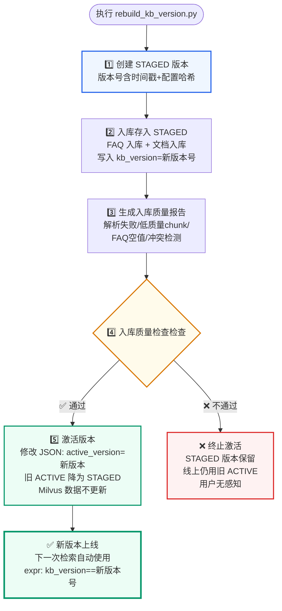
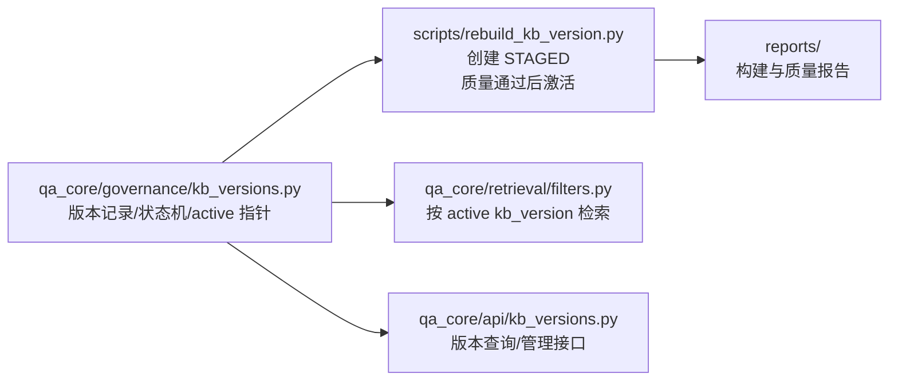

# 知识库版本管理
<Badge icon="clock" color="green">Written: 2026.06</Badge>
> 第 14 章跟敲代码：`codealong/chapters/ch14_kb_versioning`。
> 这部分代码是本章跟敲版，用来先跑通核心闭环；完整项目源码仍以本讲后文标注的 `qa_core/`、`scripts/` 等路径为准。

**上一讲**：[应用入口与环境前置校验](/RAG/pipeline/app-entry-preflight)  
**下一讲**：[数据隔离与多租户设计](/RAG/production/data-isolation)

## 本讲目标

- 理解为什么 RAG 系统需要知识库版本管理
- 掌握版本状态机的设计（STAGED → ACTIVE → ARCHIVED）
- 理解版本切换的实现（O(1) 操作，不批量更新 Milvus）
- 理解版本号生成的设计（时间戳 + 配置哈希）

---

## 第一部分：前置知识 — 为什么 RAG 需要版本管理

### 1.1 不加版本管理的风险

假设你用一个脚本把 500 个业务文档写入 Milvus。运行完毕后：

```text
场景 A：一切正常，问答效果好

场景 B：你发现新的 Embedding 模型（bge-m3-v2）效果更好，想切换
  → 重新入库，覆盖了旧的向量数据
  → 新模型效果反而更差（新的切分策略导致 chunk 太碎）
  → 无法回滚，因为旧数据已经被覆盖了

场景 C：你修改了文档切分参数（chunk_size 从 500 改为 300）
  → 想对比新旧切分方案的效果
  → 没有版本机制，你只能删除旧数据重建，对比无从谈起
```

**版本管理的核心价值**：让知识库的更新成为**可逆操作**。

### 1.2 版本管理的典型需求

| 需求 | 说明 |
| --- | --- |
| 安全入库 | 新版本先写入，不影响线上正在使用的版本 |
| 灰度验证 | 新版本入库后先评测，确定没问题再切换 |
| 快速回滚 | 新版本效果不好，一键切回旧版本 |
| 对比评测 | 同一个问题可以分别在新旧版本上验证召回效果 |
| 长期保留 | 历史版本不删除，作为 A/B 测试和故障分析的依据 |

---

## 第二部分：版本状态机

### 2.1 三种状态

```text
stateDiagram-v2
    [*] --> STAGED : 入库完成

    STAGED --> ACTIVE : 激活版本<br/>仅修改 JSON 文件
    STAGED --> ARCHIVED : 直接归档<br/>从未激活的版本

    ACTIVE --> STAGED : 回滚/新版本激活<br/>旧 ACTIVE 降级
    ACTIVE --> ARCHIVED : 长期不用后归档

    ARCHIVED --> [*] : Milvus 数据保留<br/>可手动清理

    note right of ACTIVE
        在线检索表达式：
        kb_version == "active_version"
        同一场景只有一个 ACTIVE
    end note

    note right of STAGED
        已写入 Milvus
        评测验证中
        用户检索不可见
    end note
```

### 安全入库与激活流程



- **STAGED**：版本已写入 Milvus，但线上检索不使用。通常用于新入库的版本，等待评测验证。
- **ACTIVE**：当前在线检索使用的版本。同一场景只有一个 ACTIVE 版本。
- **ARCHIVED**：不再使用的历史版本。数据和 Milvus chunk 都保留，但不参与在线检索。

### 2.2 状态转换实现

下面的代码展示的是步骤 5（激活）和归档操作。步骤 1（创建版本）见 `ensure_version()`，步骤 2（入库写入）见第 16 讲，步骤 3-4（质量报告和门控）见第 17 讲。

```python
# qa_core/governance/kb_versions.py

def activate_version(self, kb_version: str) -> KnowledgeBaseVersion:
    """把指定版本切为当前在线检索版本。

    激活只修改版本清单 JSON 文件，不更新 Milvus 数据。
    """  # → 流程图节点 5️⃣：激活版本
    self.reload()  # 重新加载，避免内存中的旧数据覆盖磁盘
    record = self.get(kb_version)
    if record is None:
        raise ValueError(f"知识库版本不存在：{kb_version}")

    previous = str(self.data.get("active_version") or "")
    now = utc_now()

    # 更新所有版本的状态
    for vid, raw in self.data["versions"].items():
        item = KnowledgeBaseVersion.from_dict(raw)
        if vid == kb_version:
            item.status = "ACTIVE"
            item.activated_at = now
        elif item.status == "ACTIVE":
            item.status = "STAGED"  # 旧 active 降级为 STAGED
        self.data["versions"][vid] = item.as_dict()

    # 更新清单的指针
    self.data["previous_version"] = previous if previous != kb_version else ...
    self.data["active_version"] = kb_version
    self.save()  # 写入磁盘
    return self.get(kb_version) or record

def archive_version(self, kb_version: str) -> KnowledgeBaseVersion:
    """归档一个非 active 版本。

    归档不会删除 Milvus 数据，只是状态标记。
    """  # → 流程图未展示的附加操作：归档
    if self.active_version_candidate() == kb_version:
        raise ValueError("不能归档当前 active 知识库版本")

    record = self.get(kb_version)
    record.status = "ARCHIVED"
    record.archived_at = utc_now()
    self.data["versions"][kb_version] = record.as_dict()
    self.save()
    return record
```

### 2.3 激活操作的轻量性

**关键设计**：激活版本只修改一个 JSON 文件，不碰 Milvus。

```text
激活前的在线检索：
  Milvus expr 包含 kb_version == "v1"

激活后的在线检索：
  Milvus expr 包含 kb_version == "v2"
  v1 的 chunk 数据仍在 Milvus 中，只是不再被查到
```

如果激活需要修改所有 chunk 的 metadata，一个 10 万条 chunk 的知识库需要很长时间。通过把版本切换放在检索表达式中，版本切换变成了 O(1) 操作。

---

## 第三部分：版本号设计

### 3.1 版本号生成

```python
def generate_kb_version(prefix="kb", scenario_id=None) -> str:
    """生成一个适合人读和机器过滤的知识库版本号。

    包含：
    - 时间戳：便于肉眼判断版本先后
    - 配置短 hash：把 embedding、reranker、chunk_schema、collection
      等关键配置纳入标识
    """
    settings = get_settings()
    scenario = _resolve_version_scenario(scenario_id)  # 私有 helper，避免 settings -> scenarios -> kb_versions 循环导入

    stamp = utc_file_stamp()  # 如 20260506_103000（年月日_时分秒）
    config_hash = stable_hash(
        scenario.scenario_id,
        settings.embedding_model_version,    # 如 "bge-m3-local-v1"
        settings.reranker_model_version,     # 如 "bge-reranker-v1"
        settings.chunk_schema_version,       # 如 "parent_child_v1"
        scenario.doc_collection,
        scenario.faq_collection,
    )[:8]  # 只取前 8 位

    return f"{prefix}_{scenario.scenario_id}_{stamp}_{config_hash}"
    # 例：kb_enterprise_knowledge_20260506_103000_9f2a1b3c
```

### 3.2 为什么版本号包含配置哈希

设计意图：从版本号可以直接判断两个版本是否使用同一套配置。

```text
kb_enterprise_knowledge_20260506_103000_9f2a1b3c
kb_enterprise_knowledge_20260507_150000_7d3e8f1a
                           不同日期 ↑         不同 hash ↑
```

如果两个版本的 hash 相同但日期不同，说明是同一套配置下的数据更新（新增/修改了文档）。
如果 hash 不同，说明 Embedding 模型、Reranker 模型或 Chunk 方案有变化，需要重点关注召回质量的对比。

---

## 第四部分：版本清单文件

### 4.1 文件结构

```json
{
    "scenario_id": "enterprise_knowledge",
    "active_version": "kb_enterprise_knowledge_20260507_150000_7d3e8f1a",
    "previous_version": "kb_enterprise_knowledge_20260506_103000_9f2a1b3c",
    "versions": {
        "kb_enterprise_knowledge_20260506_103000_9f2a1b3c": {
            "kb_version": "kb_enterprise_knowledge_20260506_103000_9f2a1b3c",
            "status": "STAGED",
            "created_at": "2026-05-06T10:30:00Z",
            "activated_at": "2026-05-06T10:35:00Z",
            "doc_collection": "enterprise_knowledge_doc",
            "faq_collection": "enterprise_knowledge_faq",
            "embedding_model_version": "bge-m3-local-v1",
            "reranker_model_version": "bge-reranker-v1",
            "chunk_schema_version": "parent_child_v1",
            "sources": ["hr", "it", "admin"],
            "stats": {
                "last_doc_count": 1523,
                "last_faq_count": 85,
                "total_doc_written": 1523,
                "total_faq_written": 85
            }
        },
        "kb_enterprise_knowledge_20260507_150000_7d3e8f1a": {
            "status": "ACTIVE",
            ...
        }
    }
}
```

### 4.2 KnowledgeBaseVersionStore 类

```python
class KnowledgeBaseVersionStore(JsonFileStore):
    """知识库版本清单读写器。

    每个场景有独立的版本清单文件：
    .index_manifest/<scenario_id>/kb_versions.json

    这样多场景教学项目可以为每个行业场景独立激活、
    回滚和对比知识库版本。
    """

    def __init__(self, path=None, scenario_id=None):
        self.scenario = _resolve_version_scenario(scenario_id)
        super().__init__(path or self.scenario.kb_versions_manifest_path)

    def resolve_active_version(self, requested=None) -> str:
        """解析一次检索应该使用的知识库版本。

        优先级：
        1. 请求显式传入的 kb_version（用于评测/灰度）
        2. 环境变量 ACTIVE_KB_VERSION
        3. 版本清单中的 active_version

        当前在线检索必须带版本过滤。没有 active 版本直接报错。
        """
        if requested:
            if not self.exists(requested):
                raise ValueError(f"请求的知识库版本不存在：{requested}")
            return requested

        active = self.active_version_candidate()
        if not active:
            raise ValueError(
                f"场景 {self.scenario.scenario_id} 没有 active 知识库版本"
            )
        if not self.exists(active):
            raise ValueError(
                f"active 知识库版本不存在于版本清单：{active}"
            )
        return active
```

---

## 第五部分：与 Milvus 检索的集成

### 5.1 写入时携带版本信息

```python
# qa_core/governance/kb_versions.py
def version_metadata(kb_version, scenario_id=None):
    """构建写入每个 FAQ/chunk metadata 的版本字段。"""
    settings = get_settings()
    scenario = _resolve_version_scenario(scenario_id)
    return {
        "scenario_id": scenario.scenario_id,
        "kb_version": kb_version,
        "embedding_model_version": settings.embedding_model_version,
        "reranker_model_version": settings.reranker_model_version,
        "chunk_schema_version": settings.chunk_schema_version,
    }
```

每条 FAQ 和 chunk 入库时，这些字段都会被写入 metadata：

```text
chunk = Document(
    page_content="入职流程包括以下步骤...",
    metadata={
        "source": "hr",
        "chunk_id": "abc123",
        "kb_version": "kb_enterprise_knowledge_20260507_150000_7d3e8f1a",
        "embedding_model_version": "bge-m3-local-v1",
        ...
    }
)
```

### 5.2 检索时过滤版本

```text
# 在线检索
active_version = resolve_active_kb_version(requested, scenario.scenario_id)
# active_version = "kb_enterprise_knowledge_20260507_150000_7d3e8f1a"

# 拼入 Milvus 表达式
expr = f'kb_version == "{active_version}" and source == "hr" and ...'

# 只检索 active 版本的 chunk
results = milvus_store.similarity_search(query, expr=expr)
```

### 5.3 评测用历史版本

```text
# 评测脚本可以显式指定历史版本
service.debug_retrieval(
    query="入职流程有哪些步骤",
    kb_version="kb_enterprise_knowledge_20260506_103000_9f2a1b3c",  # 旧版本
    ...
)

# 对比两个版本对同一批问题的召回效果
for question in eval_set:
    old_result = service.debug_retrieval(query=question, kb_version=old_version)
    new_result = service.debug_retrieval(query=question, kb_version=new_version)
    compare(old_result, new_result)
```

---

## 第六部分：全量重建的安全流程

```text
python scripts/rebuild_kb_version.py --scenario enterprise_knowledge --new-version --force --quality-gate --activate
```

执行顺序：

```text
1. 创建 STAGED 版本（version = "kb_...20260507_150000_xxxx"）
2. FAQ 入库（写入 STAGED 版本的 kb_version）
3. 文档入库（写入 STAGED 版本的 kb_version）
4. 生成入库质量报告
5. 执行入库质量检查
   ├─ 通过 → 激活版本（将 STAGED 切换为 ACTIVE）
   └─ 不通过 → 终止流程，STAGED 版本仍保留（不激活）
```

**关键安全点**：即使新的 STAGED 版本已经写入了 Milvus，只要没有执行激活步骤，线上检索仍然使用旧的 ACTIVE 版本。用户完全无感知。

---

## 本讲实践闭环

| 项目 | 内容 |
| --- | --- |
| 本讲类型 | 工程治理 |
| 实践产物 | `KnowledgeBaseVersionStore`、版本状态机、激活和回滚能力 |
| 是否进入最终项目 | 是 |
| 验收方式 | 创建 staged 版本，激活为 active，再归档旧版本 |
| 后续落点 | 第 16 讲入库生成版本，第 17 讲质量门禁控制激活 |

通过标准：任意时刻每个场景只有一个 active 版本，版本可追踪、可回滚。

### 本讲从 0 到 1 实现闭环

这一讲的核心是把“重建知识库”变成可追踪、可回滚的发布动作。实现顺序如下：

```text
stateDiagram-v2
    [*] --> STAGED: 新建版本并入库
    STAGED --> ACTIVE: 质量门禁通过 + activate
    ACTIVE --> ARCHIVED: 新版本激活后旧版本归档
    ARCHIVED --> ACTIVE: 回滚到历史版本
    STAGED --> ARCHIVED: 构建失败或废弃
```

1. 先定义版本状态：`STAGED`、`ACTIVE`、`ARCHIVED`。
2. 再实现版本清单 store，把每个场景的版本列表和 active 指针持久化。
3. 然后在入库脚本里先创建 staged 版本，质量通过后再激活。
4. 最后保证同一个场景任意时刻只有一个 active 版本。

实现完成后，相关代码结构应该是下面这张图：



来源：真实代码逻辑压缩版，对应 `qa_core/governance/kb_versions.py::KnowledgeBaseVersion`。

```python
@dataclass
class KnowledgeBaseVersion:
    kb_version: str
    scenario_id: str = ""
    status: str = "STAGED"
    description: str = ""
    created_at: str = field(default_factory=utc_now)
    activated_at: str | None = None
    archived_at: str | None = None
    doc_collection: str = ""
    faq_collection: str = ""
    embedding_model_version: str = ""
    reranker_model_version: str = ""
    chunk_schema_version: str = ""
    created_by: str = "local"
    sources: list[str] = field(default_factory=list)
    stats: dict[str, Any] = field(default_factory=dict)
```

激活版本不是改 Milvus 数据，而是修改版本清单里的 active 指针。这样切换速度快，也能随时回滚。

来源：真实代码逻辑压缩版，对应 `qa_core/governance/kb_versions.py::activate_version()`。

```python
def activate_version(self, kb_version: str) -> KnowledgeBaseVersion:
    self.reload()
    record = self.get(kb_version)
    if record is None:
        raise ValueError(f"知识库版本不存在：{kb_version}")

    previous = str(self.data.get("active_version") or "")
    now = utc_now()
    for vid, raw in self.data.setdefault("versions", {}).items():
        item = KnowledgeBaseVersion.from_dict(raw)
        if vid == kb_version:
            item.status = "ACTIVE"
            item.activated_at = now
        elif item.status == "ACTIVE":
            item.status = "STAGED"
        self.data["versions"][vid] = item.as_dict()

    self.data["previous_version"] = previous if previous != kb_version else str(self.data.get("previous_version") or "")
    self.data["active_version"] = kb_version
    self.save()
    return self.get(kb_version) or record
```

注意：真实代码激活新版本时，旧 ACTIVE 会降为 `STAGED`，不是自动归档为 `ARCHIVED`。归档是单独的 `archive_version()` 操作，并且不能归档当前 active 版本。

入库时，每个 chunk 都要写入 `scenario_id` 和 `kb_version`。线上检索通过 Milvus expr 只查当前 active 版本。

来源：真实代码调用点，见 `qa_core/governance/kb_versions.py` 和 `qa_core/retrieval/filters.py`。

```text
metadata = {
    "scenario_id": scenario_id,
    "kb_version": kb_version,
    "source": source,
}
```

验收时先创建 staged，再激活，再检查旧 active 是否归档。

来源：命令行验收，对应 `scripts/rebuild_kb_version.py`。
Docker Compose 模式下执行前，先确认项目根目录已经存在 `.env.compose`。

```bash
docker compose --env-file .env.compose run --rm api python scripts/rebuild_kb_version.py --scenario enterprise_knowledge --new-version --force --quality-gate --activate
```

闭环验证重点：

| 验证项 | 验证方式 | 期望结果 |
| --- | --- | --- |
| 新建版本 | 执行 `--new-version` | 生成 STAGED 版本 |
| 激活版本 | 加 `--activate` | 新版本变 ACTIVE |
| 旧版本降级 | 多次激活 | 旧 ACTIVE 变 STAGED，保留回滚能力 |
| 检索过滤 | 查看 expr | 包含当前 `kb_version` |
| 回滚能力 | 指定历史版本激活 | active 指针切回历史版本 |
| 手动归档 | 调用 archive | 非 active 版本变 ARCHIVED |

验收重点：知识库更新必须可追踪、可回滚，不能直接覆盖线上数据。

## 重点掌握

| 优先级 | 内容 | 原因 |
| --- | --- | --- |
| ★★★ 必会 | 版本状态机：STAGED（已入库待验证）→ ACTIVE（在线检索使用）→ ARCHIVED（归档保留） | 知识库版本管理的核心模型 |
| ★★★ 必会 | O(1) 版本切换：激活只修改 JSON 文件的 active\_version 指针，不更新 Milvus 数据 | 理解版本切换为什么是即时的，面试高频 |
| ★★★ 必会 | 版本号设计：`kb_&#123;scenario_id&#125;_&#123;timestamp&#125;_&#123;config_hash&#125;`，配置哈希体现版本差异 | 从版本号直接判断配置是否变化 |
| ★★ 理解 | resolve\_active\_version() 的三级优先级：请求传入 > 环境变量 > 版本清单 active\_version | 理解版本解析流程 |
| ★★ 理解 | version\_metadata() 将版本信息写入每个 chunk 的 metadata，检索时通过 expr 过滤 | 写入和检索的版本关联机制 |
| ★★ 理解 | 安全入库流程：创建 STAGED → 入库 → 生成质量报告 → 检查 → 激活 | 生产环境的完整安全操作 |
| ★ 了解 | 版本清单 JSON 文件结构 | 了解持久化格式 |
| ★ 了解 | 评测时可以显式指定历史版本做对比 | 了解版本管理的扩展用途 |

## 本讲小结

- **版本管理让知识库更新成为可逆操作**：入库 → 评测 → 激活 →（效果不好）→ 回滚
- **版本状态机**：STAGED（待验证）→ ACTIVE（在线使用）→ ARCHIVED（归档保留）
- **版本切换是 O(1) 操作**：只修改 JSON 文件中的 active\_version，不更新 Milvus 数据
- **版本号** = 时间戳 + 配置哈希，可以肉眼判断先后和配置差异
- **每个场景独立版本清单**，不同行业场景可以独立管理知识库版本
- **评测脚本可以显式指定历史版本**，实现新老版本对比

**下一讲**：[数据隔离与多租户](/RAG/production/data-isolation) — 租户/数据集/角色隔离、Milvus 表达式过滤