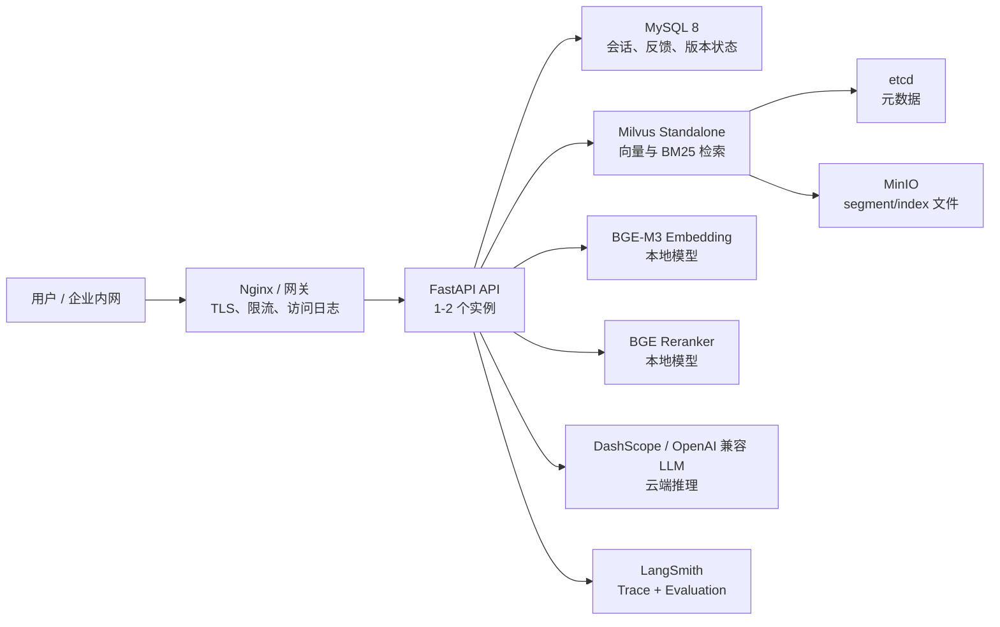
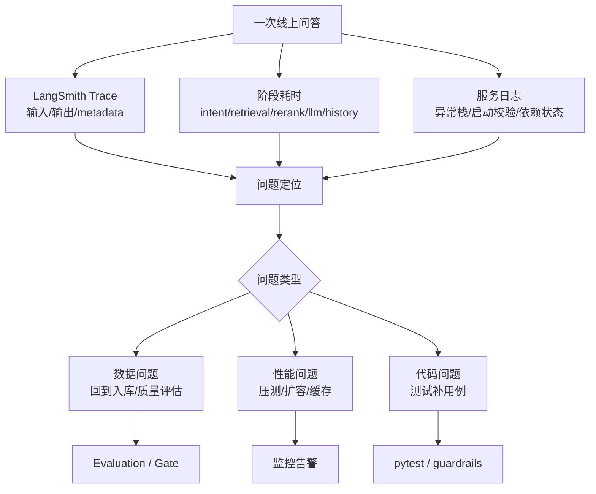
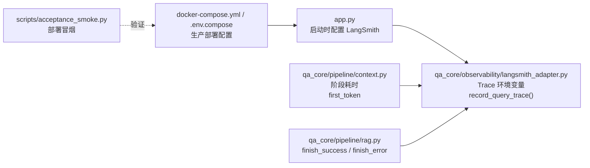

# 可观测性与链路追踪
<Badge icon="clock" color="green">Written: 2026.06</Badge>
> 第 19 章跟敲代码：`codealong/chapters/ch19_observability_tracing`。
> 这部分代码是本章跟敲版，用来先跑通核心闭环；完整项目源码仍以本讲后文标注的 `qa_core/`、`scripts/` 等路径为准。

**上一讲**：[测试与接口验收](/RAG/production/testing-system)

## 本讲目标

- 理解 RAG 系统为什么必须具备可观测性
- 掌握 LangSmith Trace 的核心字段和业务 metadata 设计
- 理解 Bad Case 如何通过 LangSmith annotation/dataset 沉淀
- 了解项目如何通过轻量 adapter 接入 LangSmith，而非自建 LLMOps 平台
- 掌握生产部署、容量评估、压测和监控告警的面试表达

> 本讲边界
>
> 第 19 讲是全课的生产化收口：第 17 讲证明“质量好不好”，第 18 讲证明“代码坏没坏”，本讲回答“上线后怎么观察问题、定位瓶颈、压测扩容、对外解释生产部署方案”。

---

## 第一部分：前置知识 — 可观测性的三个支柱

### 1.1 什么是可观测性

在 RAG 系统中，用户说"答案不对"，单看最终回答无法判断问题出在哪里：

```text
答案不对的 5 种可能原因：
1. 意图识别错了（本该 FAQ 直出，却走了文档 RAG）
2. source 推断错了（该搜 HR 文档却搜了 IT 文档）
3. 检索召回了无关内容（Embedding 或 BM25 失效）
4. 上下文构建截断了关键信息（max_context_chars 太小）
5. LLM 生成了幻觉（Prompt 约束不够）
```

没有可观测数据，你只能**猜测**。有了可观测数据，你可以**定位**。

### 1.2 本项目的可观测架构

本项目采用 **LangSmith 委托** 架构——业务代码只负责写入领域 metadata，存储、查询、可视化、评测和标注全部由 LangSmith 平台完成。

```text
RAG 运行时                     LangSmith 平台
┌──────────────────┐          ┌─────────────────────┐
│ record_query_trace│  ───→   │ Trace 存储 + 过滤    │
│ (147行 adapter)   │  metadata│ Dataset 管理         │
│                  │          │ Evaluation 自动评分   │
│ langsmith_status()│          │ Annotation 人工标注   │
└──────────────────┘          └─────────────────────┘
```

**核心原则**：项目不复刻 LLMOps 平台。自研追踪存储、状态页 Dashboard 和评测 UI 属于平台级工程，超出当前 RAG 项目的范围。企业路线下，LangSmith 提供成熟的 tracing、dataset、evaluation 和 annotation 能力，项目只负责写入业务 metadata。

---

## 第二部分：langsmith\_adapter.py — 核心代码

项目中与 LangSmith 交互的唯一模块是 `qa_core/observability/langsmith_adapter.py`（147 行）。它包含四个函数：

### 2.1 环境配置：configure\_langsmith\_environment()

```text
# qa_core/observability/langsmith_adapter.py
def configure_langsmith_environment() -> None:
    settings = get_settings()
    os.environ.setdefault("LANGSMITH_TRACING", "true" if settings.langsmith_tracing else "false")
    if settings.langsmith_api_key:
        os.environ.setdefault("LANGSMITH_API_KEY", settings.langsmith_api_key)
    if settings.langsmith_project:
        os.environ.setdefault("LANGSMITH_PROJECT", settings.langsmith_project)
    if settings.langsmith_endpoint:
        os.environ.setdefault("LANGSMITH_ENDPOINT", settings.langsmith_endpoint)
```

在 `app.py` 启动时调用一次，将 Pydantic Settings 中的 LangSmith 配置写入环境变量，使 LangChain 集成能自动感知。

### 2.2 开关检测：langsmith\_enabled()

```text
def langsmith_enabled() -> bool:
    settings = get_settings()
    return bool(settings.langsmith_tracing and settings.langsmith_api_key)
```

所有 trace 写入操作的守卫。LangSmith 未启用时直接跳过，不影响请求主链路。

### 2.3 状态查询：langsmith\_status()

返回轻量状态字典供状态页使用，包含 `provider`、`enabled`、`project`、`endpoint` 和项目 URL。

### 2.4 核心函数：record\_query\_trace()

```text
def record_query_trace(
    *,
    trace_id: str,
    session_id: str,
    question: str,
    answer: str,
    hit_type: str,
    scenario,
    data_scope: dict[str, Any],
    source_filter: str | None,
    kb_version: str,
    rewritten_query: str | None,
    intent: dict[str, Any] | None,
    retrieval: dict[str, Any] | None,
    sources: list[dict[str, Any]],
    elapsed_ms: float,
    error: str | None = None,
) -> None:
```

**执行流程**：

1. `configure_langsmith_environment()` — 确保环境变量已注入
2. `langsmith_enabled()` 检查 → 未启用直接返回
3. 构建 `metadata` 字典（18 个业务字段，见下方）
4. 构建 `inputs`（question / scenario\_id / source\_filter / kb\_version）
5. 构建 `outputs`（answer\_preview[:800] / hit\_type / sources / error）
6. 通过 `langsmith.run_helpers.trace()` 上下文管理器写入 LangSmith
7. 异常只记日志不抛出——trace 写入失败不影响用户请求

### 2.5 写入 LangSmith 的业务 metadata

```text
metadata = {
    "trace_id": trace_id,           # 与项目内部 trace_id 一致，可跨系统关联
    "session_id": session_id,
    "scenario_id": ...,             # 当前业务场景
    "scenario_name": ...,
    "source_filter": ...,           # 前端选择的业务分类
    "effective_source": ...,        # 最终生效的 source 过滤
    "kb_version": ...,              # 知识库版本号
    "tenant_id": ...,               # 数据隔离四维
    "dataset_id": ...,
    "visibility": ...,
    "user_role": ...,
    "intent": ...,                  # 意图分类结果
    "intent_reason": ...,           # 意图判断原因（rule / llm_structured）
    "hit_type": ...,                # faq_direct / rag / insufficient_context
    "prompt_profile": ...,          # 使用的 Prompt 档位
    "question_category": ...,       # 风险类别（pricing / compliance / ...）
    "sources_count": ...,           # 引用来源数量
    "top_source_score": ...,        # 最高召回分数
    "first_token_ms": ...,          # 首 token 延迟
    "stage_timings_ms": ...,        # 各阶段耗时
    "slowest_stage": ...,           # 最慢阶段
    "elapsed_ms": ...,              # 总耗时
    "error": ...,                   # 错误信息（如有）
}
```

**设计要点**：

- **metadata 不存完整 prompt/上下文**——敏感资料（合同条款、薪酬信息）不应进入外部平台
- **trace\_id 使用项目 UUID**——可在 LangSmith UI 中搜索 `trace_id` 直接定位
- **tags** 自动包含 `scenario_id` 和 `hit_type`，支持在 LangSmith 中按场景和命中路径过滤

---

## 第三部分：Bad Case 沉淀

### 3.1 LangSmith 闭环流程

```text
全量 Trace ──→ 过滤（error / no_sources / low_score）──→ Annotation（人工标注）
                                                              │
                                                              ↓
                    Gate 验收 ←── Evaluation（自动评分）←── Dataset（评估集）
```

1. **Trace 发现**：在 LangSmith 中按 `hit_type=insufficient_context` 或 `sources_count=0` 过滤失败案例
2. **Annotation 标注**：为失败案例标注 `expected_output` 和 `is_correct`，加入 Dataset
3. **Dataset 管理**：每个场景维护一个回归评估集，新增标注后自动触发 Evaluation
4. **Gate 验收**：在 CI 或发版前跑 Evaluation，对比基线分数判断是否退化

### 3.2 Trace、Annotation、Dataset、Evaluation 分别是什么

这四个词很容易混在一起，先把它们的职责区分清楚：

| 概念 | 解决的问题 | 在本项目中看什么 |
| --- | --- | --- |
| Trace | 这次请求内部发生了什么 | 意图、检索计划、命中路径、来源数量、阶段耗时、错误 |
| Annotation | 人认为这次结果应该是什么 | 期望 source、期望 hit\_type、期望关键词、是否正确 |
| Dataset | 哪些问题要长期回归 | 从 bad case 沉淀出来的真实问题集 |
| Evaluation | 当前版本在这些问题上表现如何 | 准确率、关键词覆盖、引用完整性、是否退化 |
| Experiment | 某次改动的评测结果快照 | 新旧版本、Prompt、检索参数的对比 |

可以用一句话串起来：

```text
Trace 负责发现问题，Annotation 负责定义正确答案，Dataset 负责沉淀问题，Evaluation 负责批量评分，Experiment 负责对比版本。
```

### 3.3 从一次 bad case 到一次 Evaluation

下面用一个跨境贸易问题举例：

```text
用户问题：HS 编码归类存在争议时能先按客户说法申报吗？

Trace 中看到：
- scenario_id = cross_border_risk
- hit_type = rag
- sources_count = 1
- top_source_score = 0.42
- prompt_profile = compliance_guard
- answer_preview 中没有出现“归类依据”“申报风险”“补充资料”
```

复核人员会在 Annotation 中补充：

```json
{
  "is_correct": false,
  "expected_source": "customs",
  "expected_hit_type": "rag",
  "expected_keywords": ["HS 编码", "归类依据", "申报风险", "补充资料"],
  "grading_notes": "答案没有说明不能仅按客户说法申报，也缺少风险提示"
}
```

然后把这个 Trace 加入 `cross_border_risk_bad_cases` Dataset。下次改 query rewrite、Milvus schema、Prompt Profile 或知识库版本时，LangSmith Evaluation 会重新跑这些样本，检查这类问题是否被修复。

### 3.4 Evaluation 和本地 Gate 的边界

LangSmith Evaluation 偏平台能力，本地 Gate 偏工程约束。两者分工如下：

| 环节 | LangSmith Evaluation | 本地 Gate |
| --- | --- | --- |
| 样本来源 | Trace + Annotation + Dataset | `eval_sets/*.json` |
| 优势 | 可视化、人工标注、长期实验对比 | 可脚本化、可 CI 阻断、结果确定 |
| 适合判断 | 为什么退化、哪个样本退化 | 是否允许发布 |
| 输出 | Experiment 分数和样本明细 | JSON 报告 + exit code |

因此本项目推荐的企业路线是：

```text
日常 bad case 沉淀：LangSmith
变更前强制验收：本地 Gate
长期趋势对比：LangSmith Experiments
```

### 3.5 与自建闭环的对比

|  | LangSmith 平台 | LangSmith 委托 |
| --- | --- | --- |
| Trace 存储 | 本地文件，需自行管理轮转 | 云端，自动保留 |
| 检索/过滤 | grep + 自建状态页 API | LangSmith UI 多条件过滤 |
| 标注 | 需自建标注界面 | LangSmith Annotation Queue |
| 评估 | 需自建评估跑分 | LangSmith Evaluation 自动跑 |
| 适用场景 | 教学演示底层机制 | 企业真实项目 |

本项目的教学定位：**讲 LangSmith 企业闭环为主线，JSonL 底层原理只作为概念类比。**

---

## 第四部分：RAGQueryContext 中的 trace 调用

trace 不只是在问答结束时写一次，而是在整个 Pipeline 生命周期中逐步累积数据。调用链：

```text
app.py 启动时
  └── configure_langsmith_environment()   ← 注入环境变量

Pipeline 执行中（qa_core/pipeline/runtime.py）
  └── RAGQueryContext.run_stage()         ← 每个阶段自动计时
  └── RAGQueryContext.retrieval_info      ← 累积检索诊断数据
  └── RAGQueryContext.mark_first_token()  ← 记录首 token 时刻

Pipeline 结束时（qa_core/pipeline/rag.py）
  └── finish_success() / finish_error()
      └── RAGQueryContext.record_trace()
          └── record_query_trace()        ← 汇总所有数据写入 LangSmith
```

`RAGQueryContext.run_stage()` 是阶段自动计时的关键：它执行回调并记录 `time.perf_counter()` 差值，最终汇总为 `stage_timings_ms`。

---

## 第五部分：面试收口 — 生产部署、容量评估与监控

面试中只说“项目用了 LangChain + Milvus + FastAPI”是不够的。更好的表达是：这个系统不仅能回答问题，还考虑了上线后的容量、压测、扩容、监控和故障定位。

### 5.1 生产部署拓扑

本项目当前适合中小规模知识库和教学/企业内部门户场景，推荐的最小生产拓扑如下：



组件分工：

| 组件 | 部署建议 | 主要瓶颈 |
| --- | --- | --- |
| FastAPI | 1-2 个 API 容器，后续水平扩容 | Python worker 数、外部 LLM 等待、WebSocket 长连接 |
| Milvus | 小规模用 Standalone，中大规模改 Cluster | 内存、segment 数、索引加载、磁盘 IO |
| MySQL | 单实例起步，生产建议独立数据盘和备份 | 连接数、慢 SQL、磁盘 |
| Embedding/Reranker | 有 GPU 优先本地 GPU；无 GPU 可 CPU 小并发 | 模型推理延迟和并发队列 |
| LLM | 云端 API，配置超时和重试 | 首 token 延迟、限流、费用 |
| LangSmith | 外部平台 | Trace 采样率、敏感字段脱敏 |

### 5.2 并发访问量怎么估算

RAG 系统的并发不能只看 HTTP QPS，因为一次请求通常会经历多阶段：

```text
总耗时 = 意图识别 + Embedding + Milvus 检索 + Reranker + Prompt 构建 + LLM 首 token + 流式生成
```

如果平均一次完整问答耗时 6 秒，系统同时有 30 个请求在处理，那么粗略吞吐是：

```text
QPS ≈ 并发请求数 / 平均请求耗时 = 30 / 6 = 5 QPS
```

但是 WebSocket 流式请求会长时间占用连接，面试时要区分：

| 指标 | 含义 | 为什么重要 |
| --- | --- | --- |
| 并发连接数 | 同时保持的 HTTP/WS 连接 | 决定 API worker、网关和系统 fd 上限 |
| 请求 QPS | 每秒新进来的问题数 | 决定排队压力 |
| 首 token 延迟 | 用户多久看到第一个字 | 直接决定体感速度 |
| 完整回答耗时 | 一个回答全部结束需要多久 | 决定总体吞吐 |
| Milvus P95 检索耗时 | 检索是否成为瓶颈 | 决定是否调索引/扩 Milvus |
| Reranker P95 耗时 | 重排是否成为瓶颈 | 决定是否降候选数或上 GPU |
| LLM P95 首 token | 云端模型是否稳定 | 决定是否切模型/供应商/限流 |

### 5.3 容量分档和硬件选型

下面是面试表达用的经验分档，真实项目必须以压测结果为准。表里的并发、chunk 数和机器配置不是官方标准，也不是本项目承诺的容量，只是帮助你说明“如何估算、如何验证、如何扩容”的起点。

| 规模 | 典型场景 | 建议配置 | 说明 |
| --- | --- | --- | --- |
| 本地演示 | 少量并发，几千到几万 chunk | 4C8G，SSD，CPU 推理可用 | 适合本项目 Docker Compose 单机演示 |
| 小团队内部门户 | 十级并发，十万级 chunk | 8C32G，NVMe SSD，Embedding/Reranker 可 CPU 或单 GPU | Milvus、MySQL、API 可同机但要限制资源 |
| 企业部门级 | 数十到百级并发，几十万到数百万 chunk | 16C64G+，NVMe SSD，至少一张 16-24GB 显存 GPU | API 与 Milvus/MySQL 建议拆机，模型服务独立 |
| 企业级多部门 | 更高并发，百万到千万级 chunk | Milvus Cluster，多 API 实例，独立 MySQL，GPU 模型服务池 | 需要网关限流、队列、监控告警和容量预案 |

扩容优先级建议：

1. **先看 LLM 延迟和限流**：如果慢在云端 LLM，本地加 CPU 没用。
2. **再看 Reranker**：CrossEncoder 最容易成为本地推理瓶颈，候选数越多越慢。
3. **再看 Milvus**：检索 P95 高时，检查索引、collection 是否 load、segment 是否过碎、内存是否不足。
4. **最后看 API worker**：API 本身通常不是最重的计算点，但会受 WebSocket 长连接影响。

### 5.4 什么时候需要升级硬件

不要用“访问量大了就加机器”这种笼统说法。更专业的判断方式是看指标阈值：

| 现象 | 可能原因 | 处理方式 |
| --- | --- | --- |
| CPU 长期高位 | API worker、Embedding CPU 推理、Reranker CPU 推理吃满 | 增加 API 实例，或将模型推理迁移到 GPU |
| 内存长期高位 | Milvus index/segment 占用过高 | 增加内存，拆分 collection，或升级 Milvus 部署 |
| Milvus 检索 P95 明显高于基线 | 索引不合适、未 load、segment 过碎、内存不足 | 检查索引参数、compact/load 状态、增加内存 |
| Reranker P95 明显高于基线 | 候选文档过多或 CPU 推理慢 | 降低 rerank\_top\_k，上 GPU，或做 batch 推理 |
| LLM 首 token P95 明显高于基线 | 云端模型慢或被限流 | 更换模型档位、增加供应商、做排队和降并发保护 |
| WebSocket 断连增加 | 网关超时、worker 被阻塞、网络抖动 | 调整网关超时，拆分 worker，增加心跳 |
| MySQL 连接数打满 | 会话存储连接未复用或并发过高 | 配连接池、调 max\_connections、读写拆分 |

### 5.5 压测方式

RAG 压测要分层做，不能只压健康检查，也不能只看单次人工提问。

第一层：健康检查和普通 HTTP 接口。

```text
hey -n 1000 -c 20 http://192.168.88.100:8001/health
```

第二层：HTTP 检索诊断接口，用来测不含最终 LLM 生成的检索半链路。

```text
hey -n 200 -c 10 -m POST \
  -H "Content-Type: application/json" \
  -d '{"query":"新人入职需要完成哪些流程？","scenario_id":"enterprise_knowledge"}' \
  http://192.168.88.100:8001/api/retrieval/debug
```

第三层：WebSocket 流式问答主链路。`hey` 不适合测 WebSocket，可以用 Python 脚本模拟多用户连接：

```python
import asyncio
import json
import time
import websockets

URL = "ws://192.168.88.100:8001/api/stream"
PAYLOAD = {
    "question": "新人入职需要完成哪些流程？",
    "scenario_id": "enterprise_knowledge",
}

async def one_user(i: int):
    started = time.perf_counter()
    first_token = None
    async with websockets.connect(URL, ping_interval=20) as ws:
        await ws.send(json.dumps(PAYLOAD, ensure_ascii=False))
        async for msg in ws:
            event = json.loads(msg)
            if event.get("type") == "token" and first_token is None:
                first_token = time.perf_counter() - started
            if event.get("type") in {"end", "error"}:
                total = time.perf_counter() - started
                return {"user": i, "first_token": first_token, "total": total, "type": event.get("type")}

async def main():
    results = await asyncio.gather(*(one_user(i) for i in range(30)))
    print(results)

asyncio.run(main())
```

压测报告至少要给出：

- 成功率 / 错误率
- P50 / P95 / P99 首 token 延迟
- P50 / P95 / P99 完整回答耗时
- 每阶段耗时：intent、embedding、milvus、rerank、llm
- CPU、内存、磁盘 IO、网络
- Milvus collection 是否 load、查询 P95、segment 数
- LLM API 错误、限流、超时次数

### 5.6 监控与告警

生产环境建议把监控分成四层：

| 层级 | 监控项 | 工具 |
| --- | --- | --- |
| 主机层 | CPU、内存、磁盘、网络、文件句柄 | node\_exporter / Docker stats |
| 容器层 | API/Milvus/MySQL/MinIO/etcd 健康状态、重启次数 | Docker Compose / cAdvisor |
| 应用层 | 请求数、错误率、首 token、阶段耗时、命中路径 | FastAPI middleware + LangSmith metadata |
| RAG 质量层 | sources\_count、top\_source\_score、hit\_type、Evaluation 分数 | LangSmith Trace/Evaluation + 本地 Gate |

告警建议：

下面的阈值是示例起点，不是通用生产标准。真正上线时应先压测得到本项目的正常基线，再按“明显偏离基线 + 持续一段时间”设置告警。

| 告警 | 阈值设置方式 | 处理动作 |
| --- | --- | --- |
| API 5xx 错误率 | 高于压测或线上历史基线 | 查看错误日志和 LangSmith error trace |
| 首 token P95 | 持续高于基线 | 检查 LLM、Embedding、Reranker 阶段耗时 |
| Milvus 检索 P95 | 持续高于基线 | 检查 collection load、内存和索引状态 |
| insufficient\_context 比例 | 单场景持续高于基线 | 检查知识库版本、召回阈值和资料覆盖 |
| active 版本缺失 | 任意场景 active=None | 阻断启动或立即重新激活版本 |
| 磁盘使用率 | 接近容量红线 | 清理旧日志、旧 segment、备份后扩容 |

### 5.7 生产发布流程

推荐把上线流程讲成一条稳定流水线：

```bash
代码变更
  → pytest 单元测试
  → 文档/配置一致性检查
  → 构建 API 镜像
  → 预发环境 rebuild_kb_version.py --quality-gate
  → 本地 Evaluation / LangSmith Evaluation
  → 小流量压测
  → 生产 docker compose --env-file .env.compose pull + up -d
  → 观察 LangSmith Trace、错误率、首 token、Milvus P95
```

如果只是 `.env.compose` 变化，例如更换模型地址、LangSmith 配置、DashScope Key：

```bash
docker compose --env-file .env.compose up -d --force-recreate api
docker logs -f knowforge-api
```

如果 Milvus schema 或入库逻辑变化，必须先重建知识库。已有知识库只更新资料内容时不加
`--reset-collections`；只有旧 collection schema 不兼容时才删除 collection 重建：

```bash
docker compose --env-file .env.compose run --rm api python scripts/rebuild_kb_version.py --scenario enterprise_knowledge --new-version --force --reset-collections --quality-gate --activate
```

### 5.8 生产事故排查案例

生产环境排查要从“现象”走到“证据”，不要只看最后的错误消息。下面这些案例可以作为常见问题排查模板。

| 现象 | 优先看哪里 | 常见原因 | 处理方式 |
| --- | --- | --- | --- |
| API 启动失败 | `docker logs knowforge-api`、preflight 输出 | LLM Key 无效、active 版本为空、Milvus/MySQL 未就绪、模型目录不存在 | 修复配置或依赖后 `docker compose --env-file .env.compose up -d --force-recreate api` |
| 页面提示信息不足 | 右侧诊断、LangSmith trace、top\_source\_score、sources\_count | 知识库没覆盖、active 版本错、过滤条件过窄、召回阈值过高 | 查 active 版本、检索诊断、必要时重建知识库或补资料 |
| Milvus 查询慢 | trace 中 retrieval 耗时、Milvus 日志、collection load 状态 | collection 未 load、segment 过多、过滤表达式复杂、top\_k 过大 | 预热 collection、控制 top\_k、优化过滤字段和索引 |
| 首 token 慢 | trace 中 intent / embedding / rerank / llm 阶段耗时 | LLM 排队、Reranker 耗时高、Embedding 在 CPU 上跑 | 分离模型服务、降低候选数、增加 GPU 或并发实例 |
| 回答引用不对 | trace 中 retrieval hits、context docs、final references | 召回到了相似但错误的 chunk，Reranker 没压下去 | 补 query variants、调整 rerank 策略、修正资料和 source |
| 重建后仍是旧答案 | 页面当前版本、active kb\_version、API 容器环境 | 新版本未激活、API 未重建、连了另一套 Milvus | 重新激活版本，force recreate API，确认 Milvus URI |
| 并发升高后大量超时 | HTTP/WS 错误率、LLM API 错误、连接池、CPU/GPU | LLM 限流、线程池饱和、MySQL 连接池不足 | 限流排队、扩 API 实例、拆分模型服务、调整连接池 |

一个通用排查顺序：

```bash
1. 看服务是否活着：docker compose --env-file .env.compose ps / healthcheck
2. 看启动校验：preflight 是否全部通过
3. 看业务状态：scenario、active kb_version、collection 名称
4. 看 trace：命中路径、阶段耗时、top score、sources_count
5. 看依赖：Milvus/MySQL/LLM/Embedding/Reranker
6. 看数据：资料是否入库、source 是否正确、质量门禁是否通过
```

### 5.9 二期规划边界

一期目标是把企业级多场景 RAG 主链路做稳。二期不要把所有热门能力一次性塞进主线，建议采用“主线必做 + 亮点选做”的边界。

| 版本 | 建议范围 | 说明 |
| --- | --- | --- |
| 一期 | 多场景 RAG、Milvus Hybrid、Reranker、版本、隔离、质量门禁、Trace、生产部署 | 当前课程主线，保证可讲、可跑、可验收 |
| 二期主线 | 受控 Agentic RAG：Router/Planner + RAG Tool + SQL Tool + 状态/重建工具 + Trace | 主控 Agent 统一调度，工具权限受控，避免自由多智能体失控 |
| 二期选做 | 轻量 GraphRAG Agent、OCR/VLM 入库增强、自动评测集扩展 | 作为企业项目亮点，不影响现有 RAG 主链路 |
| 暂不主推 | 自由多智能体、完整视觉聊天、强依赖 Neo4j 的重图谱平台 | 成本和不可控性较高，容易冲淡主线 |

二期边界可以这样理解：

> 二期不是把系统改成“多个 Agent 自由聊天”，而是把当前可靠的 RAG Pipeline 封装成可调用工具，由主控 Agent 按意图选择 RAG、SQL、GraphRAG 或运维工具。GraphRAG 可以作为独立专家 Agent 存在，但不强依赖 Neo4j；基础版可以先用 MySQL 存实体和关系，Neo4j 作为增强方案。多模态也不做任意图片聊天，而是作为 OCR/VLM 文档入库增强。

### 5.10 面试表达模板

可以这样回答“你的项目生产环境怎么部署、能扛多少并发”：

> 我不会直接说一个固定 QPS，因为 RAG 的瓶颈取决于 LLM 首 token、Embedding/Reranker 推理、Milvus 检索和 WebSocket 长连接。我的做法是先定义指标：并发连接数、请求 QPS、首 token P95、完整回答 P95、Milvus P95、Reranker P95 和错误率。小规模可以用单机 Docker Compose，8C32G 起步；部门级会把 API、Milvus/MySQL、模型推理拆开，Reranker 尽量放 GPU；更大规模再上 Milvus Cluster 和多 API 实例。上线前分别压 HTTP 诊断接口和 WebSocket 在线问答主链路，线上用 LangSmith Trace 记录阶段耗时和命中质量，再配合主机/容器监控和质量告警判断是否扩容。

---

## 本讲实践闭环

| 项目 | 内容 |
| --- | --- |
| 本讲类型 | 工程治理 |
| 实践产物 | LangSmith Trace、生产部署、压测指标、监控告警、事故排查和二期边界 |
| 是否进入最终项目 | 是 |
| 验收方式 | 发起一次问答能看到 trace；能复述部署、压测、扩容和排查流程 |
| 后续落点 | 课程收口；二期进入受控 Agentic RAG、GraphRAG/OCR 可插拔增强 |

通过标准：能把项目从“本地能跑”讲到“生产可观测、可压测、可扩容、可排查”。

### 本讲从 0 到 1 实现闭环

这一讲把项目从“能跑”收束到“可观测、可部署、可压测、可排查”。实现顺序如下：



1. 先配置 LangSmith 环境变量，让 LangChain/项目代码能把 trace 发出去。
2. 再封装 `record_query_trace()`，统一记录场景、版本、命中路径、耗时、错误信息。
3. 然后把阶段耗时写入 `RAGQueryContext`，定位慢在检索、重排、LLM 还是历史。
4. 最后补生产部署、压测、监控和事故排查流程。

实现完成后，相关代码结构应该是下面这张图：



来源：真实代码节选，见 `qa_core/observability/langsmith_adapter.py::configure_langsmith_environment()`。

```text
def configure_langsmith_environment() -> None:
    settings = get_settings()
    os.environ.setdefault("LANGSMITH_TRACING", "true" if settings.langsmith_tracing else "false")
    if settings.langsmith_api_key:
        os.environ.setdefault("LANGSMITH_API_KEY", settings.langsmith_api_key)
    if settings.langsmith_project:
        os.environ.setdefault("LANGSMITH_PROJECT", settings.langsmith_project)
    if settings.langsmith_endpoint:
        os.environ.setdefault("LANGSMITH_ENDPOINT", settings.langsmith_endpoint)
```

Trace 的价值不只是“看到一次调用”，而是把业务维度记录进去。排查时可以按场景、版本、意图、source、命中路径过滤。

来源：真实代码逻辑压缩版，对应 `qa_core/observability/langsmith_adapter.py::record_query_trace()`。

```text
def record_query_trace(*, trace_id, session_id, question, answer, hit_type,
                       scenario, data_scope, source_filter, kb_version,
                       rewritten_query, intent, retrieval, sources,
                       elapsed_ms, error=None) -> None:
    configure_langsmith_environment()
    if not langsmith_enabled():
        return

    retrieval_payload = retrieval or {}
    intent_payload = intent or {}
    metadata = {
        "trace_id": trace_id,
        "session_id": session_id,
        "scenario_id": getattr(scenario, "scenario_id", ""),
        "scenario_name": getattr(scenario, "display_name", ""),
        "source_filter": source_filter,
        "effective_source": retrieval_payload.get("source_filter") or source_filter,
        "kb_version": kb_version,
        "tenant_id": data_scope.get("tenant_id"),
        "dataset_id": data_scope.get("dataset_id"),
        "visibility": data_scope.get("visibility"),
        "allowed_roles": data_scope.get("allowed_roles"),
        "intent": intent_payload.get("intent"),
        "intent_reason": intent_payload.get("reason"),
        "hit_type": hit_type,
        "prompt_profile": retrieval_payload.get("prompt_profile_name"),
        "question_category": retrieval_payload.get("question_category"),
        "rewritten_query": rewritten_query,
        "sources_count": len(sources),
        "top_source_score": sources[0].get("score") if sources else None,
        "first_token_ms": retrieval_payload.get("first_token_ms"),
        "stage_timings_ms": retrieval_payload.get("stage_timings_ms"),
        "slowest_stage": retrieval_payload.get("slowest_stage"),
        "elapsed_ms": round(elapsed_ms, 2),
        "error": error,
    }

    with trace("qa_stream_query", run_type="chain", metadata=metadata, run_id=trace_id) as run_tree:
        outputs = {"answer_preview": answer[:800], "hit_type": hit_type, "sources": sources[:8], "error": error}
        run_tree.end(outputs=outputs, error=error) if error else run_tree.end(outputs=outputs)
```

Trace 失败不能影响用户请求。真实代码会捕获异常并记录 warning，保证 LangSmith 网络波动不会把问答链路拖挂。

阶段耗时要在 Pipeline 内部记录。只有总耗时没有意义，因为你不知道慢在 Milvus、Reranker、LLM 还是 MySQL 历史。

来源：真实代码调用点，见 `qa_core/pipeline/context.py::RAGQueryContext.run_stage()`。

```text
with context.run_stage("doc_retrieval"):
    doc_hits = retriever.search_many(queries)

with context.run_stage("llm_generation"):
    yield from llm.stream(prompt)
```

生产部署和压测验收要关注并发连接数、首 token P95、完整回答 P95、错误率和各阶段耗时，而不是只报一个模糊 QPS。

来源：命令行验收，对应 `docker-compose.yml`、`.env.compose` 和生产部署章节命令。

```bash
docker compose --env-file .env.compose up -d --build api
curl http://192.168.88.100:8001/health
python scripts/acceptance_smoke.py --base-url http://192.168.88.100:8001
```

闭环验证重点：

| 验证项 | 验证方式 | 期望结果 |
| --- | --- | --- |
| Trace 开关 | 配置 LangSmith 环境变量 | 问答后能看到 trace |
| metadata | 查看 trace 详情 | 有场景、版本、意图、命中路径 |
| 阶段耗时 | 查看诊断字段 | 能定位慢阶段 |
| Trace 关闭 | `LANGSMITH_TRACING=false` 或无 API Key | 不发送 trace，问答正常 |
| Trace 失败 | LangSmith 网络异常 | 只记录 warning，不影响用户答案 |
| 生产健康检查 | 请求 `/health` | 服务可用 |
| 部署冒烟 | 跑 acceptance smoke | 核心接口可访问 |
| 事故排查 | 模拟版本/依赖问题 | 能按 trace、日志、preflight 定位 |

验收重点：线上问题能从 trace、日志、健康检查、active 版本和质量报告中定位，而不是靠猜。

## 重点掌握

| 优先级 | 内容 | 原因 |
| --- | --- | --- |
| ★★★ 必会 | `record_query_trace()` 的 18 个业务 metadata 字段 | 面试常问"你往 trace 里记了什么" |
| ★★★ 必会 | LangSmith trace → annotation → dataset → evaluation 闭环 | 体现项目有RAG 回归与入库质量体系 |
| ★★★ 必会 | 生产部署、容量评估、压测和监控指标 | 面试常问"系统上线后能扛多少并发、怎么扩容" |
| ★★★ 必会 | 生产事故排查顺序：服务健康 → preflight → active 版本 → trace → 依赖 → 数据 | 能把线上问题从现象排到证据 |
| ★★ 理解 | `configure_langsmith_environment()` 的环境变量注入机制 | 理解 LangChain 集成如何感知 LangSmith |
| ★★ 理解 | `RAGQueryContext.run_stage()` 的阶段计时方式 | 能解释"怎么知道哪个阶段最慢" |
| ★★ 理解 | 二期边界：受控 Agentic RAG 为主，GraphRAG/OCR 作为可插拔增强 | 防止项目规划过重或失控 |
| ★ 了解 | 自建追踪存储方案的设计思路 | 作为系统设计题的备选方案 |

---

## 本讲小结

- **项目不复刻 LLMOps 平台**：trace 存储、过滤、可视化、标注和评估全部委托给 LangSmith
- **147 行 adapter** 是项目中与 LangSmith 交互的唯一代码
- **18 个 metadata 字段** 覆盖了场景、数据隔离、检索策略、耗时和错误信息
- **LangSmith 闭环**：Trace 发现 → Annotation 标注 → Dataset 沉淀 → Evaluation 回归 → Gate 验收
- **生产化表达**：用并发连接数、首 token P95、阶段耗时、Milvus/Reranker/LLM 瓶颈、压测结果和监控告警来回答容量问题，而不是拍脑袋报 QPS
- **事故排查**：先看服务健康和 preflight，再看 active 版本、trace 阶段耗时、依赖状态和入库数据
- **二期规划**：主线建议是受控 Agentic RAG，GraphRAG 和 OCR/VLM 作为可插拔增强，不把自由多智能体作为生产主方案