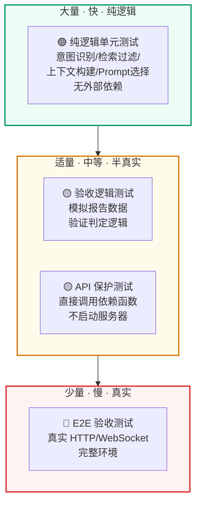
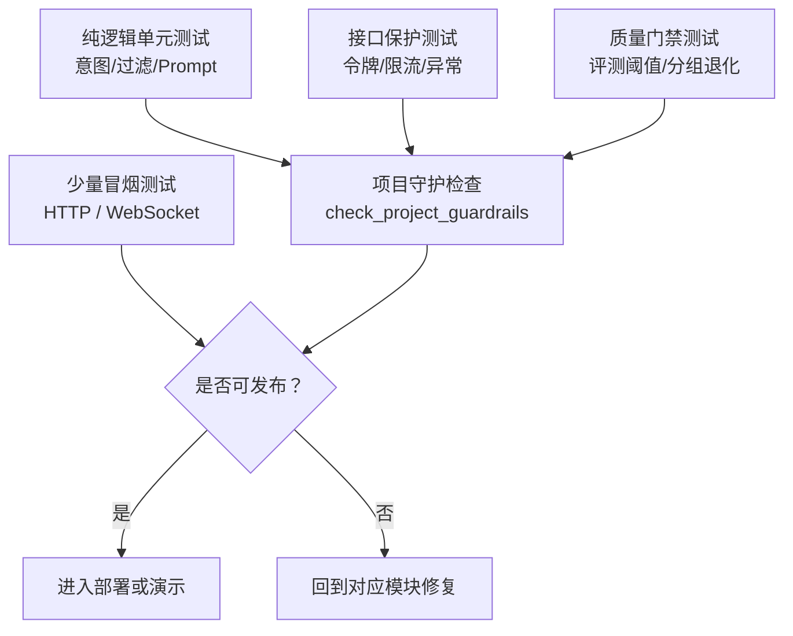
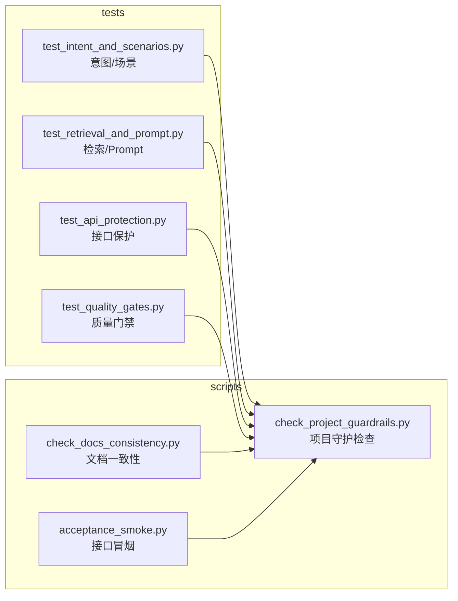

# 测试体系
<Badge icon="clock" color="green">Written: 2026.06</Badge>
> 第 18 章跟敲代码：`codealong/chapters/ch18_test_system`。
> 这部分代码是本章跟敲版，用来先跑通核心闭环；完整项目源码仍以本讲后文标注的 `qa_core/`、`scripts/` 等路径为准。

**上一讲**：[RAG 回归验收与入库质量](/RAG/advanced/rag-evaluation)  
**下一讲**：[LangSmith 观测、Trace 与生产化部署](/RAG/production/observability-tracing)

## 本讲目标

- 理解 RAG 系统测试的分层策略
- 掌握纯逻辑测试、API 保护测试、入库质量检查测试的设计模式
- 理解为什么 RAG 测试要"绕过 HTTP，直接调用核心函数"

> 本讲边界
>
> 第 18 讲回答“上线前如何证明代码和接口没有被改坏”。它关注 pytest、接口验收和回归保护。第 17 讲已经讲质量指标怎么定义，第 19 讲会讲上线后如何通过 Trace、监控、压测和容量评估持续观察系统。

---

## 第一部分：前置知识 — RAG 测试的特殊挑战

### 1.1 为什么不能只用 E2E 测试

传统 Web 应用的端到端测试：

```text
启动服务 → 发 HTTP 请求 → 检查 HTTP 响应 → 断言 JSON 字段
```

RAG 系统的 E2E 测试面临几个问题：

1. **外部依赖重**：需要 Milvus、MySQL、LLM API、本地模型全部在线
2. **答案不确定性**：同一个问题 LLM 可能每次都生成不同的措辞
3. **慢**：一次 RAG 问答需要 2-5 秒，跑 100 条需要很长时间
4. **成本**：每次测试都消耗 LLM API token

**解决方案**：纯逻辑测试 + 分层测试。

### 1.2 测试金字塔



本项目的测试主要集中在底部和中部：纯逻辑测试 + 验收逻辑测试。E2E 验收测试通过 `scripts/acceptance_smoke.py` 和 `scripts/api_e2e_smoke.py` 在完整环境中手动运行。

---

## 第二部分：纯逻辑单元测试

### 2.1 测试文件组织

```text
tests/
├── test_intent_and_scenarios.py    # 意图识别、问题类别、场景注册
├── test_retrieval_and_prompt.py    # 检索过滤、上下文构建、Prompt 选择
├── test_api_protection.py          # 管理令牌、限流
└── test_quality_gates.py           # 入库质量、RAG 回归验收、Bad Case
```

### 2.2 意图识别测试（纯逻辑）

```python
# tests/test_intent_and_scenarios.py

class IntentClassifierTests(unittest.TestCase):
    """验证意图识别输出正确的意图类型，不需要真实 LLM。"""

    def test_business_knowledge_question_uses_knowledge_intent(self):
        scenario = get_scenario_registry().resolve("enterprise_knowledge")
        result = classify_intent("新人入职流程怎么走", [], scenario)
        self.assertEqual(result.intent, "KNOWLEDGE_QUERY")
        self.assertEqual(result.suggested_source, "hr")

    def test_short_direct_faq_shape_prefers_faq_intent(self):
        scenario = get_scenario_registry().resolve("enterprise_knowledge")
        result = classify_intent("员工报销需要准备哪些材料？", [], scenario)
        self.assertEqual(result.intent, "FAQ_QUERY")
        self.assertEqual(result.reason, "source_question_shape_rule")
        # 规则命中 → 不调用 LLM → reason 是确定性字符串
```

**关键模式**：这些测试验证的是**规则路径**，不经过 LLM。测试空历史（`[]`）触发规则判定，可以验证规则逻辑的正确性。

### 2.3 source 推断测试（跨场景）

```python
class ScenarioRegistryTests(unittest.TestCase):

    def test_enterprise_source_patterns_are_used_for_source_inference(self):
        scenario = get_scenario_registry().resolve("enterprise_knowledge")
        self.assertEqual(infer_source("新人入职流程怎么走", scenario), "hr")
        self.assertEqual(infer_source("VPN 连不上怎么处理", scenario), "it")

    def test_cross_border_source_patterns_are_used(self):
        scenario = get_scenario_registry().resolve("cross_border_risk")
        self.assertEqual(infer_source("交易对手命中制裁名单怎么办", scenario), "sanction")
        self.assertEqual(infer_source("信用证不符点如何处理", scenario), "payment")

    def test_engineering_project_patterns_are_used(self):
        scenario = get_scenario_registry().resolve("engineering_project_qa")
        self.assertEqual(infer_source("图纸变更后旧版本还能作为施工依据吗", scenario), "drawing")
        self.assertEqual(infer_source("隐蔽工程验收需要哪些资料", scenario), "quality")
```

**关键模式**：使用 `resolve(scenario_id)` 加载真实场景 TOML 配置，验证 source\_patterns 的匹配逻辑。这是对"配置即代码"的测试。

### 2.4 场景边界检测测试

```python
def test_scenario_boundary_detects_question_from_other_business_scene(self):
    scenario = get_scenario_registry().resolve("enterprise_knowledge")
    # 问一个工程安全问题，但当前场景是企业知识
    decision = detect_scenario_boundary(
        "安全技术交底只有口头说明可以吗？", scenario
    )
    self.assertTrue(decision.crossed)
    self.assertEqual(decision.matched_scenario_id, "engineering_project_qa")
    self.assertEqual(decision.matched_source, "safety")
```

### 2.5 检索过滤测试（纯逻辑）

```python
# tests/test_retrieval_and_prompt.py

class RetrievalFilterTests(unittest.TestCase):
    """验证 source、版本、数据域会进入 Milvus 表达式。"""

    def test_build_source_expr_with_scope_and_version(self):
        scope = resolve_data_scope(
            tenant_id="tenant_a", dataset_id="dataset_1",
            visibility="internal", user_role="admin"
        )
        expr = build_source_expr(
            "billing",
            kb_version="kb_v1",
            valid_sources=["billing", "support"],
            data_scope=scope,
        )
        self.assertIn('source == "billing"', expr)
        self.assertIn('kb_version == "kb_v1"', expr)
        self.assertIn('tenant_id == "tenant_a"', expr)
        self.assertIn('array_contains(allowed_roles, "admin")', expr)

    def test_build_source_expr_rejects_invalid_source(self):
        with self.assertRaises(ValueError):
            build_source_expr("unknown", valid_sources=["billing"])
```

**关键模式**：不连接 Milvus，只验证表达式字符串的正确性。这比启动 Milvus 再验证快 100 倍。

### 2.6 上下文构建测试

```python
class ContextBuilderTests(unittest.TestCase):

    def test_direct_faq_answer_requires_exact_match_or_threshold(self):
        doc = Document(
            page_content="是否支持开发票",
            metadata={"standard_question": "是否支持开发票",
                       "answer": "支持，具体以系统规则为准。"},
        )
        # 精确匹配 → 分数不重要，直接返回
        self.assertEqual(
            direct_faq_answer("是否支持开发票", doc, score=0.1, threshold=0.9),
            "支持，具体以系统规则为准。"
        )
        # 相似但不精确 → 分数必须超过阈值
        self.assertEqual(
            direct_faq_answer("可以开票吗", doc, score=0.95, threshold=0.9),
            "支持，具体以系统规则为准。"
        )
        self.assertIsNone(
            direct_faq_answer("可以开票吗", doc, score=0.3, threshold=0.9)
        )

    def test_select_context_docs_deduplicates_parent_and_applies_budget(self):
        """验证父子块去重和字符预算。"""
        # ... 见源码 tests/test_retrieval_and_prompt.py
```

### 2.7 Prompt Profile 选择测试

```python
class PromptProfileTests(unittest.TestCase):

    def test_pricing_question_uses_pricing_guard_before_intent_profile(self):
        """费用类问题必须使用 pricing_guard, 即使意图是 FAQ_QUERY。"""
        profile = build_answer_prompt_profile("FAQ_QUERY", query="发票和退款规则是什么")
        self.assertEqual(profile.name, "pricing_guard")
        self.assertIn("已确认", profile.system_template)

    def test_business_compliance_questions_use_compliance_guard(self):
        """合规类问题使用 compliance_guard, 不按普通知识问答处理。"""
        queries = [
            "受限空间作业前需要哪些安全确认？",
            "检验批资料和现场实物不一致怎么办？",
            "安全技术交底只有口头说明可以吗？",
        ]
        for query in queries:
            with self.subTest(query=query):
                self.assertEqual(infer_question_category(query), "compliance")
                profile = build_answer_prompt_profile("KNOWLEDGE_QUERY", query=query)
                self.assertEqual(profile.name, "compliance_guard")
```

---

## 第三部分：API 保护测试

### 3.1 管理令牌验证

```python
# tests/test_api_protection.py

class ApiProtectionTests(unittest.TestCase):

    def test_admin_token_requires_configured_token(self):
        """令牌为空时直接返回 500。"""
        original = api_deps.settings.admin_api_token
        api_deps.settings.admin_api_token = ""  # 临时修改配置
        try:
            with self.assertRaises(HTTPException) as ctx:
                api_deps.require_admin_token(None)
            self.assertEqual(ctx.exception.status_code, 500)
        finally:
            api_deps.settings.admin_api_token = original  # 恢复配置

    def test_admin_token_rejects_wrong_token_when_enabled(self):
        """错误令牌返回 401。"""
        original = api_deps.settings.admin_api_token
        api_deps.settings.admin_api_token = "secret"
        try:
            with self.assertRaises(HTTPException) as ctx:
                api_deps.require_admin_token("bad")
            self.assertEqual(ctx.exception.status_code, 401)
            # 正确令牌不抛异常
            self.assertIsNone(api_deps.require_admin_token("secret"))
        finally:
            api_deps.settings.admin_api_token = original
```

**关键模式**：
- 不启动 FastAPI 服务器，直接调用依赖函数
- 临时修改 `settings` 对象来模拟不同配置
- `try/finally` 确保测试后恢复原始配置

### 3.2 限流测试

```python
def test_rate_limit_can_block_after_limit(self):
    original_limit = api_deps.settings.api_rate_limit_per_minute
    api_deps.settings.api_rate_limit_per_minute = 2  # 每分钟只允许 2 次
    api_deps.RATE_BUCKETS.clear()
    try:
        self.assertTrue(api_deps.check_rate_limit("unit-test"))   # 第 1 次：允许
        self.assertTrue(api_deps.check_rate_limit("unit-test"))   # 第 2 次：允许
        self.assertFalse(api_deps.check_rate_limit("unit-test"))  # 第 3 次：拒绝
    finally:
        api_deps.settings.api_rate_limit_per_minute = original_limit
        api_deps.RATE_BUCKETS.clear()
```

---

## 第四部分：验收逻辑测试

### 4.1 入库质量检查测试

```python
class QualityGateTests(unittest.TestCase):

    def test_ingestion_gate_rejects_faq_document_conflicts(self):
        """FAQ/正文冲突时验收必须拒绝。"""
        report = _clean_ingestion_report()
        report["faq_document_conflicts"] = {"conflict_count": 1}
        result = evaluate_ingestion_gate(report, IngestionQualityThresholds())
        self.assertFalse(result["ok"])
        self.assertEqual(result["failures"][0]["metric"], "faq_document_conflicts")

    def test_ingestion_gate_passes_clean_report(self):
        """干净的报告必须通过。"""
        result = evaluate_ingestion_gate(
            _clean_ingestion_report(), IngestionQualityThresholds()
        )
        self.assertTrue(result["ok"])
```

### 4.2 RAG 回归验收 — 分组回归检测

```python
def test_evaluation_gate_rejects_scenario_group_regression(self):
    """全局 Recall 正常但某个场景退化 → 验收必须拒绝。"""
    report = {
        "recall_at_k": 1.0,  # 全局正常
        "rows": [
            {"scenario_id": "enterprise_knowledge", "recall_hit": True},
            {"scenario_id": "insurance_claims", "recall_hit": False},  # 这个场景退化
        ],
    }
    result = evaluate_eval_gate(report, EvaluationGateThresholds())
    self.assertFalse(result["ok"])
    # 失败指标中包含按场景分组的退化信息
    self.assertIn("scenario.insurance_claims.recall_at_k",
                  {item["metric"] for item in result["failures"]})
```

### 4.3 Bad Case 分类测试

```python
def test_bad_case_classifier_marks_environment_noise(self):
    """Milvus 连接失败 → 环境噪声，不进入业务复核。"""
    result = classify_bad_case(
        ["error", "low_source_count"],
        error="MilvusException: Fail connecting to server on localhost:19530",
    )
    self.assertEqual(result["bad_case_category"], "environment_error")
    self.assertTrue(result["is_environment_noise"])

def test_bad_case_classifier_marks_retrieval_quality(self):
    """低分低来源 → 检索质量问题。"""
    result = classify_bad_case(["low_source_count", "low_top_score"])
    self.assertEqual(result["bad_case_category"], "retrieval_quality")
    self.assertFalse(result["is_environment_noise"])
```

---

## 第五部分：运行测试

### 5.1 运行全部单元测试

```bash
python -m pytest tests -q
```

预期输出：

```text
104 passed, 10 warnings, 10 subtests passed
```

当前测试集包含 104 个 pytest 用例，另有 10 个 subtests。大部分用例是纯逻辑和验收逻辑测试，不依赖 Milvus、MySQL 或 LLM；完整耗时以本机环境为准。

### 5.2 运行特定测试文件

```bash
# 只测试意图识别和场景
python -m pytest tests/test_intent_and_scenarios.py -q

# 只测试检索和 Prompt
python -m pytest tests/test_retrieval_and_prompt.py -q
```

### 5.3 在 CI/回归检查中使用

```text
# 项目守护检查（包含测试）
python scripts/check_project_guardrails.py

# 接口和页面验收
python scripts/api_e2e_smoke.py --base-url http://127.0.0.1:8000
python scripts/acceptance_smoke.py --base-url http://127.0.0.1:8000
```

---

## 本讲实践闭环

| 项目 | 内容 |
| --- | --- |
| 本讲类型 | 工程治理 |
| 实践产物 | pytest 分层测试、接口验收、guardrails 守护检查 |
| 是否进入最终项目 | 是 |
| 验收方式 | 运行单元测试、接口验收和项目守护检查 |
| 后续落点 | 第 19 讲作为上线前检查和回归保障 |

通过标准：核心逻辑可在不依赖外部服务的情况下快速回归，接口和质量门禁能阻断明显退化。

### 本讲从 0 到 1 实现闭环

这一讲不是追求“测试越多越好”，而是建立低成本、可重复的回归网。实现顺序如下：



1. 先写纯逻辑测试，覆盖意图、场景配置、过滤表达式、Prompt 选择。
2. 再写接口保护测试，覆盖管理令牌、限流、异常响应。
3. 然后写验收脚本，把质量门禁、文档一致性、核心测试串起来。
4. 最后保留少量 HTTP/WebSocket 冒烟测试，证明接口真的能通。

实现完成后，相关代码结构应该是下面这张图：



来源：真实代码调用点，见 `tests/test_intent_and_scenarios.py`。

```text
def test_rule_intent_without_llm():
    result = classify_intent("你好", history=[])
    assert result.intent == IntentType.GREETING
```

检索过滤、Prompt 选择这类规则不需要连接 Milvus 或 LLM。直接检查函数输出，速度快，也不受环境波动影响。

来源：真实代码调用点，见 `tests/test_retrieval_and_prompt.py`。

```text
def test_filter_expr_contains_scope():
    expr = build_source_expr(plan, data_scope)
    assert "scenario_id" in expr
    assert "kb_version" in expr
    assert "tenant_id" in expr
```

API 保护测试重点验证安全边界，例如没有管理令牌不能访问管理接口，超出限流要返回 429。

来源：真实代码调用点，见 `tests/test_api_protection.py`。

```python
def test_admin_requires_token(client):
    response = client.get("/api/admin/status")
    assert response.status_code in {401, 403}
```

项目守护脚本用于把多个检查串成一个上线前命令。它适合本地发布前和 CI 中执行。

来源：命令行验收，对应 `scripts/check_project_guardrails.py`。

```bash
python scripts/check_project_guardrails.py
python -m pytest tests/test_intent_and_scenarios.py tests/test_retrieval_and_prompt.py tests/test_api_protection.py -q
```

闭环验证重点：

| 验证项 | 验证方式 | 期望结果 |
| --- | --- | --- |
| 纯逻辑测试 | 跑 pytest | 不依赖外部服务也能快速回归 |
| API 保护 | 跑接口保护测试 | 未授权和超限请求被拦截 |
| 质量门禁 | 跑 gate 测试 | 指标退化会失败 |
| 文档一致性 | 跑 docs 检查 | 场景、路径、讲义不漂移 |
| 冒烟测试 | 跑 HTTP/WS smoke | 关键接口可访问 |

验收重点：用低成本纯逻辑测试覆盖大部分规则，少量接口/E2E 只验证关键链路；不要把所有测试都做成依赖 Milvus、MySQL、LLM 的慢测试。

## 重点掌握

| 优先级 | 内容 | 原因 |
| --- | --- | --- |
| ★★★ 必会 | RAG 测试金字塔：大量纯逻辑单元测试（毫秒级）→ 适量验收逻辑测试 → 少量 E2E 验收 | 理解 RAG 系统测试的分层策略 |
| ★★★ 必会 | 纯逻辑测试模式：绕过 HTTP，直接调用核心函数，不依赖 Milvus/MySQL/LLM | RAG 测试的核心方法论，面试常问 |
| ★★★ 必会 | 验收逻辑测试验证分组回归检测：全局均值正常但某个场景退化时，验收必须拒绝 | 理解分组验收的测试方法 |
| ★★ 理解 | 意图识别测试验证规则路径（空历史 [] 触发规则判定，不经过 LLM） | 纯逻辑测试的具体例子 |
| ★★ 理解 | 检索过滤测试验证表达式字符串（不连接 Milvus，只检查 expr 字符串内容） | 绕过外部依赖的测试技巧 |
| ★★ 理解 | API 保护测试：临时修改 settings + try/finally 恢复的模式 | 模拟不同配置的测试技巧 |
| ★★ 理解 | Prompt Profile 选择测试：pricing 问题必须用 pricing\_guard 而非意图兜底 | 验证选择优先级的正确性 |
| ★ 了解 | 测试文件组织方式（4 个测试文件，104 个用例） | 了解测试规模 |
| ★ 了解 | 运行测试的命令（pytest）和 CI 集成方式（check\_project\_guardrails） | 了解如何执行测试 |

## 本讲小结

- **测试金字塔**：大量纯逻辑测试（毫秒级）→ 适量验收逻辑测试 → 少量 E2E 验收
- **纯逻辑测试绕过外部依赖**：不连接 Milvus/MySQL/LLM，直接调用核心函数
- **临时修改 settings** + **try/finally 恢复**：模拟不同配置而不影响其他测试
- **分组验收测试**：确保全局均值不会掩盖局部退化
- **Bad Case 分类测试**：验证环境噪声和业务问题被正确分离

---

## 本讲能力小结

学完第 18 讲后，你应该能把项目的测试体系讲清楚：

| 能力 | 对应内容 |
| --- | --- |
| 分层测试设计 | 区分纯逻辑测试、接口保护测试、验收逻辑测试和少量 E2E 验收 |
| 低成本回归 | 用毫秒级纯逻辑测试覆盖意图、过滤、Prompt 选择等核心规则 |
| 外部依赖隔离 | 测试时不直接依赖 Milvus/MySQL/LLM，降低环境噪声 |
| 验收门禁 | 用统一验收逻辑判断质量是否退化，避免“看起来能跑”但效果变差 |
| Bad Case 沉淀 | 把失败案例转成可复现的测试数据，持续补强系统边界 |

完整课程能力总结放在第 19 讲和课程大纲中，本讲只聚焦“测试与接口验收”这一块。