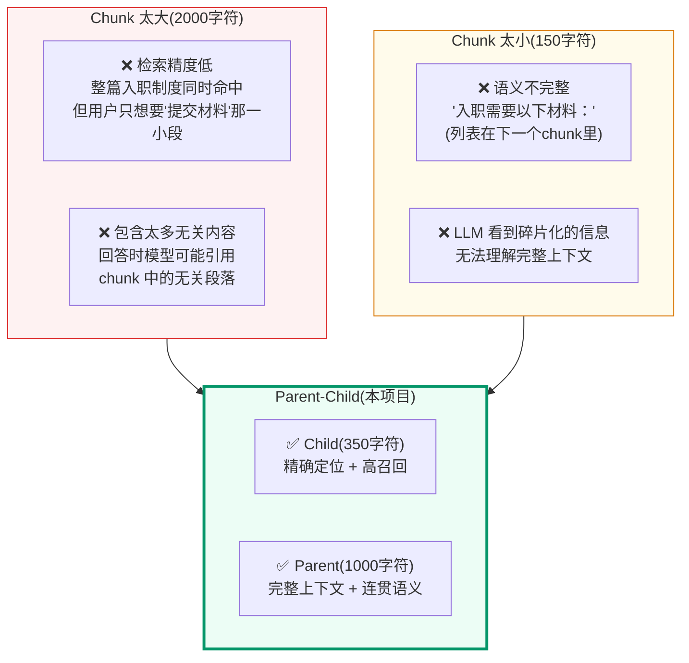
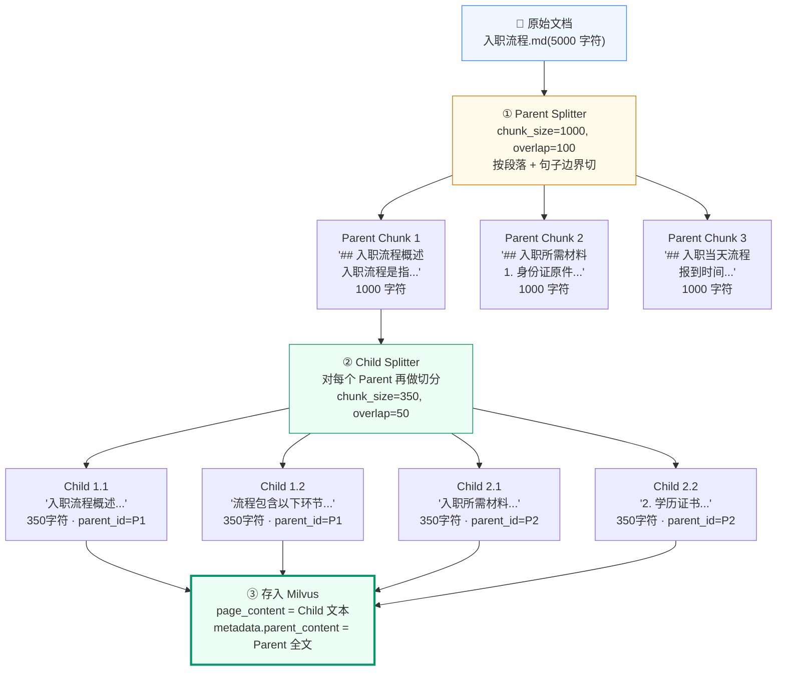
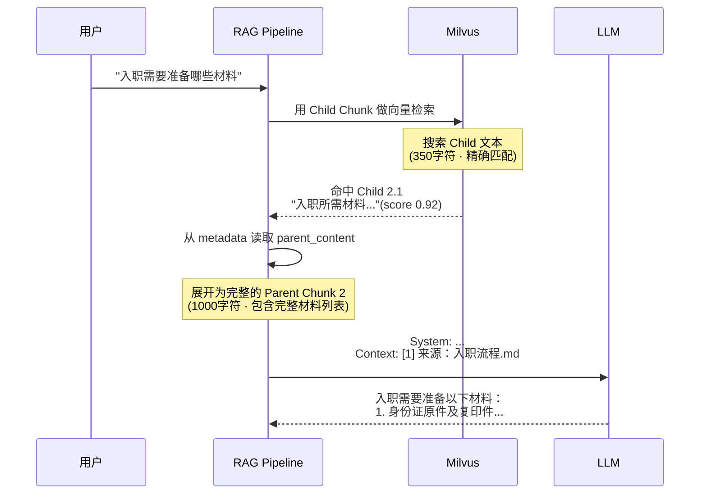
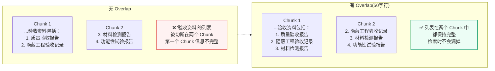
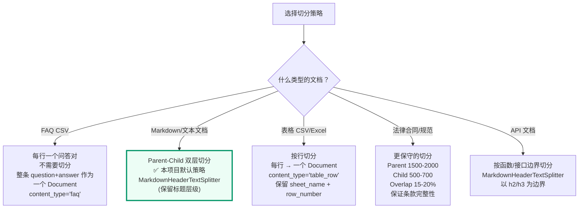

# 文档切分策略
<Badge icon="clock" color="green">Written: 2026.06</Badge>
## 1. 为什么需要这讲

附录 E 讲解了 RecursiveCharacterTextSplitter 的递归降级算法。第 3 讲 §10 展示了 LangChain splitter 的 API 用法。但 **Parent-Child Chunking**(父子块切分)是本项目最关键的设计决策之一，影响着检索精度和答案质量，目前没有一个地方完整讲解它。

本附录覆盖：

| 你想知道 | 当前覆盖 |
| --- | --- |
| 为什么要 Parent-Child 两层？只用一层不行吗？ | 未深入 |
| Parent 1000 字符、Child 350 字符怎么定的？ | 代码有但没解释 |
| Overlap 100/50 有什么作用？ | 未解释 |
| 不同文档类型的切分策略有何不同？ | 未覆盖 |
| 语义切分 vs 固定长度切分怎么选？ | 未覆盖 |

## 2. 为什么需要切分

### 2.1 LLM 的上下文窗口是有限的

LLM 的上下文窗口虽然越来越大(qwen-plus 支持 32K token)，但这不是无限的。而且：

- **成本**：Prompt 越长，每次调用的 token 费用越高
- **注意力稀释**：LLM 对长文本中间的细节注意力会衰减("Lost in the Middle" 问题)
- **检索精度**：如果把整本 PDF 当做一个 Document，检索时找到的永远是同一篇文档，无法精确定位到具体段落

### 2.2 只用一个 Chunk Size 的问题



**这张图用一个直观的对比回答了一个核心问题：为什么不能简单地把文档按固定长度一刀切？**

**Chunk 太大(2000 字符)的问题**：检索时整篇入职制度被当做一个结果返回，但用户只关心"提交材料"这一小段。向量相似度算的是整个 chunk 和问题的匹配程度——chunk 中 90% 无关内容会"稀释"向量，导致相似度分数不准。更严重的是，LLM 拿到这个 2000 字符的 chunk 后，可能引用其中的无关段落来回答，产生"看起来有关但其实不对"的幻觉。

**Chunk 太小(150 字符)的问题**：语义信息被切断。"入职需要以下材料："这一句以冒号结尾，但材料列表在下一个 chunk 里。检索到这个小 chunk 后，LLM 只能看到半句话，后面的关键信息完全丢失。碎片化的 chunk 还会导致"每个 chunk 的语义都差不多"——向量空间中的区分度降低，检索精度反而更差。

**Parent-Child(本项目的方案)**：核心思路是**检索用小块，生成用大块**。Child chunk(350 字符)粒度细、语义聚焦，检索时精确定位到"提交材料"这一段；Parent chunk(1000 字符)包含完整上下文，LLM 生成时能看到前后的语义关联。两个 chunk 通过 `parent_id` 关联——Milvus 中存的是 Child 的向量和文本，但 metadata 中携带了完整的 Parent 内容。检索命中 Child 后，构建上下文时取的是 Parent。

**具体参数是怎么定的？** Parent 1000 字符、Child 350 字符是本项目当前的默认配置，不是 LangChain 或行业标准。设计依据是：Child 要足够短，便于精确检索一个要点；Parent 要足够长，便于给 LLM 提供完整上下文。这里的 token 换算只能粗略估计，因为中文、英文、数字和表格的 token 密度不同。生产环境应结合资料段落长度分布、召回评测和 prompt 成本继续调整。

## 3. Parent-Child Chunking 完整流程

### 3.1 切分过程



### 3.2 检索和生成时的使用



**关键设计**：
- **检索**用 Child(短、精确)—— 350 字符能精确定位到"材料"这个主题
- **生成**用 Parent(长、完整)—— LLM 看到的 1000 字符包含了完整的材料清单，不会遗漏

### 3.3 代码实现

```python
# qa_core/indexing/chunking.py

from langchain_text_splitters import (
    MarkdownHeaderTextSplitter,
    RecursiveCharacterTextSplitter,
)
from qa_core.config.settings import get_settings
from qa_core.utils import stable_hash

# 中文优先分隔符：段落 → 换行 → 句子标点 → 短语标点 → 空格 → 字符
CHINESE_SEPARATORS = [
    "\n\n", "\n",
    "。", "！", "？", "；", ";", ".", "!", "?",
    "，", ",",
    " ",
    "",
]

def split_documents(documents: list[Document]) -> tuple[list[Document], list[str]]:
    """将文档切成 Parent-Child 双层结构。

    Child 进 Milvus 做精确检索，Parent 存 metadata 给 LLM 看完整上下文。
    """
    settings = get_settings()

    # 两个 splitter：Parent 大块(1000)，Child 小块(350)
    parent_splitter = RecursiveCharacterTextSplitter(
        chunk_size=settings.parent_chunk_size,       # 1000
        chunk_overlap=settings.parent_overlap,        # 100
        separators=CHINESE_SEPARATORS,
    )
    child_splitter = RecursiveCharacterTextSplitter(
        chunk_size=settings.child_chunk_size,         # 350
        chunk_overlap=settings.child_overlap,          # 50
        separators=CHINESE_SEPARATORS,
    )

    chunks: list[Document] = []
    ids: list[str] = []

    for doc in documents:
        content_type = str(doc.metadata.get("content_type", "")).lower()
        file_type = str(doc.metadata.get("file_type", "")).lower()

        # ── 分支 1：表格行不切分 ──
        # 表格 loader 已经把一行转成"表头 + 行号 + 单元格键值"的完整语义单元。
        # 再切会导致"金额"和"状态"分到两个 chunk 里，检索到金额却找不到审批人。
        if content_type.startswith("table"):
            parent_docs = [doc]

        # ── 分支 2：Markdown 先按标题切再递归切 ──
        elif file_type == ".md":
            header_splitter = MarkdownHeaderTextSplitter(
                headers_to_split_on=[("#", "h1"), ("##", "h2"), ("###", "h3")]
            )
            # 按 #/##/### 标题切分为章节，保留 h1/h2/h3 到 metadata
            header_docs = header_splitter.split_text(doc.page_content)
            for header_doc in header_docs:
                header_doc.metadata.update(doc.metadata)  # 补回文件级 metadata
            # 每个章节再递归切 Parent
            parent_docs = parent_splitter.split_documents(header_docs)

        # ── 分支 3：普通文本直接递归切 Parent ──
        else:
            parent_docs = parent_splitter.split_documents([doc])

        # ── 每个 Parent 再切 Child，并用稳定哈希生成 ID ──
        for parent_doc in parent_docs:
            parent_content = parent_doc.page_content

            # 稳定哈希 = SHA256(scenario_id + kb_version + embedding_model_version
            #                   + chunk_schema_version + doc_id + parent_content)
            # 同一个文件未变化时 ID 不变；文件变化时 ID 自动变化，配合 manifest 更新
            parent_id = stable_hash(
                parent_doc.metadata.get("scenario_id"),
                parent_doc.metadata.get("kb_version"),
                parent_doc.metadata.get("embedding_model_version"),
                parent_doc.metadata.get("chunk_schema_version"),
                parent_doc.metadata.get("doc_id"),
                parent_content,
            )

            child_docs = child_splitter.split_documents([parent_doc])
            for child_doc in child_docs:
                chunk_id = stable_hash(parent_id, child_doc.page_content)
                metadata = dict(child_doc.metadata or {})
                metadata.update({
                    "parent_id": parent_id,
                    "parent_content": parent_content,
                    "chunk_id": chunk_id,
                })
                chunks.append(Document(page_content=child_doc.page_content, metadata=metadata))
                ids.append(chunk_id)

    return chunks, ids
```

**关键设计点**(对照上面的代码阅读)：

| 行 | 设计决策 | 原因 |
| --- | --- | --- |
| `content_type.startswith("table")` | 表格行不切分 | 一行已经是完整语义单元，切开会拆散列值 |
| `MarkdownHeaderTextSplitter` | md 文件先按标题切 | 保留 `h1/h2/h3` 层级信息到 metadata，LLM 可引用章节结构 |
| `stable_hash(...)` | 用 SHA256 生成 ID | 包含 5 个版本字段 + 内容 → 同一文件未改动时 ID 稳定，改动后自动变化 |
| `kb_version` 进 hash | 版本隔离 | 同一文件在两个 KB 版本中可共存，不会主键冲突 |

```python
# qa_core/pipeline/context.py — 检索后展开 Parent

def select_context_docs(faq_hits, doc_hits, plan):
    for hit in eligible_doc_hits:
        metadata = hit.document.metadata or {}
        parent_content = metadata.get("parent_content")

        # 如果有 parent_content，优先使用(完整上下文)
        # 否则降级使用 page_content(Child 本身)
        content = parent_content or hit.document.page_content
        append_doc(Document(page_content=content, metadata=metadata), ...)
```

## 4. Chunk Size 的选择原理

### 4.1 Parent Size：为什么是 1000

```text
Parent 给 LLM 看，决定了答案的上下文完整度。

太小(500 字符)：
  → LLM 看到碎片："入职需要以下材料：1. 身份证"(列表断了)
  → 回答不完整

太大(2000 字符)：
  → 一次带太多无关内容进 Prompt
  → 消耗 token 额度，可能稀释关键信息

1000 字符 ≈ 500 中文字 ≈ 适合一个完整小节的长度：
  → "## 入职所需材料" + 5 个要点的完整描述
  → "## VPN 故障排查" + 4 个步骤的完整说明
```

### 4.2 Child Size：为什么是 350

```text
Child 给 Milvus 检索，决定了检索精度。

太小(150 字符)：
  → 语义信息不足，向量表示不准确
  → 容易误召回(短文本的向量噪音大)

太大(500 字符)：
  → 检索不够精确，退化为 Parent 的行为
  → 召回时带进太多无关句子

350 字符 ≈ 2-3 个完整句子：
  → 包含了完整的语义单元
  → 足够 Embedding 模型提取准确语义
  → 精确定位到具体的段落
```

### 4.3 Overlap 的作用



**Overlap 比例选择**：

| 比例 | 效果 | 适用场景 |
| --- | --- | --- |
| 0% | 无重叠，存储最小 | 短文档、FAQ(每条独立) |
| 5-10% | 轻量重叠 | 制度文档、说明文档 |
| **10-15%**(本项目) | **适中** | **通用文档(本项目使用)** |
| 20%+ | 大量重叠，存储开销大 | 法律合同(不能截断关键条款) |

Parent 使用 10% overlap(100/1000)，Child 使用 ~14% overlap(50/350)。Child 的 overlap 比例略高，因为小块更容易在边界处切断语义。

## 5. 不同文档类型的切分策略



**不是所有文档都该用同一种切法。** 这张决策树展示了项目中五种文档类型各自对应的切分策略，以及为什么：

**分支一：FAQ CSV → 不切分。** FAQ 的每一行已经是一个完整的问答对——问题本身就是最好的检索单位，标准答案作为 metadata.answer 携带。如果对 FAQ 做切分，"问题"和"答案"可能被切开分到两个 chunk 里，检索命中问题 chunk 时拿不到答案。所以 FAQ 是一个 Document = CSV 中的一行。

**分支二：Markdown / 文本文档 → Parent-Child 双层(本项目默认策略)。** 这类文档是最主要的资料形态(制度、流程、手册)，占知识库的 80% 以上。使用 MarkdownHeaderTextSplitter 保留标题层级(`#` → `##` → `###`)，切分时优先在标题边界处断，保证每个 chunk 内部的语义不跨越章节边界。

**分支三：表格 CSV / Excel → 按行切分。** 表格的每一行是一个独立的数据记录(如"制裁名单"表中的一行 = 一个国家 + 限制类型 + 法律依据)。跨行切分会把两个不同记录的数据拼在一起，导致检索混乱。每行作为一个 Document，`content_type='table_row'`，保留 `sheet_name` 和 `row_number` 用于溯源。

**分支四：法律合同 / 规范 → 更保守的参数。** 法律文本中条款之间的引用关系非常紧密——第 5 条可能引用第 3 条的定义，第 10 条可能推翻第 8 条的适用条件。如果切得太碎，LLM 看到的是"孤立的条款"而不是"关联的法律文本"。所以 Parent 放大到 1500-2000 字符，Child 放大到 500-700 字符，overlap 提高到 15-20%，确保关键条款不会被切断。

**分支五：API 文档 → 按函数/接口边界切分。** API 文档有清晰的结构——每个函数(或 endpoint)是独立的语义单元，包含签名、参数、返回值、示例。以 h2/h3 标题为边界切分，每个 chunk 恰好是一个完整的 API 说明。

**注意：** 当前项目中，分支一(FAQ)和分支二(Markdown)是主路径。分支三(表格)已在入库闭环中支持。分支四和五作为扩展策略，配置参数已预留但当前场景未大量使用。

### 5.1 本项目中的实际配置

```text
# qa_core/config/settings.py

# 通用文档(Markdown / 纯文本)
parent_chunk_size: int = 1000
child_chunk_size: int = 350
parent_overlap: int = 100
child_overlap: int = 50

# 表格文件(CSV / Excel)
# 不在 settings 中，由 table_documents.py 控制
# 每行作为一个 Document，不切分

# FAQ CSV
# 不在 settings 中，由 faq_ingestion.py 控制
# 每条 FAQ 作为一个 Document，不切分
```

## 6. 语义切分 vs 固定长度切分

### 6.1 两种策略对比

| 策略 | 做法 | 例子 | 优点 | 缺点 |
| --- | --- | --- | --- | --- |
| **固定长度** | 按字符数强制切 | 每 500 字符一刀 | 实现简单，性能稳定 | 可能在句子中间切断 |
| **递归降级**(本项目) | 先按段落切，超长再降级 | `\n\n` → `\n` → `。` → `，` | 优先语义边界 | 略复杂 |
| **语义切分** | 用 Embedding 模型判断语义断点 | 两个句子 Embedding 距离突然变大 → 切分点 | 语义最连贯 | 需要额外模型调用，慢 |

### 6.2 本项目选择递归降级的理由

本项目的分隔符列表：`["\n\n", "\n", "。", "！", "？", "；", "，", " ", ""]`

```text
以 "入职流程包含以下步骤：1. 提交材料 2. 签订合同 3. 办理社保" 为例：

1. 先尝试用 \n\n(段落)切 → 没找到
2. 用 \n(换行)切 → 没找到
3. 用 。(句子)切 → 没找到(这段没有句号)
4. 用 ，(短语)切 → 找到了：
   "入职流程包含以下步骤：1. 提交材料"
   "2. 签订合同"
   "3. 办理社保"
```

这个策略保证了**切分点优先落在自然的语义边界上**(段落 > 句子 > 短语)，只有当前面的分隔符切完后某块仍超过限制时，才降级到更细粒度的分隔符。

## 7. 切分质量的自我验证

### 7.1 好的 Chunk 长什么样

```text
✅ 好的 Child Chunk(350字符)：
"## 入职所需材料

入职当天需要携带以下材料：
1. 身份证原件及复印件(正反面)
2. 学历证书复印件(最高学历)
3. 离职证明(上一家公司的正式离职文件)
4. 近三个月的一寸免冠照片 2 张
5. 本人名下的银行卡(用于工资发放)"
→ 主题明确、信息完整、有标题层级

❌ 差的 Child Chunk(350字符)：
"2. 学历证书复印件(最高学历)
3. 离职证明(上一家公司的正式离职文件)
4. 近三个月的一寸免冠照"
→ 开头被切断、没有标题、不知道这是入职还是报销的材料
```

### 7.2 项目内置的质量检查

```python
# qa_core/quality/chunk.py

def detect_low_quality_chunks(chunks):
    """检测低质量 Chunk，输出到入库质量报告。"""
    issues = []
    for chunk in chunks:
        text = chunk.page_content
        # 1. 空 Chunk
        if not text.strip():
            issues.append({"chunk_id": chunk.metadata["chunk_id"], "issue": "empty"})
        # 2. 过短 Chunk(< 50 字符，几乎无信息)
        elif len(text) < 50:
            issues.append({"chunk_id": chunk.metadata["chunk_id"], "issue": "too_short"})
        # 3. 噪声占比过高(> 50% 是标点或空白)
        elif sum(1 for c in text if c in " \n\t\r，。；：！？、") / len(text) > 0.5:
            issues.append({"chunk_id": chunk.metadata["chunk_id"], "issue": "noisy"})
    return issues
```

## 8. 本讲小结

- **Parent 负责给 LLM 完整上下文(1000字符)**，Child 负责给 Milvus 精确检索(350字符)
- **检索用 Child，生成用 Parent**：Child 精确定位 → 展开 parent\_content → LLM 看到完整段落
- **Overlap 防止边界切断语义**：Parent 10%(100/1000)，Child 14%(50/350)
- **递归降级切分**优先在段落、句子边界切，避免在短语中间截断
- **不同文档类型用不同策略**：FAQ 不切、表格按行、制度文档用 Parent-Child
- **切分质量 = 答案质量的上限**：Chunk 切坏了，后面的检索、Rerank、生成都救不回来