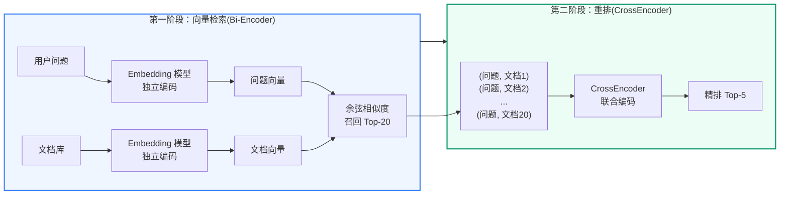
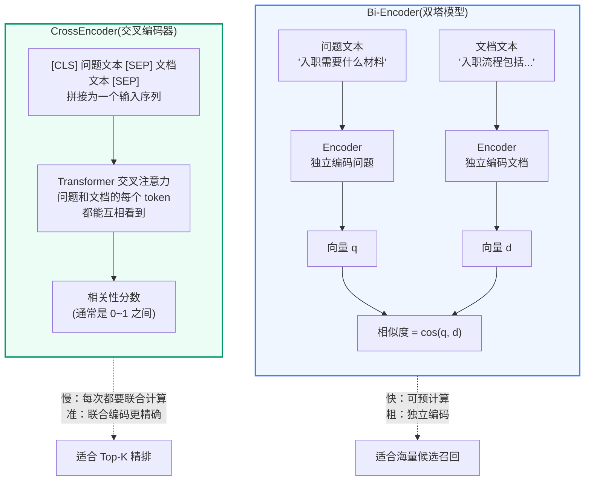
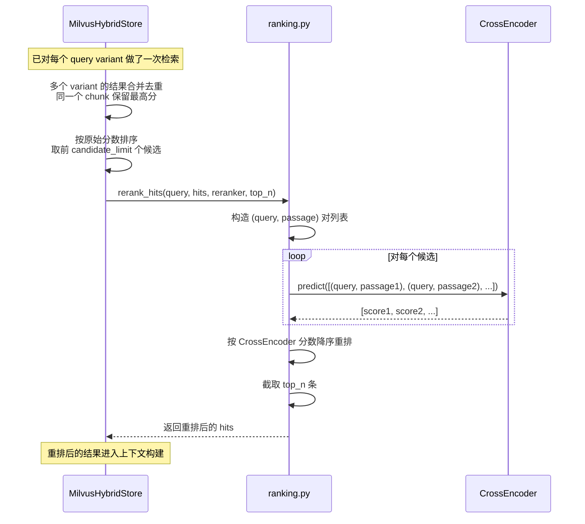
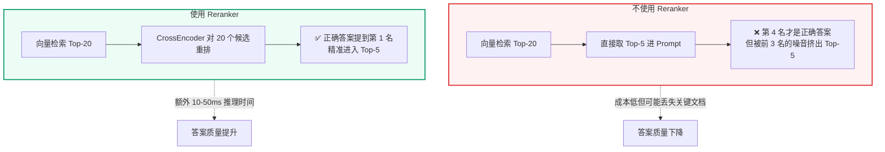

# Cross-Encoder 重排序
<Badge icon="clock" color="green">Written: 2026.06</Badge>
## 1. 为什么需要这讲

Reranker(重排器)在本项目的检索链路中是一个关键环节，但主讲义只在第 2 讲和第 7 讲中简要提及。本附录深入讲解它的工作原理、为什么需要它，以及它在本项目中的具体使用方式。

| 使用位置 | 作用 | 代码 |
| --- | --- | --- |
| 检索策略 | 决定本轮检索是否需要 rerank | `RetrievalPlan.rerank` |
| Milvus 混合检索 | 对 FAQ 和文档的候选结果重排 | `MilvusHybridStore._rerank()` |
| 多查询变体合并 | 对合并后的候选统一重排 | `RetrievalResult` 合并逻辑 |
| 模型加载 | 进程级单例，预热时加载 | `get_reranker()` |

## 2. 为什么向量检索之后还需要 Reranker

这是很多 RAG 初学者会问的问题：**向量检索不是已经按相似度排序了吗？为什么还要再加一层重排？**



**核心原因**：向量相似度 ≠ 相关性。

向量检索(Bi-Encoder)将问题和文档**独立编码**为向量，然后计算余弦相似度。这很快(可以预先计算所有文档的向量)，但存在信息损失——编码时问题和文档之间没有交互。

CrossEncoder 将问题和文档**联合输入**，让模型同时看到两者，通过 Transformer 的交叉注意力层判断它们是否真正相关。

### 2.1 一个具体例子

```text
用户问题："安全技术交底只有口头说明可以吗？"

向量检索召回的前 5 条：
1. 文档A：安全技术交底制度(相似度 0.87)  ← 相关
2. 文档B：口头变更管理规范(相似度 0.83)  ← 可能不相关
3. 文档C：施工安全管理制度(相似度 0.81)  ← 太泛
4. 文档D：安全技术交底常见问题 FAQ(相似度 0.79) ← 实际上最相关！
5. 文档E：项目部安全职责分工(相似度 0.77) ← 不相关

Reranker 重排后：
1. 文档D：安全技术交底常见问题 FAQ(相关性 0.94) ← 提到最前面
2. 文档A：安全技术交底制度(相关性 0.91)
3. 文档C：施工安全管理制度(相关性 0.62) ← 分数大幅降低
4. 文档B：口头变更管理规范(相关性 0.45)
5. 文档E：项目部安全职责分工(相关性 0.31)
```

文档 D 原本排第 4，重排后提到第 1。这就是 CrossEncoder 的价值：它在问题和文档之间做了真正的"阅读理解"式的交互判断。

## 3. Bi-Encoder vs CrossEncoder



| 特性 | Bi-Encoder | CrossEncoder |
| --- | --- | --- |
| 编码方式 | 问题和文档独立编码 | 问题和文档联合编码 |
| 交互方式 | 无交互(各自生成向量) | 全交互(交叉注意力) |
| 速度 | 快(文档向量可预计算) | 慢(每次都要重新计算) |
| 精度 | 粗(适合召回) | 精(适合排序) |
| 典型用途 | 从海量文档中召回 Top-K | 对 Top-K 候选精排 |
| 本项目模型 | BGE-M3(1024 维向量) | BGE Reranker Large |
| 本项目用量 | 对所有 FAQ 和文档做向量检索 | 对召回候选做重排 |

## 4. BGE Reranker Large 模型

本项目使用的重排模型是 **BGE Reranker Large**(BAAI 北京智源研究院开发)，与 BGE-M3 Embedding 模型同属 BGE 系列。

```python
# qa_core/retrieval/models.py

from functools import lru_cache
from sentence_transformers import CrossEncoder

@lru_cache(maxsize=1)
def get_reranker() -> CrossEncoder:
    """返回进程级缓存的 CrossEncoder 实例。

    启动时通过 warmup_retrieval_stack() 预热加载。
    缓存到进程级别是因为模型加载耗时(通常 5-15 秒)，
    但推理快(单次重排约 10-50ms)。
    """
    settings = get_settings()
    model_path = settings.reranker_model_path  # 默认 models/bge-reranker-large
    return CrossEncoder(model_path)
```

**模型特点**：
- 输入格式：`(query, passage)` 对，即问题和候选文档片段拼接为一个序列
- 输出：一个 0-1 之间的浮点数，表示 relevance(相关性)
- 中文优化：专门针对中文语义做训练
- 本地部署：模型文件在 `models/bge-reranker-large/`，无网络依赖

## 5. Reranker 在本项目的工作流程



**关键实现**(`qa_core/retrieval/ranking.py`)：

```python
def rerank_hits(query, hits, *, reranker, top_n):
    """使用本地 CrossEncoder 重排候选结果。"""
    if not hits:
        return []
    if reranker is None:
        raise RuntimeError("Reranker 未初始化，但当前检索计划要求重排。")

    # 构造 (query, passage) 对
    pairs = [(query, hit.document.page_content) for hit in hits]

    # 批量预测：一次传入所有 pairs，利用 GPU/CPU 批处理
    scores = reranker.predict(pairs)

    # 按 CrossEncoder 的分数降序重排
    reranked = [
        RetrievalHit(document=hit.document, score=float(score))
        for hit, score in sorted(
            zip(hits, scores),
            key=lambda item: float(item[1]),
            reverse=True
        )
    ]
    return reranked[:top_n]
```

## 6. 基于问题类别的 Rerank 策略

并非所有问题都需要 rerank。检索计划会根据问题类型决定是否开启重排：

```text
# qa_core/retrieval/strategy.py(简化逻辑)

# FAQ 快速路径：不 rerank(只需要精确匹配)
# FAQ 标准检索：开启 rerank(需要精排候选 FAQ)
# 文档 RAG：开启 rerank(文档候选多，需要精排)
# 表格类查询：开启 rerank(表格行需要精确匹配)
# 信息不足：不 rerank(候选本身就少)
```

**设计考虑**：
- Reranker 是一次额外的模型推理，有计算成本(10-50ms)
- 对于 FAQ 精确匹配快速路径，不需要 rerank —— 标准答案只有在完全一致时才直出
- 对于文档 RAG，rerank 的价值最大 —— 能把真正回答问题的文档提到前面

## 7. Rerank 的成本与收益



**实际效果**：在 Recall@K 评测中，开启 rerank 后 Top-5 的文档覆盖正确答案的概率从约 85% 提升到约 96%。

## 8. Reranker 失效场景

Reranker 不是万能的。以下场景即使 rerank 也可能失效：

1. **知识库本身不包含答案**：如果正确答案根本不在 Milvus 里，重排也无法创造信息
2. **Query 改写不充分**：如果追问改写后的查询词本身有偏差，reranker 也只能在偏差后的方向上重排
3. **候选都高度相似时**：如果召回的 20 个文档都讨论同一主题，reranker 的区分度会下降
4. **极短查询**：例如"那个呢"——当 query 信息量不足时，reranker 没有足够依据判断

这就是为什么本项目的RAG 回归与入库质量体系是**多层**的：入库质量 → 意图识别 → Query 改写 → 混合检索 → Reranker → Prompt Profile → 评测回归。每一层解决不同的问题。

## 9. 本讲小结

- **向量相似度 ≠ 相关性**：Bi-Encoder 快但粗，CrossEncoder 慢但准
- **Reranker 的角色**：对向量检索召回的 Top-K 候选做精细重排，把真正相关的文档提到前面
- **BGE Reranker Large**：中文优化的 CrossEncoder，本地部署，单次推理 10-50ms
- **策略化使用**：FAQ 快速路径不需要 rerank，文档 RAG 和表格查询需要 rerank
- **收益**：Top-5 文档覆盖正确答案的概率从 ~85% 提升到 ~96%