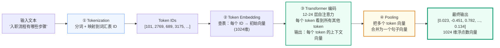
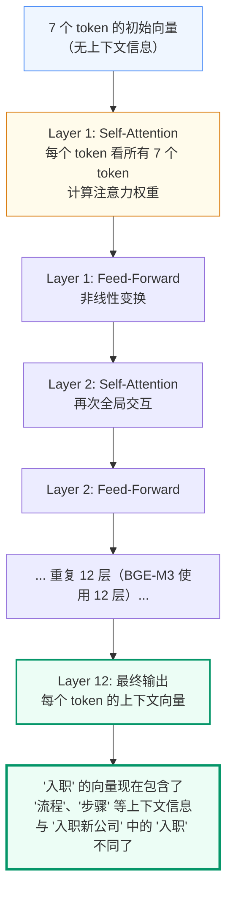
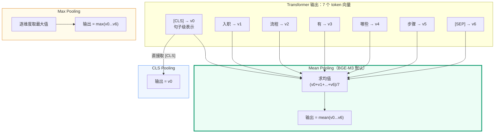
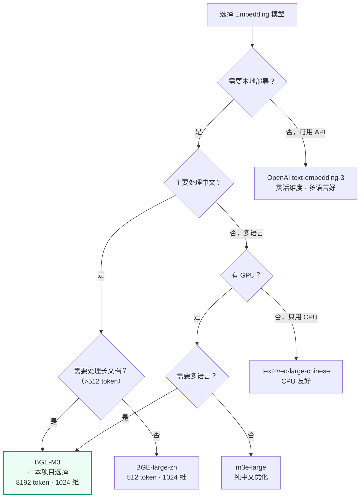
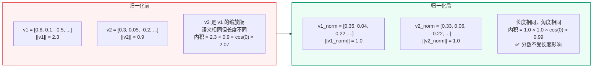

# Embedding 与 BGE-M3
<Badge icon="clock" color="green">Written: 2026.06</Badge>
## 为什么需要这讲

讲 02 §1.4 介绍了 BGE-M3 的基本信息（特性表 + 一段代码）。但 Embedding 是整个 RAG 系统的基石——向量检索、相似度计算、Reranker 的输入全部都依赖它。深入理解 Embedding 对于面试和实际调优都至关重要。

本附录覆盖以下讲 02 未深入的内容：

| 你想知道 | 当前覆盖 |
| --- | --- |
| 一段文本具体是怎么变成 1024 个数字的？ | 讲 02 只说"Embedding 模型输出向量" |
| CLS Pooling / Mean Pooling 是什么？为什么重要？ | 未覆盖 |
| 为什么选 1024 维？维度怎么权衡？ | 未覆盖 |
| BGE-M3 vs text2vec vs m3e vs OpenAI 怎么选？ | 未覆盖 |
| `normalize_embeddings=True` 做了什么？ | 代码有但没解释 |
| Embedding 模型怎么评估好坏（MTEB）？ | 未覆盖 |

## 一、文本变向量的完整过程



### 1.1 第一步：Tokenization（分词）

```python
# 以 BGE-M3 使用的 XLM-RoBERTa tokenizer 为例
from transformers import AutoTokenizer

tokenizer = AutoTokenizer.from_pretrained("BAAI/bge-m3")

text = "入职流程有哪些步骤"
tokens = tokenizer.tokenize(text)
print(tokens)
# ['▁入职', '▁流程', '▁有', '▁哪些', '▁步骤']

input_ids = tokenizer.encode(text)
print(input_ids)
# [0, 2769, 689, 3175, 852, 2714, 2]
#  ↑                          ↑
# [CLS] 起始标记           [SEP] 结束标记
```

Tokenization 的本质：把自然语言文本映射为词汇表中的整数 ID。BGE-M3 的 tokenizer 词汇表约有 25 万个 token。

### 1.2 第二步：Token Embedding（查表）

```text
# 每个 token ID 查表得到初始向量（未包含上下文信息）
# 形状：(7, 1024) — 7 个 token，每个 1024 维

token_embeddings = embedding_table[input_ids]
# token_embeddings[0] = [CLS] 的初始向量
# token_embeddings[1] = '入职' 的初始向量
# token_embeddings[2] = '流程' 的初始向量
# ...
```

这一步得到的向量还**没有上下文信息**——"入职"这个词在"入职流程"和"离职后入职新公司"中，初始向量是完全一样的。需要通过下一步 Transformer 来注入上下文。

### 1.3 第三步：Transformer 编码（核心）



**Self-Attention 的核心思想**：对于每个 token，计算它与其他所有 token 的"相关性分数"。比如处理"入职"时，模型发现"流程"和"步骤"与它高度相关，于是把它们的语义信息加权融合到"入职"的向量中。

### 1.4 第四步：Pooling（关键选择）

Transformer 输出的是**每个 token 的向量**（7 个），但我们需要的是**整个句子的向量**（1 个）。Pooling 负责这个合并操作。



| Pooling 策略 | 做法 | 优点 | 缺点 | 适用场景 |
| --- | --- | --- | --- | --- |
| **CLS** | 取 `[CLS]` token 的输出向量 | 简单 | 需要训练时专门优化 CLS | BERT 系列常用 |
| **Mean** | 所有 token 向量求均值 | 信息全面，对短句和长句都友好 | 可能被无意义的 token 稀释 | **BGE-M3 使用** |
| **Max** | 每个维度取最大值 | 保留最强信号 | 丢失分布信息 | 少用 |

BGE-M3 使用 Mean Pooling，这也是为什么 `encode_kwargs=&#123;"normalize_embeddings": True&#125;` 通常开启了 L2 归一化——Mean Pooling 后的向量长度可能不同，归一化后所有向量落在单位球面上，余弦相似度的计算更稳定。

## 二、维度选择：为什么是 1024 维

### 2.1 维度的本质

一个 1024 维的向量可以看作是在 1024 维空间中定位一个点。维度越高，空间越大，能编码的语义信息越丰富。但维度越高，存储和计算成本也越大。

```text
维度        每向量存储      百万向量的存储     检索速度      语义区分力
─────────────────────────────────────────────────────────
384         1.5 KB         1.5 GB             最快          ★★☆
768         3 KB           3 GB               快            ★★★
1024        4 KB           4 GB               中等          ★★★★
1536        6 KB           6 GB               较慢          ★★★★☆
4096        16 KB          16 GB              慢            ★★★★★
```

### 2.2 本项目选 1024 维的理由

BGE-M3 默认输出 1024 维，这个维度是经过大量实验平衡后的结果：

- 比 768 维（BGE-large 的维度）有更强的语义区分力
- 比 1536 维（OpenAI text-embedding-3-large）存储成本更低
- 1024 = 2^10，GPU 计算友好
- 在 MTEB 中文基准上，BGE-M3 的 1024 维效果与 OpenAI 1536 维相当

## 三、主流 Embedding 模型对比

| 模型 | 维度 | 最大长度 | 中文支持 | 部署方式 | 适用场景 |
| --- | --- | --- | --- | --- | --- |
| **BGE-M3**（本项目） | 1024 | 8192 token | ⭐⭐⭐ | 本地 CPU/GPU | 中文 RAG 首选 |
| BGE-large-zh | 1024 | 512 token | ⭐⭐⭐ | 本地 | 中文短文本 |
| text2vec-large-chinese | 1024 | 512 token | ⭐⭐ | 本地 | 中文短文本 |
| m3e-large | 1024 | 512 token | ⭐⭐ | 本地 | 中文短文本 |
| OpenAI text-embedding-3-small | 512/1536 | 8192 token | ⭐ | API | 多语言 |
| OpenAI text-embedding-3-large | 256/1024/3072 | 8192 token | ⭐⭐ | API | 多语言，可选维度 |



**这张决策树以"是否需要本地部署"作为第一层分支——这是所有后续决策的前提。**

**右路（可用 API）：OpenAI text-embedding-3**

如果数据可以发送到外部服务，OpenAI 的 Embedding API 是最省事的方案——不需要下载模型、不需要 GPU、按 token 计费、多语言效果好。适合海外项目或对数据出境不敏感的团队。但本项目的场景是企业内部知识库（制度、流程、合同、合规），数据不能随意发送给第三方，所以这条路不适用。

**左路（必须本地部署）：进入中文场景判断**

这是本项目的路径。进入本地部署后，第二个决策点是"主要处理中文？"：

- **多语言场景 → 再看有没有 GPU**：有 GPU + 需要多语言 → BGE-M3（支持中英文 + 100+ 语言）；没有 GPU + 只需中文 → m3e-large（纯中文优化，CPU 友好）
- **中文场景 → 再看是否处理长文档**：这是本项目的判断路径

**长文档判断（> 512 token）**：很多老一代中文 Embedding 模型（BGE-large-zh、text2vec、m3e）的最大输入长度只有 512 token。一份企业制度文档的一个段落就可能超过这个限制，超出的部分会被直接截断——相当于"只读了文档的前半部分"。

BGE-M3 支持 **8192 token** 的输入，可以一次性编码很长的 chunk。搭配 Parent-Child Chunking 时，Parent chunk（1000 字符 ≈ 600-800 token）也在范围内。这是本项目选择 BGE-M3 的核心原因之一。

**GPU 分支（无长文档需求时）**：有 GPU 直接用 BGE-large-zh（性能最好）；没有 GPU 用 text2vec-large-chinese（CPU 优化更好）。但这两个模型都被 512 token 限制住，不适合长文档 RAG。

**BGE-M3 是本项目的最终选择**，决策路径是：必须本地部署 → 主要处理中文 → 需要处理长文档（> 512 token）→ BGE-M3（8192 token, 1024 维）。高亮颜色标注了这是推荐路径。

## 四、L2 归一化：为什么 normalize\_embeddings=True

### 4.1 没有归一化的问题

```text
# 两个语义相同的句子，但长度不同
query = "入职"
doc = "入职流程包含以下步骤：1. 提交个人材料 2. 签订劳动合同 3. 办理社保"

# Mean Pooling 后：
# query 的向量长度较大（token 少，平均值波动大）
# doc 的向量长度较小（token 多，平均值趋于零）

# 直接用内积比较：
#   query · doc = ||query|| × ||doc|| × cos(θ)
#   长度差异会影响分数！
```

### 4.2 L2 归一化的作用

```text
v\_{\text{normalized}} = \frac{v}{||v||\_2}
```

归一化后，所有向量的长度都变成 1（落在单位球面上）。此时：

```text
\text{cosine}(A, B) = A\_{\text{norm}} \cdot B\_{\text{norm}} = \text{IP}(A, B)
```

**余弦相似度 = 内积**。这使得：
- 相似度计算退化为内积，更快
- 不受向量原始长度的影响
- Milvus 的 COSINE 和 IP 两种度量在归一化后完全等价

### 4.3 可视化



## 五、MTEB：如何评估 Embedding 模型

**MTEB（Massive Text Embedding Benchmark）** 是评估 Embedding 模型的事实标准。它包含 8 大类、58 个数据集：

| 类别 | 测什么 | 本项目相关的场景 |
| --- | --- | --- |
| **Retrieval** | 从大量文档中找到相关文档的能力 | ⭐ 最相关（RAG 检索） |
| **Clustering** | 将相似文本分组的能力 | 文档归类 |
| **PairClassification** | 判断两个文本是否语义等价 | FAQ 去重 |
| **Reranking** | 对候选结果重新排序 | Reranker 评测 |
| **STS** | 判断两个句子的语义相似度 | 相似 FAQ 检测 |
| **Classification** | 文本分类 | 意图识别 |
| **Summarization** | 摘要质量 | 历史摘要 |
| **BitextMining** | 跨语言对齐 | 多语言场景 |

BGE-M3 在中文 Retrieval 子集上排名前列，这也是本项目选择它的核心理由。

## 六、Embedding 模型在本项目中的加载

```python
# qa_core/retrieval/models.py

from functools import lru_cache
from langchain_huggingface import HuggingFaceEmbeddings

@lru_cache(maxsize=1)
def get_embeddings() -> HuggingFaceEmbeddings:
    """进程级缓存的 Embedding 模型。

    BGE-M3 模型文件约 2.2GB（包含 tokenizer + Transformer 权重）。
    首次加载需要 10-30 秒（取决于硬件）。启动时通过 warmup_retrieval_stack()
    预热，后续调用直接复用。

    device='cpu' 在本项目中使用 CPU 推理。
    对于教学场景（每小时几十次 Embedding），CPU 足够。
    生产环境建议使用 device='cuda'。
    """
    return HuggingFaceEmbeddings(
        model_name="models/bge-m3",
        model_kwargs={"device": "cpu"},
        encode_kwargs={
            "normalize_embeddings": True,  # L2 归一化
            "batch_size": 8,               # 批量处理大小
        },
    )
```

**加载时间分析**：

```text
首次加载 get_embeddings()：
  ├─ 加载 tokenizer 配置 + 词汇表（~50MB）        → 1-2 秒
  ├─ 加载 Transformer 12 层权重（~2.1GB）         → 8-20 秒（取决于磁盘）
  └─ 预热（第一次 encode 需要初始化计算图）       → 2-5 秒
  总计：约 10-30 秒

后续调用（已缓存）：
  └─ encode("入职流程")                           → 50-200ms
```

这就是为什么项目在 `warmup_runtime()` 中调用 `warmup_retrieval_stack()`——如果不预热，第一个用户首次提问需要等待 30 秒才能得到回复。

## 本讲小结

- **Tokenization → Embedding → Transformer → Pooling**：四步将文本转为 1024 维向量
- **Pooling 策略**决定如何从多个 token 向量合并为句子向量：CLS/Mean/Max，BGE-M3 使用 Mean Pooling
- **1024 维**是精度与成本的平衡点，在 MTEB 中文基准上与更高维度模型效果相当
- **L2 归一化**使余弦相似度退化为内积，消除向量长度对分数的影响
- **BGE-M3** 支持 8192 token 长文本、本地部署、中文优化，是本项目的最佳选择
- **MTEB** 的 Retrieval 子集是评估 Embedding 模型检索能力的最相关标准