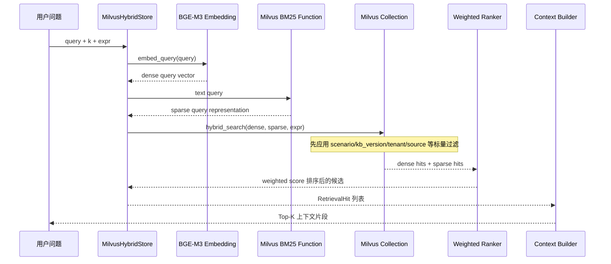
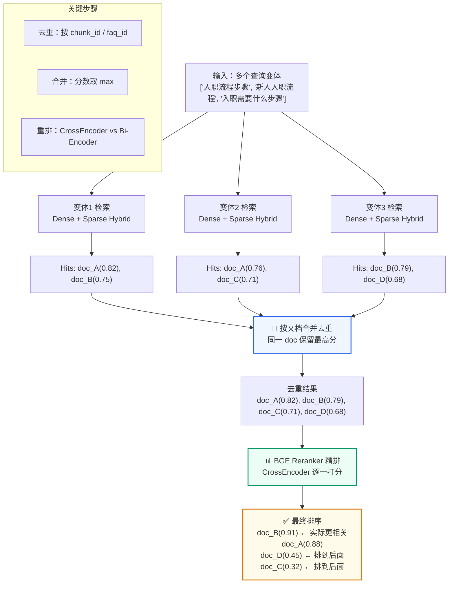
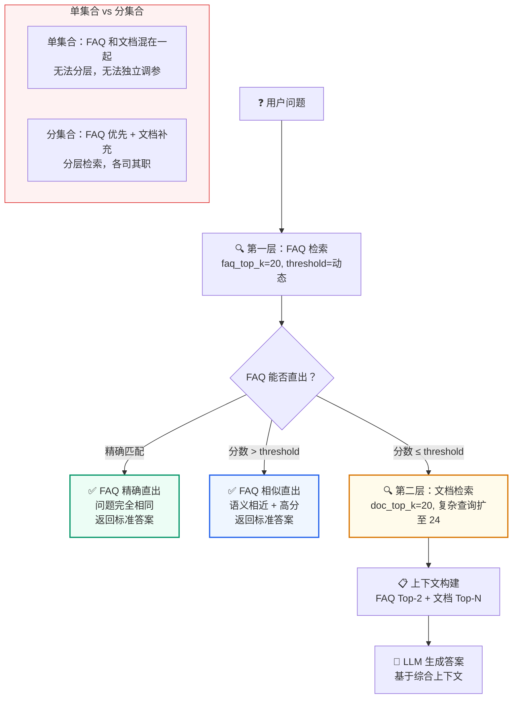
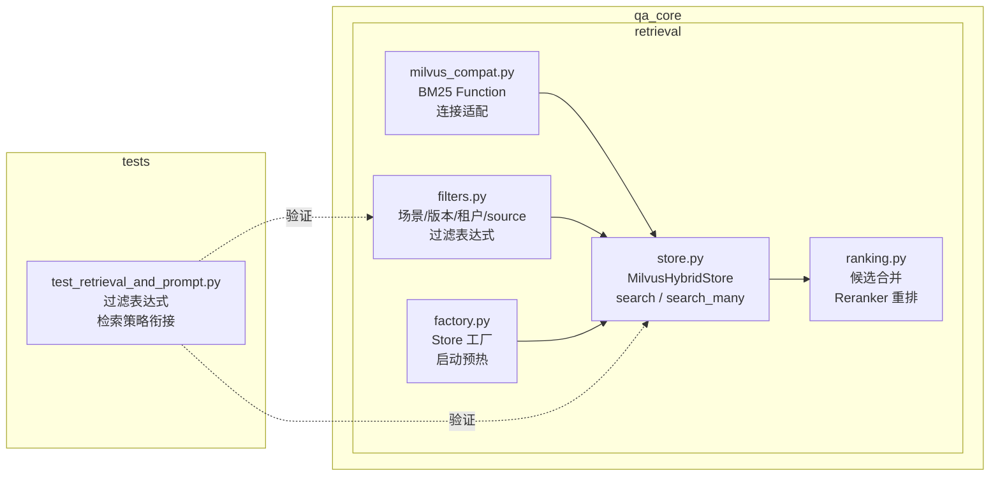

# Milvus 混合检索
<Badge icon="clock" color="green">Written: 2026.06</Badge>
> 第 08 章跟敲代码：`codealong/chapters/ch08_milvus_hybrid_search`。
> 这部分代码是本章跟敲版，用来先跑通核心闭环；完整项目源码仍以本讲后文标注的 `qa_core/`、`scripts/` 等路径为准。

**上一讲**：[查询改写与变体生成](/RAG/retrieval/query-rewrite-variants)  
**下一讲**：[QAService 核心编排](/RAG/pipeline/qaservice-orchestration)

## 本讲目标

- 深入理解 Milvus Dense + Sparse Hybrid Search 的实现细节
- 掌握 Milvus 过滤表达式的构建规则和安全校验
- 理解 Reranker 在检索链路中的角色和实现
- 了解多查询变体合并去重的完整流程

> 📖 **前置阅读**：如果你不熟悉 HNSW 索引原理或想看 pymilvus 基本操作（创建 Collection、建索引、插入、搜索），请先阅读 [第4讲：Milvus 索引机制与基本操作](/RAG/retrieval/milvus-index-and-operations)。

---

## 数据准备检查

第二阶段重点讲在线检索链路，不完整展开离线知识库构建。但在进入混合检索之前，必须确认 Milvus 中已经有可检索数据、有 active 知识库版本。可以把它理解为：讲 SQL 查询前，要先确认表和测试数据已经准备好。

下面所有 `docker compose --env-file .env.compose ...` 命令都要求项目根目录已经存在
`.env.compose`。仓库只提交 `.env.compose.example`，新环境先执行：

```text
if (!(Test-Path .env.compose)) { Copy-Item .env.compose.example .env.compose }
notepad .env.compose
```

### 0.1 检查服务是否启动

```bash
docker compose --env-file .env.compose ps
```

重点看 `milvus`、`mysql`、`api` 是否处于 running/healthy 状态。如果 Milvus 或 MySQL 没起来，后面的 collection、active 版本、检索演示都会失败。

### 0.2 检查当前场景和 active 版本

```python
docker compose --env-file .env.compose run --rm api python -c "from qa_core.config.settings import get_settings; from qa_core.scenarios.registry import get_scenario; from qa_core.governance.kb_versions import KnowledgeBaseVersionStore; s=get_settings(); sc=get_scenario(s.active_scenario_id); store=KnowledgeBaseVersionStore(sc.kb_versions_path); print('scenario=', sc.id); print('faq_collection=', sc.faq_collection); print('doc_collection=', sc.doc_collection); print('active=', store.get_active_version())"
```

期望看到：

- `scenario` 是当前讲解场景，例如 `enterprise_knowledge`
- `faq_collection` 和 `doc_collection` 有明确名称
- `active` 不是 `None`

如果 `active=None`，说明还没有激活知识库版本，在线检索不知道该查哪一批数据。

### 0.3 检查 Milvus Collection 是否存在

```python
docker compose --env-file .env.compose run --rm api python -c "from pymilvus import MilvusClient; from qa_core.config.settings import get_settings; s=get_settings(); c=MilvusClient(uri=s.milvus_uri); print(c.list_collections())"
```

列表中应该包含当前场景的 FAQ/Doc collection。例如企业知识场景通常需要看到：

```text
enterprise_faq_hybrid_v1
enterprise_doc_hybrid_v1
```

### 0.4 如果没有数据，先做一次预置入库

第二阶段不讲入库细节，但课前最好把 8 个业务场景一次性初始化好。

新环境首次初始化，或者之前改过 Milvus schema，使用 `--reset-collections` 重建全部 8 个场景：

```bash
docker compose --env-file .env.compose up -d mysql etcd minio milvus
docker compose --env-file .env.compose build api
docker compose --env-file .env.compose run --rm api python scripts/rebuild_scenarios.py --reset-collections
```

如果之前已经存在知识库，只是资料内容变化，批量刷新 8 个场景时不要删除 collection：

```bash
docker compose --env-file .env.compose run --rm api python scripts/rebuild_scenarios.py
```

批量脚本会逐个为 8 个冻结场景创建新知识库版本、强制入库、执行质量门禁并激活。这样第 8 讲切换任意业务场景时，Milvus 都有可检索数据。

如果只想补一个场景，例如企业知识场景，也可以执行单场景预置：

```bash
docker compose --env-file .env.compose run --rm api python scripts/rebuild_kb_version.py --scenario enterprise_knowledge --new-version --force --quality-gate --activate
```

如果之前改过 Milvus schema，或者遇到 BM25 Function / sparse 字段不兼容，需要删除旧 collection 后重建：

```bash
docker compose --env-file .env.compose run --rm api python scripts/rebuild_kb_version.py --scenario enterprise_knowledge --new-version --force --reset-collections --quality-gate --activate
```

本讲边界：

> 第 8 讲暂时不展开“数据如何入库”，只确认“Milvus 里已经有可检索的数据”。完整的 FAQ、文档、表格资料如何通过 `rebuild_kb_version.py` 构建成 active 版本，放到第 16 讲系统讲。

---

## 第一部分：前置知识 — BM25 算法原理

### 1.1 什么是 BM25

**BM25（Best Matching 25）** 是信息检索领域最经典的关键词匹配算法，可以看作是 TF-IDF 的改进版。

BM25 的核心思想：**一个词在一篇文档中出现的频率越高，这篇文档与该词的关联度越大；但如果这个词在很多文档中都出现（如"的"、"是"），它区分文档的能力就弱**。

> **和第 2 讲的向量相似度有什么关系？** Dense 检索会把文本转成连续浮点向量，再用 Cosine / IP / L2 这类几何相似度比较；本项目的 Sparse 检索使用 Milvus BM25 Function，它虽然落在 `sparse` 字段里，但评分核心是词频、逆文档频率和长度归一化，不是把 sparse 字段继续套余弦相似度公式。

```text
\text{BM25}(D, Q) = \sum\_{i=1}^{n} \text{IDF}(q\_i) \times \frac{f(q\_i, D) \times (k\_1 + 1)}{f(q\_i, D) + k\_1 \times (1 - b + b \times \frac{|D|}{\text{avgdl}})}
```

虽然公式看起来复杂，但理解它做什么即可：

- **IDF（逆文档频率）**：稀有词（如"入职"、"Webhook"）贡献高，常见词（如"的"、"这个"）贡献低
- **TF 归一化**：词频高不一定分数高，BM25 对 TF 做了饱和处理（出现 3 次和出现 30 次的分差不大）
- **长度归一化**：长文档不天然比短文档更有优势

### 1.2 BM25 的打分直觉

BM25 不是简单数关键词出现了几次。它会同时考虑三个问题：

1. **查询词有没有出现**：用户问"入职材料"，文档里出现"入职"和"材料"，相关性就会上升。
2. **这个词是否有区分度**：如果"材料"在很多文档里都出现，它的贡献会被降低；如果"入职"只在少数 HR 文档里出现，它的贡献会更高。
3. **文档是否过长**：一篇很长的制度汇编可能包含很多词，但不一定比一条短 FAQ 更精准，所以 BM25 会做文档长度归一化。

用口语表达就是：

> BM25 更喜欢"命中了用户关键词、关键词又比较少见、文本长度还比较克制"的文档。

假设用户问题是：

```text
新人入职需要提交哪些材料？
```

有三条候选文本：

```text
A：新人入职需要提交身份证复印件、学历证明、离职证明和银行卡信息。
B：员工材料归档要求包括合同、审批单、培训记录等。
C：公司制度汇编包含人事、财务、采购、行政等全部管理办法。
```

BM25 的排序通常会是：

```text
A > B > C
```

原因：

- A 同时命中"新人/入职/提交/材料"，而且内容集中，得分最高。
- B 命中"材料"，但没有命中"入职"，只能算部分相关。
- C 可能语义上属于公司制度，但没有命中关键查询词，BM25 分数低。

这也是 BM25 的典型优势：**对术语、编号、制度名称、合同条款、HS 编码、表单名称这类精确词非常敏感**。

### 1.3 BM25 使用示例

如果不用 Milvus 内置 BM25，在 Python 里可以用 `rank_bm25` 快速理解它的工作方式：

```python
from rank_bm25 import BM25Okapi

docs = [
    "新人 入职 需要 提交 身份证 复印件 学历证明 离职证明 银行卡 信息",
    "员工 材料 归档 要求 包括 合同 审批单 培训记录",
    "公司 制度 汇编 包含 人事 财务 采购 行政 管理办法",
]

tokenized_docs = [doc.split() for doc in docs]
bm25 = BM25Okapi(tokenized_docs)

query = "新人 入职 材料"
scores = bm25.get_scores(query.split())

for doc, score in sorted(zip(docs, scores), key=lambda x: x[1], reverse=True):
    print(round(score, 3), doc)
```

示例输出类似：

```text
1.284 新人 入职 需要 提交 身份证 复印件 学历证明 离职证明 银行卡 信息
0.102 员工 材料 归档 要求 包括 合同 审批单 培训记录
0.000 公司 制度 汇编 包含 人事 财务 采购 行政 管理办法
```

这个示例只用于理解算法。它把很多工程问题都省略了：

- 示例里已经手工把文本切成了空格分词，真实中文文档需要稳定的中文分词器。
- 示例每次启动都重新构建 `BM25Okapi(tokenized_docs)`，真实系统不能每次查询都重建全量索引。
- 示例只有 3 条文档，真实项目会持续新增、删除、重建 chunk，需要知道哪些旧文本要移除、哪些新文本要加入。
- 示例只返回 BM25 分数，真实 Hybrid Search 还要和 Dense 向量检索结果合并、去重、排序。

所以真实项目没有用 `rank_bm25` 做在线检索，而是让 Milvus 在服务端完成中文分词、BM25 sparse 向量生成、索引和检索。

### 1.4 Dense vs Sparse 互补

回顾第 2 讲的内容，这里做更深入的对比：

|  | Dense（BGE-M3 Embedding） | Sparse（BM25） |
| --- | --- | --- |
| 表示方式 | 1024 维浮点数向量 | 稀疏向量（大部分维度为 0） |
| 强项 | 语义相似、同义词、改写 | 精确关键词、专业术语、编号 |
| 弱项 | 专业术语可能召回不精准 | 不理解语义，"改密码"≠"重置密码" |
| 计算 | 需要 Embedding 模型（GPU 友好） | 纯统计计算（CPU 即可） |
| 例子 | "入职需要什么" → 召回"报到材料" | "HS 编码 8471.30" → 精确匹配 |

---

## 第二部分：Milvus 混合检索实现

### 2.1 双向量字段的 Schema

在 Milvus 中，每个 collection 有两个向量字段：

```text
Collection Schema:
┌──────────────┬──────────────┬──────────────────────────────┐
│ 字段名        │ 类型          │ 说明                          │
├──────────────┼──────────────┼──────────────────────────────┤
│ pk           │ VARCHAR      │ 主键（稳定 chunk_id）          │
│ text         │ VARCHAR      │ 原始文本（检索输入 + 生成展示） │
│ dense        │ FLOAT_VECTOR │ BGE-M3 生成的 1024 维向量      │
│ sparse       │ SPARSE_VECTOR│ Milvus 服务端 BM25 生成         │
│ source       │ VARCHAR      │ 业务分类（用于过滤）           │
│ kb_version   │ VARCHAR      │ 知识库版本（用于过滤）         │
│ scenario_id  │ VARCHAR      │ 场景 ID（用于过滤）            │
│ tenant_id    │ VARCHAR      │ 租户 ID（用于过滤）            │
│ ...          │ ...          │ 更多标量过滤字段               │
└──────────────┴──────────────┴──────────────────────────────┘
```

### 2.2 LangChain Milvus 初始化

```python
# qa_core/retrieval/store.py
from langchain_milvus import Milvus

self._store = Milvus(
    embedding_function=get_embeddings(),      # BGE-M3 → 生成 dense 向量
    builtin_function=bm25_function(),          # Milvus 内置 BM25 → 生成 sparse 向量
    collection_name=self.collection_name,
    connection_args=connection_args,
    vector_field=["dense", "sparse"],          # 双向量字段
    text_field="text",
    primary_field="pk",
    auto_id=False,                             # 手动指定 ID
)
```

**关键参数分析**：

- `embedding_function`：当调用 `add_documents()` 写入数据时，LangChain 自动调用 BGE-M3 对 `text` 字段生成 Dense 向量
- `builtin_function`：Milvus 2.5.x 可用的服务端内置函数，在写入时自动对 `text` 字段执行中文分词 + BM25 编码，生成 Sparse 向量
- `vector_field=["dense", "sparse"]`：声明两个向量字段，相似度搜索时会**同时使用两者**，Milvus 内部自动加权融合分数
- `auto_id=False`：使用入库时生成的稳定 chunk\_id 作为主键。这使得文档更新时可以按 ID `delete(ids=old_ids)` 再 `add_documents(new_chunks)`

### 2.3 BM25 中文分词配置

```text
# qa_core/retrieval/milvus_compat.py
def bm25_function():
    return BM25BuiltInFunction(
        input_field_names="text",        # 对哪个字段做 BM25
        output_field_names="sparse",     # 输出到哪个向量字段
        analyzer_params={"type": "chinese"},  # 使用中文分词器
        enable_match=True,               # 启用 BM25 match 评分
    )
```

`analyzer_params=&#123;"type": "chinese"&#125;` 确保 BM25 使用中文分词器（而不是默认的英文空格分词）。这样"企业知识库智能问答"会被正确拆分为"企业/知识库/智能/问答"，而不是按空格当成一个整体。

### 2.4 Milvus 内置 BM25 的优势

本项目没有在 Python 侧自己维护 BM25 索引，而是使用 Milvus 2.5.x 的 `BM25BuiltInFunction`。这样做有几个工程优势：

| 方案 | 问题 |
| --- | --- |
| Python 自己跑 BM25 | Demo 很简单，但生产化时还要补中文分词、索引缓存、删除/新增 chunk 更新、BM25 与 Dense 结果合并去重 |
| MySQL `LIKE` / 全文索引 | 可以做关键词匹配，但无法和 Dense 向量检索在同一套向量检索流程里融合 |
| Milvus 内置 BM25 | 文本写入时自动生成 sparse 向量，查询时自动生成 sparse query，并能和 dense 检索统一融合 |

具体到本项目，Milvus 内置 BM25 带来这些收益：

1. **入库简单**：`add_documents()` 只写入文本和 metadata，Milvus 服务端自动从 `text` 字段生成 `sparse` 向量。
2. **查询简单**：用户输入 query 后，Milvus 自动生成 sparse query representation，不需要业务代码手动调用 BM25 编码器。
3. **融合自然**：Dense 和 Sparse 在一次 Hybrid Search 请求里完成，避免 Python 侧分别查两套系统再手动 merge。
4. **数据一致**：文档文本、dense 向量、sparse 向量、metadata 都在同一个 collection 中，版本过滤、租户过滤、source 过滤可以一起生效。
5. **更适合增量重建**：删除旧 chunk、写入新 chunk 后，BM25 sparse 字段由 Milvus 重新生成，不需要额外维护外部倒排索引。
6. **中文配置集中**：中文分词器通过 `analyzer_params=&#123;"type": "chinese"&#125;` 固定在 collection schema / function 配置里，避免不同脚本分词口径不一致。

所以这里的设计可以概括为：

```text
Python 负责业务编排
Embedding 模型负责 dense 语义向量
Milvus BM25 Function 负责 sparse 关键词向量
Milvus Hybrid Search 负责统一召回和融合排序
```

### 2.5 Hybrid Search 的分数融合

当同时使用 Dense 和 Sparse 检索时，Milvus 内部如何融合两者的分数？

```text
总分数 = w_dense × dense_score + w_sparse × sparse_score

默认权重：w_dense = 0.5, w_sparse = 0.5
          （可在搜索参数中调整）
```

本项目的 Milvus 配置使用默认权重 0.5 : 0.5，语义和关键词各占一半。对于特定场景（如法律文档更依赖精确关键词），可以调整权重。

### 2.6 一次 Hybrid Search 的完整时序

把前面的 dense、sparse、BM25、过滤和融合串起来，一次检索大致是这样发生的：



口语化理解：

> Dense 负责“意思像不像”，BM25 负责“关键词有没有精准命中”，Milvus 负责在同一个 collection 里把两种召回结果按权重融合，再把符合版本、租户、分类过滤条件的候选返回给 RAG 链路。

---

## 第三部分：过滤表达式构建

### 3.1 为什么需要过滤表达式

向量检索是在整个 collection 中找最相似的内容。但实际业务中，我们需要限制搜索范围：

- 同一个 collection 中存了多个场景的数据 → 只搜当前场景的
- 同一个场景中有多个知识库版本 → 只搜 active 版本的
- 开启了数据隔离 → 只搜当前租户/数据集的
- 前端选择了业务分类 → 只搜该分类的

这些限制通过 Milvus 的**标量过滤表达式**实现。

### 3.2 build\_source\_expr() 实现

```text
# qa_core/retrieval/filters.py
def build_source_expr(
    source_filter: str | None,
    kb_version: str | None = None,
    valid_sources: list[str] | None = None,
    data_scope: DataScope | None = None,
) -> str | None:
    """把业务过滤条件转换为 Milvus 布尔表达式。

    表达式包含四类约束：
    - source：业务分类，例如 hr、billing、alarm
    - kb_version：知识库版本，支持灰度、回滚
    - tenant_id/dataset_id：轻量多租户和数据集隔离
    - visibility/allowed_roles：轻量可见性控制
    """
    clauses: list[str] = []

    # 1. 业务分类过滤
    if source_filter:
        # 白名单校验！防止无效值进入 Milvus
        if valid_sources is not None and source_filter not in valid_sources:
            raise ValueError(f"无效的业务分类：{source_filter}")
        safe_source = escape_expr_value(str(source_filter))
        clauses.append(f'source == "{safe_source}"')

    # 2. 知识库版本过滤
    if kb_version:
        safe_version = escape_expr_value(str(kb_version))
        clauses.append(f'kb_version == "{safe_version}"')

    # 3. 数据隔离过滤
    if data_scope is not None:
        clauses.extend(data_scope.expr_clauses())

    # 4. 用 AND 拼接所有条件
    return " and ".join(clauses) if clauses else None
```

### 3.3 拼接后的实际表达式

对于一次具体的查询，过滤表达式可能长这样：

```text
# 场景：ent知识助手，HR 分类，active 版本，默认租户
expr = (
    'source == "hr"'
    ' and kb_version == "kb_enterprise_knowledge_20260506_103000_9f2a1b3c"'
    ' and tenant_id == "default"'
    ' and dataset_id == "default"'
    ' and visibility in ["public", "internal"]'
)
```

这个表达式在 Milvus 内部先做标量过滤（缩小搜索范围），再做向量检索，大幅提升检索精度和效率。

### 3.4 安全转义

```python
# qa_core/governance/data_scope.py
def escape_expr_value(value: str) -> str:
    """转义 Milvus 表达式中的特殊字符。

    防止用户输入中包含双引号等特殊字符破坏表达式结构。
    例如 source_filter='hr" or 1==1 or "' 这种注入尝试必须被转义。
    """
    return str(value).replace('"', '\\"')
```

---

## 第四部分：多查询变体检索与合并

### 4.1 search\_many() 的完整流程



```text
def search_many(
    self,
    queries: list[str],
    *,
    k: int,
    source_filter: str | None,
    kb_version: str | None = None,
    valid_sources: list[str] | None = None,
    data_scope: DataScope | None = None,
    source_type: Literal["faq", "doc"],
    rerank: bool = True,
) -> RetrievalResult:
    """对多个查询变体分别检索，合并结果后 rerank"""
    merged: dict[str, RetrievalHit] = {}
    searched_queries = normalize_queries(queries)

    for clean_query in searched_queries:
        # 对每个变体执行 Hybrid Search（关闭 rerank 避免重复重排）
        result = self.search(
            clean_query,
            k=k,
            source_filter=source_filter,
            kb_version=kb_version,
            valid_sources=valid_sources,
            data_scope=data_scope,
            source_type=source_type,
            rerank=False,
        )
        # 合并到全局结果（按文档去重，保留最高分）
        merge_hits_by_document(merged, result.hits)

    # 按分数排序
    hits = sort_hits_by_score(merged.values())

    # Rerank 重排（只对合并后的有限候选统一重排）
    if rerank and hits:
        hits = self._rerank(searched_queries[0], hits)

    return RetrievalResult(hits=hits[:k], ...)
```

### 4.2 文档去重逻辑

```python
def document_key(document: Document) -> str:
    """返回用于合并重复命中文档的稳定标识。

    优先级：
    1. chunk_id — 文档 chunk 的唯一 ID
    2. faq_id — FAQ 的唯一 ID
    3. 内容前 120 字符 — 最后兜底
    """
    metadata = document.metadata or {}
    return str(
        metadata.get("chunk_id")
        or metadata.get("faq_id")
        or document.page_content[:120]
    )

def merge_hits_by_document(merged, hits):
    """同一个文档被多个 query variant 命中时，只保留分数更高的那次。"""
    for hit in hits:
        key = document_key(hit.document)
        previous = merged.get(key)
        if previous is None or hit.score > previous.score:
            merged[key] = hit
```

**为什么需要去重？**

```text
用户问："入职流程有哪些步骤"
变体 1："入职流程有哪些步骤" → 命中 chunk_A (分数 0.82)
变体 2："入职需要做什么"     → 命中 chunk_A (分数 0.76)  ← 重复！
变体 3："入职具体步骤"       → 命中 chunk_A (分数 0.79)  ← 重复！

去重后：chunk_A 只保留分数最高的那次 (0.82)
```

### 4.3 Reranker 重排实现

```text
def rerank_hits(
    query: str,
    hits: list[RetrievalHit],
    *,
    reranker: Any,
    top_n: int,
) -> list[RetrievalHit]:
    """使用 CrossEncoder 重排候选结果。

    与向量检索（Bi-Encoder）不同，CrossEncoder 将 query 和 passage
    拼接后一起编码，通过交叉注意力获得更精确的相关性判断。
    """
    if not hits:
        return []
    if reranker is None:
        raise RuntimeError("Reranker 未初始化，但当前检索计划要求重排。")

    # 构建 (query, passage) 对
    pairs = [(query, hit.document.page_content) for hit in hits]

    # CrossEncoder 逐对打分
    scores = reranker.predict(pairs)

    # 按新分数重新排序
    reranked = [
        RetrievalHit(document=hit.document, score=float(score))
        for hit, score in sorted(
            zip(hits, scores),
            key=lambda item: float(item[1]),
            reverse=True
        )
    ]
    return reranked[:top_n]
```

**Reranker 的计算代价**：

- 向量检索（Bi-Encoder）：O(n) 次向量比较，n=候选数，每次都是快速的向量内积
- Reranker（CrossEncoder）：O(k) 次 Transformer 前向传播，k=候选数（通常 20-50），每次都需要模型推理

这就是为什么 Reranker 只对检索召回的前 k 个候选做重排，而不是对整个 collection 做。如果对整个 collection（可能有几十万条）做 CrossEncoder，一次查询就要几分钟。

---

## 第五部分：FAQ 与文档分集合设计

### FAQ 分层检索策略



### 5.1 为什么分集合

```text
方案 A：把所有内容放一个集合
  FAQ chunk + 文档 chunk 混在一起
  → 检索时 FAQ 和文档同等对待
  → 无法实现"FAQ 优先"策略
  → 无法给 FAQ 和文档设置不同的阈值

方案 B（本项目）：分两个集合
  FAQ collection（如 enterprise_knowledge_faq）
  Doc collection（如 enterprise_knowledge_doc）
  → FAQ 先检索，高置信直接返回
  → FAQ 低置信时再查文档
  → 可以独立调整 FAQ 和文档的 top_k、阈值
```

### 5.2 两层检索的工作流

```text
用户问题
    │
    ├─ FAQ 检索（faq_top_k = 20）
    │   └─ 精确匹配或分数 > faq_direct_threshold？
    │       ├─ 是 → 直接返回标准答案（不调用 LLM）
    │       └─ 否 → 继续文档检索
    │
    ├─ 文档检索（doc_top_k = 32）
    │   └─ Dense + Sparse Hybrid → Rerank → 去重
    │
    ├─ 上下文构建（FAQ Top-2 + 文档 Top-N）
    │   └─ 过滤低分、截断超长、去重
    │
    └─ LLM 生成
```

### 5.3 FAQ 的高置信直出

```python
# qa_core/pipeline/retrieval_steps.py
def get_faq_direct_answer(context, prepared, faq_result):
    """判断是否可以直出 FAQ 标准答案。

    只在整体分数最高的那条 FAQ 上判断直出，而非每条都试：
    - faq_direct_exact_only=True → threshold=inf，只允许精确匹配
    - faq_direct_exact_only=False → 相似分数超过 faq_direct_threshold 即可直出
    """
    threshold = float("inf") if prepared.plan.faq_direct_exact_only else prepared.plan.faq_direct_threshold
    return direct_faq_answer(
        context.query,
        faq_result.top_document,
        faq_result.top_score,
        threshold,
    )
```

---

## 第六部分：连接管理与数据库初始化

### 6.1 Milvus 数据库创建

```text
# qa_core/retrieval/milvus_compat.py
def ensure_milvus_database():
    """在服务端支持数据库时创建配置中的 Milvus database。"""
    settings = get_settings()
    client = MilvusClient(uri=settings.milvus_uri)
    databases = client.list_databases()

    # 如果配置了数据库名但不存在，自动创建
    if settings.milvus_database and settings.milvus_database not in databases:
        client.create_database(settings.milvus_database)
```

Milvus 2.4+ 引入了 Database 概念，类似于关系数据库的 Database。本项目的 `MILVUS_DATABASE` 默认为空，也就是使用 Milvus 默认 database；如果后续需要按环境或租户做更强隔离，本机 API 调试写在 `.env`，Docker Compose 部署写在 `.env.compose`。

### 6.2 显式连接别名注册

```python
def collection_alias(collection_name: str) -> str:
    return f"{collection_name}_alias"

def ensure_orm_alias_connection(alias: str, uri: str | None = None) -> None:
    settings = get_settings()
    target_uri = uri or settings.milvus_uri
    if connections.has_connection(alias):
        return
    connections.connect(alias=alias, uri=target_uri)
```

项目采用清晰的连接适配方式：为每个 collection 生成稳定 alias，并在创建 `langchain-milvus` wrapper 前显式注册 PyMilvus ORM 连接。这样既保留 LangChain VectorStore 抽象，也避免底层 ORM API 找不到连接。这不是补丁式兼容，而是当前 `langchain-milvus` 底层仍依赖 PyMilvus ORM alias 的工程边界。

---

## 本讲实践闭环

| 项目 | 内容 |
| --- | --- |
| 本讲类型 | 项目实现 |
| 实践产物 | `retrieval/store.py`、`filters.py`、`ranking.py` 的 Hybrid Search 能力 |
| 是否进入最终项目 | 是 |
| 验收方式 | 对已入库场景执行检索，返回 FAQ/Doc 命中，metadata 包含版本和过滤字段 |
| 后续落点 | 第 10 讲把检索结果放入完整 RAG Pipeline |

通过标准：Dense + Sparse 都参与召回，过滤表达式生效，Reranker 能对候选重排。

### 本讲从 0 到 1 实现闭环

实现完成后，相关代码结构应该是下面这张图：



#### Step 1：封装 Milvus BM25 Function

目标：让 Milvus 服务端根据 `text` 字段自动生成 sparse 向量。

来源：真实代码节选，见 `qa_core/retrieval/milvus_compat.py::bm25_function()`。

```text
def bm25_function():
    return BM25BuiltInFunction(
        input_field_names="text",
        output_field_names="sparse",
        analyzer_params={"type": "chinese"},
        enable_match=True,
    )
```

设计解释：Python 不维护外部 BM25 倒排索引，dense 和 sparse 都交给同一个 Milvus collection 管理。

#### Step 2：实现过滤表达式

目标：所有检索都必须限制在当前场景、版本、租户、数据集和分类内。

来源：真实代码逻辑压缩版，对应 `qa_core/retrieval/filters.py::build_source_expr()`。

```python
def build_source_expr(source_filter, kb_version=None, valid_sources=None, data_scope=None):
    validate_source_filter(source_filter, valid_sources)
    clauses = []

    if source_filter:
        safe_source = escape_expr_value(str(source_filter))
        clauses.append(f'source == "{safe_source}"')

    if kb_version:
        safe_version = escape_expr_value(str(kb_version))
        clauses.append(f'kb_version == "{safe_version}"')

    if data_scope is not None:
        clauses.extend(data_scope.expr_clauses())

    return " and ".join(clauses) if clauses else None
```

关键点：`source_filter` 必须先过白名单，字符串值必须转义；`scenario_id`、`tenant_id`、`dataset_id`、`visibility`、`allowed_roles` 不是在这里手写，而是由 `DataScope.expr_clauses()` 统一追加。

#### Step 3：实现 MilvusHybridStore 懒加载

目标：第一次检索或入库时才创建 LangChain Milvus store，并做 schema 校验。

来源：真实代码逻辑压缩版，对应 `qa_core/retrieval/store.py::MilvusHybridStore.store`。

```python
@property
def store(self) -> Milvus:
    if self._store is None:
        ensure_milvus_database()
        alias = collection_alias(self.collection_name)
        connection_args = langchain_connection_args(alias)
        ensure_orm_alias_connection(alias)

        self._store = Milvus(
            embedding_function=get_embeddings(),
            builtin_function=bm25_function(),
            collection_name=self.collection_name,
            connection_args=connection_args,
            vector_field=["dense", "sparse"],
            text_field="text",
            primary_field="pk",
            auto_id=False,
            enable_dynamic_field=True,
            consistency_level="Session",
            drop_old=False,
        )
        self.validate_hybrid_schema()
    return self._store
```

设计解释：schema 不兼容要启动时暴露，不能等用户提问时才出现 `nq [0] is invalid`。`validate_hybrid_schema()` 会检查 `text` analyzer、`dense` 字段、`sparse` 字段是否为 BM25 Function 输出，以及是否存在 `text -> sparse` 的 BM25 Function。

#### Step 4：实现单查询检索和多查询合并

来源：真实代码逻辑压缩版，对应 `qa_core/retrieval/store.py::search()` 和 `search_many()`。

```python
def search(self, query, *, k, source_filter, kb_version, valid_sources, data_scope, source_type, rerank=True):
    clean_query = (query or "").strip()
    if not clean_query or k <= 0:
        return RetrievalResult(query=clean_query, source_type=source_type)

    expr = build_source_expr(source_filter, kb_version, valid_sources, data_scope)
    kwargs = {
        "ranker_type": "weighted",
        "ranker_params": {"weights": [0.55, 0.45]},
    }

    raw_hits = self._similarity_search_with_score(clean_query, k=k, expr=expr, kwargs=kwargs)
    hits = [RetrievalHit(document=doc, score=float(score or 0.0)) for doc, score in raw_hits]
    if rerank and hits:
        hits = self._rerank(clean_query, hits)
    return RetrievalResult(hits=hits, query=clean_query, source_type=source_type)

def search_many(self, queries, *, k, source_filter, kb_version, valid_sources, data_scope, source_type, rerank=True):
    searched_queries = normalize_queries(queries)
    merged = {}

    for q in searched_queries:
        result = self.search(q, k=k, source_filter=source_filter, kb_version=kb_version,
                             valid_sources=valid_sources, data_scope=data_scope,
                             source_type=source_type, rerank=False)
        merge_hits_by_document(merged, result.hits)

    hits = sort_hits_by_score(merged.values())
    if rerank and hits:
        candidate_limit = max(settings.rerank_top_n * len(searched_queries), settings.rerank_top_n)
        hits = self._rerank(searched_queries[0], hits[:candidate_limit])
    return RetrievalResult(hits=hits[:k], query=" | ".join(searched_queries), source_type=source_type)
```

设计解释：多个 query variants 可能命中同一个 chunk，合并时保留最高分，再统一 rerank；单查询检索使用 weighted ranker 融合 dense/sparse，当前权重是 dense 0.55、sparse 0.45。

异常处理也不能省略：如果 Milvus 报 `nq [0] is invalid`，项目不会降级到 dense-only，而是明确提示 collection schema 缺少正确 BM25 Function，需要 `--reset-collections` 重建。

#### Step 5：验收检索闭环

前置：当前场景已有 active 版本和 Milvus collection。

来源：命令行验收，对应 `tests/test_retrieval_and_prompt.py`。

```bash
python -m pytest tests/test_retrieval_and_prompt.py -q
```

闭环验证重点：

| 验证项 | 验证方式 | 期望结果 |
| --- | --- | --- |
| BM25 Function | 查看 collection schema | `sparse` 是 BM25 Function 输出字段 |
| 过滤表达式 | 单测检查 expr 字符串 | 包含 `scenario_id`、`kb_version`、`tenant_id`、`source` |
| 单查询检索 | 用已入库问题检索 | 返回 FAQ 或文档候选 |
| 多查询合并 | 传入多个 variants | 同一文档去重，保留最高分 |
| Reranker | 开启 rerank | 候选顺序可被重排 |
| schema 兼容性 | 旧 collection | 启动或检索前明确报错，提示重建 |
| 空 query/k&lt;=0 | 传入空 query 或 k=0 | 返回空结果，不访问 Milvus |
| `nq[0]` 根因 | 复用旧 sparse schema | 抛出重建 collection 的明确错误 |

通过标准：

- 过滤表达式包含 `kb_version`、`tenant_id`、`dataset_id`、`source` 等字段。
- 多查询命中同一文档时能去重。
- Reranker 只对候选 Top-K 精排。
- 页面或检索脚本能返回 FAQ/Doc 命中，metadata 不缺关键字段。

## 重点掌握

| 优先级 | 内容 | 原因 |
| --- | --- | --- |
| ★★★ 必会 | Milvus Hybrid Search 的双向量字段 Schema：dense（BGE-M3 Embedding）+ sparse（BM25 BuiltInFunction） | 混合检索的底层实现基础 |
| ★★★ 必会 | 过滤表达式构建（build\_source\_expr）：source + kb\_version + 数据隔离四字段拼成 Milvus expr | 确保检索不跨场景、不跨版本、不跨租户 |
| ★★★ 必会 | FAQ/文档分集合设计：FAQ 高置信直出（不调 LLM），FAQ 低分→文档检索 | 分层检索的核心架构 |
| ★★ 理解 | BM25 算法核心思想、简单使用示例，以及 Milvus 内置 BM25 的工程优势 | 理解 Sparse 检索的原理和本项目为什么不手写 BM25 |
| ★★ 理解 | search\_many() 多查询变体合并流程：各自检索→按文档去重保留最高分→统一 Rerank | 多查询变体如何产生最终候选 |
| ★★ 理解 | Reranker（CrossEncoder）重排的实现和代价 | 理解为什么只对 Top-K 做重排 |
| ★ 了解 | 白名单校验 + 安全转义（escape\_expr\_value）防止注入 | 安全设计了解即可 |
| ★ 了解 | 显式连接别名注册的原因 | 连接适配，了解即可 |

## 本讲小结

- **BM25** 是经典的词频-逆文档频率检索算法，擅长精确关键词匹配；Milvus 内置 BM25 可以自动生成 sparse 向量并和 dense 检索统一融合
- **Milvus Hybrid Search** 同时使用 Dense 向量（语义）和 Sparse 向量（关键词），默认 50:50 加权
- **过滤表达式**将 source、kb\_version、tenant\_id 等拼成 Milvus expr，在执行检索前缩小搜索范围
- **白名单校验 + 安全转义**防止无效值或注入攻击进入 Milvus 表达式
- **多查询变体**分别检索后按文档去重合并，保留最高分
- **Reranker**（CrossEncoder）对候选做精排，代价高但精度高，只对 Top-K 候选使用
- **FAQ/文档分集合**是实现分层检索和动态阈值的基础

**下一讲**：[QAService 核心编排](/RAG/pipeline/qaservice-orchestration) — 服务门面模式、HTTP/WS 分工、事件生成器