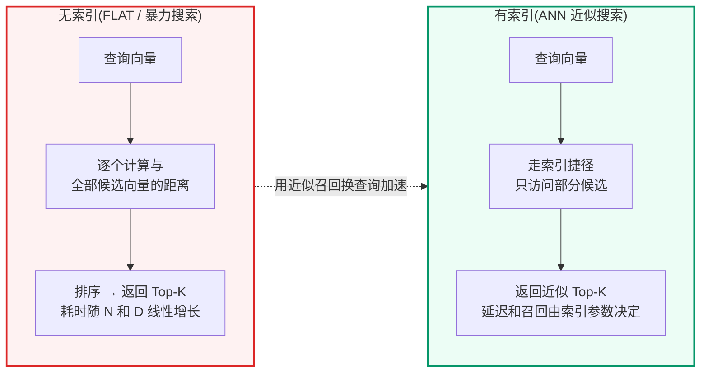
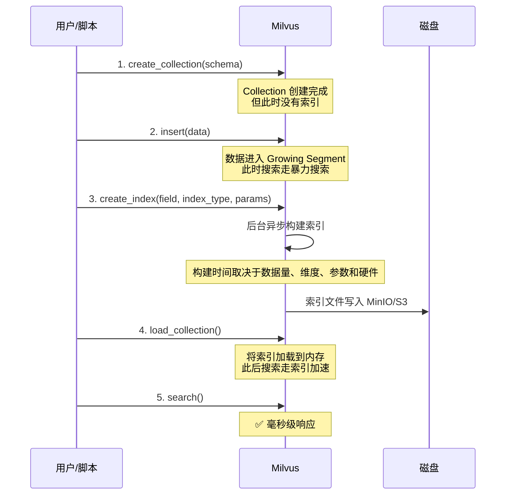
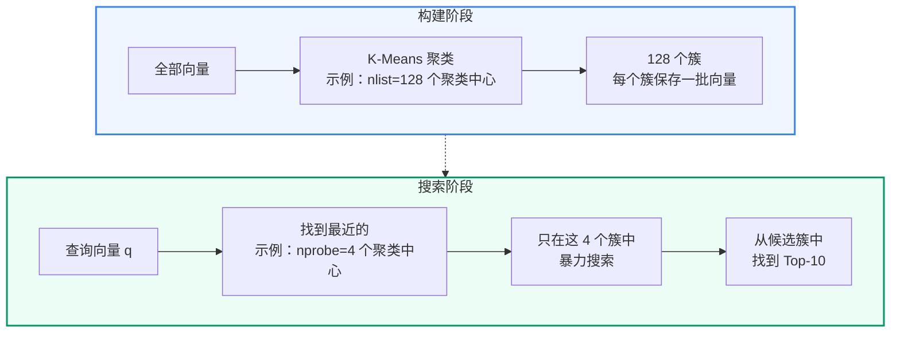
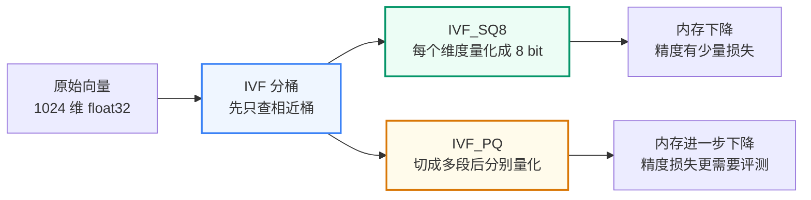
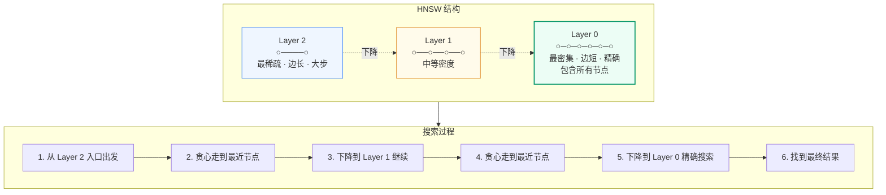
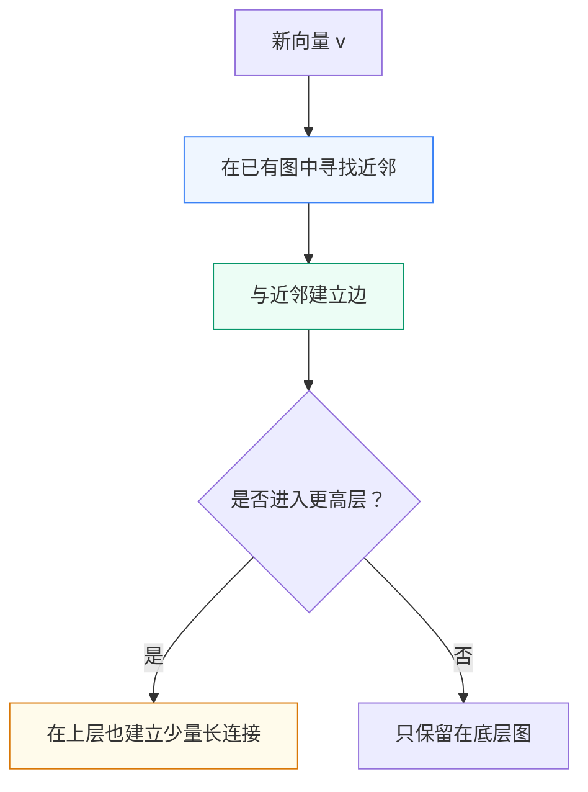
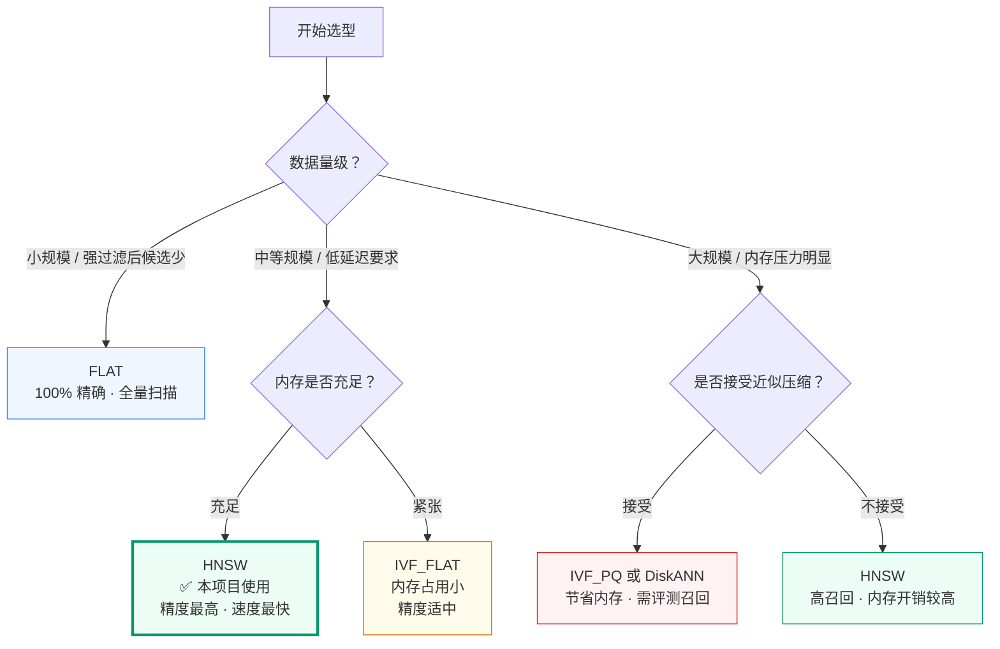
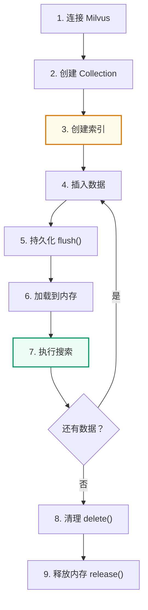
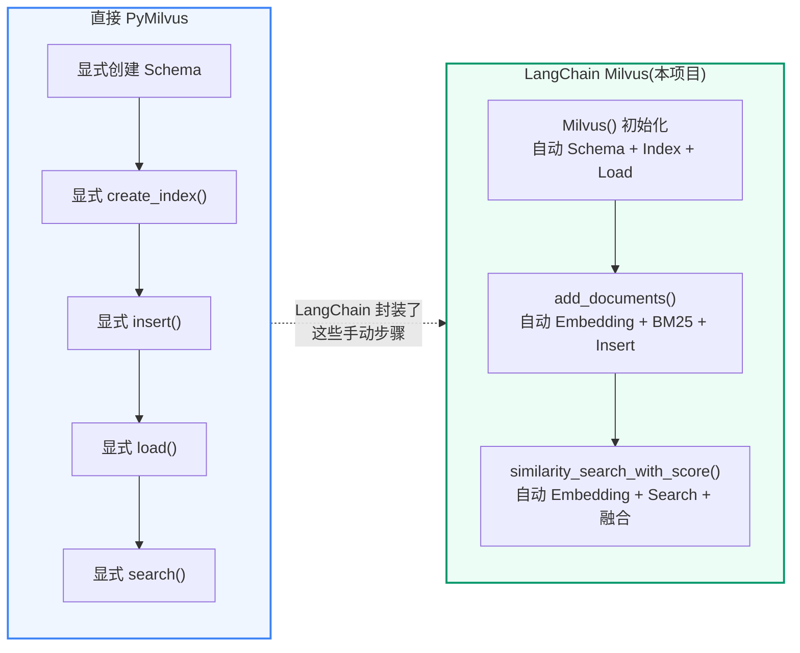

# Milvus 索引与运维
<Badge icon="clock" color="green">Written: 2026.06</Badge>
**上一讲**：[LangChain 生态系统](/RAG/foundations/langchain-ecosystem)  
**下一讲**：[意图分类](/RAG/pipeline/intent-classification)

## 1. 本讲目标

- 理解向量索引的本质：用空间和构建时间换查询速度
- 掌握四种主流索引类型(FLAT / IVF\_FLAT / IVF\_PQ/SQ8 / HNSW)的工作原理和适用场景
- 能用 PyMilvus 完成 Collection 创建、索引构建、数据插入、搜索的完整流程
- 理解 PyMilvus 原生混合检索和 langchain-milvus 混合检索的差异
- 知道本项目中 PyMilvus 和 langchain-milvus 分别负责哪些代码
- 能根据召回率、延迟和内存压力解释索引选型取舍

> **本讲定位**：本讲用 PyMilvus 演示 Milvus 的创建、插入、索引、搜索和混合检索，再对照本项目的 langchain-milvus 封装。这里先讲离线构建的前置概览，完整的知识库构建链路(`rebuild_kb_version.py`、FAQ/文档入库、质量门禁、版本激活)放在第 16 讲系统展开。

---

## 2. 向量索引的本质

### 2.1 为什么需要索引



**索引的本质**：用额外的存储空间和构建时间，换取查询时的大幅加速。类比：
- 无索引 = 在未排序的书架上逐本翻找
- 有索引 = 先查图书馆目录卡片，按索书号直接走到对应书架

### 2.2 索引在什么时候构建



**关键点**：
- 创建 Collection 时不会自动建索引——必须显式调用 `create_index()`
- 索引构建是**异步**的——调用 `create_index()` 后立即返回，Milvus 在后台构建
- 必须先 `load_collection()` 将索引加载到内存，才能使用索引加速搜索

---

## 3. 主流索引类型图解

> **数字口径说明**：本节会出现两类数字。`nlist`、`nprobe`、`M`、`efConstruction`、`ef` 这类参数范围来自 Milvus 官方文档；规模线、耗时和硬件容量只能作为教学示例或项目经验估算，不能当成官方标准。真实项目必须结合向量维度、过滤条件、QPS、硬件、collection/segment 状态和压测结果重新校准。

### 3.1 FLAT — 暴力搜索

```text
FLAT 不做任何索引优化。搜索时逐条计算距离。

数据: [v1, v2, v3, v4, v5, ..., v1000000]
查询: q
      ↓
      q 与 v1 计算距离
      q 与 v2 计算距离
      ...
      q 与 v1000000 计算距离
      ↓
      排序 → 取 Top-10

✅ 精度 100%(找到的一定是最近邻)
❌ 速度最慢 O(N×D)
🎯 适用：需要 100% 精确召回的小规模数据、离线评测基准，或强过滤后候选集很小的场景
```

注意：Milvus 官方只明确 FLAT 是 exhaustive search / brute-force search，精确但慢，不适合 massive vector data；官方没有给出“少于 1 万就用 FLAT”这种固定阈值。讲义或项目中出现的“1 万”只能解释为单机教学环境下的保守经验线，不是通用结论。

### 3.2 IVF\_FLAT — 倒排索引 + 暴力搜索



**核心参数**：

| 参数 | 含义 | 官方范围 / 调参方向 |
| --- | --- | --- |
| `nlist` | 聚类中心数 | Milvus 文档给出的取值范围是 `[1, 65536]`，默认值 `128`，常用建议范围是 `[32, 4096]`；值越大，簇更细，构建时间也更高 |
| `nprobe` | 搜索时探测的聚类数 | Milvus 文档给出的取值范围是 `[1, nlist]`，默认值 `8`；值越大，召回率更高，查询延迟也更高 |

```text
✅ 通常比 FLAT 更快
✅ 内存占用比 HNSW 小
❌ 精度取决于 nprobe(可能漏掉边界附近的向量)
🎯 适用：希望在召回率、内存和查询延迟之间做平衡的场景
```

### 3.3 IVF\_SQ8 / IVF\_PQ — 倒排索引 + 量化压缩

先记住一句话：

> IVF 负责“少查一些桶”，SQ8/PQ 负责“每个向量少占一点内存”。

IVF\_FLAT 只做聚类分桶，桶里的向量仍然以原始 float32 保存。IVF\_SQ8 和 IVF\_PQ 在 IVF 的基础上继续压缩向量，所以它们解决的核心问题不是“怎么更聪明地找桶”，而是“桶里的向量太多、太占内存怎么办”。



**IVF\_SQ8：Scalar Quantization，逐维压缩**

SQ8 可以理解成“把每一维的小数压缩成 8 bit 编码”。原始向量每一维通常是 float32，占 4 字节；SQ8 会把每一维映射到 0-255 的整数区间，占 1 字节。这样向量主体存储会明显变小，但距离计算不再完全基于原始浮点数，因此召回率需要用评测集验证。

```text
原始向量：
[0.1234, -0.5521, 0.0388, ...]  每维 float32

SQ8 压缩后：
[138,     42,      117,   ...]  每维 uint8

搜索时：
先找最近的 IVF 桶 → 在桶内用量化后的向量近似计算距离 → 返回 Top-K
```

**IVF\_PQ：Product Quantization，分段压缩**

PQ 的压缩更激进。它不是逐维单独压缩，而是先把一个高维向量切成多段，每一段用一个“码本”表示。存储时不再保存每段的原始浮点值，而是保存“这一段最像码本里的第几个中心”。

以 1024 维向量为例：

```text
原始向量：
1024 维 float32

切成 m=64 段：
每段 16 维

每段用 nbits=8 编码：
每段只保存 1 个 code

最终主体编码：
64 个 code，而不是 1024 个 float32
```

这个例子只是帮助理解压缩方向，不是容量承诺。真实索引还包含 IVF 聚类中心、PQ 码本、主键、元数据和段管理开销。Milvus 官方参数里，`m` 表示 PQ 分段数量，并要求向量维度能被 `m` 整除；`nbits` 表示每个低维子向量编码使用的 bit 数，默认常见为 8。

**IVF\_SQ8 和 IVF\_PQ 的取舍**

| 对比项 | IVF\_SQ8 | IVF\_PQ |
| --- | --- | --- |
| 压缩方式 | 每一维从 float32 量化为 8 bit | 向量切成多段，每段用码本编号表示 |
| 内存节省 | 明显下降 | 通常比 SQ8 更省 |
| 召回损失 | 一般小于 PQ，但仍需评测 | 更依赖 `m`、`nbits` 和评测集 |
| 理解难度 | 相对容易 | 更复杂 |
| 适用场景 | 内存有压力，但希望保留相对稳定召回 | 数据规模更大、内存更紧张、能接受更强近似 |

不要把 SQ8/PQ 理解成“更高级所以更好”。它们的本质是压缩。压缩带来内存收益，也会带来距离近似误差。是否值得用，要看业务对召回率、延迟、内存成本的取舍。

### 3.4 HNSW — 分层可导航小世界图



> 📖 **深入学习**：HNSW 图索引的理论原理详见 [附录C：HNSW 索引参数调优](/RAG/appendix/hnsw-index)。

HNSW 和 IVF 的思路完全不同：

- IVF 是“先聚类分桶，再只查少数桶”。
- HNSW 是“把向量组织成图，搜索时沿着越来越近的节点走”。

可以把 HNSW 想象成城市道路：

```text
高层图：高速路，节点少，跳得远，用来快速接近目标区域
中层图：主干路，节点变多，继续缩小范围
底层图：街区路，包含全部节点，在附近精细搜索
```

### 3.5 HNSW 是怎么建出来的

构建 HNSW 时，每个向量会变成图里的一个节点。新节点插入时，会在图中寻找离它比较近的已有节点，并建立连接。不是每个节点都出现在所有层：

- 最底层包含全部向量。
- 越往上，节点越少。
- 上层负责快速跳转，下层负责精细搜索。



这就是为什么 HNSW 的构建成本和内存占用会比较高：它不只是保存向量，还要保存节点之间的连接关系。

### 3.6 HNSW 是怎么查的

查询时，HNSW 不会从底层全量扫描开始，而是从上层入口点开始：

```text
1. 从最高层入口节点出发
2. 在当前层贪心移动：只要邻居更接近查询向量，就走过去
3. 当前层走不动了，就下降一层
4. 重复上面的过程
5. 到最底层后，保留一批候选节点，返回 Top-K
```

HNSW 快的原因是：它用上层图快速接近目标区域，再在底层图局部搜索。它不是全量扫描，也不是只查固定几个 IVF 桶。

**核心参数**：

| 参数 | 控制什么 | 调大后的变化 |
| --- | --- | --- |
| `M` | 每个节点最多连多少个邻居 | 图更密，召回可能更好；内存和构建成本上升 |
| `efConstruction` | 构建索引时为新节点寻找近邻的候选宽度 | 图质量可能更好；构建更慢 |
| `ef` / `efSearch` | 查询时在底层保留多少候选 | 召回可能更好；查询延迟上升 |

这些参数的默认值由当前 Milvus / langchain-milvus 版本和创建方式决定，不应在讲义里当成固定标准。需要确认时，看 collection 的 index 描述。

**HNSW 参数调小/调大的直觉**

```text
M 太小：
  图太稀，可能找不到足够好的路径，召回下降

M 太大：
  图更密，搜索路径更多，但内存和构建时间增加

efConstruction 太小：
  建图时邻居找得不充分，图质量受影响

ef 太小：
  查询时候选太少，速度快但可能漏掉更好的近邻

ef 太大：
  查询更认真，召回更稳，但延迟上升
```

**为什么本项目选择 HNSW**

本项目当前知识库规模不算大，更看重运行稳定性和召回效果。HNSW 的特点是查询延迟低、召回稳定，但需要更多内存保存图结构。对本项目来说，这是一个更容易解释、更适合作为默认实现的选择；后续如果数据规模明显扩大，再通过压测比较 HNSW、IVF\_FLAT、IVF\_PQ 等方案。

### 3.7 索引选型决策树



**分支一：小规模 / 强过滤后候选少 → FLAT**

FLAT 不做任何近似——逐条计算与全部向量的距离后排序返回。优势是 100% 精确，适合原型验证、离线评测基准、强过滤后候选集很小的场景。本项目的单个场景 FAQ Collection 通常只有几十到几百条，在这个数量级上 FLAT 和 HNSW 的延迟差异通常不明显，但这仍然要以本机压测为准。

**分支二：中等规模 + 内存充足 → HNSW(本项目选择)**

HNSW 是常用的高召回低延迟 ANN 索引。它预先构建多层"高速公路图"——上层节点少跳得远，下层节点密查得准。Milvus 官方口径是：HNSW 查询延迟低、搜索准确性好，但需要更高内存来维护图结构。本项目选择 HNSW，是因为当前知识库规模不大，且更看重召回稳定性；具体内存和延迟不能照抄固定数字，应以容量估算和压测为准。

**分支三：内存更敏感 → IVF\_FLAT**

用 K-means 聚类分桶，检索时只搜最近 N 个桶。内存比 HNSW 小(不需要存储图结构)，但精度略低——查询向量落在桶边界附近时可能漏掉相邻桶中的近邻。

**分支四：大规模 / 内存压力明显 → IVF\_PQ 或 DiskANN**

当向量规模继续扩大、内存成本成为主要瓶颈时，才考虑 IVF\_PQ、DiskANN 等方案。IVF\_PQ 通过量化压缩减少内存，DiskANN 将部分索引压力转移到 SSD。它们不是“规模一大就必选”，而是需要结合召回率目标、SSD 性能、过滤条件和压测结果来定。

---

## 4. PyMilvus 基本操作与原生混合检索

以下代码展示不依赖 LangChain、直接用 PyMilvus 操作 Milvus 的完整流程。理解这些后，再看第 8 讲中 langchain-milvus 的封装，就能知道底层发生了什么。

### 4.1 连接 Milvus

```python
from pymilvus import connections, MilvusClient

# 方式一：connections 模块(本项目 LangChain 使用的方式)
connections.connect(
    alias="default",
    uri="http://127.0.0.1:19530",
    db_name="",
)

# 方式二：MilvusClient(新版 API，更简洁)
client = MilvusClient(uri="http://127.0.0.1:19530")

# 查看所有 Collection
collections = client.list_collections()
```

### 4.2 创建 Collection 和 Schema

```python
from pymilvus import Collection, CollectionSchema, FieldSchema, DataType

# 定义字段
pk_field = FieldSchema(name="pk", dtype=DataType.VARCHAR, is_primary=True, max_length=128)
text_field = FieldSchema(name="text", dtype=DataType.VARCHAR, max_length=65535)
dense_field = FieldSchema(name="dense", dtype=DataType.FLOAT_VECTOR, dim=1024)
sparse_field = FieldSchema(name="sparse", dtype=DataType.SPARSE_FLOAT_VECTOR)
source_field = FieldSchema(name="source", dtype=DataType.VARCHAR, max_length=64)
kb_version_field = FieldSchema(name="kb_version", dtype=DataType.VARCHAR, max_length=128)

# 创建 Schema
schema = CollectionSchema(
    fields=[pk_field, text_field, dense_field, sparse_field, source_field, kb_version_field],
    description="教学用 FAQ 集合",
    enable_dynamic_field=True,
)

# 创建 Collection
collection = Collection(
    name="demo_collection",
    schema=schema,
    consistency_level="Session",
)
```

### 4.3 创建索引

```text
# 为 Dense 向量字段创建 HNSW 索引
dense_index_params = {
    "index_type": "HNSW",
    "metric_type": "COSINE",
    "params": {"M": 16, "efConstruction": 200},
}
collection.create_index(field_name="dense", index_params=dense_index_params)

# 为 Sparse 向量字段创建索引
sparse_index_params = {
    "index_type": "SPARSE_INVERTED_INDEX",
    "metric_type": "IP",
}
collection.create_index(field_name="sparse", index_params=sparse_index_params)
```

### 4.4 插入数据

```python
import numpy as np

entities = [
    ["doc_001", "doc_002", "doc_003"],  # pk
    [
        "入职流程包含以下步骤：1. 提交个人材料 2. 签订劳动合同 3. 办理社保",
        "员工报销需要准备发票原件、报销申请单、部门审批签字",
        "VPN 连接失败时，请先检查网络连接，然后尝试重启 VPN 客户端",
    ],  # text
    np.random.rand(3, 1024).tolist(),     # dense 向量(实际由 BGE-M3 生成)
    [{} for _ in range(3)],               # sparse 手动占位；自动生成必须配置 3.8 的 BM25 Function
    ["hr", "finance", "it"],              # source
    ["v1", "v1", "v1"],                   # kb_version
]

mr = collection.insert(entities)
print(f"插入了 {mr.insert_count} 条数据")
```

### 4.5 加载到内存并搜索

```text
# 必须先加载才能搜索
collection.load()

# 执行搜索
search_params = {"metric_type": "COSINE", "params": {"ef": 64}}
query_vector = np.random.rand(1, 1024).tolist()

results = collection.search(
    data=query_vector,
    anns_field="dense",
    param=search_params,
    limit=5,
    expr='source == "hr"',            # 标量过滤
    output_fields=["text", "source"],  # 返回字段
)

for hits in results:
    for hit in hits:
        print(f"  id={hit.id}, distance={hit.distance:.4f}")
        print(f"  text={hit.entity.get('text')[:50]}...")
```

### 4.6 删除数据

```text
# 按主键删除
collection.delete(ids=["doc_001", "doc_002"])

# 按表达式删除
collection.delete(expr='kb_version == "v1"')
```

### 4.7 完整流程串联



### 4.8 用 PyMilvus 直接实现混合检索

前面的 `collection.search()` 只查一个向量字段。真实 RAG 项目常常需要同时查两路：

- `dense`：语义向量，适合相似表达和改写。
- `sparse`：BM25 稀疏向量，适合关键词、编号、术语、制度名称。

如果完全不用 langchain-milvus，可以用 PyMilvus 明确写出“创建 schema → 配置 BM25 Function → 分别建 dense/sparse 索引 → 发起 hybrid\_search → 融合排序”的过程。

```python
from pymilvus import (
    AnnSearchRequest,
    Collection,
    CollectionSchema,
    DataType,
    FieldSchema,
    Function,
    FunctionType,
    WeightedRanker,
)

fields = [
    FieldSchema(name="pk", dtype=DataType.VARCHAR, is_primary=True, max_length=128),
    FieldSchema(
        name="text",
        dtype=DataType.VARCHAR,
        max_length=65535,
        enable_analyzer=True,
        analyzer_params={"type": "chinese"},
    ),
    FieldSchema(name="dense", dtype=DataType.FLOAT_VECTOR, dim=1024),
    FieldSchema(name="sparse", dtype=DataType.SPARSE_FLOAT_VECTOR),
    FieldSchema(name="source", dtype=DataType.VARCHAR, max_length=64),
]

bm25 = Function(
    name="text_bm25",
    function_type=FunctionType.BM25,
    input_field_names="text",
    output_field_names="sparse",
)

schema = CollectionSchema(
    fields=fields,
    functions=[bm25],
    enable_dynamic_field=True,
    description="PyMilvus hybrid search demo",
)

collection = Collection("demo_hybrid_search", schema=schema, consistency_level="Session")

collection.create_index(
    field_name="dense",
    index_params={"index_type": "HNSW", "metric_type": "COSINE", "params": {"M": 16, "efConstruction": 200}},
)
collection.create_index(
    field_name="sparse",
    index_params={"index_type": "SPARSE_INVERTED_INDEX", "metric_type": "IP"},
)
```

插入时，业务代码只需要提供 `pk`、`text`、`dense` 和业务元数据。`sparse` 是 BM25 Function 的输出字段，由 Milvus 根据 `text` 自动生成，不需要手动传入。

```text
collection.insert(
    [
        {
            "pk": "doc_001",
            "text": "新人入职需要提交身份证、学历证明和银行卡信息。",
            "dense": dense_vectors[0],  # 实际项目中由 BGE-M3 生成
            "source": "hr",
        },
        {
            "pk": "doc_002",
            "text": "报销需要发票、审批单和部门负责人签字。",
            "dense": dense_vectors[1],
            "source": "finance",
        },
    ]
)
collection.flush()
collection.load()
```

检索时，PyMilvus 需要显式构造两路请求，再指定融合器：

```text
dense_request = AnnSearchRequest(
    data=[query_dense_vector],
    anns_field="dense",
    param={"metric_type": "COSINE", "params": {"ef": 64}},
    limit=20,
    expr='source == "finance"',
)

sparse_request = AnnSearchRequest(
    data=[query_text],
    anns_field="sparse",
    param={"metric_type": "IP"},
    limit=20,
    expr='source == "finance"',
)

results = collection.hybrid_search(
    reqs=[dense_request, sparse_request],
    rerank=WeightedRanker(0.55, 0.45),
    limit=5,
    output_fields=["text", "source"],
)
```

这段代码能看清混合检索的底层结构：

1. `dense_request` 负责语义召回。
2. `sparse_request` 负责关键词召回。
3. `WeightedRanker(0.55, 0.45)` 负责把两路结果按权重融合。
4. `expr` 负责 source、版本、租户、可见性等标量过滤。

PyMilvus 原生写法的优点是透明、可控，适合学习底层机制、排查 schema、做索引调参和性能压测；缺点是业务代码会变长，需要自己处理 embedding、BM25 Function、连接、schema 校验、结果转换和异常提示。

---

## 5. langchain-milvus 如何实现混合检索

> **上下文**：[第 3 讲](/RAG/foundations/langchain-ecosystem) 已经建立了 VectorStore 抽象；本讲先用 PyMilvus 展示 Milvus 的底层操作，再回到本项目的 langchain-milvus 封装。这样你能理解"为什么项目代码中没有显式的 `create_collection()` 或 `create_index()` 调用"。

理解了上面的 PyMilvus 原生混合检索后，再看下面的 `Milvus()`、`add_documents()`、`similarity_search_with_score()`，就能知道 langchain-milvus 帮我们省掉了哪些重复代码。第 8 讲会在完整 Hybrid Search 场景中再次使用这些封装。

### 5.1 初始化时的隐藏操作

```text
# 第 8 讲中的代码(qa_core/retrieval/store.py)
self._store = Milvus(
    embedding_function=get_embeddings(),
    builtin_function=bm25_function(),
    collection_name=self.collection_name,
    vector_field=["dense", "sparse"],
    text_field="text",
    primary_field="pk",
    auto_id=False,
    enable_dynamic_field=True,
    consistency_level="Session",
    drop_old=False,
)
```

这个封装对应 PyMilvus 里的多步操作：

```text
1. 用 PyMilvus 连接到 Milvus
2. 检查 Collection 是否存在
   ├─ 不存在 → 自动创建 Collection + Schema + HNSW 索引 + SPARSE_INVERTED_INDEX + load()
   └─ 存在 → 直接使用现有 Collection
3. 如果 drop_old=True → 先 drop 再重建(⚠️ 本项目设为 False)
```

**这就是为什么项目代码中没有显式的 `create_collection()` 或 `create_index()` 调用**：常规创建和插入流程由 langchain-milvus 封装完成；项目只在 schema 校验、database 管理、重建 collection 等地方直接使用 PyMilvus。

在本项目里，这段代码位于 `qa_core/retrieval/store.py::MilvusHybridStore.store`。它是 FAQ 集合和文档集合的统一检索入口。

### 5.2 add\_documents() 的隐藏操作

```text
store.add_documents(documents=docs, ids=ids)
```

底层实际执行：

```text
1. 对每个 doc.page_content 调用 embedding_function → 生成 Dense 向量
2. Milvus 服务端 BM25BuiltInFunction 对 text 字段 → 生成 Sparse 向量
3. 将 Dense + Sparse + text + metadata 包装为 insert 请求
4. collection.insert(entities) → collection.flush()
```

在本项目里，`scripts/rebuild_kb_version.py` 和 `scripts/rebuild_scenarios.py` 会通过检索封装把 FAQ 和文档 chunk 写入 Milvus。第 16 讲会完整展开入库链路；本讲只需要先知道：项目最终不是手写 `collection.insert()`，而是通过 `MilvusHybridStore.add_documents()` 写入。

### 5.3 similarity\_search\_with\_score() 的隐藏操作

```text
store.similarity_search_with_score(
    query,
    k=20,
    expr=expr,
    ranker_type="weighted",
    ranker_params={"weights": [0.55, 0.45]},
)
```

底层实际执行：

```text
1. embedding_function 将 query 文本 → Dense 向量
2. 内置 BM25Function 将 query 文本 → Sparse 向量
3. 通过 PyMilvus 发起 dense/sparse 多向量搜索 → 标量过滤 → 加权融合
4. 结果包装为 [(Document, score), ...]
```

在本项目里，这段调用位于 `qa_core/retrieval/store.py::MilvusHybridStore.search()`。项目还会在 LangChain 返回结果之后继续做两件事：

1. 转成项目内部的 `RetrievalHit`，避免上层业务直接依赖 langchain-milvus 的返回结构。
2. 按需调用 CrossEncoder reranker，对初始候选做二阶段重排。

注意：当前讲义代码与本项目现有 `langchain-milvus==0.2.2` 调用方式保持一致。后续如果升级到新的 reranker Function API，再把这里的 `ranker_type/ranker_params` 替换为新写法。

### 5.4 对比总结



**PyMilvus 原生混合检索 vs langchain-milvus 混合检索**：

| 维度 | PyMilvus 原生写法 | langchain-milvus 写法 |
| --- | --- | --- |
| 代码透明度 | 每一步都显式写出来，适合学习和排障 | 细节被封装，业务代码更短 |
| Schema / 索引控制 | 更细，可以直接控制字段、索引、ranker | 通过封装参数控制，常规场景足够 |
| Embedding | 需要自己调用模型并组织向量 | 自动调用 `embedding_function` |
| BM25 Sparse | 需要自己配置 BM25 Function 和 sparse 搜索请求 | 通过 `builtin_function=BM25BuiltInFunction(...)` 收口 |
| 结果结构 | 返回 Milvus 原始命中，需要自己转换 | 返回 LangChain Document，方便接 RAG 链路 |
| 本项目用途 | 连接、database、schema 校验、排障、底层演示 | FAQ/文档在线检索和入库主入口 |

---

## 6. langchain-milvus 与 PyMilvus 的职责边界

### 6.1 本项目为什么两者都存在

本项目最终选择：**继续使用 langchain-milvus 作为业务检索入口，保留 PyMilvus 作为底层连接、database 管理和 schema 检查工具，不迁移为纯 PyMilvus 实现。**

原因是 `langchain-milvus` 不是独立驱动——它是套在 PyMilvus 之上的 LangChain VectorStore。业务代码面向 LangChain VectorStore，但底层连接、database、collection schema 仍然由 PyMilvus 完成。

这里的“适配层”不是为了兼容旧版本而额外凑出来的代码，而是职责边界：

- 业务检索要接 LangChain 的 `Document`、embedding、reranker 和 QAService，所以入口放在 langchain-milvus。
- Milvus 连接、database、BM25 Function、schema 检查属于数据库驱动层，放在 PyMilvus 相关工具里更清楚。
- 当 collection 结构不符合当前 Dense + BM25 Sparse 设计时，必须靠底层 schema 检查及时报错，不能让业务层悄悄降级。

### 6.2 本项目当前的稳定做法

适配代码集中在 `qa_core/retrieval/milvus_compat.py`：

```python
def collection_alias(collection_name: str) -> str:
    return f"{collection_name}_alias"

def langchain_connection_args(alias: str) -> dict[str, str]:
    return {"uri": settings.milvus_uri, "alias": alias}

def ensure_orm_alias_connection(alias: str, uri: str | None = None) -> None:
    if connections.has_connection(alias):
        return
    connections.connect(alias=alias, uri=target_uri)
```

`MilvusHybridStore.store` 在首次创建 wrapper 时做三件事：

```text
if self._store is None:
    ensure_milvus_database()
    alias = collection_alias(self.collection_name)
    connection_args = langchain_connection_args(alias)
    ensure_orm_alias_connection(alias)
    self._store = Milvus(...)
```

工程价值：

```text
store.py 仍表达"业务检索走 langchain-milvus"
milvus_compat.py 表达"BM25 Function、database、连接别名在这里收口"
项目不需要改成纯 PyMilvus
```

> 如果已经用了 LangChain Milvus，为什么还要导入 PyMilvus？  
> 答案：LangChain Milvus 是抽象层，不是底层驱动。抽象层让 RAG 好写，底层驱动负责连接、database 和 collection schema。项目用一个很薄的适配层把这些底层细节收口。

### 6.3 本项目代码职责地图

| 文件 / 模块 | 主要使用 | 在项目中的职责 |
| --- | --- | --- |
| `qa_core/retrieval/milvus_compat.py` | PyMilvus + langchain-milvus BM25 Function | 管理连接参数、ORM alias、database、中文 BM25 Function |
| `qa_core/retrieval/store.py::MilvusHybridStore.store` | langchain-milvus `Milvus` | 创建业务检索用 VectorStore，配置 dense/sparse 字段和 BM25 Function |
| `qa_core/retrieval/store.py::validate_hybrid_schema()` | PyMilvus schema 对象 | 检查旧 collection 是否缺少 analyzer、sparse 字段或 BM25 Function |
| `qa_core/retrieval/store.py::add_documents()` | langchain-milvus | 写入 FAQ 和文档 chunk，自动生成 dense/sparse 检索数据 |
| `qa_core/retrieval/store.py::search()` | langchain-milvus + 项目 reranker | 执行 Dense + Sparse 混合检索、过滤、融合和二阶段重排 |
| `scripts/rebuild_kb_version.py` | PyMilvus `MilvusClient` + 项目 store | 必要时重建 collection，再通过项目 store 入库 |
| `scripts/rebuild_scenarios.py` | 项目入库脚本 | 批量重建 8 个冻结业务场景 |

这样划分后，可以这样理解：

```text
PyMilvus 负责“连得上、建得对、查得清楚”
langchain-milvus 负责“让 RAG 业务代码少关心底层细节”
MilvusHybridStore 负责“把两者封装成项目自己的检索能力”
```

---

## 7. 调参与性能提醒

本讲不要求记固定耗时，也不把“多少条向量用什么索引”讲成死规则。索引效果要看自己的数据、向量维度、过滤条件、QPS、硬件和评测集。真正上线前，至少要同时观察四个指标：召回率、查询 P95、索引大小、构建时间。

本讲先理解取舍关系即可：

| 变化 | 通常影响 |
| --- | --- |
| `nprobe` / `ef` 调大 | 召回更稳，查询更慢 |
| `M` / `efConstruction` 调大 | HNSW 图质量可能更好，构建和内存成本更高 |
| 使用 SQ8 / PQ | 内存下降，但召回损失必须评测 |
| 过滤条件更复杂 | 检索计划和查询延迟都可能变化 |

---

## 8. 本讲实践闭环

| 项目 | 内容 |
| --- | --- |
| 本讲类型 | 原理实验 |
| 实践产物 | PyMilvus 连接、创建 Collection、建索引、插入、搜索、原生混合检索 demo |
| 是否进入最终项目 | 不作为独立业务模块；它用于理解最终项目里的 `MilvusHybridStore` |
| 验收方式 | 插入样本后可以搜索到 Top-K 结果，删除后 collection 清理成功 |
| 后续落点 | 第 8 讲封装为 `MilvusHybridStore`，第 16 讲用于批量入库 |

通过标准：能解释 Collection、Field、Index、load、search 分别做什么。

### 8.1 本讲从 0 到 1 实现闭环

这一讲是底层实验，不直接交付最终项目业务代码。它的作用是解释第 8 讲 `MilvusHybridStore` 背后到底封装了什么。

1. 先用 PyMilvus 连接 Milvus。
2. 再创建一个最小 collection，包含主键、文本、dense 向量字段。
3. 然后创建向量索引。
4. 插入几条样本向量后 `load_collection()` 并执行 Top-K 搜索。
5. 再理解 PyMilvus 原生混合检索如何把 dense 和 sparse 两路结果融合。
6. 最后删除实验 collection，避免污染后续项目数据。

来源：实验骨架，对应本讲 Milvus 底层操作 demo，不作为最终项目模块。

```python
from pymilvus import MilvusClient

client = MilvusClient(uri="http://127.0.0.1:19530")
client.create_collection(
    collection_name="demo_vector_search",
    dimension=4,
    metric_type="IP",
)
```

搜索前一定要确认 collection 已加载，生产环境还要确认索引构建完成。后续项目中这些细节由 LangChain Milvus 封装和本项目 Milvus 适配层处理。

来源：实验骨架，对应 PyMilvus 的 insert/search 基础流程。

```text
client.insert(
    collection_name="demo_vector_search",
    data=[
        {"id": 1, "vector": [0.1, 0.2, 0.3, 0.4], "text": "入职流程"},
        {"id": 2, "vector": [0.8, 0.1, 0.1, 0.1], "text": "报销制度"},
    ],
)

result = client.search(
    collection_name="demo_vector_search",
    data=[[0.1, 0.2, 0.3, 0.4]],
    anns_field="vector",
    limit=2,
    output_fields=["text"],
)
```

来源：命令行验收。可以把上面的片段整理为独立脚本运行，也可以直接在 Python 交互环境中执行。

```text
python path/to/your_milvus_demo.py
```

验收重点：能解释 Collection、Field、Index、load、insert、search 分别做什么；知道第 8 讲为什么可以不手写这些底层步骤。

## 9. 重点掌握

| 优先级 | 内容 | 原因 |
| --- | --- | --- |
| ★★★ 必会 | 索引的本质：用空间和构建时间换查询速度 | 理解为什么需要专门学这一讲 |
| ★★★ 必会 | 四种索引类型(FLAT/IVF\_FLAT/IVF\_PQ/HNSW)的差异和适用场景 | 索引选型是面试高频题 |
| ★★★ 必会 | HNSW 的工作原理：分层图 + 贪心搜索 | 本项目使用的索引，也是第 2 讲 HNSW 概念的落地 |
| ★★ 理解 | PyMilvus 基本操作六步走：连接→创建Collection→建索引→插入→加载→搜索 | 理解底层 API，知道 langchain-milvus 封装了什么 |
| ★★ 理解 | PyMilvus 原生混合检索：dense request + sparse request + ranker | 理解第 8 讲混合检索不是黑盒 |
| ★★ 理解 | langchain-milvus 在初始化/add\_documents/search 时自动做了什么 | 理解第 8 讲中为什么看不到 create\_collection/create\_index |
| ★★ 理解 | 本项目代码职责地图：`milvus_compat.py`、`store.py`、`rebuild_kb_version.py` | 知道 PyMilvus 和 langchain-milvus 分别落在哪些文件 |
| ★ 了解 | 调参取舍：召回率、P95、索引大小、构建时间 | 知道真实项目不能靠固定数字拍板 |

## 10. 本讲小结

- **索引的本质**：用空间和构建时间换查询速度。没索引走暴力搜索(FLAT)，有索引走 ANN 近似搜索
- **四种主流索引**：FLAT(100% 精度/最慢)、IVF\_FLAT(聚类加速)、IVF\_PQ(压缩+聚类)、HNSW(图搜索/本项目使用)
- **选型决策**：小规模或强过滤后候选少→FLAT；重视低延迟和高召回且内存充足→HNSW；内存更敏感→IVF\_FLAT；大规模且内存压力明显→IVF\_PQ/DiskANN
- **PyMilvus 基本操作**：连接 → 创建 Collection → 创建索引 → 插入 → 加载 → 搜索
- **PyMilvus 原生混合检索**：显式构造 dense/sparse 两路请求，再用 ranker 融合
- **langchain-milvus 自动帮我们做了**：初始化时自动 Schema+Index+Load；add\_documents 时自动 Embedding+BM25+Insert；search 时自动 Embedding+混合融合
- **本项目职责边界**：`store.py` 负责业务检索封装，`milvus_compat.py` 负责连接、database 和 BM25 Function，入库脚本负责重建和写入
- **调参要看评测**：当前项目规模先用默认 HNSW；生产优化必须看压测和召回评测，不靠固定数字拍板

**下一讲**：[意图分类](/RAG/pipeline/intent-classification) — 6 种意图类型、规则优先+LLM 补充、structured output