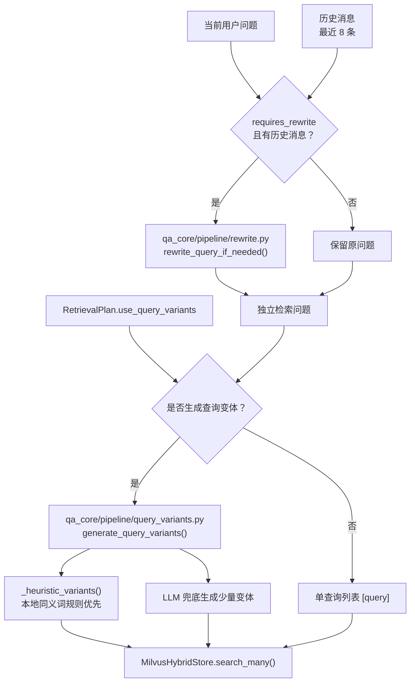
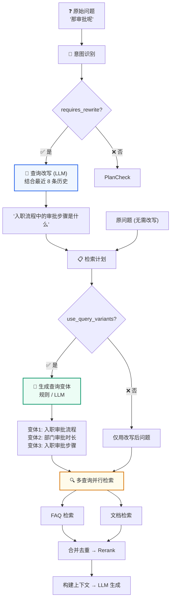
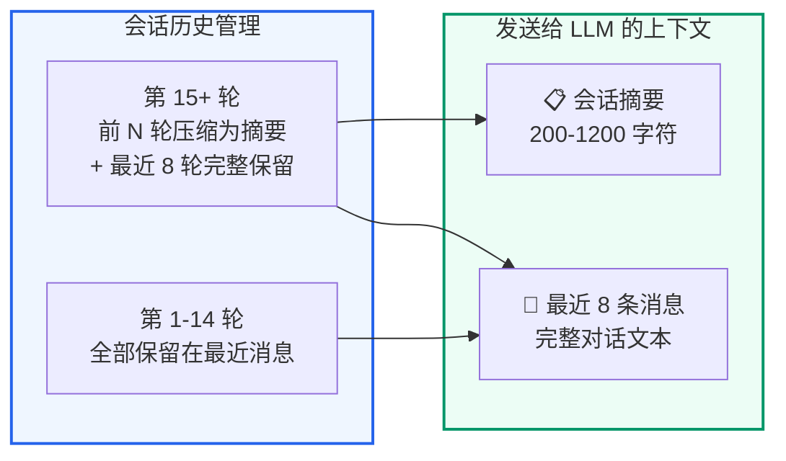
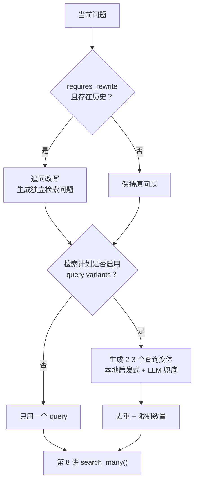
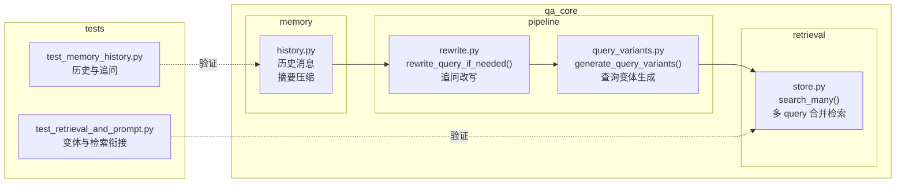

# 查询改写与多路变体
<Badge icon="clock" color="green">Written: 2026.06</Badge>
> 第 07 章跟敲代码：`codealong/chapters/ch07_query_rewrite_variants`。
> 这部分代码是本章跟敲版，用来先跑通核心闭环；完整项目源码仍以本讲后文标注的 `qa_core/`、`scripts/` 等路径为准。

**上一讲**：[检索策略与动态计划](/RAG/retrieval/retrieval-strategy)  
**下一讲**：[Milvus 混合检索深度解析](/RAG/retrieval/milvus-hybrid-search)

## 1. 本讲目标

- 理解多轮对话中追问问题的处理机制
- 掌握查询改写(Query Rewrite)的触发条件和工作原理
- 理解查询变体(Query Variants)如何提升召回覆盖率

---

## 2. 本讲项目交付闭环

第 6 讲已经生成了检索计划，但真实对话里用户经常不会把问题说完整。本章要解决两个召回前的问题：一是把“那审批呢”这类追问改写成能独立检索的问题，二是在需要时生成少量同义检索表达，提高 Milvus 召回覆盖率。

| 项目交付项 | 说明 |
| --- | --- |
| 核心模块 | `qa_core/pipeline/rewrite.py`、`qa_core/pipeline/query_variants.py` |
| 核心函数 | `rewrite_query_if_needed()`、`generate_query_variants()`、`_heuristic_variants()`、`_looks_like_short_structured_question()` |
| 输入条件 | 第 5 讲 `IntentResult.requires_rewrite`、第 6 讲 `RetrievalPlan.use_query_variants` |
| 输出结果 | 独立检索问题、查询变体列表 |
| 下游衔接 | 第 8 讲 Milvus Hybrid Search 的 `search_many()` |
| 验证入口 | `tests/test_retrieval_and_prompt.py`、`tests/test_memory_history.py` |

本讲实现完成后的代码结构：



闭环验证方式：

```text
pytest tests/test_retrieval_and_prompt.py tests/test_memory_history.py -q
```

验证时重点看：追问是否能改写成带上下文的独立问题，完整问题是否保持原样，短结构化问题是否跳过 LLM 扩展，查询变体是否去重并受数量上限控制。

---

## 3. 前置知识 — 多轮对话中的指代消解

### 3.1 为什么追问需要特殊处理

在真实对话中，用户的后续问题往往依赖于前文的上下文：

```text
用户：入职流程有哪些步骤？
AI：入职流程包括：1. 提交材料 2. 签订合同 3. 部门审批 4. 领取工位...

用户：那审批需要多久？          ← 这是一个追问
      ↑ "那审批" 指的是什么审批？不结合历史无法理解
```

如果直接把"那审批需要多久"发给 Milvus 做向量检索：
- 检索到的可能是"请假审批"、"报销审批"、"采购审批"……
- 因为向量只看到"审批"和"多久"，不知道上下文是"入职流程"

**这就是追问改写的必要性**：把依赖上下文的问题补全为独立的检索问题。

### 3.2 指代消解的概念

**指代消解(Anaphora Resolution)** 是 NLP 的一个经典问题：确定代词或省略的主体指什么。

```text
"那审批呢" → "那" 指代的是 入职流程中的审批步骤
"费用呢"   → "费用" 需要结合上文确定是 入职费用 还是 培训费用
"还有吗"   → 需要结合上文确定在问什么"还有"
```

---

## 4. 查询改写(Query Rewrite)

### 4.1 触发条件

改写不是对所有问题都执行，有两个条件：

```python
def rewrite_query_if_needed(query, history_messages, should_rewrite):
    if not should_rewrite or not history_messages:
        return query  # 直接返回原问题
```

1. **`should_rewrite == True`**：由意图识别结果中的 `requires_rewrite` 控制
2. **`history_messages` 不为空**：没有历史上下文就无法改写

**哪些情况 `requires_rewrite` 为 True？**

```text
# qa_core/intent/classifier.py — 触发 requires_rewrite 的场景

# 场景 1：追问规则命中
if history and (FOLLOW_UP_HINTS.search(query.strip()) or len(query.strip()) <= 8):
    return IntentResult(
        intent="FOLLOW_UP",
        requires_rewrite=True,  # ← 标记需要改写
        ...
    )

# 场景 2：LLM 判断需要改写
return IntentResult(
    intent=decision.intent,
    requires_rewrite=decision.requires_rewrite or decision.intent == "FOLLOW_UP",
    ...
)
```

### 4.2 改写实现

```python
# qa_core/pipeline/rewrite.py
from langchain_core.messages import HumanMessage, SystemMessage

def rewrite_query_if_needed(query, history_messages, should_rewrite):
    if not should_rewrite or not history_messages:
        return query

    # 只取最近 8 条历史 — 聚焦当前话题
    history_text = format_messages(history_messages[-8:])

    llm = get_chat_model(streaming=False)  # 非流式，需要完整结果
    response = llm.invoke([
        SystemMessage(content=REWRITE_SYSTEM_PROMPT),
        HumanMessage(
            content=f"对话历史：\n{history_text}\n\n"
                    f"当前问题：{query}\n\n"
                    f"改写后的检索问题："
        ),
    ])

    rewritten = str(response.content).strip()
    if not rewritten:
        raise RuntimeError("查询改写返回空结果，无法生成独立检索问题。")
    return rewritten
```

### 4.3 改写 Prompt 设计

```text
REWRITE_SYSTEM_PROMPT = """
你是一个查询改写助手。你的任务是把用户的追问问题改写成独立的检索问题。

规则：
1. 如果问题已经可以独立理解，直接返回原问题
2. 如果问题包含代词(那、这个、它、他们)或依赖上文，请结合对话历史补全
3. 补全后的检索问题应该包含具体的实体和动作
4. 只返回改写后的问题，不要加任何解释

示例：
对话历史：
用户：入职流程有哪些步骤
AI：入职流程包括提交材料、签订合同、部门审批...

当前问题：那审批呢
改写后的检索问题：入职流程中的审批步骤是什么

对话历史：
用户：API 限流怎么处理
AI：API 限流可以通过升级套餐或联系技术支持处理...

当前问题：升级套餐多少钱
改写后的检索问题：API 限流相关套餐的升级费用是多少
"""
```

### 4.4 为什么要限制历史长度

```text
history_text = format_messages(history_messages[-8:])  # 只取最近 8 条
```

- **效率**：发送给 LLM 的 token 数减少，改写延迟降低
- **聚焦**：只取最近的对话，让改写聚焦当前追问主题
- **防止跑题**：如果用户 14 轮之前问的是"入职"，现在问的是"报销"，取全部历史反而会让改写混淆

### 4.5 完整问题不改写的原则

```text
if not should_rewrite or not history_messages:
    return query  # 直接返回原问题，不做任何修改
```

对于完整、自包含的问题(如"入职流程有哪些步骤"、"API 密钥怎么生成")，保持原样是最好的做法。让 LLM 改写清晰的问题可能会导致"改偏"——原本明确的问题被改成模糊的。

---

## 5. 查询变体(Query Variants)

### 5.1 为什么需要查询变体

用户的问题表述方式可能和知识库中的表述不一致。例如：

```text
用户问：新人入职当天要带什么
知识库写：入职报到需提交的材料清单
```

虽然语义相近(Embedding 能找到)，但关键词完全不同(BM25 找不到了)。

**查询变体**的思路：把用户的原始问题扩展成多个等价表达，每个都去检索，提高命中率。

```text
原始问题："新人入职当天要带什么"

查询变体：
  1. "新人入职当天要带什么"        ← 原问题
  2. "入职报到需要提交哪些材料"    ← 正式表述
  3. "入职当天需要准备什么文件"    ← 另一种问法
  4. "入职需要携带的证件和材料"    ← 更具体的表述
```

### 5.2 两种生成方式

**方式 1：规则生成(本地，不用 LLM)**

对于能从 scene TOML 中推断出 source 的短问题，使用关键词替换生成变体：

```python
# qa_core/pipeline/query_variants.py
def generate_query_variants(query: str, *, enabled: bool) -> list[str]:
    """返回"原问题 + 少量同义检索表达"。

    该函数是召回增强，不是问题改写。返回值同时传给 FAQ 和文档集合的 search_many()。

    生成策略分 3 层：
    1. enabled=False 或配置关闭 → 直接返回 [原问题]
    2. 短结构化问题 → 跳过扩展(已经足够清晰，扩展无收益)
    3. 本地启发式命中 → 用关键词替换规则生成变体(快、稳定、不用 LLM)
    4. 以上都不满足 → 调用 LLM 结构化输出生成变体
    """
    settings = get_settings()
    cleaned = query.strip()
    if not enabled or not cleaned or settings.retrieval_variant_max <= 0:
        return [cleaned]

    if _looks_like_short_structured_question(cleaned):
        return [cleaned]

    heuristic_variants = _heuristic_variants(cleaned, settings.retrieval_variant_max)
    if len(heuristic_variants) > 1:
        return heuristic_variants

    variants = [cleaned]
    model = get_chat_model(streaming=False).with_structured_output(QueryVariants)
    result = model.invoke([
        SystemMessage(content=QUERY_VARIANT_SYSTEM_PROMPT),
        HumanMessage(content=f"原问题：{cleaned}\n最多生成 {settings.retrieval_variant_max} 条检索表达。"),
    ])
    for item in result.queries:
        candidate = str(item).strip()
        if candidate and candidate not in variants:
            variants.append(candidate)
        if len(variants) >= settings.retrieval_variant_max + 1:
            break
    return variants
```

其中 `_heuristic_variants()` 是本地关键词替换规则，覆盖高频同义表达：

```python
def _heuristic_variants(query: str, max_extra: int) -> list[str]:
    """为高频业务知识/FAQ 说法生成低延迟的本地变体。"""
    variants = [query]
    normalized = query.lower()

    def add(candidate: str) -> None:
        """在保持顺序和上限的前提下，追加非空变体。"""
        candidate = candidate.strip()
        if candidate and candidate not in variants and len(variants) < max_extra + 1:
            variants.append(candidate)

    if "安装" in query or "失败" in query or "报错" in query:
        add(query.replace("失败", "报错"))
        add(query.replace("报错", "失败"))
    if "流程" in query:
        add(query.replace("流程", "SOP"))
        add(query.replace("流程", "处理步骤"))
    if "发票" in query:
        add(query.replace("发票", "开票"))
        add(query.replace("发票", "账单"))
    if "开票" in query:
        add(query.replace("开票", "发票"))
    if "告警" in query:
        add(query.replace("告警", "报警"))
        add(query.replace("告警", "异常"))
    if "webhook" in normalized:
        add(query.replace("webhook", "回调").replace("Webhook", "回调"))
        add(query.replace("Webhook", "Webhook 回调").replace("webhook", "Webhook 回调"))
    if "资料" in query:
        add(query.replace("资料", "材料"))
        add(query.replace("资料", "记录"))
    if "材料" in query:
        add(query.replace("材料", "资料"))
    if "流程" in query and "怎么走" in query:
        add(query.replace("怎么走", "有哪些步骤"))
        add(query.replace("流程", "办理流程"))
    if "怎么排查" in query:
        add(query.replace("怎么排查", "如何处理"))
        add(query.replace("怎么排查", "处理步骤"))
    if "能不能" in query:
        add(query.replace("能不能", "是否可以"))
    if "可以吗" in query:
        add(query.replace("可以吗", "是否可以"))
    return variants
```

上面 `generate_query_variants()` 在调用本地启发式之前，先通过 `_looks_like_short_structured_question()` 判断问题是否已经足够结构化，避免对清晰短问题做无收益的 LLM 扩展：

```python
# qa_core/pipeline/query_variants.py
def _looks_like_short_structured_question(query: str) -> bool:
    """判断一个问题是否已经足够结构化，不值得再调用 LLM 扩展检索表达。

    使用场景：
    - 问题已经短且清晰；
    - 本地启发式没有命中额外高价值同义词；
    - 继续调用 LLM 只会增加尾延迟，而不会明显提高召回。

    这类问题在当前项目里主要是：
    - 流程/资料/材料/SOP 类标准问法；
    - "怎么排查""怎么处理""能不能""可以吗"这类业务 FAQ 句式；
    - 已经带有明确业务主语的短句。
    """
    compact = query.strip()
    if not compact or len(compact) > 24:
        return False
    return any(
        marker in compact
        for marker in (
            "怎么走",
            "资料",
            "材料",
            "怎么排查",
            "怎么处理",
            "需要哪些",
            "能不能",
            "可以吗",
            "是什么",
            "要看什么",
        )
    )
```

判断逻辑：问题长度不超过 24 个字符，且包含流程类、FAQ 类的高频句式标记。命中时直接返回单查询 `[cleaned]`，不再走 LLM 扩展路径。

**方式 2：LLM 生成(Pydantic 结构化输出，适用于本地规则未命中的情况)**

```text
    # 本地启发式未命中时，使用 Pydantic 结构化输出让 LLM 生成变体
    # 注意：该逻辑是 generate_query_variants() 内部的内联实现，不是独立函数
    if not heuristic_hit:
        model = get_chat_model(streaming=False).with_structured_output(QueryVariants)
        result = model.invoke([
            SystemMessage(content=QUERY_VARIANT_SYSTEM_PROMPT),
            HumanMessage(content=f"原问题：{cleaned}\n最多生成 {settings.retrieval_variant_max} 条检索表达。"),
        ])
        for item in result.queries:
            ...  # 去重、上限控制后追加到 variants 列表
```

### 5.3 什么时候不生成变体

```text
# RetrievalPlan 是 frozen dataclass，use_query_variants 在 build_retrieval_plan() 构造时设定
# qa_core/retrieval/strategy.py
plan = RetrievalPlan(
    ...
    use_query_variants=intent.intent in {"KNOWLEDGE_QUERY", "FOLLOW_UP"},
    ...
)
```

只在**知识咨询**和**追问**时启用。原因：

- **问候/直接答案/人工客服**：不需要检索，自然不需要变体
- **FAQ 查询**：FAQ 的标准问题通常较短且固定，变体可能引入噪音
- **知识咨询**：域广，多角度检索有收益
- **追问**：改写后的问题可能丢失了一些原问题的角度，变体可以补充

---

## 6. 历史消息的压缩策略

### 6.1 为什么不把全部历史发给 LLM

假设用户已经和系统对话了 50 轮：
- 全部历史可能有好几千个 token
- 每次请求(意图识别、改写、生成)都带完整历史 → 成本高、延迟高
- 对话时间跨度长，早期的主题和当前问题可能已经无关

### 6.2 摘要 + 最近消息 策略

```python
# qa_core/memory/history.py — ChatHistoryStore 类
def get_context_messages(self, session_id: str):
    # 1. 读取已有会话摘要(从 MySQL 摘要表加载)
    summary = self.get_summary(session_id)

    # 2. 读取最近 8 条消息(由 settings.history_recent_messages 控制)
    recent = self.get_messages(session_id, limit=self.settings.history_recent_messages)

    # 3. 拼接：摘要作为 SystemMessage 放在前面
    if summary:
        return [SystemMessage(content=f"历史摘要：{summary}")] + recent
    return recent
```

**摘要生成**：当历史消息超过 `history_summary_after_messages`(默认 14 条)，由 `refresh_summary_if_needed()` 在每轮回答结束后异步触发摘要刷新。实际代码拆分为两个方法：

- `get_summary(session_id)` — 从 MySQL 摘要表读取已有摘要
- `refresh_summary_if_needed(session_id)` — 判断消息数是否达标，达标则调用 LLM 生成摘要并通过 `save_summary()` 写入 MySQL

```python
# qa_core/memory/history.py — ChatHistoryStore 类

def get_summary(self, session_id: str) -> str:
    """从 MySQL 摘要表加载当前会话的对话摘要。"""
    if not self.settings.history_summary_enabled:
        return ""
    self.ensure_summary_table()
    with self.engine.begin() as conn:
        row = conn.execute(
            text(f"SELECT summary FROM {self.settings.chat_summary_table_name} "
                 f"WHERE session_id=:session_id"),
            {"session_id": session_id},
        ).fetchone()
    return str(row[0]) if row and row[0] else ""

def refresh_summary_if_needed(self, session_id: str) -> None:
    """当消息数超过阈值时，用 LLM 生成/更新摘要并写入 MySQL。"""
    if not self.settings.history_summary_enabled:
        return
    messages = self.get_messages(session_id)
    if len(messages) < self.settings.history_summary_after_messages:
        return

    # 只总结"较早历史"，最近 N 条继续原文保留
    older_messages = messages[: -self.settings.history_recent_messages]
    if not older_messages:
        return

    current_summary = self.get_summary(session_id) or "无"
    history_text = format_messages(older_messages)
    llm = get_chat_model(streaming=False)
    response = llm.invoke([
        SystemMessage(content=HISTORY_SUMMARY_SYSTEM_PROMPT),
        HumanMessage(content=(
            f"已有摘要：\n{current_summary}\n\n"
            f"新增历史：\n{history_text}\n\n"
            f"请输出不超过 {self.settings.history_summary_max_chars} 字的更新摘要。"
        )),
    ])
    summary = str(response.content).strip()[: self.settings.history_summary_max_chars]
    if summary:
        self.save_summary(session_id, summary)
```

### 6.3 上下文窗口管理全景

```text
整个会话的上下文管理策略：

时间轴 ──────────────────────────────────────────────>

轮次 1-8：全部保留在最近消息中
轮次 9-20：前 14 轮压缩为一段摘要 + 最近 8 轮完整保留
轮次 15+：摘要逐步更新 + 始终保留最近 8 轮

发给 LLM 的内容：
┌────────────────────┐
│ 会话摘要(如果有)  │  ← 200-1200 字符
├────────────────────┤
│ 最近 8 条消息      │  ← 完整对话文本
└────────────────────┘
```

---

## 7. 改写+变体的完整流程

### 7.1 在 RAG 链路中的位置



**流程图中每个节点的代码定位：**

| 流程图节点 | 对应函数路径 | 本讲对应章节 |
| --- | --- | --- |
| 意图识别 | `qa_core/intent/classifier.py::classify_intent()` | 第 5 讲 |
| requires\_rewrite? | `qa_core/intent/classifier.py::IntentResult.requires_rewrite` | 第 5 讲 |
| 查询改写 (LLM) | `qa_core/pipeline/rewrite.py::rewrite_query_if_needed()` | [第二部分](#query-rewrite) |
| 检索计划 | `qa_core/retrieval/strategy.py::build_retrieval_plan()` | 第 6 讲 |
| use\_query\_variants? | `qa_core/retrieval/strategy.py::RetrievalPlan.use_query_variants` | [3.3 节](#33) |
| 生成查询变体 | `qa_core/pipeline/query_variants.py::generate_query_variants()` | [第三部分](#query-variants) |
| 多查询并行检索 | `qa_core/retrieval/store.py::MilvusHybridStore.search_many()` | [5.3 节](#53) |
| 合并去重 → Rerank | `qa_core/retrieval/ranking.py::merge_hits_by_document()`、`qa_core/retrieval/ranking.py::rerank_hits()` | 第 7 讲 |
| 构建上下文 → LLM 生成 | `qa_core/pipeline/context.py::select_context_docs()`、`qa_core/pipeline/steps.py::stream_llm_answer()` | 第 9 讲 |

> **阅读建议**：对照上表，先在流程图中理解数据流向("改写后的问题去哪里了""变体是在哪个节点生成的")，再按"对应章节"列跳转到具体代码。不要试图一次性读懂全部代码——按流程图节点逐个击破。

### 7.2 历史压缩策略



**这张图解决了一个实际问题：LLM 的上下文窗口不是无限的，但对话可以无限进行下去。**

左半部分(会话历史管理)展示了两阶段策略：

- **第 1-14 轮**：所有消息完整保留。这时候对话还短，全部历史加起来不过几千 token，LLM 完全可以消化。
- **第 15 轮开始**：前 N 轮压缩为一段 200-1200 字符的摘要，只保留最近 8 轮完整消息。压缩的触发条件是 `refresh_summary_if_needed()`，它在每轮问答结束后检查消息数——超过 `history_summary_after_messages`(默认 14 条)就用非流式 LLM 生成摘要，存到 MySQL 的摘要表。

右半部分(发送给 LLM 的上下文)展示的是**每次请求时拼给 LLM 的最终内容**：

```text
[System Prompt]
   ↓
[会话摘要] ← 如果有(200-1200 字符，概括前十几轮的要点)
   ↓
[最近 8 条消息] ← 完整原文(保留措辞细节和指代关系)
   ↓
[当前问题] ← 用户刚发的问题
```

**为什么是"摘要 + 最近 8 条"而不是"全部历史"？** 如果 30 轮对话后还把全部历史发给 LLM，prompt 会膨胀到上万 token，不仅成本飙升，LLM 的注意力也会被稀释(中间偏早的对话细节会干扰当前问题的判断)。摘要把早期对话浓缩成一两句话，最近 8 条保留完整上下文——在"省 token"和"不丢信息"之间取得了平衡。

**为什么最近保留 8 条而不是 3 条或 14 条？** 这里的 8 条是项目默认值，不是行业标准。它的依据是：多轮追问经常跨越 4-5 轮("入职需要什么材料"→"身份证复印件可以吗"→"电子版行不行"→"多久能办好"→"提前准备可以吗")，只保留 3 条容易丢指代；保留太多又会增加 prompt 成本并引入旧话题干扰。生产环境可以通过追问改写成功率、prompt 长度和用户会话统计继续调整。

**代码实现**——两个核心方法对应上图的两个阶段：

```python
# qa_core/memory/history.py — ChatHistoryStore 类

def get_context_messages(self, session_id: str) -> list[BaseMessage]:
    """对应上图右半部分：拼给 LLM 的最终上下文。"""
    # 读取已持久化的最近 N 条完整消息(默认 8 条)
    recent = self.get_messages(session_id, limit=self.settings.history_recent_messages)
    # 从 MySQL 摘要表读取已有摘要
    summary = self.get_summary(session_id)
    if summary:
        # 摘要作为 SystemMessage 放在前面，让 rewrite 和 answer prompt
        # 都能把它当作背景事实读取
        return [SystemMessage(content=f"历史摘要：{summary}")] + recent
    return recent

def refresh_summary_if_needed(self, session_id: str) -> None:
    """对应上图左半部分：第 15+ 轮时触发摘要压缩。"""
    if not self.settings.history_summary_enabled:
        return
    messages = self.get_messages(session_id)
    # 判断是否需要压缩：消息数 < 阈值则跳过
    if len(messages) < self.settings.history_summary_after_messages:
        return

    # 只压缩"较早历史"，最近 N 条继续原文保留
    older = messages[: -self.settings.history_recent_messages]
    if not older:
        return

    current = self.get_summary(session_id) or "无"
    llm = get_chat_model(streaming=False)       # 非流式，后台执行
    response = llm.invoke([
        SystemMessage(content=HISTORY_SUMMARY_SYSTEM_PROMPT),
        HumanMessage(content=(
            f"已有摘要：\n{current}\n\n"
            f"新增历史：\n{format_messages(older)}\n\n"
            f"请输出不超过 {self.settings.history_summary_max_chars} 字的更新摘要。"
        )),
    ])
    summary = str(response.content).strip()[: self.settings.history_summary_max_chars]
    if summary:
        self.save_summary(session_id, summary)   # upsert 到 MySQL 摘要表
```

**两个方法的调用时机**：
- `get_context_messages()` — 每次 RAG 请求开始时调用(在 `prepare_retrieval()` 内部)，为意图识别和查询改写提供上下文
- `refresh_summary_if_needed()` — 每轮问答结束后异步调用(通过 `_schedule_summary_refresh()` 在后台线程执行)，不阻塞用户看到答案

### 7.3 检索时的用法

```text
# qa_core/retrieval/store.py — MilvusHybridStore 类
def search_many(
    self,
    queries: list[str],
    *,
    k: int,
    source_filter: str | None,
    kb_version: str | None = None,
    valid_sources: list[str] | None = None,
    data_scope: DataScope | None = None,
    source_type: Literal["faq", "doc"],
    rerank: bool = True,
) -> RetrievalResult:
    """对多个查询变体分别检索，合并重复 chunk 后统一重排。

    核心流程：
    1. 清洗查询变体 → 逐个变体做轻量检索(先不 rerank)
    2. 按 chunk_id/faq_id 合并重复命中，只保留最高分
    3. 按分数排序 → 取候选上限 → CrossEncoder 统一重排
    """
    merged: dict[str, RetrievalHit] = {}
    for q in normalize_queries(queries):
        result = self.search(q, k=k, ..., rerank=False)
        merge_hits_by_document(merged, result.hits)   # 原地更新 dict

    hits = sort_hits_by_score(merged.values())
    if rerank and hits:
        hits = self._rerank(queries[0], hits)         # 原问题作为 rerank query
    return RetrievalResult(hits=hits[:k], ...)
```

关键点：`merge_hits_by_document(merged: dict, hits: list)` 不是一个返回新列表的纯函数——它原地修改 `merged` 字典，以 `chunk_id`(或 `faq_id`)为 key，遇到同一文档的重复命中时只保留分数更高的那次。

---

## 8. 本讲实践闭环

| 项目 | 内容 |
| --- | --- |
| 本讲类型 | 项目实现 |
| 实践产物 | `pipeline/rewrite.py`、`pipeline/query_variants.py`、历史摘要能力 |
| 是否进入最终项目 | 是 |
| 验收方式 | 用“审批呢”这类追问验证可改写为独立问题；清晰问题保持原样 |
| 后续落点 | 第 8 讲对多个 query variants 执行合并检索 |

通过标准：追问能补全指代，变体数量受控且去重，完整问题不会被过度改写。

### 8.1 本讲从 0 到 1 实现闭环

本讲位于“意图识别之后、检索之前”。它解决两个问题：追问太短时先改写成独立问题；普通问题召回不稳时生成少量等价变体。



实现完成后，相关代码结构应该是下面这张图：



#### 8.1.1 ：只在必要时改写追问

目标：把“审批呢”这类省略问题改写成独立检索问题，但完整问题保持原样。

来源：真实代码逻辑压缩版，对应 `qa_core/pipeline/rewrite.py::rewrite_query_if_needed()`。

```python
def rewrite_query_if_needed(query: str, history_messages, should_rewrite: bool) -> str:
    if not should_rewrite or not history_messages:
        return query

    history_text = format_messages(history_messages[-8:])
    llm = get_chat_model(streaming=False)
    response = llm.invoke([
        SystemMessage(content=REWRITE_SYSTEM_PROMPT),
        HumanMessage(content=f"对话历史：\n{history_text}\n\n当前问题：{query}\n\n改写后的检索问题："),
    ])
    rewritten = str(response.content).strip()
    if not rewritten:
        raise RuntimeError("查询改写返回空结果，无法生成独立检索问题。")
    return rewritten
```

设计解释：改写是有成本、有风险的动作。只有 `should_rewrite=True` 且有历史时才做；如果 LLM 返回空字符串，项目选择硬失败暴露问题，而不是静默回退原问题导致检索偏题。

#### 8.1.2 ：构造改写 Prompt

目标：让 LLM 只做“指代消解”，不要扩写成另一个问题。

来源：简化骨架，对应 `qa_core/pipeline/rewrite.py` 中的改写 Prompt 构造。

```text
messages = [
    SystemMessage(content="把用户追问改写成独立检索问题，不要回答问题。"),
    HumanMessage(content=f"历史：{format_messages(history)}\n当前追问：{query}"),
]
rewritten = get_chat_model(streaming=False).invoke(messages).content.strip()
```

设计解释：改写模型必须非流式，因为下游检索需要完整 query。

#### 8.1.3 ：生成查询变体

目标：对清晰问题生成 2-3 个等价表达，提高召回覆盖率。

来源：真实代码逻辑压缩版，对应 `qa_core/pipeline/query_variants.py::generate_query_variants()`。

```python
def generate_query_variants(query: str, *, enabled: bool) -> list[str]:
    settings = get_settings()
    cleaned = query.strip()

    # 第 1 层：未启用、空问题、或配置上限为 0，只返回原问题
    if not enabled or not cleaned or settings.retrieval_variant_max <= 0:
        return [cleaned]

    # 第 2 层：短结构化问题不扩展，避免多余 LLM 调用和语义漂移
    if _looks_like_short_structured_question(cleaned):
        return [cleaned]

    # 第 3 层：本地启发式优先，覆盖流程/SOP、发票/开票、告警/报警等高频同义词
    heuristic_variants = _heuristic_variants(cleaned, settings.retrieval_variant_max)
    if len(heuristic_variants) > 1:
        return heuristic_variants

    # 第 4 层：规则没覆盖的新表达，再调用 LLM 结构化生成
    variants = [cleaned]
    model = get_chat_model(streaming=False).with_structured_output(QueryVariants)
    result = model.invoke([...])
    for item in result.queries:
        candidate = str(item).strip()
        if candidate and candidate not in variants:
            variants.append(candidate)
        if len(variants) >= settings.retrieval_variant_max + 1:
            break
    return variants
```

设计解释：变体不是越多越好。真实代码先用低成本规则覆盖高频表达，只有规则不够时才调用 LLM；所有变体都会去重并受 `retrieval_variant_max + 1` 控制。

#### 8.1.4 ：管理历史摘要

目标：长会话中保留“摘要 + 最近 N 条”，避免把全部历史塞进 Prompt。

来源：真实代码调用点，见 `qa_core/memory/history.py`。

```text
context_messages = history_store.get_context_messages(session_id)
history_store.refresh_summary_if_needed(session_id)
```

设计解释：改写依赖历史，但历史不能无限增长。摘要用于保留早期上下文，最近消息用于保留细节。

#### 8.1.5 ：接入多查询检索

验收命令：

来源：命令行验收，对应 `tests/test_memory_history.py` 和 `tests/test_retrieval_and_prompt.py`。

```bash
python -m pytest tests/test_memory_history.py tests/test_retrieval_and_prompt.py -q
```

闭环验证重点：

| 验证项 | 输入条件 | 期望结果 |
| --- | --- | --- |
| 追问改写 | 历史中提过“新人入职流程”，当前问 `审批呢` | 改写成包含“新人入职”和“审批”的独立问题 |
| 完整问题保护 | `新人入职需要完成哪些流程？` | 保持原样，不强行改写 |
| 无历史保护 | 当前问 `审批呢` 但没有历史 | 不调用改写，避免乱补上下文 |
| 空改写保护 | LLM 返回空字符串 | 抛出异常暴露问题 |
| 变体禁用 | `enabled=False` | 只返回原问题 |
| 短结构化问题 | `流程怎么走` | 跳过 LLM 扩展 |
| 启发式变体 | `Webhook 怎么配置` | 生成“回调”等本地同义变体 |
| 变体数量控制 | 清晰知识问题 | 生成结果去重，受配置上限控制 |
| 多查询检索衔接 | 多个 variants | `search_many()` 能合并结果并保留最高分 |

通过标准：

- `审批呢` 能结合历史改写成完整问题。
- 完整问题不会被强制改写。
- query variants 去重且数量受控。
- `search_many()` 能接收多个变体并按文档合并结果。

## 9. 重点掌握

| 优先级 | 内容 | 原因 |
| --- | --- | --- |
| ★★★ 必会 | 查询改写(Query Rewrite)的触发条件：requires\_rewrite=True + 有历史消息 | 多轮对话中指代消解的实现方式 |
| ★★★ 必会 | 查询变体(Query Variants)的作用：将原问题扩展为多个等价表达提高召回覆盖率 | 召回增强的核心手段 |
| ★★★ 必会 | 历史压缩策略："摘要(200-1200 字符)+ 最近 8 条完整消息"，第 15 轮开始触发压缩 | 管理 LLM 上下文窗口的关键设计 |
| ★★ 理解 | rewrite\_query\_if\_needed() 的实现：非流式 LLM，聚焦最近 8 条历史，改写为独立检索问题 | 理解改写模块的具体代码 |
| ★★ 理解 | 变体生成的两种方式：本地启发式(关键词替换，快、免费)vs LLM 结构化输出(灵活) | 理解性能与灵活性的平衡 |
| ★★ 理解 | \_looks\_like\_short\_structured\_question() 的判断逻辑：短问题且命中高频句式标记时跳过 LLM 扩展 | 避免对清晰问题做无收益的 LLM 调用 |
| ★★ 理解 | 完整问题不改写的原则：清晰的问题保持原样，防止"改偏" | 重要的设计约束 |
| ★ 了解 | 历史摘要的异步刷新机制(refresh\_summary\_if\_needed) | 了解实现细节 |
| ★ 了解 | search\_many() 的多查询合并流程 | 本讲 5.3 节展开 |

## 10. 本讲小结

- **追问改写**只在 `requires_rewrite=True` 且有历史时执行，避免对所有问题增加 LLM 调用
- 改写聚焦最近 8 条历史，使用非流式 LLM 生成独立的检索问题
- **完整问题不改写**：清晰的问题保持原样，防止改写"改偏"
- **查询变体**将问题扩展为多个等价表达，提高召回覆盖率
- 变体生成有本地启发式和 LLM 结构化输出两种方式，最多生成 3 个变体控制检索成本
- **历史压缩**采用"摘要 + 最近 8 条"策略，在召回质量和成本之间平衡

**下一讲**：[Milvus 混合检索深度解析](/RAG/retrieval/milvus-hybrid-search) — Dense + Sparse 检索实现、BM25 原理、过滤表达式构建