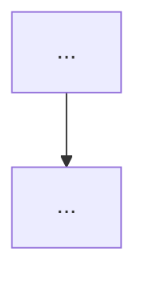
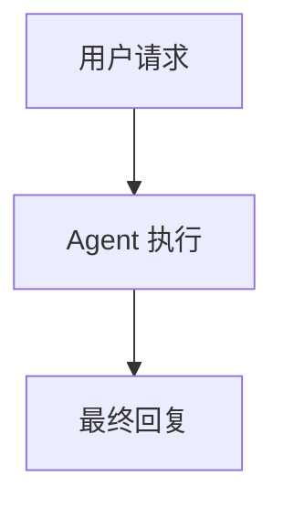

# Diagram Commenting Reference

## Principle

Visible diagram output should become Mermaid. The original PNG/text diagram should remain in the MDX file as a comment so it can be recovered later.

## Markdown Image Replacement

Before:

```mdx

```

After:

```mdx


{/* Original diagram image:

*/}
```

## ASCII/Text Diagram Replacement

Before:

````mdx
~~~text
用户请求
  ↓
Agent 执行
  ↓
最终回复
~~~
````

After:

````mdx


{/* Original text diagram:
~~~text
用户请求
  ↓
Agent 执行
  ↓
最终回复
~~~
*/}
````

## Comment Safety

- Do not put raw `*/` inside MDX comments
- If the original text contains `*/`, replace it with `* /` inside the comment only
- Keep comments close to the replacement Mermaid block
- Do not delete the original source unless the user explicitly asks

## Output Preference

When the user asks for a concise response after processing, report:

- File path
- Whether the Written month Badge was inserted or updated
- Number of formatted tree-like text blocks, if tree blocks were detected
- Number of converted diagram blocks
- Number of converted interview accordions, if interview sections were processed
- Number of converted reference sections, if reference sections were processed
- Whether original PNG/text sources were preserved as comments
- Verification result, if run
